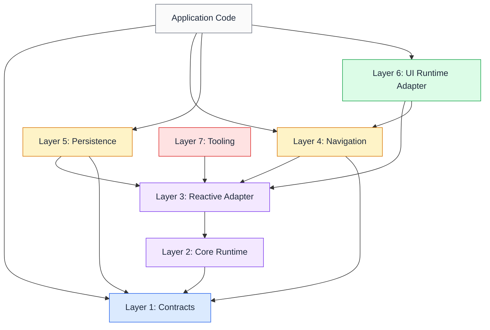

# Nidana Bus Reference Architecture: Implementer's Guide

**Status:** Draft
**Author:** Purbo
**Version:** 0.15.0
**Date:** 2026-10-09

**Companion documents:** [Specification](nidana-bus-ref-arch-spec-v0_15_0.md) · [Rationale and Positioning](nidana-bus-ref-arch-rationale-v0_15_0.md)

## About This Document

This document is informative. It collects the material an implementer or adopting team needs beyond the rules: data contract options, reference patterns for cross-cutting concerns and navigation, platform mappings, operational guidance, migration advice, open questions and the tooling roadmap. Version 1 of Nidana Bus is implemented for Dart/Flutter only. Material for Kotlin/Android, Swift/iOS and TypeScript/Web describes design targets and is unvalidated until an implementation exists.

## Table of Contents

- [1. Data Contract Options](#1-data-contract-options)
  - [1.1 Recommended Approach: Platform-Native Immutable Data Classes](#11-recommended-approach-platform-native-immutable-data-classes)
  - [1.2 Alternative: Protocol Buffers](#12-alternative-protocol-buffers)
  - [1.3 Alternative: JSON Schema](#13-alternative-json-schema)
  - [1.4 Decision Matrix and Persistence Implications](#14-decision-matrix-and-persistence-implications)
- [2. Patterns for Cross-Cutting Concerns](#2-patterns-for-cross-cutting-concerns)
- [3. Navigation as a Cross-Cutting Concern](#3-navigation-as-a-cross-cutting-concern)
  - [3.1 The Problem with Distributed Navigation](#31-the-problem-with-distributed-navigation)
  - [3.2 Navigation Intent as a Data Contract](#32-navigation-intent-as-a-data-contract)
  - [3.3 Navigation Topics](#33-navigation-topics)
  - [3.4 The Two-Topology Navigation Model](#34-the-two-topology-navigation-model)
  - [3.5 Deep Link Startup Ordering](#35-deep-link-startup-ordering)
  - [3.6 Navigation Result Handling](#36-navigation-result-handling)
  - [3.7 When Direct Navigation Is Acceptable](#37-when-direct-navigation-is-acceptable)
- [4. Error Handling Approaches](#4-error-handling-approaches)
  - [4.1 `AppError` Contract](#41-apperror-contract)
  - [4.2 Circuit Breaker as Stream State](#42-circuit-breaker-as-stream-state)
- [5. Verification Pipeline](#5-verification-pipeline)
  - [5.1 Verification Property Map](#51-verification-property-map)
  - [5.2 Automated Verification Pipeline](#52-automated-verification-pipeline)
- [6. Platform Mapping](#6-platform-mapping)
  - [6.1 Reactive Primitives by Platform](#61-reactive-primitives-by-platform)
  - [6.2 Engine Choice: Rx vs Native](#62-engine-choice-rx-vs-native)
  - [6.3 Topology DSL Per Platform](#63-topology-dsl-per-platform)
    - [Dart/Flutter](#dartflutter)
    - [Kotlin/Android (Flow)](#kotlinandroid-flow)
    - [Swift/iOS (Combine)](#swiftios-combine)
    - [TypeScript/Web (RxJS)](#typescriptweb-rxjs)
  - [6.4 Bus Reference Acquisition Per Platform](#64-bus-reference-acquisition-per-platform)
  - [6.5 Ordering and Scheduler Implementation Per Platform](#65-ordering-and-scheduler-implementation-per-platform)
- [7. Web and TypeScript](#7-web-and-typescript)
  - [7.1 Bus Lifecycle in Browser Contexts](#71-bus-lifecycle-in-browser-contexts)
  - [7.2 React Integration](#72-react-integration)
    - [React Hooks](#react-hooks)
    - [Bus Provider](#bus-provider)
    - [React StrictMode](#react-strictmode)
    - [React Server Components](#react-server-components)
  - [7.3 Angular Integration](#73-angular-integration)
  - [7.4 Vue Integration](#74-vue-integration)
  - [7.5 Web-Specific Considerations](#75-web-specific-considerations)
- [8. Operational Concerns](#8-operational-concerns)
  - [8.1 Performance and Memory Cost Model](#81-performance-and-memory-cost-model)
  - [8.2 Production Observability](#82-production-observability)
  - [8.3 Internationalization](#83-internationalization)
  - [8.4 Multi-Process Considerations](#84-multi-process-considerations)
  - [8.5 Concurrency Model](#85-concurrency-model)
  - [8.6 Topic Deprecation and Contract Evolution](#86-topic-deprecation-and-contract-evolution)
  - [8.7 Dynamic and Per-Entity Topics](#87-dynamic-and-per-entity-topics)
- [9. Migration and Adoption](#9-migration-and-adoption)
  - [9.1 Adoption Sequencing](#91-adoption-sequencing)
  - [9.2 Strangler Fig and Parallel-Architecture Coexistence](#92-strangler-fig-and-parallel-architecture-coexistence)
  - [9.3 Coexistence With Existing State Management](#93-coexistence-with-existing-state-management)
  - [9.4 Rollout Strategy](#94-rollout-strategy)
  - [9.5 Team Adoption](#95-team-adoption)
- [10. Open Questions](#10-open-questions)
  - [10.1 Testing Strategy and TestBus](#101-testing-strategy-and-testbus)
  - [10.2 DevTools and Observability](#102-devtools-and-observability)
  - [10.3 Scaling to Multiple Feature Teams](#103-scaling-to-multiple-feature-teams)
  - [10.4 Server-Driven Topologies](#104-server-driven-topologies)
  - [10.5 Persistence and Hydration](#105-persistence-and-hydration)
- [Appendix A: Full System Diagram](#appendix-a-full-system-diagram)
- [Appendix B: Library Modularization](#appendix-b-library-modularization)
  - [B.1 Seven-Layer Stack](#b1-seven-layer-stack)
  - [B.2 Per-Platform Package Layout](#b2-per-platform-package-layout)
    - [Dart / Flutter (pub.dev)](#dart--flutter-pubdev)
    - [Kotlin / Android (Maven Central)](#kotlin--android-maven-central)
    - [Swift / iOS (Swift Package Manager)](#swift--ios-swift-package-manager)
    - [TypeScript / Web (npm)](#typescript--web-npm)
  - [B.3 Cross-Platform Naming Convention](#b3-cross-platform-naming-convention)
  - [B.4 Dependency Graph](#b4-dependency-graph)
- [Appendix C: Tooling Roadmap](#appendix-c-tooling-roadmap)
  - [C.1 Static Analysis Coverage](#c1-static-analysis-coverage)
  - [C.2 Per-Platform Tooling Status](#c2-per-platform-tooling-status)
    - [Dart / Flutter](#dart--flutter)
    - [Kotlin / Android](#kotlin--android)
    - [Swift / iOS](#swift--ios)
    - [TypeScript / Web](#typescript--web)
  - [C.3 Codegen Inputs and Outputs](#c3-codegen-inputs-and-outputs)
  - [C.4 Devtools Roadmap](#c4-devtools-roadmap)
  - [C.5 Verification Mapping](#c5-verification-mapping)

---

## 1. Data Contract Options

### 1.1 Recommended Approach: Platform-Native Immutable Data Classes

For most applications (especially single-platform or small-team projects) platform-native immutable data classes are the right default:

| Platform | Mechanism | Example |
|---|---|---|
| **Dart** | `freezed` or `@immutable` data class | `@freezed class AuthState with _$AuthState { ... }` |
| **Kotlin** | `data class` (copy-on-write semantics) | `data class AuthState(val user: User, val token: String)` |
| **Swift** | `struct` (value type) | `struct AuthState { let user: User; let token: String }` |
| **TypeScript** | `Readonly<T>` interfaces, `as const` literals, or libraries like `immer` | `interface AuthState { readonly user: User; readonly token: string; }` |

ADTs for state modeling: use sealed classes, sealed interfaces, or enums with associated values for states with distinct variants.

```kotlin
sealed interface AuthState {
  data object Initializing  : AuthState
  data object Unauthenticated : AuthState
  data class  Authenticating(val provider: String) : AuthState
  data class  Authenticated(val user: User, val token: Token) : AuthState
  data class  Error(val reason: AuthError) : AuthState
}
```

**Pros:** Zero overhead, full IDE support, native pattern matching, no serialization layer needed for in-process communication. The compiler enforces immutability and exhaustiveness.

**Cons:** No cross-platform schema sharing. No built-in backward/forward compatibility guarantees. Evolving a contract requires touching every consumer.

### 1.2 Alternative: Protocol Buffers

For cross-platform projects, large organizations, or applications that need topic persistence with compatibility guarantees, Protocol Buffers offer stronger contracts.

```protobuf
// contracts/auth.proto
syntax = "proto3";
package nidana.auth;

message AuthState {
  oneof state {
    Initializing initializing = 1;
    Unauthenticated unauthenticated = 2;
    Authenticated authenticated = 3;
  }
}

message Authenticated {
  User user = 1;
  string token = 2;
  // Field 3 can be added later without breaking existing consumers.
}
```

**Pros:**
- Backward and forward compatibility by design.
- Cross-platform schema sharing: one `.proto` file generates Dart, Kotlin, Swift, and TypeScript contracts.
- Self-documenting: the `.proto` file is the schema registry.

**Cons:**
- Verbosity and friction. Protobuf-generated classes are less ergonomic than native data classes; pattern matching on `oneof` fields is clunky.
- Build complexity: protobuf compiler in the build pipeline, generated code committed or generated on-the-fly, version management of `.proto` files.
- Overhead for in-process communication: protobuf serialization is unnecessary when data never leaves the process. The bus operates on deserialized objects internally; protobuf becomes a contract-definition tool rather than a wire format.

### 1.3 Alternative: JSON Schema

For teams that want schema-driven contracts without the protobuf build pipeline:

```json
{
  "$id": "nidana://auth/state",
  "type": "object",
  "properties": {
    "status": { "enum": ["initializing", "unauthenticated", "authenticating", "authenticated", "error"] },
    "user": { "$ref": "nidana://auth/user" },
    "token": { "type": "string" }
  },
  "required": ["status"]
}
```

**Pros:** Human-readable, widely tooled, no binary compilation step. Useful for server-driven topologies where the server defines contracts at runtime ([§10.4](#104-server-driven-topologies)).

**Cons:** No compile-time type safety; validation is runtime-only. Verbose for complex ADTs. Inferior to both native data classes (ergonomics) and protobuf (compatibility guarantees).

### 1.4 Decision Matrix and Persistence Implications

| Factor | Native Data Classes | Protobuf | JSON Schema |
|---|---|---|---|
| Ergonomics | Excellent | Moderate | Poor |
| Compile-time safety | Full | Full (generated) | None |
| Pattern matching / ADTs | Native | Clunky | None |
| Cross-platform sharing | None | Excellent | Good |
| Backward/forward compat | Manual discipline | By design | Manual discipline |
| Persistence/hydration | Needs serializer | Built-in | Built-in |
| Build complexity | None | Moderate | Low |
| Team adoption friction | Low | Moderate-High | Low |

**This decision carries the most weight when persistence is on the roadmap.** Persisted data is the most demanding serialization scenario: a value written to disk by v1 of the app must be readable by v2 after fields have been added, renamed, or removed. Native data classes have no built-in answer for this. Once persistence is in production with native classes, switching to protobuf later requires a migration pass over every persisted value.

**Default recommendation by project type:**

- **Single-platform mobile app, single team, no persistence on roadmap:** native data classes.
- **Single-platform mobile app, persistence likely:** start with native data classes for prototyping; plan protobuf migration before shipping persistence.
- **Cross-platform from day one:** protobuf for contracts shared across platforms; native for purely platform-internal types.
- **Large organization, many feature teams:** protobuf as the lingua franca, with code generation from a centralized `.proto` repository.
- **Server-driven topologies on the roadmap ([§10.4](#104-server-driven-topologies)):** JSON Schema for the dynamic contract layer; native or protobuf for the rest.

Regardless of technology, the rule is: never use bare primitives on a topic. Wrap them in a named structure. `Topic<ConnectionState>`, not `Topic<bool>`. `Topic<SearchQuery>`, not `Topic<String>`.

---

## 2. Patterns for Cross-Cutting Concerns

| Concern | Type | Topology Pattern |
|---|---|---|
| Analytics | Service | Reads from multiple event topics, performs side effect (send to backend). No writes to bus. |
| Error handling | Module (has UI) | Reads from `Topic<AppError>`, transforms into error dialog state, renders UI. |
| Network monitoring | Service | Observes OS connectivity APIs (side effect), writes to `Topic<Connectivity>`. |
| Logging / tracing | Service | Reads via envelope observation ([Spec §9.1](nidana-bus-ref-arch-spec-v0_15_0.md#91-envelope-observation)). No writes. |
| Feature flags | Service | Reads from remote config (side effect), writes to `Topic<FeatureFlags>`. |
| Navigation | Service + topologies | Pages publish `NavIntent` events; resolver topology produces resolved intents; executor performs platform navigation. See [§3](#3-navigation-as-a-cross-cutting-concern). |
| Deep linking | Service | Reads OS intent/URL (side effect), writes to `Topic<NavIntent>`. Subsumed into navigation. |
| Device location | Service | Observes OS location APIs (side effect), writes to `Topic<DeviceLocation>`. |
| OS permissions | Service | Queries and requests OS permissions (side effect), writes to `Topic<PermissionGrant>`. Guard topologies can block intents until permission is granted. |

---

## 3. Navigation as a Cross-Cutting Concern

Navigation is a side effect. The architecture's rule is: side effects happen at the shell boundary. In conventional applications, navigation calls are scattered across every page that needs to move the user somewhere. A page calls `Navigator.push(...)` or `router.navigate(...)` directly, performing the side effect inline.

This creates three problems that the rest of the architecture is designed to eliminate for other concerns.

### 3.1 The Problem with Distributed Navigation

**Invisible coordination.** When user logout requires navigating to the login screen, clearing the cart, disconnecting websockets, and emitting analytics, each of these lives in a different module. If navigation is a direct call inside the auth module, the other modules must independently detect the auth change and decide whether to navigate. The coordination is implicit.

**Unobservable transitions.** Analytics cannot observe screen transitions without being wired into every page's navigation code. Deep link resolution logic is duplicated or centralized in a fragile router configuration that cannot react to runtime state.

**Guard logic scatters.** Auth guards ("redirect to login if not authenticated") end up as boilerplate in each page's initialization, or as middleware in the router that must be kept in sync with the topology's understanding of auth state.

The solution follows the same principle the architecture applies everywhere else: pages express *intent*, a centralized service performs the *effect*.

### 3.2 Navigation Intent as a Data Contract

Pages publish navigation intents to an `EventTopic<NavIntent>`. A dedicated `NavigationExecutor` at the upper shell consumes resolved intents and performs the actual platform navigation calls. The `NavIntent` sealed type captures the vocabulary:

```
sealed interface NavIntent {
    data class GoTo(val route: Route, val args: Map<String, Any>? = null) : NavIntent
    data class Replace(val route: Route, val args: Map<String, Any>? = null) : NavIntent
    data object Back : NavIntent
    data class BackTo(val route: Route) : NavIntent  // synthesized via repeated Back on platforms lacking native popUntil
    data class DeepLink(val uri: Uri) : NavIntent    // pre-resolution only; resolved before reaching executor
    data class ShowModal(val route: Route, val args: Map<String, Any>? = null) : NavIntent
    data object DismissModal : NavIntent
}

// Post-resolution ADT: excludes DeepLink (all deep links resolved to typed intents)
sealed interface ResolvedNavIntent {
    data class GoTo(val route: Route, val args: Map<String, Any>? = null) : ResolvedNavIntent
    data class Replace(val route: Route, val args: Map<String, Any>? = null) : ResolvedNavIntent
    data object Back : ResolvedNavIntent
    data class BackTo(val route: Route) : ResolvedNavIntent
    data class ShowModal(val route: Route, val args: Map<String, Any>? = null) : ResolvedNavIntent
    data object DismissModal : ResolvedNavIntent
}

// Confirmed route state, written by the executor after the platform router has completed the transition
data class RouteState(
    val route: Route,
    val args: Map<String, Any>,
    val pathParams: Map<String, String>,
    val queryParams: Map<String, String>,
)

// A confirmed route transition, written atomically by the executor
data class RouteTransition(
    val from: RouteState,
    val to: RouteState,
    val intent: ResolvedNavIntent,
    val timestamp: DateTime,
)
```

`Route` is a typed reference, analogous to `Topic<T>`. A `RouteRegistry` provides compile-time route safety:

```
object CheckoutRoutes {
    val cart         = Route("checkout/cart")
    val payment      = Route("checkout/payment")
    val confirmation = Route("checkout/confirmation")
}

object AuthRoutes {
    val login    = Route("auth/login")
    val register = Route("auth/register")
}
```

Whether `Route` carries type parameters for arguments (`Route<PaymentArgs>`) is a platform-specific design decision; typed route arguments add compile-time safety at the cost of registry complexity. Platform implementations should choose based on their routing framework's capabilities.

`BackTo` is part of the portable ADT. On platforms with native popUntil (Flutter `Navigator.popUntil`), the executor uses it directly. On platforms without (some configurations of GoRouter, React Router), the executor synthesizes `BackTo(route)` as repeated `Back` until the target route is at the top of the stack.

### 3.3 Navigation Topics

```
// Shared contracts (Layer 1): published by the navigation package, visible to every module.
abstract class NavigationTopics {
    // Input: pages publish intents here
    static final intent = EventTopic<NavIntent>(
        name = "nav.intent",
    )

    // Internal: post-guard, post-deep-link-resolution intents for the executor
    static final resolvedIntent = EventTopic<ResolvedNavIntent>(
        name = "nav.resolved-intent",
    )

    // Output: confirmed current route, written by the executor
    static final currentRoute = StateTopic<RouteState>(
        name = "nav.current-route",
        initial = RouteState.initial(),
    )

    // Output: confirmed navigation history, written by the executor
    static final history = ReplayTopic<RouteTransition>(
        name = "nav.history",
        bufferSize = 20,
    )

    // Optional: reactive access policy for role-based authorization
    static final accessPolicy = StateTopic<RouteAccessPolicy>(
        name = "nav.access-policy",
        initial = RouteAccessPolicy.empty(),
    )
}
```

### 3.4 The Two-Topology Navigation Model

Navigation is split into a resolver topology and an executor adapter so that no topology reads what it writes: a single topology that read `currentRoute` and wrote `resolvedIntent` would violate the cycle policy in [Spec §3.8](nidana-bus-ref-arch-spec-v0_15_0.md#38-cycle-detection). The split keeps the system-wide read/write graph acyclic.

**Topology 1: `nav-resolver` (APPLICATION).**

```
// Navigation package (module-local): the resolver topology.
topology("nav-resolver", scope = Scope.APPLICATION) {
    val intents      = read(NavigationTopics.intent)
    val auth         = read(AuthTopics.state)
    val accessPolicy = read(NavigationTopics.accessPolicy)

    // Guard: redirect unauthenticated/unauthorized users.
    // withLatestFrom: emit only when a new intent arrives, using latest auth/policy as context.
    val guarded = intents
        .withLatestFrom(auth, accessPolicy, ::applyAuthGuard)

    // Deep link resolution: convert raw URIs to typed routes
    val resolved = guarded.map(::resolveDeepLinks)

    write(NavigationTopics.resolvedIntent, resolved)
}

// Pure function: testable without any navigation framework
fun applyAuthGuard(
    intent: NavIntent,
    auth: AuthState,
    policy: RouteAccessPolicy,
): NavIntent {
    val target = intent.targetRoute() ?: return intent
    val requirement = policy.requirementFor(target) ?: return intent
    return when {
        requirement is RouteAccessRequirement.Authenticated
            && auth !is AuthState.Authenticated ->
            NavIntent.GoTo(AuthRoutes.login, args = mapOf("returnTo" to target))

        requirement is RouteAccessRequirement.Role
            && (auth as? AuthState.Authenticated)?.user?.role !in requirement.roles ->
            NavIntent.GoTo(CommonRoutes.unauthorized, args = mapOf("attempted" to target))

        else -> intent
    }
}

// Pure function: converts DeepLink URIs to typed intents.
fun resolveDeepLinks(intent: NavIntent): ResolvedNavIntent = when (intent) {
    is NavIntent.DeepLink     -> resolveUri(intent.uri)
    is NavIntent.GoTo         -> ResolvedNavIntent.GoTo(intent.route, intent.args)
    is NavIntent.Replace      -> ResolvedNavIntent.Replace(intent.route, intent.args)
    is NavIntent.Back         -> ResolvedNavIntent.Back
    is NavIntent.BackTo       -> ResolvedNavIntent.BackTo(intent.route)
    is NavIntent.ShowModal    -> ResolvedNavIntent.ShowModal(intent.route, intent.args)
    is NavIntent.DismissModal -> ResolvedNavIntent.DismissModal
}
```

`applyAuthGuard` has one signature everywhere: `(intent, auth, policy) → NavIntent`. The static-policy case passes a build-time constant `RouteAccessPolicy`. The reactive case (where policy comes from a topic) reads the policy as a stream input. The function is the same.

**The Executor (shell boundary).** The `NavigationExecutor` is not a topology; it is a shell-side adapter that subscribes to `resolvedIntent`, performs the platform navigation call, and writes both `currentRoute` and `history` atomically when the platform confirms the transition.

```
abstract class NavigationExecutor {
    abstract fun execute(intent: ResolvedNavIntent)
    abstract fun observeRouteChanges(): Stream<PlatformRouteEvent>
}

class FlutterNavigationExecutor(
    private val router: GoRouter,
    private val bus: Bus,
) : NavigationExecutor {
    // The executor is the source of truth for the confirmed route: it claims the StateTopic.
    private val publisher = bus.publisher(
        source = "executor:flutter-navigation",
        writes = setOf(NavigationTopics.currentRoute),
    )
    private val currentRoute = publisher.writer(NavigationTopics.currentRoute)
    private val subscriptions = CompositeSubscription()

    init {
        // Subscribe to resolved intents and execute them
        subscriptions += bus.observe(NavigationTopics.resolvedIntent)
            .listen(::execute)

        // Convert platform router feedback into RouteState + RouteTransition,
        // writing them atomically so history and currentRoute always agree.
        subscriptions += observeRouteChanges()
            .scan(initial = null as PlatformRouteEvent?) { _, current -> current }
            .pairwise()
            .filterNotNull()
            .listen { (prev, curr) ->
                val transition = RouteTransition(
                    from      = prev.toRouteState(),
                    to        = curr.toRouteState(),
                    intent    = curr.causingIntent,
                    timestamp = DateTime.now(),
                )
                // Atomic-ish: both publishes happen on the per-topic dispatcher in this order.
                currentRoute.publish(curr.toRouteState())                 // claimed StateTopic
                publisher.publish(NavigationTopics.history, transition)   // ReplayTopic, multi-writer
            }
    }

    override fun execute(intent: ResolvedNavIntent) {
        when (intent) {
            is GoTo         -> router.go(intent.route.path, extra = intent.args)
            is Replace      -> router.pushReplacement(intent.route.path, extra = intent.args)
            is Back         -> router.pop()
            is BackTo       -> router.popUntil(intent.route.path)
            is ShowModal    -> router.push(intent.route.path, extra = intent.args)
            is DismissModal -> router.pop()
        }
    }

    override fun observeRouteChanges(): Stream<PlatformRouteEvent> { ... }

    fun dispose() {
        subscriptions.dispose()
    }
}
```

The executor's `init` block subscribes to `resolvedIntent`. The disposal contract is explicit: callers (the runtime adapter's bootstrap code) hold a reference to the executor and call `dispose()` when the coordination domain ends. The executor is single-instance per coordination domain and registered as APPLICATION-scoped infrastructure.

`RouteTransition.intent` is sourced from the platform router's confirmed event, not from the topic. The platform routing framework knows which intent caused the transition (passed through to the framework call). This design avoids a cross-topic ordering dependency between history and route state: history and currentRoute are written together by a single writer (the executor), with intent provenance attached by the framework, not reconstructed from observed topic emissions.

The executor switch is exhaustive over `ResolvedNavIntent`. `DeepLink` is impossible by construction (resolved before reaching the executor).

Each platform provides its own executor: `FlutterNavigationExecutor`, `ComposeNavigationExecutor`, `SwiftUINavigationExecutor`, and per-framework web executors. The resolver topology is identical across platforms; only the executor differs.

### 3.5 Deep Link Startup Ordering

OS deep link delivery (Android `Intent`, iOS `openURL`, web initial URL) may arrive before the resolver topology has activated. The startup barrier ([Spec §3.13](nidana-bus-ref-arch-spec-v0_15_0.md#313-startup-barrier)) covers this: the bootstrap activates `nav-resolver`, constructs the executor (whose publisher claims `nav.current-route` and which subscribes to `resolvedIntent`), and then calls `bus.start()`. A deep-link intent published before `start()` is queued and delivered once the resolver is subscribed. Where the OS delivers the intent through a callback the bootstrap cannot defer, the callback publishes to `NavigationTopics.intent` through the bootstrap's publisher; the queue handles the ordering. No ad-hoc replay topic is needed.

### 3.6 Navigation Result Handling

Some navigation patterns expect a result from the destination screen ("pick a photo and return the selected image"). The stream model handles this through typed result topics, not through untyped payloads on the navigation intent:

```
// Source page records the request it is about to make, then publishes the intent
sourcePagePublisher.publish(ProfileTopics.pickRequested, PhotoPickRequest(id = requestId))
sourcePagePublisher.publish(NavigationTopics.intent,
    NavIntent.GoTo(MediaRoutes.photoPicker, args = PhotoPickRequest(id = requestId)))

// Destination page publishes the result, echoing the request id, then navigates back
destinationPagePublisher.publish(MediaTopics.pickerResult, PhotoPickResult.selected(requestId, photo))
destinationPagePublisher.publish(NavigationTopics.intent, NavIntent.Back)

// Source page's topology matches results to the request it issued, as data
topology("profile-editor", scope = Scope.PAGE) {
    val requested = read(ProfileTopics.pickRequested)
    val results   = read(MediaTopics.pickerResult)
    val mine = results
        .withLatestFrom(requested) { result, request -> result.takeIf { it.requestId == request.id } }
        .filterNotNull()
    // ... react to the selected photo
}
```

The result flows through a typed `EventTopic<PhotoPickResult>`. When more than one picker flow can be in progress at once, the intent carries a request id the source generated and the result echoes it; matching is a `filter` on payload. Correlation is never done on envelope metadata: transformers do not see envelopes ([Spec §3.5](nidana-bus-ref-arch-spec-v0_15_0.md#35-envelope-metadata-propagation)), and a page's publish is a root publish that the bus does not link to the intent that opened the page. The envelope's `correlationId` remains an observability concern ([§8.2](#82-production-observability)).

Topics have no scope ([Spec §7.4](nidana-bus-ref-arch-spec-v0_15_0.md#74-topic-vs-topology-lifecycle)). The result topic is an `EventTopic`, so it retains nothing between flows; a result published while no reader is subscribed is dropped, which is the correct behaviour for a stale result. The reading topology is `PAGE`-scoped and subscribes only while the source page is mounted.

### 3.7 When Direct Navigation Is Acceptable

Not every app needs centralized navigation. For small applications with a handful of screens and no cross-module navigation coordination, direct navigation calls are simpler and sufficient. The stream-based model adds value when:

- Multiple modules need to react to the same navigation event (e.g., logout clears state across features and navigates to login).
- Auth guards or conditional routing logic is currently duplicated across pages.
- Analytics needs to observe all screen transitions without per-page instrumentation.
- Deep link resolution must consider runtime state (auth, onboarding completion, feature flags).
- The app targets multiple platforms and the navigation logic should be shared while only the execution differs.

The pattern is opt-in. The `nidana-navigation` package ([Appendix B](#appendix-b-library-modularization)) is an optional dependency. Apps that do not need centralized navigation simply omit it.

---

## 4. Error Handling Approaches

| Approach | Mechanism | When To Use |
|---|---|---|
| Result ADT | `Topic<Result<T, E>>` carries success or error in the type | Domain-specific errors within a feature |
| Error topic | Catch error, publish to `ErrorTopics.appError` | Cross-feature error reporting |
| Retry with backoff | `retryWhen` operator in topology transform | Transient I/O failures |
| Fallback emission | `onErrorResumeNext` / `catchError` emitting default state | UI must never show blank screen |
| Circuit breaker | `scan` accumulator over failure events; threshold check via `filter` | Prevent cascading failures |

### 4.1 `AppError` Contract

`AppError` is the cross-feature error type published to the global error topic.

```
data class AppError(
    val kind:          ErrorKind,
    val message:       String,
    val correlationId: String,
    val source:        String,
    val recoverable:   Boolean,
    val cause:         Throwable?,  // platform-specific; null in cross-platform contexts
)

enum class ErrorKind { Network, Validation, Authorization, Internal, Unknown }

abstract class ErrorTopics {
    static final appError = EventTopic<AppError>(
        name = "error.app",
    )
}
```

Services and topologies catch exceptions at the shell boundary or via `catchError` operators and publish structured `AppError` values. The error handling module ([§2](#2-patterns-for-cross-cutting-concerns)) subscribes to `ErrorTopics.appError` and renders appropriate UI (toast, dialog, error page) based on `kind` and `recoverable`.

`AppError` should not carry the underlying token, password, or PII payload of a sensitive operation. The `correlationId` allows correlating with the original sensitive operation envelope without copying its payload. Treat `AppError` topics as non-sensitive by default (the error is shown to users and logged); ensure error construction redacts any sensitive values.

### 4.2 Circuit Breaker as Stream State

A circuit breaker expressed as mutable state inside the topology body would violate the pure-wiring constraint. Instead, model it as a `scan` accumulator over a failure-event stream. All state lives in the stream operator, not the topology body.

```
val circuitOpen = read(PaymentTopics.result)
    .scan(0) { count, result ->
        when (result) {
            is Result.Failure -> count + 1
            is Result.Success -> 0          // a success closes the circuit
        }
    }
    .map { count -> count >= 3 }

val retryableRequests = read(PaymentTopics.request)
    .withLatestFrom(circuitOpen) { request, open -> if (!open) request else null }
    .filterNotNull()
```

A success resets the counter inside the same `scan`. The circuit breaker is a pure stream transformation, testable by publishing a sequence of `Result.Failure` and `Result.Success` values and asserting on the gating output.

---

## 5. Verification Pipeline

### 5.1 Verification Property Map

| Property | Verified by | Mechanism | Platform availability |
|---|---|---|---|
| Topic type compatibility | Compiler | Static type checking | All target platforms |
| Transformer input/output compatibility | Compiler | Function signatures | All target platforms |
| State space exhaustiveness | Compiler | Sealed ADT + exhaustive match | Kotlin, Swift, Dart (partial), TypeScript (via discriminated unions) |
| Domain invariants (structural) | Compiler | Phantom types, tagged wrappers | All target platforms |
| Semantic transformer correctness | Property-based tests | Arbitrary input generation | All target platforms |
| Topology wiring correctness | Wiring tests + TestBus | Controlled scheduler, synthetic inputs | All target platforms |
| Liveness / safety (temporal) | Model checker | TLA+, Alloy | External tooling |
| Side-effect correctness | Integration tests | External systems required | All target platforms |
| Real-time properties | Load testing | System performance required | All target platforms |

### 5.2 Automated Verification Pipeline

The verification strategies above are automatable, because topologies are introspectable data structures, not opaque imperative code.

A topology declares its reads, writes, and transforms as structured metadata. A tool can:

1. **Extract the topology graph at build time.** `Catalog.scanTopologies(packages = [...])` enumerates topology classes, calls `buildDefinition()` to obtain `TopologyDefinition` IRs, and aggregates them.

2. **Detect structural violations automatically:**

| Check | Automated? | Mechanism |
|---|---|---|
| Topic name uniqueness | Yes | Static analysis of all TopicRegistry declarations |
| Inter-topology cycle detection | Yes | Strongly connected component detection on the read/write graph |
| Intra-topology self-cycle without scan | Yes | Inspect `TopologyDefinition` IR for read-of-self-write paths not mediated by stateful operators |
| Unreachable topics (defined but never read) | Yes | Graph reachability analysis |
| Orphan reads (a topic read by a topology that no topology writes and no publisher claims) | Yes for `StateTopic`; warning for `EventTopic` and `ReplayTopic`, which shells publish without claims | Reverse reachability over topology writes and publisher claims |
| Type mismatches | Yes | Caught by the compiler; cross-platform validation by codegen |
| Scope compatibility (an owner shorter-lived than one of its readers) | Yes | Cross-reference the ownership table, including publisher claims and their scopes, with each reader's declared scope ([Spec §7.2](nidana-bus-ref-arch-spec-v0_15_0.md#72-scope-declaration)) |
| Multi-writer on `StateTopic` | Yes | Workspace AST scan over `write(...)` calls and publisher `writes` declarations, grouped by topic; group size must be exactly one ([Spec §3.11](nidana-bus-ref-arch-spec-v0_15_0.md#311-single-writer-ownership)) |
| Sequencer anti-pattern | Yes | Single-producer/single-consumer chain detection within one topology |
| Sensitive topics not flagged | Warning | Heuristic match on type name and configurable keyword list |

3. **Generate property-based tests automatically.** Given a transformer with signature `(CartItems, AuthState) → CheckoutUIState`, a generator produces a property-based test harness that feeds random inputs and checks invariants declared via annotations:

```
@invariant("canCheckout implies isLoggedIn")
@invariant("empty cart implies canCheckout is false")
fun buildCheckoutUI(cart: CartItems, auth: AuthState): CheckoutUIState
```

A code generator produces the test from these annotations.

4. **Generate topology wiring tests.** Given the topology declaration, a tool produces a test that activates the topology on a `TestBus`, publishes synthetic values on input topics, and asserts that output topics receive values of the correct type. This is a structural smoke test.

5. **Produce a live topology catalog.** Build-time tooling generates a browsable catalog: all topics, their types, sensitivity, owning teams, which topologies read/write them (derived from AST scan, not from any field on the topic), and their lifecycle scopes. Documentation that is always up to date because it is derived from code.

CI integration: steps 1-4 run as CI checks. A merge request that introduces a cycle, an orphan topic, a scope violation, or an unflagged sensitive type fails the build before code review. Per-platform tooling is specified in [Appendix C](#appendix-c-tooling-roadmap).

---

## 6. Platform Mapping

The architecture is reactive-engine-agnostic. The bus runtime delegates stream behavior to the underlying library on each platform. This section maps the architecture to the dominant reactive primitives on each target.

### 6.1 Reactive Primitives by Platform

| Platform | Primary Engine | StateTopic backing | EventTopic backing | ReplayTopic backing |
|---|---|---|---|---|
| **Dart/Flutter** | RxDart | `BehaviorSubject<T>` | `PublishSubject<T>` | `ReplaySubject<T>(maxSize: N)` |
| **Kotlin/Android** | Kotlin Flow | `MutableStateFlow<T>` | `MutableSharedFlow<T>(replay = 0, extraBufferCapacity = N)` | `MutableSharedFlow<T>(replay = N)` |
| **Kotlin/Android (alt)** | RxKotlin | `BehaviorSubject<T>` | `PublishSubject<T>` | `ReplaySubject<T>` |
| **Swift/iOS** | Combine | `CurrentValueSubject<T, Never>` | `PassthroughSubject<T, Never>` | Custom (Combine has no native ReplaySubject; implemented via custom subject) |
| **Swift/iOS (alt)** | RxSwift | `BehaviorSubject<T>` | `PublishSubject<T>` | `ReplaySubject<T>` |
| **TypeScript/Web** | RxJS | `BehaviorSubject<T>` | `Subject<T>` | `ReplaySubject<T>(N)` |

### 6.2 Engine Choice: Rx vs Native

On Kotlin and Swift, the choice between the Rx variant and the native engine (Flow, Combine) is a per-application decision, not a per-topology one. Mixing within a single application is possible but requires bridging at every boundary and is not recommended.

| Factor | Native engines (Flow, Combine) | Rx engines |
|---|---|---|
| Idiomatic on platform | Yes; first-class language support | Less; requires engine library |
| Cross-platform consistency | Each platform's native engine differs | Same operators across all platforms |
| Operator coverage | Smaller core, more deliberate | Very large; some operators have nuanced semantics |
| Backpressure model | Built-in (Flow) or none (Combine) | Explicit operators (`onBackpressureBuffer`, etc.) |
| Test ergonomics | Native test schedulers | Rx test schedulers; mature |
| Coroutine integration (Kotlin) | Native | Requires `kotlinx-coroutines-rx*` |

The recommendation: use the native engine on each platform unless the team specifically values Rx operator compatibility across platforms. The bus contract ([Spec §3](nidana-bus-ref-arch-spec-v0_15_0.md#3-bus-runtime-contract)) is identical regardless of choice.

### 6.3 Topology DSL Per Platform

The topology DSL is implemented per platform with idioms appropriate to the language. The conceptual contract is identical; the syntax adapts.

#### Dart/Flutter

```dart
class CheckoutTopology extends Topology {
  @override
  String get topologyId => 'checkout-flow';

  @override
  Scope get scope => Scope.module;

  @override
  void declare(TopologyBuilder b) {
    final cart = b.read(CheckoutTopics.cartItems);
    final auth = b.read(AuthTopics.state);

    final ui = Streams.combineLatest2(cart, auth, buildCheckoutUI);
    b.write(CheckoutTopics.uiState, ui);
  }
}

CheckoutUIState buildCheckoutUI(CartItems cart, AuthState auth) {
  // pure function
}
```

#### Kotlin/Android (Flow)

```kotlin
class CheckoutTopology : Topology() {
    override val topologyId = "checkout-flow"
    override val scope = Scope.MODULE

    override fun TopologyBuilder.declare() {
        val cart = read(CheckoutTopics.cartItems)
        val auth = read(AuthTopics.state)

        val ui = combine(cart, auth, ::buildCheckoutUI)
        write(CheckoutTopics.uiState, ui)
    }
}

fun buildCheckoutUI(cart: CartItems, auth: AuthState): CheckoutUIState =
    CheckoutUIState(...)
```

#### Swift/iOS (Combine)

```swift
final class CheckoutTopology: Topology {
    override var topologyId: String { "checkout-flow" }
    override var scope: Scope { .module }

    override func declare(_ b: TopologyBuilder) {
        let cart = b.read(CheckoutTopics.cartItems)
        let auth = b.read(AuthTopics.state)

        let ui = cart.combineLatest(auth, buildCheckoutUI)
        b.write(CheckoutTopics.uiState, source: ui)
    }
}

func buildCheckoutUI(_ cart: CartItems, _ auth: AuthState) -> CheckoutUIState {
    // pure function
}
```

#### TypeScript/Web (RxJS)

```ts
class CheckoutTopology extends Topology {
    readonly topologyId = 'checkout-flow';
    readonly scope = Scope.MODULE;

    declare(b: TopologyBuilder): void {
        const cart = b.read(CheckoutTopics.cartItems);
        const auth = b.read(AuthTopics.state);

        const ui = combineLatest([cart, auth]).pipe(
            map(([cart, auth]) => buildCheckoutUI(cart, auth)),
        );
        b.write(CheckoutTopics.uiState, ui);
    }
}

function buildCheckoutUI(cart: CartItems, auth: AuthState): CheckoutUIState {
    // pure function
}
```

### 6.4 Bus Reference Acquisition Per Platform

The bus is accessed by explicit reference, never via global accessor. Each platform's runtime adapter provides the canonical mechanism for reaching the bus from a service, page, or component.

| Platform | Bus binding | Acquisition site |
|---|---|---|
| **Flutter** | `Provider<Bus>` or `InheritedWidget` at the app root | `Provider.of<Bus>(context)` or `context.read<Bus>()` in widgets |
| **Compose** | `CompositionLocal<Bus>` at the app root | `LocalBus.current` in composables |
| **SwiftUI** | `@Environment` or `@EnvironmentObject` | `@Environment(\.bus) var bus` in views |
| **UIKit** | Constructor injection from app delegate / scene delegate | DI container (Swinject, Resolver, manual) |
| **React** | `BusContext.Provider` at the app root | `useBus()` hook |
| **Vue** | `app.provide('bus', bus)` at the app root | `inject('bus')` in setup |
| **Angular** | DI provider (`{ provide: BUS, useValue: bus }`) | Constructor injection |

For server-side rendering and parallel testing, the runtime adapter creates one bus instance per request/test and binds it to the appropriate scope (request scope, test scope). The application code does not change; only the bootstrap differs.

### 6.5 Ordering and Scheduler Implementation Per Platform

This is the implementation surface of [Spec §3.3](nidana-bus-ref-arch-spec-v0_15_0.md#33-ordering-guarantees) (ordering) and [Spec §3.6](nidana-bus-ref-arch-spec-v0_15_0.md#36-scheduler-and-dispatcher-contract) (scheduler). The bus contract is fixed; the platform-specific machinery to satisfy it varies.

| Platform | Per-topic ordering | Per-topic scheduler | Reentrancy normalization |
|---|---|---|---|
| **Dart/RxDart** | Native with `sync: true` subjects (the default `sync: false` delivers asynchronously) | `EventLoopScheduler` (single Dart isolate); virtual scheduler in `TestBus` | `scheduleMicrotask()` |
| **Kotlin/Flow** | Per-topic `limitedParallelism(1)` dispatcher; `Dispatchers.Main.immediate` for UI topics | Same; injected via `BusConfig` | `dispatcher.launch { channel.send(value) }` |
| **Kotlin/RxKotlin** | Per-topic `Schedulers.single()`-equivalent | Same; pluggable | `MainScheduler.asyncInstance` or per-topic serial |
| **Swift/Combine** | Per-topic `DispatchQueue` (`.serial`); `.main` for UI topics | Same; injected scheduler | `DispatchQueue.async` on per-topic queue |
| **Swift/RxSwift** | Per-topic `SerialDispatchQueueScheduler` | Same | `MainScheduler.asyncInstance` or per-topic serial |
| **TypeScript/RxJS** | Browser microtask queue (single-threaded JS) | `asapScheduler` / virtual scheduler in `TestBus` | `queueMicrotask()` or `asapScheduler` |

Implementations must verify the per-topic ordering property with a regression test that publishes a deterministic sequence on a topic and asserts that all subscribers observe the same sequence. The regression test is mandatory; the test harness in `nidana-test-utils` ([Appendix B](#appendix-b-library-modularization)) provides it.

---

## 7. Web and TypeScript

The web platform deserves its own section because of the additional complexity introduced by browser-specific concerns (long-lived tabs, server-side rendering, hydration), the diversity of UI frameworks (React, Angular, Vue), and the cultural differences in how the JS ecosystem approaches state management.

### 7.1 Bus Lifecycle in Browser Contexts

| Context | Coordination domain | Bus instance lifetime |
|---|---|---|
| **Single-page app, client-only** | Tab | Bus is created on app mount, lives until tab close or navigation away |
| **Server-side rendering (SSR)** | HTTP request | One bus per request; values published during render flow into the HTML response; client hydrates from a serialized snapshot |
| **Long-lived single-tab app** (in-app browser, electron) | Process | Bus lives for the entire process; topic memory growth is a real concern (see [§8.1](#81-performance-and-memory-cost-model)) |
| **Multi-tab interaction** | One bus per tab | Cross-tab coordination via `BroadcastChannel` or `localStorage` events is application-level, not bus-level |

The architecture takes no position on cross-tab coordination. If two tabs of the same app need to share state, the application is responsible for replicating relevant topic emissions across tabs. A future `nidana-multi-tab` adapter is plausible but not in scope.

### 7.2 React Integration

React is the largest single web framework segment and the integration point that requires the most explicit explanation, partly because the React community has well-established state management patterns (Redux, Zustand, Jotai, TanStack Query) that the bus may appear to compete with.

The position: Nidana Bus does not replace TanStack Query for server-state caching, nor does it replace Zustand for trivial component-local state. The bus operates at a different layer: cross-cutting application data flow that spans multiple features. A React app can use Nidana Bus for coordination concerns (auth, navigation, app-wide state), TanStack Query for server cache, and Zustand or component state for component-local UI. They are complementary.

#### React Hooks

The `nidana-react` package provides hooks that integrate with React's data flow primitives:

```tsx
import { useBus, useTopic, useTopicValue, usePublisher } from '@nidana/react';

function CheckoutPage() {
    const ui = useTopic(CheckoutTopics.uiState);  // Suspense-compatible
    const submit = usePublisher(CheckoutTopics.submitOrder);

    return <CartView state={ui} onSubmit={submit} />;
}
```

`useTopic` is implemented on top of `useSyncExternalStore`. The synchronous initial read is `bus.getCurrentValue(topic)` ([Spec §2.5](nidana-bus-ref-arch-spec-v0_15_0.md#25-topic-initialization)), which is always defined for `StateTopic`. This makes the hook compatible with React 18 concurrent rendering: no tearing, correct initial render, no double-fetch.

`usePublisher(topic)` returns a stable callback that publishes to the topic with `source = "page:<componentName>"` (auto-derived where possible from the component's display name).

#### Bus Provider

The runtime adapter installs the bus via React context:

```tsx
import { BusProvider, createBus } from '@nidana/react';

function App() {
    const bus = useMemo(() => createBus({ /* config */ }), []);

    return (
        <BusProvider bus={bus}>
            <Router>{/* app */}</Router>
        </BusProvider>
    );
}
```

The `useBus()` hook returns the contextual bus. There is no global accessor. This is what makes the architecture safe for SSR, parallel test execution, and component-level testing.

#### React StrictMode

In dev mode, React 18 StrictMode mounts components twice to surface effects bugs. The runtime adapter handles this transparently for module scope ([Spec §7.3](nidana-bus-ref-arch-spec-v0_15_0.md#73-module-scope-binding)): the scope reference is acquired on first mount and released on first unmount; the second mount finds the existing scope and the deactivate-on-first-unmount is offset by the second mount's acquire. Topologies do not double-activate; subscriptions do not double-fire.

#### React Server Components

React Server Components (RSC) introduce a server-side rendering pass that runs without client state. The bus is not directly usable inside RSC (server components have no `useState`, `useEffect`, or context in the React-DOM sense). The pattern: server components fetch and render based on props; client components consume `useTopic` for live state. The boundary between server and client components is the natural boundary between server-rendered shell and bus-driven interactivity.

For full SSR with hydration (Next.js Pages Router, Remix), the bus is created per-request on the server, populated with initial values, serialized, and the client deserializes into a fresh bus instance during hydration. The `nidana-react/ssr` subpackage provides serialization helpers.

### 7.3 Angular Integration

Angular has first-class RxJS integration, which makes Nidana Bus a natural fit. The `nidana-angular` package provides a bus token, a Topic decorator, and lifecycle helpers that integrate with Angular's DI and component lifecycle.

```ts
@Component({...})
class CheckoutComponent {
    constructor(@Inject(BUS) private bus: Bus) {}

    readonly ui$ = this.bus.observe(CheckoutTopics.uiState);
    readonly submit = (req: OrderRequest) =>
        this.bus.publisher('page:checkout').publish(CheckoutTopics.submitOrder, req);
}
```

The bus is provided at the application level via Angular DI:

```ts
bootstrapApplication(AppComponent, {
    providers: [
        { provide: BUS, useFactory: () => createBus({ /* config */ }) },
    ],
});
```

Module scope binds to Angular's route-level providers via `provideNidanaModule(checkoutFlow)`.

### 7.4 Vue Integration

The `nidana-vue` package exposes the bus via Vue's provide/inject and supplies composables:

```ts
// main.ts
import { createNidanaPlugin } from '@nidana/vue';

const bus = createBus({ /* config */ });
const app = createApp(App);
app.use(createNidanaPlugin(bus));

// CheckoutPage.vue
<script setup>
import { useTopic, usePublisher } from '@nidana/vue';

const ui = useTopic(CheckoutTopics.uiState);
const submit = usePublisher(CheckoutTopics.submitOrder);
</script>

<template>
  <CartView :state="ui" @submit="submit" />
</template>
```

`useTopic` returns a Vue ref that reflects the topic's current value, integrating with Vue's reactivity system. Module scope is provided via a `useNidanaModule(checkoutFlow)` composable used in the layout component.

### 7.5 Web-Specific Considerations

**Bundle size.** The bus runtime, topic registry, and reactive engine adapter add to the JS bundle. RxJS is the largest dependency at ~30KB minified+gzipped. Tree-shaking ensures only used operators are included. The bus runtime itself is small (a few KB). Total overhead for a typical app is under 50KB.

**Hydration mismatches.** When SSR pre-populates topics and the client hydrates, the topic state must match between server and client at hydration time. The serialization helpers ensure this; topology activation is deferred until after hydration to prevent the server's pre-rendered HTML from disagreeing with the client's first render.

**Long-lived tabs.** A SaaS app left open for days accumulates topic state. Persistence opt-out for transient topics (chat history, search results, ephemeral UI) is essential. See [§8.1](#81-performance-and-memory-cost-model) for the cost model.

---

## 8. Operational Concerns

This section covers the production-engineering aspects of running Nidana Bus applications: threading, lifecycle, performance, observability, and the mechanics that turn the architectural pattern into a working production system.

### 8.1 Performance and Memory Cost Model

The architecture has measurable per-message overhead. This section provides a cost model so teams can decide whether the overhead is acceptable for their workload.

**Per-message overhead.** Each emission incurs:

1. The reactive engine's per-emission cost (subject notification, operator pipeline traversal). This is engine-specific but typically a handful of allocations.
2. Envelope metadata allocation: 1 record per emission (id, correlationId, causationId, parentCorrelationIds, source, timestamp, sensitive). On platforms with object pooling, this can be amortized; a default implementation allocates fresh.
3. Per-operator metadata threading: 1 tuple/pair per pipeline stage that propagates metadata.
4. Observer dispatch: 1 call per registered observer with capability for the topic.
5. Reentrancy normalization: 1 microtask/queued continuation if the publish is reentrant.

**Order of magnitude.** Per-emission overhead in a typical implementation is in the tens of microseconds on modern devices, with allocation pressure proportional to pipeline depth. For 60fps UI flows, this is well under one frame budget per emission, but a hot path emitting 1000 values per second consumes meaningful time and produces meaningful GC pressure.

**Hot-path techniques.** When a topic genuinely emits at high rates:

- Use `sample` or `throttle` to reduce emission frequency at the topology boundary.
- Mark the topic with `dedup` enabled (default for `StateTopic`) so identical values are suppressed.
- Move the hot computation off the topology graph entirely; the topology subscribes to a coarsened summary topic, and the raw stream is consumed directly by the service that needs it.
- Disable envelope metadata for the topic (a `tracing = Tracing.disabled` flag on the topic declaration). The runtime emits without metadata; observability tooling does not see the topic. This is a deliberate trade-off and should be documented in the topic registry.

**Memory cost model.** Each topic holds:

| Topic type | Memory cost |
|---|---|
| `StateTopic<T>` | One reference to the latest value of type `T`, plus one entry in the bus's topic-to-subject map. |
| `EventTopic<T>` | One subject; no retained values. |
| `ReplayTopic<T>(N)` | Up to N references to recent values, plus the subject. |

The dominant cost in long-running tabs is the cumulative size of values held by `StateTopic`s and `ReplayTopic` buffers. Topics holding large values (image caches, stream snapshots, large derived state) should use explicit `bus.removeTopic` for cleanup ([Spec §7.5](nidana-bus-ref-arch-spec-v0_15_0.md#75-topic-cleanup)) or be designed to hold compact summaries with the heavy data fetched on demand.

**Benchmark methodology.** A reference benchmark suite is provided in `nidana-perf-suite` ([Appendix B](#appendix-b-library-modularization)). It measures: per-emission latency at varying pipeline depths, allocation rate per emission, throughput at various subscriber counts, scope acquire/release cost, and topology activation time. Teams should run the suite on their target hardware and adjust the architecture's usage (envelope tracing flags, per-topic dispatchers, hot-path bypasses) accordingly.

### 8.2 Production Observability

The bus's structural property (every meaningful data flow passes through a known seam) makes production observability tractable.

**Telemetry mapping.** A standard `OpenTelemetry` mapping is provided in `nidana-otel`:

| Bus event | OpenTelemetry concept |
|---|---|
| Publish to a topic | Span (named after the topic) with attributes for `id`, `correlationId`, `causationId`, `source`, `payloadType` |
| Topology activation | Span with `topologyId`, `scope` |
| Causation chain | Span links via `causationId` |
| Sensitive topic | Attribute `nidana.sensitive=true`; payload redacted |

The mapping allows correlating a user-reported issue (with a known timestamp and rough action description) to the exact causation chain through the application.

**Topic catalog.** The build-time topology catalog ([Spec §6.5](nidana-bus-ref-arch-spec-v0_15_0.md#65-topology-as-self-documenting-data)) is available as a runtime artifact. Production tools can render the topology graph, show recent emissions per topic, and trace causation chains.

**Sampling.** Production observability requires sampling, especially for high-frequency topics. The observer model ([Spec §3.7](nidana-bus-ref-arch-spec-v0_15_0.md#37-observer-execution-model)) supports sampling: a `SamplingObserver` retains a configurable fraction of envelopes for export. The remainder are observed for in-process metrics (counts, latency histograms) without export overhead.

**Compliance considerations.** GDPR right-to-be-forgotten implies that user data flowing through topics must be erasable on request. The architecture provides the seam: topics flagged `sensitive = true` and persisted ([§10.5](#105-persistence-and-hydration)) are tracked in a per-user index that the persistence layer uses for erasure. Audit logging (PCI-DSS, HIPAA) similarly flows through observers with `OBSERVE_SENSITIVE` capability and an explicit redaction policy applied inside the observer before the envelope reaches any external sink via `ObserveContext`.

### 8.3 Internationalization

The architecture is localization-neutral. Topics carry domain values (a `Money` type with amount and currency, a `DateTime` with timezone), not localized strings. Localization happens at the rendering boundary: pages take domain values and the active locale and produce localized UI.

```
// Topic carries domain value
val price = StateTopic<Money>(...)

// Page renders with locale-aware formatting
val formatted = MoneyFormatter(locale).format(money)  // locale is platform-provided
```

For locale changes during a session (the user switches language in settings), the platform's locale is exposed via a `Topic<Locale>`. Consuming pages observe both the domain value and the locale and re-render on changes. This is a regular reactive pattern, not a bus feature.

### 8.4 Multi-Process Considerations

The bus instance is per-process (one of the coordination domain examples in [Spec §3.1](nidana-bus-ref-arch-spec-v0_15_0.md#31-bus-identity-and-coordination-domain)). Apps with background workers (Android `WorkManager`, iOS background tasks, web service workers) run in a separate process or context with no shared bus.

The pattern: the worker performs its task and persists results. When the foreground process resumes, it loads the persisted state and publishes to the relevant topics. The bus is not crossing the process boundary; durable storage is.

For platforms with multi-window or multi-scene support (iPadOS, Android multi-window, browser multi-tab), each window/scene/tab is a separate coordination domain with its own bus instance. Cross-window coordination (if needed) is application-level: a shared persistence layer plus replicated topic publishes, or a `BroadcastChannel` adapter on the web.

### 8.5 Concurrency Model

The architecture's concurrency model is the union of three layers:

1. **The reactive engine's concurrency.** Flow uses coroutines; Combine uses dispatch queues and schedulers; RxJS uses synchronous microtasks; RxDart and Rx variants use schedulers. The bus delegates emission delivery to the engine.
2. **The bus's per-topic dispatcher.** Serializes ordering for each topic. Implementations vary by platform ([§6.5](#65-ordering-and-scheduler-implementation-per-platform)).
3. **The topology DSL's purity constraint.** Transformers are pure functions. They do not introduce concurrency; they are called by the engine in whatever context the dispatcher specifies.

The combined property: within a single topic's delivery path, ordering is fully serial. Across topics, behavior depends on engine and dispatcher choices, but the bus provides per-topology cross-topic ordering for emissions originating from the same transformer ([Spec §3.3](nidana-bus-ref-arch-spec-v0_15_0.md#33-ordering-guarantees)).

Topologies that need stronger inter-topic ordering should restructure their data model. The recommended pattern is a single combined state topic (e.g., `CheckoutState` containing both cart and confirmation status) instead of two separate topics that must be observed in lockstep.

### 8.6 Topic Deprecation and Contract Evolution

Topics evolve. A team renames `cart.items` to `cart.line-items`. A field is added to `CheckoutUIState`. A topic is split into two for separation of concerns. The architecture supports evolution through three mechanisms:

**Field-level evolution.** Native data classes do not provide automatic compatibility. Adding a non-required field with a default value is safe; renaming or removing fields requires a coordinated migration. Protobuf provides automatic compatibility for additions and ignores unknown fields, making it the right choice when frequent field-level evolution is expected ([§1.4](#14-decision-matrix-and-persistence-implications)).

**Topic-level deprecation.** A topic can be marked `deprecated` in its declaration:

```kotlin
@Deprecated("Use CheckoutTopics.lineItems", replaceWith = ReplaceWith("CheckoutTopics.lineItems"))
val cartItems = StateTopic<CartItems>(name = "cart.items", ...)
```

The deprecation is a CI lint that warns on any new use of the old topic. A migration topology may bridge old and new topics during the transition period:

```kotlin
topology("cart-items-bridge", scope = Scope.APPLICATION) {
    val newItems = read(CheckoutTopics.lineItems)
        .map { lineItems -> lineItems.toLegacyCartItems() }
    write(CheckoutTopics.cartItems, newItems)
}
```

The bridge is removed when no consumers of the old topic remain.

**Schema versioning for persisted topics.** Topics whose values are persisted ([§10.5](#105-persistence-and-hydration)) include a schema version in their persistence record. The persistence layer applies a registered migration function when loading a value with an old version. Without persistence, schema versioning is unnecessary.

### 8.7 Dynamic and Per-Entity Topics

Some applications need a topic per entity instance: per-user state, per-document state, per-conversation state. Defining a static `Topic<UserState>` per user is impractical when the user count is unbounded.

The pattern: a single topic of `Map<UserId, UserState>` with a single writer that handles all per-user updates. Consumers select their user's state through a transformation:

```kotlin
val allUsers = StateTopic<Map<UserId, UserState>>(
    name = "users.by-id",
    initial = emptyMap(),
)

topology("user-detail", scope = Scope.PAGE) {
    val users = read(UserTopics.allUsers)
    val currentUserId = read(UserTopics.currentlyViewedUserId)
    val currentUser = combine(users, currentUserId) { map, id -> map[id] }
    write(UserTopics.currentUserView, currentUser)
}
```

For very large entity sets (thousands of users with frequent updates), the aggregate topic becomes a memory and emission-rate hotspot. The alternative is a topic factory: `bus.topicForUser(userId)` returns or lazily creates a `Topic<UserState>` keyed by user ID. The factory pattern requires extending the topic registry to support dynamic creation; a future `nidana-dynamic-topics` package may provide this. For most applications, the aggregate-topic pattern is sufficient.

---

## 9. Migration and Adoption

The architecture is most valuable when adopted holistically, but greenfield rewrites are rarely the path. This section provides incremental adoption guidance for teams introducing Nidana Bus into existing codebases.

### 9.1 Adoption Sequencing

A practical introduction sequence:

1. **Pick one cross-cutting concern.** Auth is the canonical example. Replace the existing auth-state distribution mechanism (DI singleton, callbacks, a global event bus) with a `Topic<AuthState>` and a single auth service that publishes to it.
2. **Migrate consumers incrementally.** Existing pages that read auth from the old mechanism continue to work. New pages, or pages being touched anyway, switch to subscribing to the topic.
3. **Add the next concern.** Connectivity, feature flags, navigation, error reporting are good candidates. Each is independent.
4. **Migrate per-feature state.** When a feature is being rewritten or significantly modified, introduce its topology and topic registry.
5. **Eventually retire the old patterns.** Once enough of the app is on the bus, the old patterns become more friction than value and can be removed.

The architecture is designed for this kind of strangler-fig migration. Topics are additive; existing code does not have to know they exist. A page can subscribe to a topic without affecting any other consumer of the underlying data.

### 9.2 Strangler Fig and Parallel-Architecture Coexistence

During migration, the bus and the legacy architecture coexist. The legacy code continues to use its existing patterns (singletons, callbacks, ViewModels); the new code uses the bus. The two communicate through bridge components.

**Bridge from legacy to bus.** While the legacy singleton is still the source of truth for auth, the bridge is the owner of `auth.state` and claims it. No `auth-core` topology exists yet on the bus side:

```kotlin
class LegacyAuthBridge(private val bus: Bus, private val legacyAuthSingleton: AuthManager) {
    // Migration phase 1: the legacy side owns auth state; the bridge claims the topic.
    private val publisher = bus.publisher(
        source = "bridge:legacy-auth",
        writes = setOf(AuthTopics.state),
    )
    private val authState = publisher.writer(AuthTopics.state)

    init {
        legacyAuthSingleton.addListener { newState ->
            authState.publish(newState.toBusAuthState())
        }
    }
}
```

When the `auth-core` reducer ([Spec §2.5](nidana-bus-ref-arch-spec-v0_15_0.md#25-topic-initialization)) is introduced, ownership moves in one step: the bridge drops its claim and publishes `AuthEvent`s to `AuthTopics.events` instead, and the reducer claims `auth.state` by activating. The bus rejects any build in which both are live ([Spec §3.11](nidana-bus-ref-arch-spec-v0_15_0.md#311-single-writer-ownership)), which is the check that keeps the two migration phases from overlapping silently.

**Bridge from bus to legacy.** A topology observes a topic and calls a legacy callback:

```kotlin
class BusToLegacyBridge(private val bus: Bus, private val legacyCart: LegacyCartApi) {
    init {
        bus.observe(CheckoutTopics.cartItems).listen { items ->
            legacyCart.replaceContents(items.toLegacyCartItems())
        }
    }
}
```

Bridges are honest about their nature: they are not topologies, they are imperative shells. They live in the migration code path and are removed when the legacy side is retired.

### 9.3 Coexistence With Existing State Management

For React apps already on Redux, Zustand, or TanStack Query, coexistence is straightforward:

- **Redux:** the bus is a separate state mechanism from the Redux store. Adopt incrementally feature by feature. Bridge components dispatch Redux actions in response to topic emissions, or publish to topics in response to Redux state changes.
- **TanStack Query:** continue to use TanStack Query for server cache. The bus carries app-coordination state. They do not overlap.
- **Zustand / Jotai:** can coexist or be replaced. Zustand stores feel similar to topics but are not lifecycle-managed. A team may keep Zustand for component-local state and use the bus for cross-feature coordination.

For Flutter apps already on BLoC or Provider:

- **BLoC:** [Rationale §5.2](nidana-bus-ref-arch-rationale-v0_15_0.md#52-the-bloc--mvvm--mvi-interposition-problem) describes the interposition pitfall. During migration, BLoCs that wrap topics are acceptable if the team understands the redundancy and has a plan to retire them.
- **Provider:** topics replace Provider's cross-cutting state distribution. Pages that consume a Provider switch to consuming a topic. Component-local state continues to use Provider or `setState`.

### 9.4 Rollout Strategy

For risk-averse organizations, the bus can be introduced behind a feature flag:

```kotlin
val authStateSource: Stream<AuthState> = if (featureFlags.useBusForAuth) {
    bus.observe(AuthTopics.state)
} else {
    legacyAuthManager.asObservable()
}
```

The flag allows progressive rollout: enable in dev, then in beta, then in a percentage of production users, with metrics monitored at each step. The bus's observability properties (correlation IDs, structured envelopes) make problem isolation straightforward when issues arise.

### 9.5 Team Adoption

The architecture has a learning curve. Teams new to reactive programming will need to develop fluency with stream operators. Teams new to FP-discipline architectures will need to internalize the pure-substrate boundary.

Recommended introduction:

1. **Workshop on reactive primitives.** A few hours covering subjects, operators, schedulers, and the most common combinators (`map`, `filter`, `combineLatest`, `withLatestFrom`, `switchMap`, `scan`, `debounce`).
2. **Workshop on the bus contract.** Topics, topologies, scopes, the lifecycle model, and the pure-substrate boundary.
3. **Pair-programming on the first feature.** The team builds the first topology together, with an experienced facilitator. The artifacts (topology code, transformer tests, topology graph) become reference templates.
4. **Code review checklists.** Reviewers explicitly check for: pure transformers, no side effects in topology bodies, scope declarations, single-writer compliance, sensitive flag presence on PII topics. The checklist becomes muscle memory over a few months.

Teams that skip the foundational reactive workshop tend to write topologies that are imperatively-shaped: chained `map` operators that internally mutate state, side effects in transformers, missing scope declarations. The fix is reactive fluency, not architecture-specific tooling.

---

## 10. Open Questions

These are architectural decisions or detailed specifications that are not yet resolved. Each represents a place where additional design work or production experience is needed before the architecture is fully prescriptive.

### 10.1 Testing Strategy and TestBus

The `TestBus` is referenced throughout the document as the deterministic test substrate. Its concrete contract requires further specification:

- **Synthetic clock control.** What is the precise API for `advanceTime`, `triggerActions`, and interaction with platform-specific time sources (Flutter's `WidgetTester`, Compose's `TestScheduler`, RxJS's `TestScheduler`)?
- **Envelope recording.** The TestBus records all envelopes for assertion. What is the assertion API? Pattern matching, equality, custom predicates?
- **Topology test isolation.** How does a test activate a single topology under test without dragging in `APPLICATION` topologies that the test does not need?
- **Cross-platform test parity.** The same test scenarios should run on every platform with identical assertions. How is this enforced?

A `nidana-test-utils` package will provide the implementation; the contract document is in progress.

### 10.2 DevTools and Observability

The build-time topology catalog ([Spec §6.5](nidana-bus-ref-arch-spec-v0_15_0.md#65-topology-as-self-documenting-data)) and the production telemetry mapping ([§8.2](#82-production-observability)) are specified. The interactive devtools layer is not. Open questions:

- A live topology graph visualizer with real-time emission highlighting.
- An envelope inspector that filters by topic, correlation ID, source, time window.
- A causation tree explorer that walks `causationId` chains.
- Performance profiling: per-topic emission rates, per-topology activation times, allocation pressure.
- Integration with platform devtools (Flutter DevTools, React DevTools, Chrome DevTools).
- Linking a page's publishes to the navigation that opened it: `RouteState` could carry the `correlationId` of the causing intent, and the UI adapter's publisher could stamp page publishes with it. This is an observability convenience only; application logic never matches on envelope metadata ([§3](#3-navigation-as-a-cross-cutting-concern)).

These are tooling concerns rather than architectural ones, but they will shape what production observability feels like in practice.

### 10.3 Scaling to Multiple Feature Teams

Topic registry organization ([Spec §4.4](nidana-bus-ref-arch-spec-v0_15_0.md#44-topic-registry-organization)) and code generation ([Spec §4.5](nidana-bus-ref-arch-spec-v0_15_0.md#45-code-generation-requirement-at-scale)) address the technical aspects of scale. The organizational aspects are open:

- **Ownership boundaries.** Who owns a topic that is read by five teams and written by one? The writer team is the natural owner; mechanisms to enforce this in code review are not yet specified.
- **Cross-team contracts.** A team adding a field to a contract must coordinate with consumers. What is the workflow? RFC documents, schema review meetings, contract version management?
- **Module decomposition.** When does a feature warrant its own topology repository, its own published library? At what scale does a monorepo with shared topic registries become unmanageable?

These are not architectural decisions; they are organizational patterns that the architecture enables. Larger deployments will surface the right answers.

### 10.4 Server-Driven Topologies

Two distinct concepts share this name:

- **Server-controlled topology rewiring.** The server emits configuration that the running app uses to switch among pre-shipped topologies (e.g., enable a new pipeline for A/B testing). This is straightforward: the configuration arrives on a topic; a meta-topology uses `switchMap` to swap among pre-defined topologies.
- **Server-shipped topology code.** The server delivers topology *code* (not just configuration) that the app executes. This requires sandboxed execution, code signing, security review, and is incompatible with the architecture's compile-time-typed topology model.

The first is supportable now. The second is a separate research area that the architecture does not currently target. Documents that conflate them produce confusion; this section is a clear separation.

### 10.5 Persistence and Hydration

Topics often need to survive process restarts: auth state, cart contents, draft documents, user preferences. The architecture provides the seam (topics are discrete units of state) but not the persistence implementation. Open questions:

- **Per-topic opt-in syntax.** A topic declaration includes `persistence = Persistence.toDisk` or similar.
- **Storage backend.** Per-platform: `Hive` / `Drift` (Flutter), `DataStore` / `Room` (Android), `UserDefaults` / `Core Data` (iOS), `IndexedDB` / `localStorage` (web).
- **Schema migration.** [§8.6](#86-topic-deprecation-and-contract-evolution) describes the deprecation flow; concrete migration mechanics for persisted state are open.
- **Sensitive-data persistence.** Topics flagged `sensitive` are not auto-persisted ([Spec §9.2](nidana-bus-ref-arch-spec-v0_15_0.md#92-sensitive-data-handling)). What is the explicit secure-storage opt-in? `SecureStorage` (mobile keychain), `WebCrypto` + `IndexedDB` (web)?
- **Hydration timing.** When does the persistence service publish loaded values to topics? [Spec §2.5](nidana-bus-ref-arch-spec-v0_15_0.md#25-topic-initialization) establishes the pattern; specific bootstrap orchestration for multi-topic hydration (with dependencies) requires more detail.

A `nidana-persistence` package is in design; this section captures the open questions.

---

## Appendix A: Full System Diagram

The following diagram shows a complete instance of the architecture in a realistic application context. It includes services, modules, the bus, navigation, and observability layers.

```mermaid
graph TB
    subgraph SHELL_TOP ["Imperative Shell: Services and Executors"]
        direction LR
        AUTH_SVC["Auth Service"]
        PAY_SVC["Payment Service"]
        PERS_SVC["Persistence Service"]
        NET_SVC["Network Monitor"]
        ANALYTICS_SVC["Analytics Service"]
        NAV_EXEC["Navigation Executor"]
    end

    subgraph PURE ["Pure Substrate: Nidana Bus"]
        subgraph TOPOLOGIES ["Active Topologies"]
            direction LR
            TOPO_AUTH["auth-core<br/>(APPLICATION)"]
            TOPO_PAY["payment-flow<br/>(APPLICATION)"]
            TOPO_NAV_RES["nav-resolver<br/>(APPLICATION)"]
            TOPO_CHECKOUT["checkout-flow<br/>(MODULE)"]
            TOPO_FORM["payment-form<br/>(PAGE)"]
        end

        subgraph TOPICS ["Topic Registry"]
            direction LR
            T_AUTH(["auth.state<br/>(StateTopic, sensitive)"])
            T_CART(["cart.items<br/>(StateTopic)"])
            T_AUTH_EV(["auth.events<br/>(EventTopic)"])
            T_CART_EV(["cart.events<br/>(EventTopic)"])
            T_PAY_REQ(["payment.request<br/>(EventTopic, sensitive)"])
            T_PAY_RES(["payment.result<br/>(StateTopic, sensitive)"])
            T_NAV_INT(["nav.intent<br/>(EventTopic)"])
            T_NAV_RES_INT(["nav.resolved-intent<br/>(EventTopic)"])
            T_NAV_CUR(["nav.current-route<br/>(StateTopic)"])
            T_NAV_HIST(["nav.history<br/>(ReplayTopic)"])
            T_ERR(["error.app<br/>(EventTopic)"])
        end

        subgraph OBSERVERS ["Bus Observers"]
            OBS_LOG["LoggingObserver<br/>(OBSERVE_ALL)"]
            OBS_TRACE["TraceObserver<br/>(OBSERVE_ALL +<br/>OBSERVE_SENSITIVE)"]
        end
    end

    subgraph SHELL_BOTTOM ["Imperative Shell: Pages"]
        direction LR
        PAGE_LOGIN["Page: Login"]
        PAGE_CART["Page: Cart"]
        PAGE_PAY["Page: Payment"]
        PAGE_CONFIRM["Page: Confirmation"]
    end

    AUTH_SVC -->|"AuthEvent"| T_AUTH_EV
    AUTH_SVC -.->|"observes"| T_AUTH
    PAY_SVC -.->|"observes"| T_PAY_REQ
    PAY_SVC -->|"owns, writes"| T_PAY_RES
    PERS_SVC -->|"Hydrated"| T_AUTH_EV
    PERS_SVC -->|"Hydrated"| T_CART_EV
    NET_SVC -->|"connectivity"| TOPO_AUTH
    ANALYTICS_SVC -.->|"observes via observer"| OBS_LOG
    NAV_EXEC -.->|"observes, executes"| T_NAV_RES_INT
    NAV_EXEC -->|"owns, writes"| T_NAV_CUR
    NAV_EXEC -->|"writes"| T_NAV_HIST

    T_AUTH_EV -->|"reads"| TOPO_AUTH
    TOPO_AUTH -->|"owns, writes"| T_AUTH
    TOPO_PAY --- T_PAY_REQ
    TOPO_PAY --- T_PAY_RES
    TOPO_PAY --- T_AUTH
    TOPO_NAV_RES --- T_NAV_INT
    TOPO_NAV_RES --- T_NAV_RES_INT
    TOPO_NAV_RES --- T_AUTH
    T_CART_EV -->|"reads"| TOPO_CHECKOUT
    TOPO_CHECKOUT -->|"owns, writes"| T_CART
    TOPO_CHECKOUT --- T_PAY_REQ
    TOPO_FORM --- T_PAY_REQ

    PAGE_LOGIN -->|"AuthEvent"| T_AUTH_EV
    PAGE_LOGIN -.->|"observes"| T_AUTH
    PAGE_LOGIN -->|"intent"| T_NAV_INT
    PAGE_CART -->|"CartEvent"| T_CART_EV
    PAGE_CART -.->|"observes"| T_CART
    PAGE_CART -->|"intent"| T_NAV_INT
    PAGE_PAY -->|"request"| T_PAY_REQ
    PAGE_PAY -.->|"observes"| T_PAY_RES
    PAGE_CONFIRM -.->|"observes"| T_PAY_RES

    OBS_LOG -.->|"observes non-sensitive"| TOPICS
    OBS_TRACE -.->|"observes all incl. sensitive"| TOPICS

    style SHELL_TOP fill:none,stroke:#d97706,stroke-dasharray: 5 5,stroke-width:2px,color:#d97706
    style PURE fill:none,stroke:#7c3aed,stroke-dasharray: 5 5,stroke-width:2px,color:#7c3aed
    style TOPOLOGIES fill:none,stroke:#7c3aed,stroke-dasharray: 5 5,stroke-width:2px,color:#7c3aed
    style TOPICS fill:none,stroke:#2563eb,stroke-dasharray: 5 5,stroke-width:2px,color:#2563eb
    style OBSERVERS fill:none,stroke:#dc2626,stroke-dasharray: 5 5,stroke-width:2px,color:#dc2626
    style SHELL_BOTTOM fill:none,stroke:#059669,stroke-dasharray: 5 5,stroke-width:2px,color:#059669

    style AUTH_SVC fill:#fef3c7,stroke:#d97706,color:#1e293b
    style PAY_SVC fill:#fef3c7,stroke:#d97706,color:#1e293b
    style PERS_SVC fill:#fef3c7,stroke:#d97706,color:#1e293b
    style NET_SVC fill:#fef3c7,stroke:#d97706,color:#1e293b
    style ANALYTICS_SVC fill:#fef3c7,stroke:#d97706,color:#1e293b
    style NAV_EXEC fill:#fef3c7,stroke:#d97706,color:#1e293b
    style TOPO_AUTH fill:#f3e8ff,stroke:#7c3aed,color:#1e293b
    style TOPO_PAY fill:#f3e8ff,stroke:#7c3aed,color:#1e293b
    style TOPO_NAV_RES fill:#f3e8ff,stroke:#7c3aed,color:#1e293b
    style TOPO_CHECKOUT fill:#f3e8ff,stroke:#7c3aed,color:#1e293b
    style TOPO_FORM fill:#f3e8ff,stroke:#7c3aed,color:#1e293b
    style T_AUTH fill:#fee2e2,stroke:#dc2626,color:#1e293b
    style T_CART fill:#e0e7ff,stroke:#4f46e5,color:#1e293b
    style T_AUTH_EV fill:#e0e7ff,stroke:#4f46e5,color:#1e293b
    style T_CART_EV fill:#e0e7ff,stroke:#4f46e5,color:#1e293b
    style T_PAY_REQ fill:#fee2e2,stroke:#dc2626,color:#1e293b
    style T_PAY_RES fill:#fee2e2,stroke:#dc2626,color:#1e293b
    style T_NAV_INT fill:#e0e7ff,stroke:#4f46e5,color:#1e293b
    style T_NAV_RES_INT fill:#e0e7ff,stroke:#4f46e5,color:#1e293b
    style T_NAV_CUR fill:#e0e7ff,stroke:#4f46e5,color:#1e293b
    style T_NAV_HIST fill:#e0e7ff,stroke:#4f46e5,color:#1e293b
    style T_ERR fill:#e0e7ff,stroke:#4f46e5,color:#1e293b
    style OBS_LOG fill:#fee2e2,stroke:#dc2626,color:#1e293b
    style OBS_TRACE fill:#fee2e2,stroke:#dc2626,color:#1e293b
    style PAGE_LOGIN fill:#dbeafe,stroke:#2563eb,color:#1e293b
    style PAGE_CART fill:#dbeafe,stroke:#2563eb,color:#1e293b
    style PAGE_PAY fill:#dbeafe,stroke:#2563eb,color:#1e293b
    style PAGE_CONFIRM fill:#dbeafe,stroke:#2563eb,color:#1e293b
```



Notable structural points illustrated by the diagram:

- The bus instance contains the topic registry, the active topologies, and the observer list. All three are owned by the same bus.
- Services and the navigation executor live in the upper shell. Pages live in the lower shell. Both publish to and subscribe from topics; neither knows about the other.
- The navigation flow follows the two-topology model: `nav-resolver` reads `nav.intent` and writes `nav.resolved-intent`; the executor (in the upper shell) consumes resolved intents and writes the confirmed `nav.current-route` and `nav.history`. No cycle in the cross-topology graph.
- Sensitive topics (`auth.state`, `payment.request`, `payment.result`) are visible to `TraceObserver` (which has `OBSERVE_SENSITIVE`) but not to `LoggingObserver`.
- Every `StateTopic` has exactly one writer: `auth-core` owns `auth.state`, `checkout-flow` owns `cart.items`, the payment service owns `payment.result` as a claimed shell publisher, and the navigation executor owns `nav.current-route` the same way. Nothing else can write them; the bus rejects a second claimant at activation or construction.
- The persistence service hydrates auth and cart state by publishing `Hydrated` events on `auth.events` and `cart.events` after loading from disk; the owning reducers fold them into state. Topics with `Initializing` variants in their ADTs render appropriate UI during hydration.
- `payment-flow` is `APPLICATION`-scoped like every service topology. The payment SDK itself loads on the first request, inside the payment service, behind the `payment.sdk-state` readiness topic ([Spec §7.1](nidana-bus-ref-arch-spec-v0_15_0.md#71-lifecycle-scopes)); the substrate never knows the load was deferred.
- `checkout-flow` is `MODULE`-scoped: it activates when the user enters any checkout route and deactivates (after grace period) when they leave the checkout subtree.
- `payment-form` is `PAGE`-scoped: tied to the lifetime of the payment page.
- Observer identifiers are global to the bus instance, but topology identifiers used in topology bodies (`auth-core`, `payment-flow`, `nav-resolver`, `checkout-flow`, `payment-form`) are strictly module-local. They appear in the diagram as labels for orientation, not as imports any other module makes.

---

## Appendix B: Library Modularization

The architecture is delivered as a layered package hierarchy. Lower layers are pure and platform-independent; upper layers are platform-specific. Applications depend on the layers they need.

### B.1 Seven-Layer Stack

| Layer | Purpose | Platform | Optional? |
|---|---|---|---|
| 1. Contracts | Topic, MessageEnvelope, Topology, NavIntent, RouteState ADTs | Cross-platform (per-language reimplementation or codegen) | No |
| 2. Core Runtime | Bus runtime, topic registry, topology activation, envelope threading | Per-platform | No |
| 3. Reactive Adapter | Adapts the platform's reactive engine to the bus contract | Per-platform | No |
| 4. Navigation | NavigationExecutor, RouteRegistry, nav-resolver topology template, applyAuthGuard | Per-platform | Yes |
| 5. Persistence | Topic persistence, schema migration, secure storage for sensitive topics | Per-platform | Yes |
| 6. UI Runtime Adapter | BusProvider, useTopic-equivalent, module scope binding | Per-framework (React, Compose, SwiftUI, Flutter, Vue, Angular) | No (one required per platform) |
| 7. Tooling | Codegen, lints, devtools, perf benchmarks | Per-platform | Yes |

### B.2 Per-Platform Package Layout

The package naming follows platform conventions. Cross-platform consistency in concept; per-platform consistency in package style.

#### Dart / Flutter (pub.dev)

```
nidana_dart_contracts            # Layer 1
nidana_dart_runtime              # Layer 2
nidana_dart_runtime_rxdart       # Layer 3 (RxDart adapter)
nidana_dart_navigation           # Layer 4
nidana_dart_persistence          # Layer 5
nidana_dart_runtime_flutter      # Layer 6 (Flutter UI adapter)
nidana_dart_codegen              # Layer 7 tooling
nidana_dart_lint                 # Layer 7 (custom_lint rules)
nidana_dart_devtools             # Layer 7
nidana_dart_perf_suite           # Layer 7
```

#### Kotlin / Android (Maven Central)

```
io.nidana.kotlin:contracts                # Layer 1
io.nidana.kotlin:runtime                  # Layer 2
io.nidana.kotlin:runtime-flow             # Layer 3 (Flow adapter)
io.nidana.kotlin:runtime-rxkotlin         # Layer 3 (RxKotlin adapter)
io.nidana.kotlin:navigation               # Layer 4
io.nidana.kotlin:persistence              # Layer 5
io.nidana.kotlin:runtime-compose          # Layer 6 (Compose UI adapter)
io.nidana.kotlin:runtime-android-views    # Layer 6 (legacy Views adapter)
io.nidana.kotlin:codegen-ksp              # Layer 7 (KSP codegen)
io.nidana.kotlin:detekt-rules             # Layer 7 (Detekt lint rules)
io.nidana.kotlin:devtools                 # Layer 7
io.nidana.kotlin:perf-suite               # Layer 7
```

#### Swift / iOS (Swift Package Manager)

```
NidanaContracts                  # Layer 1
NidanaRuntime                    # Layer 2
NidanaRuntimeCombine             # Layer 3 (Combine adapter)
NidanaRuntimeRxSwift             # Layer 3 (RxSwift adapter)
NidanaNavigation                 # Layer 4
NidanaPersistence                # Layer 5
NidanaRuntimeSwiftUI             # Layer 6 (SwiftUI adapter)
NidanaRuntimeUIKit               # Layer 6 (UIKit adapter)
NidanaCodegen                    # Layer 7 (build plugin)
NidanaSwiftLintRules             # Layer 7
NidanaDevtools                   # Layer 7
NidanaPerfSuite                  # Layer 7
```

#### TypeScript / Web (npm)

```
@nidana/contracts                # Layer 1
@nidana/runtime                  # Layer 2
@nidana/runtime-rxjs             # Layer 3
@nidana/navigation               # Layer 4
@nidana/persistence              # Layer 5
@nidana/react                    # Layer 6
@nidana/angular                  # Layer 6
@nidana/vue                      # Layer 6
@nidana/codegen                  # Layer 7
@nidana/eslint-config            # Layer 7
@nidana/devtools                 # Layer 7
@nidana/perf-suite               # Layer 7
```

### B.3 Cross-Platform Naming Convention

| Concept | Dart | Kotlin | Swift | TypeScript |
|---|---|---|---|---|
| Bus | `Bus` | `Bus` | `Bus` | `Bus` |
| Topic factory (state) | `StateTopic` | `StateTopic` | `StateTopic` | `StateTopic` |
| Topic factory (event) | `EventTopic` | `EventTopic` | `EventTopic` | `EventTopic` |
| Topology base | `Topology` | `Topology` | `Topology` | `Topology` |
| Builder | `TopologyBuilder` | `TopologyBuilder` | `TopologyBuilder` | `TopologyBuilder` |
| Read | `b.read(...)` | `read(...)` | `b.read(...)` | `b.read(...)` |
| Write | `b.write(topic, src)` | `write(topic, src)` | `b.write(topic, source: src)` | `b.write(topic, src)` |
| Combine | `Streams.combineLatest2/3/...` | `combine(a, b, transform)` | `a.combineLatest(b, transform)` | `combineLatest([a, b]).pipe(map(...))` |
| With Latest From | `a.withLatestFrom(b, transform)` | `a.withLatestFrom(b, transform)` | `a.withLatestFrom(b, transform)` | `a.pipe(withLatestFrom(b), map(...))` |
| Switch Map | `a.switchMap(f)` | `a.flatMapLatest { f(it) }` | `a.flatMap(.latest, f)` | `a.pipe(switchMap(f))` |
| Activate | `bus.activate(topology)` | `bus.activate(topology)` | `bus.activate(topology)` | `bus.activate(topology)` |
| Observe | `bus.observe(topic)` | `bus.observe(topic)` | `bus.observe(topic)` | `bus.observe(topic)` |
| Publisher | `bus.publisher(source)` | `bus.publisher(source)` | `bus.publisher(source: ...)` | `bus.publisher(source)` |
| Module scope wrapper | `NidanaModule(topology, child)` | `NidanaModule(topology) { ... }` | `.module(topology)` view modifier | `<NidanaModule topology={...}>` |
| Test bus | `TestBus(config)` | `TestBus(config)` | `TestBus(config: ...)` | `TestBus(config)` |

The conceptual operations are identical; the surface syntax adapts to each language's conventions.

### B.4 Dependency Graph



A minimal application depends on Layers 1, 2, 3, and 6 (the platform's UI adapter pulls in the rest as transitive dependencies). Navigation, persistence, and tooling are opt-in.

---

## Appendix C: Tooling Roadmap

The architecture relies on tooling for many of its structural guarantees. This appendix specifies the per-platform tooling status and roadmap.

### C.1 Static Analysis Coverage

The following checks are required for production deployment. The "Status" column reflects the v1 release plan (the architecture's first stable release); v2 features are planned for a subsequent release.

| Check | Description | Mechanism | Status |
|---|---|---|---|
| Topic name uniqueness | No two topic declarations share a name within the coordination domain | Build-time scan or codegen schema | v1 (codegen), v1 (scan-based for hand-written registries) |
| Single-writer enforcement | Exactly one writer, topology or claimed shell publisher, per `StateTopic` | Runtime first-claim at activation and publisher construction (the guarantee). Workspace AST scan over `write(TopicRef, ...)` calls in topology bodies and `writes` sets in `bus.publisher(...)` constructions, grouped by topic reference; group size must be 1 (the early warning). | v1 (runtime), v1 (scan) |
| Inter-topology cycle detection | The cross-topology read/write graph contains no strongly connected component with more than one topology | SCC algorithm on the aggregated `TopologyDefinition` IRs | v1 |
| Intra-topology self-cycle (without scan) | A topology that reads a topic it also writes does so only via a state-bearing operator | Inspection of `TopologyDefinition.transforms` for paths from write to read | v1 |
| Scope compatibility | A `StateTopic`'s owner has a scope at least as long as every topology that reads it | Cross-reference of the ownership table (topology writes and publisher claims, with scopes) against each reader's declared scope | v1 |
| Sequencer anti-pattern | No topology contains a chain of single-producer/single-consumer topics that should be a state machine | Pattern-matching on `TopologyDefinition.transforms` | v2 |
| Sensitive flag presence | Topics carrying types in a known-sensitive list are flagged `sensitive = true` | Heuristic match on type name and configurable keyword list | v1 (warning), v2 (configurable error) |
| Unreachable topics | Topics defined in a registry that no topology reads or writes | Reverse reachability analysis | v2 |
| Orphan reads | A topology reads a topic that no other topology writes (with allowlist for shell-published topics) | Reverse reachability with allowlist | v2 |
| Pure-substrate purity | A transformer function imports only allow-listed packages (no platform-specific or I/O imports) | Import-graph analysis | v2 |

### C.2 Per-Platform Tooling Status

Status conventions: **planned v1** = in the first stable release; **planned v2** = a subsequent release; **third-party** = a tool the team configures, not provided by Nidana itself. Version 1 is delivered for Dart/Flutter only. The Kotlin, Swift and TypeScript tables describe the intended shape of those ports and carry no schedule.

#### Dart / Flutter

| Tool | Purpose | Status |
|---|---|---|
| `nidana_dart_codegen` | Schema-driven topic registry generation, topic catalog generation, build-time topology graph emission | planned v1 |
| `nidana_dart_lint` (custom_lint) | Single-writer, scope, sensitive-flag, raw-string-topic, sequencer anti-pattern lints | planned v1 (single-writer, scope, raw-string), planned v2 (sensitive-flag, sequencer) |
| `build_runner` integration | Codegen runs as part of standard Flutter build | planned v1 |
| Coverage tool integration | Pure-function transformer test coverage reports | third-party (`coverage` package) |

#### Kotlin / Android

| Tool | Purpose | Status |
|---|---|---|
| `io.nidana.kotlin:codegen-ksp` | KSP-based topic registry generation, schema migration code generation | planned v1 |
| `io.nidana.kotlin:detekt-rules` | Single-writer, scope, sensitive-flag, raw-string-topic, sequencer anti-pattern rules | planned v1 (single-writer, scope, raw-string), planned v2 (sensitive-flag, sequencer) |
| Gradle plugin | Codegen integration into Android Gradle build | planned v1 |
| Android Studio plugin | Topic catalog browser, topology graph visualizer | planned v2 |

#### Swift / iOS

| Tool | Purpose | Status |
|---|---|---|
| `NidanaCodegen` (SwiftPM build plugin) | Topic registry generation from schema | planned v1 |
| `NidanaSwiftLintRules` | Single-writer, scope, sensitive-flag, raw-string-topic, sequencer anti-pattern rules | planned v1 (single-writer, scope, raw-string), planned v2 (sensitive-flag, sequencer) |
| Xcode build phase script | Codegen integration | planned v1 |
| Xcode source extension | Topic catalog browser | planned v2 |

#### TypeScript / Web

| Tool | Purpose | Status |
|---|---|---|
| `@nidana/codegen` | Topic registry generation, schema migration code generation | planned v1 |
| `@nidana/eslint-config` | Single-writer, scope, sensitive-flag, raw-string-topic, sequencer anti-pattern rules | planned v1 (single-writer, scope, raw-string), planned v2 (sensitive-flag, sequencer) |
| Webpack/Vite plugin | Codegen integration into build pipeline | planned v1 |
| Browser extension | Topic catalog browser, live topology graph, envelope inspector | planned v2 |

### C.3 Codegen Inputs and Outputs

The codegen tooling consumes a schema file (`topics.yaml`, `routes.yaml`, `policies.yaml`) and emits per-platform code:

```yaml
# topics.yaml (single source of truth)
domains:
  auth:
    owner: platform-team
    topics:
      state:
        type: AuthState
        variant: state
        initial: Initializing
        sensitive: true
        description: "Current authentication state"
```

Emitted artifacts per platform:

| Platform | Output |
|---|---|
| Dart | `auth_topics.dart` containing `class AuthTopics { static final state = StateTopic<AuthState>(...); }` |
| Kotlin | `AuthTopics.kt` containing `object AuthTopics { val state = StateTopic<AuthState>(...) }` |
| Swift | `AuthTopics.swift` containing `enum AuthTopics { static let state = StateTopic<AuthState>(...) }` |
| TypeScript | `auth-topics.ts` containing `export const AuthTopics = { state: stateTopic<AuthState>({ ..., equals }) } as const`; codegen emits a structural `equals` for every contract type ([Spec §3.12](nidana-bus-ref-arch-spec-v0_15_0.md#312-statetopic-deduplication)) |
| Documentation | `topics.md` browsable topic catalog with cross-references |
| CI lint manifest | `topology-graph.json` for cycle detection and orphan analysis |

The schema file is the single source of truth. Adding a topic, changing a type, or marking sensitive happens in one place; all platforms regenerate in sync.

### C.4 Devtools Roadmap

| Tool | Purpose | Status |
|---|---|---|
| Topology graph visualizer (build-time) | Static graph in HTML, served alongside generated docs | planned v1 |
| Topology graph visualizer (runtime) | Live `bus.toGraph()` rendered in a browser overlay or platform devtools panel | planned v2 |
| Envelope inspector | Stream of recent envelopes with filters by topic, correlation, source, time | planned v2 |
| Causation tree explorer | Walk `causationId` chains to reconstruct user-action lineage | planned v2 |
| Performance profiler | Per-topic emission rates, per-topology activation times, allocation pressure | v2 (basic metrics), v3 (full profiler) |
| TestBus envelope recorder | Capture, replay, and assertion APIs for tests | planned v1 |
| OpenTelemetry exporter | Span/attribute mapping from envelopes to OTel | planned v1 |

### C.5 Verification Mapping

Each architectural rule maps to a tooling implementation. Teams adopting the architecture can verify their tooling stack covers the rules they care about.

| Rule | v1 Tooling | v2 Tooling | Manual Discipline (no tool) |
|---|---|---|---|
| [Spec §3.1](nidana-bus-ref-arch-spec-v0_15_0.md#31-bus-identity-and-coordination-domain) Bus reference (no global singleton) | Lint flags global `Bus.instance` accessors | Lint flags imports of bus from non-DI contexts | Review checklist |
| [Spec §3.2](nidana-bus-ref-arch-spec-v0_15_0.md#32-subject-lifecycle) No auto-GC of subjects | N/A (architectural) | N/A | N/A |
| [Spec §3.3](nidana-bus-ref-arch-spec-v0_15_0.md#33-ordering-guarantees) Per-topic ordering | Regression test in `nidana-test-utils` | Production tracing via OTel | N/A |
| [Spec §3.4](nidana-bus-ref-arch-spec-v0_15_0.md#34-reentrant-publish-normalization) Reentrancy normalization | Dev-mode diagnostic when threshold exceeded | Production tracing | N/A |
| [Spec §3.7](nidana-bus-ref-arch-spec-v0_15_0.md#37-observer-execution-model) Observer publish prohibition | Type-level: `BusObserver.onPublish` receives `ObserveContext`, not `Bus`. No `publish` callable from the observer scope. | Same; lint flags any attempt to capture `bus` in an `ObserveContext` closure | Review checklist |
| [Spec §3.8](nidana-bus-ref-arch-spec-v0_15_0.md#38-cycle-detection) Cycle detection | CI lint via topology graph SCC | Same | Review |
| [Spec §3.9](nidana-bus-ref-arch-spec-v0_15_0.md#39-activation-idempotency) Activation idempotency | Runtime check; throws on duplicate `topologyId` with different declaration | Lint for two `bus.activate(...)` calls in same scope | Review |
| [Spec §3.11](nidana-bus-ref-arch-spec-v0_15_0.md#311-single-writer-ownership) Single-writer | Runtime first-claim at topology activation and publisher construction + workspace AST scan over `write(...)` calls and publisher `writes` sets (group size 1 per `StateTopic`) | Same; binary-module manifests extend the AST scan to closed-source modules | N/A |
| [Spec §3.12](nidana-bus-ref-arch-spec-v0_15_0.md#312-statetopic-deduplication) StateTopic dedup | Architectural default; no tool required | N/A | N/A |
| [Spec §4.6](nidana-bus-ref-arch-spec-v0_15_0.md#46-topology-identity) Topology identity is module-local | Codegen does not emit topology registries; topology IDs do not appear in shared contracts artifacts (`topology-graph.json` is build-time tooling output, not an importable module) | Same; lint flags any exported symbol whose value is a `TopologyRef` | Review checklist |
| [Spec §6.1](nidana-bus-ref-arch-spec-v0_15_0.md#61-topology-declaration-api) Topology body is pure wiring | Type-level: `read()` returns an opaque handle with no value accessor | Lint for I/O or external-state access inside `declare()` bodies | Review checklist |
| [Spec §6.4](nidana-bus-ref-arch-spec-v0_15_0.md#64-topology-misuse-the-sequencer-anti-pattern) Sequencer anti-pattern | N/A | CI lint for single-producer/single-consumer chains | Review checklist |
| [Spec §7.2](nidana-bus-ref-arch-spec-v0_15_0.md#72-scope-declaration) Scope compatibility | Runtime check at activation against the ownership table; CI lint over the aggregated IR | Same | Review |
| [Spec §7.6](nidana-bus-ref-arch-spec-v0_15_0.md#76-initializing-variant-for-async-hydration) Initializing variant | N/A | CI lint when persistence is configured for a topic without Initializing variant in its ADT | Review checklist |
| [Spec §9.2](nidana-bus-ref-arch-spec-v0_15_0.md#92-sensitive-data-handling) Sensitive flag | CI lint warns on PII types without flag | CI lint becomes error (configurable) | Review checklist |
| [§3](#3-navigation-as-a-cross-cutting-concern) Navigation graph well-formedness | Cycle detection covers it | Specialized lint for nav-resolver/executor pattern | Review |
| [Spec §10.2](nidana-bus-ref-arch-spec-v0_15_0.md#102-principles) No throwing transformers | N/A | Lint for `throw` in transformer body | Review |
| [Rationale §4.1](nidana-bus-ref-arch-rationale-v0_15_0.md#41-cross-platform-logic-portability) Pure substrate purity | N/A | Import-graph analysis for transformers | Review |

The rules without v1 tool support are enforced by CI lints in v2 or by review discipline. Adopting the architecture without v2 tooling places more weight on review process; teams should plan accordingly.
