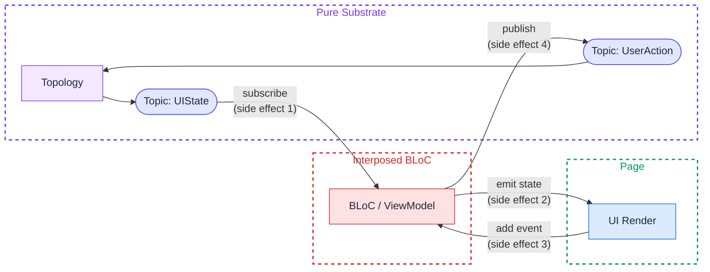

# Nidana Bus Reference Architecture: Rationale and Positioning

**Status:** Draft
**Author:** Purbo
**Version:** 0.15.0
**Date:** 2026-10-09

**Companion documents:** [Specification](nidana-bus-ref-arch-spec-v0_15_0.md) · [Implementer's Guide](nidana-bus-ref-arch-guide-v0_15_0.md)

## About This Document

This document is informative. It records why the Specification says what it says: the motivation, the properties the structure buys and the ones it does not, how the architecture relates to existing patterns, and what it deliberately leaves out. Nothing here adds a rule; where this document and the Specification disagree, the Specification wins.

## Table of Contents

- [1. Motivation](#1-motivation)
- [2. Resilience Properties](#2-resilience-properties)
  - [2.1 Eliminated by Construction](#21-eliminated-by-construction)
  - [2.2 Requires Discipline (Guardrails Provided)](#22-requires-discipline-guardrails-provided)
  - [2.3 Quantifiable Impact](#23-quantifiable-impact)
  - [2.4 What This Means in Practice](#24-what-this-means-in-practice)
- [3. Formal Properties and Determinism](#3-formal-properties-and-determinism)
  - [3.1 Compositional Algebra](#31-compositional-algebra)
  - [3.2 Determinism](#32-determinism)
    - [Time-Dependent Operators: Controlled Non-Determinism](#time-dependent-operators-controlled-non-determinism)
  - [3.3 Type-System-As-Proof](#33-type-system-as-proof)
  - [3.4 What Cannot Be Verified at the Type Level](#34-what-cannot-be-verified-at-the-type-level)
- [4. Emergent Architectural Properties](#4-emergent-architectural-properties)
  - [4.1 Cross-Platform Logic Portability](#41-cross-platform-logic-portability)
    - [Strategy 1: Portable DSL](#strategy-1-portable-dsl)
    - [Strategy 2: Single-Language SSOT with Code Generation](#strategy-2-single-language-ssot-with-code-generation)
    - [The Portability Constraint as Architectural Pressure](#the-portability-constraint-as-architectural-pressure)
  - [4.2 AI-Agent Affordances](#42-ai-agent-affordances)
- [5. Integration With Existing UI Patterns](#5-integration-with-existing-ui-patterns)
  - [5.1 The Recommended Path: Topology Output Directly to UI](#51-the-recommended-path-topology-output-directly-to-ui)
  - [5.2 The BLoC / MVVM / MVI Interposition Problem](#52-the-bloc--mvvm--mvi-interposition-problem)
  - [5.3 When Interposition Might Be Acceptable](#53-when-interposition-might-be-acceptable)
  - [5.4 Summary](#54-summary)
- [6. Comparison With Existing Patterns](#6-comparison-with-existing-patterns)
- [7. What This Architecture Does Not Solve](#7-what-this-architecture-does-not-solve)
  - [7.1 Ephemeral and Component-Local UI State](#71-ephemeral-and-component-local-ui-state)
  - [7.2 Domain-Specific Modeling](#72-domain-specific-modeling)
  - [7.3 Non-Reactive Third-Party SDKs](#73-non-reactive-third-party-sdks)
  - [7.4 Real-Time Collaborative Editing and CRDTs](#74-real-time-collaborative-editing-and-crdts)
  - [7.5 Cross-Process and Cross-Device Coordination](#75-cross-process-and-cross-device-coordination)
  - [7.6 Backend / Server-Side Architecture](#76-backend--server-side-architecture)
  - [7.7 Performance Optimization for Specialized Workloads](#77-performance-optimization-for-specialized-workloads)
  - [7.8 Authentication, Authorization, and Security Mechanisms](#78-authentication-authorization-and-security-mechanisms)
- [8. FAQ for Skeptics](#8-faq-for-skeptics)
  - [8.1 "Isn't this just an event bus with extra steps?"](#81-isnt-this-just-an-event-bus-with-extra-steps)
  - [8.2 "Why not just use Redux/NgRx/MobX/Zustand/Pinia?"](#82-why-not-just-use-reduxngrxmobxzustandpinia)
  - [8.3 "Reactive programming has a steep learning curve."](#83-reactive-programming-has-a-steep-learning-curve)
  - [8.4 "The bus is a god object. Singletons are bad."](#84-the-bus-is-a-god-object-singletons-are-bad)
  - [8.5 "Why not let pages subscribe directly to services?"](#85-why-not-let-pages-subscribe-directly-to-services)
  - [8.6 "What about performance overhead?"](#86-what-about-performance-overhead)
  - [8.7 "DI already solves coordination."](#87-di-already-solves-coordination)
  - [8.8 "This will not work for our app, which is X."](#88-this-will-not-work-for-our-app-which-is-x)

---

## 1. Motivation

Mobile and web applications face a coordination problem. Features are vertically sliced (auth, checkout, profile), yet real-world data flows are often horizontal: a network connectivity change affects every feature, an auth token expiration ripples across all API calls, an analytics event must observe every user action without coupling to any specific screen.

A frontend application is a fundamentally asynchronous environment. Sensor readings arrive unpredictably. Users tap, swipe, and type at their own pace. Backend responses return after variable latency, sometimes out of order, sometimes not at all. OS-level events (connectivity changes, permission prompts, lifecycle transitions) interrupt at arbitrary moments. Every meaningful interaction is concurrent with every other. Modeling this reality as a collection of synchronous request/response procedures is a mismatch: it forces developers to bolt concurrency onto an abstraction that assumes sequential control flow, producing the callback tangles, race conditions, and state synchronization bugs that plague conventional architectures. A reactive data-flow model treats asynchrony as the default, not the exception. Streams are the natural representation of values that change over time, and topologies are the natural way to declare how those changing values relate to each other.

Traditional approaches (dependency injection, service locators, shared singletons) solve the wiring problem but not the data-flow problem. They tell you *where* to find a dependency, not *how data moves* through the system over time.

Nidana Bus addresses this by making data flow explicit, typed, and declarative. The bus is not a god object; it is a substrate, a shared namespace of typed channels (topics) through which decoupled components communicate via reactive streams. The actual coordination logic lives in topologies: local, composable declarations of how topics relate to each other.

---

## 2. Resilience Properties

The architecture, applied with discipline, produces applications with measurably lower crash rates and ANR (Application Not Responding) incidents. This is not a marketing claim; it is a structural consequence of specific design constraints. Intellectual honesty requires distinguishing between failures the architecture eliminates by construction (no discipline needed; the structure makes them impossible) and failures it makes unlikely but still possible (the architecture provides guardrails, but developer discipline is still required).

### 2.1 Eliminated by Construction

These failure categories become structurally impossible when the architecture is followed:

| Failure Category | How the Architecture Eliminates It | Traditional Equivalent |
|---|---|---|
| **Race conditions on shared mutable state on `StateTopic`** | Data contracts on topics are immutable. A `Topic<CartItems>` emits immutable snapshots. Single-writer ownership ([Spec §3.11](nidana-bus-ref-arch-spec-v0_15_0.md#311-single-writer-ownership)) gives every `StateTopic` exactly one writer, topology or claimed shell publisher, so memory races and logical read-modify-write contention are both prevented at the type-and-runtime level. `EventTopic` and `ReplayTopic` are multi-writer; for state derived from multi-writer events, the reducer pattern ([Spec §6.4](nidana-bus-ref-arch-spec-v0_15_0.md#64-topology-misuse-the-sequencer-anti-pattern)) gives a single canonical writer to the corresponding `StateTopic`. | `ConcurrentModificationException`, null pointer on partially-mutated state, corrupted shared singleton |
| **Cascading failures across features** | Topologies are isolated. An error in the payment topology does not propagate to the auth topology or the analytics topology. Each topology's error boundary is self-contained. *Note:* this is fault isolation (exception propagation). If a topology writes corrupted data to a shared topic, downstream topologies will still read it. Data integrity is a contract-level concern, not a runtime isolation property. | An unhandled exception in a callback chain taking down unrelated components |
| **Unhandled exceptions in business logic** | Transformers are pure functions. When errors are modeled as values (`Result<T, E>`) per [Spec §10](nidana-bus-ref-arch-spec-v0_15_0.md#10-error-model), there is no exception to throw. The failure is data on a topic, not a stack-unwinding crash. The architecture *enables* exception-free business logic but does not *enforce* it; a developer can still throw, index out of bounds, or unwrap null inside a transformer. Such exceptions are confined to the topology's error boundary: the underlying reactive framework terminates that topology's subscription, not the backing subject itself. Other topologies subscribed to the same topic are unaffected. | `NullPointerException` deep in a ViewModel, uncaught `Future` errors |
| **Zombie subscriptions / listener leaks** | Explicit lifecycle scopes (APPLICATION, MODULE, PAGE) tie topology activation to well-defined boundaries. When a scope ends, all its subscriptions are disposed automatically. | Forgotten `removeListener` / `dispose` calls causing memory pressure, leading to OOM or ANR |
| **Invisible coupling failures** | Components couple only through typed data contracts. Changing a service's internal implementation cannot break a page that reads from the same topic. There are no hidden interface dependencies to violate. | Service interface change silently breaking a consumer three layers away |
| **Type mismatch at runtime** | Topic references carry compile-time type information. Publishing a `String` to a `Topic<CartItems>` is a compiler error. | `ClassCastException` from untyped event buses or stringly-typed message passing |
| **Inter-topology dependency cycles** | Cycles in the cross-topology read/write graph are rejected at activation time and detected as a CI lint via static analysis ([Spec §3.8](nidana-bus-ref-arch-spec-v0_15_0.md#38-cycle-detection), [Spec §6.5](nidana-bus-ref-arch-spec-v0_15_0.md#65-topology-as-self-documenting-data)). | Hidden circular service dependencies producing infinite loops or deadlocks |
| **Activation duplication** | `activate(topology)` is idempotent on `topologyId` ([Spec §3.9](nidana-bus-ref-arch-spec-v0_15_0.md#39-activation-idempotency)). Double-registration is detected and either deduplicated or rejected. | Double-registered listeners producing duplicated side effects |

### 2.2 Requires Discipline (Guardrails Provided)

These failure categories are significantly mitigated but not eliminated. The architecture provides structural guidance, but the developer can still violate the constraints:

| Failure Category | Guardrail | What Can Still Go Wrong |
|---|---|---|
| **Blocking the main thread (ANR)** | Reactive streams are inherently asynchronous. The topology model naturally pushes I/O to background streams. Services perform side effects outside the main thread by convention. Per-topic dispatcher selection ([Spec §3.6](nidana-bus-ref-arch-spec-v0_15_0.md#36-scheduler-and-dispatcher-contract)). | A developer writes a synchronous network call inside a service before publishing to a topic. A transformer performs O(n²) computation on a large dataset on the main thread. |
| **Unbounded memory growth** | Manual topic cleanup ([Spec §7.5](nidana-bus-ref-arch-spec-v0_15_0.md#75-topic-cleanup)), explicit buffer limits on `ReplayTopic`, scope-based topology teardown. | A `StateTopic` accumulates large objects without cleanup. A `ReplayTopic` is configured with an excessively large buffer. |
| **Topology-as-sequencer** | [Spec §6.4](nidana-bus-ref-arch-spec-v0_15_0.md#64-topology-misuse-the-sequencer-anti-pattern) guidance, CI lint for single-producer/single-consumer topic chains. | A developer implements a multi-step sequential process as a chain of single-consumer read/write steps within a single topology. Functionally correct but semantically wrong. |
| **Stale state on rehydration** | Per-topic persistence opt-in prevents accidental rehydration of transient state ([Guide §10.5](nidana-bus-ref-arch-guide-v0_15_0.md#105-persistence-and-hydration)). Sensitive flag prevents auto-snapshot of credentials ([Spec §9.2](nidana-bus-ref-arch-spec-v0_15_0.md#92-sensitive-data-handling)). | Developer enables persistence on a topic carrying network state, causing the app to render stale data on restart. |
| **Slow transformers causing jank** | Pure function design makes transformers easy to profile and benchmark in isolation. Scheduler control allows offloading heavy transforms to background threads. | A transformer doing expensive serialization or image processing on the main thread scheduler. |
| **Multi-writer logical contention** | `StateTopic` has one owner ([Spec §3.11](nidana-bus-ref-arch-spec-v0_15_0.md#311-single-writer-ownership)), enforced by runtime first-claim over topologies and shell publishers alike, plus the workspace AST scan. | A team bypasses the bus with raw engine access to the backing subject, or routes a second writer through an `EventTopic` whose reducer is a bare setter ([Spec §6.4](nidana-bus-ref-arch-spec-v0_15_0.md#64-topology-misuse-the-sequencer-anti-pattern)), which moves the race into the reducer's input order instead of resolving it. |
| **Privacy leakage via observers** | Sensitive flag ([Spec §9.2](nidana-bus-ref-arch-spec-v0_15_0.md#92-sensitive-data-handling)) gates observer visibility. CI lint flags sensitive types not marked. | A developer adds an `OBSERVE_SENSITIVE` observer that forwards raw envelopes to an external logging system through `ObserveContext` sinks without redaction. |

### 2.3 Quantifiable Impact

The following table maps common production stability metrics to the architectural properties that improve them:

| Metric | Contributing Architecture Property | Expected Impact |
|---|---|---|
| Crash-free rate | Immutable contracts, error-as-values, topology isolation, single-writer ownership | Eliminates the majority of non-platform, non-native crashes. The remaining crashes are platform bugs, OOM from external causes, and native code failures. |
| ANR rate (Android) | Async-by-default reactive streams, explicit lifecycle, no blocking I/O in the pure substrate | Significantly reduced. The primary remaining ANR risk is blocking calls in service implementations, which are visible, isolated, and auditable at the shell boundary. |
| Memory leak rate | Scope-based topology disposal, explicit topic cleanup, no long-lived closures capturing references | Structurally reduced. Leak sources are confined to the imperative shells. |
| Mean time to diagnose | Correlation/causation IDs, topology graph visualization, inspectable topic state | Significantly reduced. Every data flow is traceable. |

These are expected impacts based on architectural properties. Concrete benchmarks against real applications are not yet available; see [Guide §8.1](nidana-bus-ref-arch-guide-v0_15_0.md#81-performance-and-memory-cost-model) for the cost model and benchmark methodology. Teams should treat the impact column as a hypothesis and measure on their own workload.

### 2.4 What This Means in Practice

The honest claim is not "Nidana Bus guarantees zero crashes." The honest claim is:

**The architecture eliminates, by construction, several common categories of runtime failure in mobile and web applications: shared-state races on state topics, cascading failures, listener leaks, dependency cycles, and unhandled exceptions in business logic. The remaining failure categories (main-thread blocking, unbounded memory, slow transforms) are confined to well-defined boundaries where they are visible, auditable, and testable. The net effect is a more stable application with crash causes that are easier to diagnose and fix when they do occur.**

This is a structural property of the architecture, not a claim about any specific implementation. An implementation that violates the constraints (mutable data on topics, side effects in transformers, missing lifecycle scopes, multi-writer state topics without reducer discipline) loses these guarantees.

---

## 3. Formal Properties and Determinism

This section makes a deliberately modest set of architectural claims. The architecture preserves type-system-as-proof and stream-composition algebra that traditional reactive architectures dilute via shared mutable state and interleaved side effects. That preservation is not unique to Nidana Bus; it is what any FP-discipline architecture provides when applied consistently. What this section does *not* attempt is a paper-length category-theoretic exposition; the gain in clarity would not justify the cost.

### 3.1 Compositional Algebra

The bus is a substrate for arrow-style composition: typed streams compose sequentially through shared topics and in parallel through combinators (`combineLatest`, `merge`, `zip`). The algebra is associative and identity-preserving in the standard ways:

- Sequential composition: `(F then G) then H ≡ F then (G then H)`.
- Identity: a topology that simply forwards its input is a no-op composition.
- Parallel composition: when two topologies operate on disjoint topics, their parallel composition commutes.

Two practical consequences follow, each with a precise scope.

**Activation order.** For the `StateTopic` subgraph, activation order is irrelevant: a topology activated late receives each `StateTopic`'s current value on subscription and converges to the same result as one activated early. For `EventTopic`, order matters by design, because events published before a reader subscribes are not delivered ([Spec §7.4](nidana-bus-ref-arch-spec-v0_15_0.md#74-topic-vs-topology-lifecycle)). The startup barrier ([Spec §3.13](nidana-bus-ref-arch-spec-v0_15_0.md#313-startup-barrier)) removes the distinction for the `APPLICATION` scope: nothing is delivered until every `APPLICATION` topology is active, so within that scope activation order is irrelevant for every topic variant. `MODULE` and `PAGE` topologies observe only events published after their activation, which is why state a late-activating consumer needs lives on a `StateTopic`.

**Refactoring through intermediate topics.** Splitting one topology into two through an intermediate topic preserves the sequence of values on every topic. It adds one scheduling boundary per intermediate topic ([Spec §3.4](nidana-bus-ref-arch-spec-v0_15_0.md#34-reentrant-publish-normalization)), so emissions on different topics may interleave differently than before; cross-topic ordering is not guaranteed in either arrangement ([Spec §3.3](nidana-bus-ref-arch-spec-v0_15_0.md#33-ordering-guarantees)).

The reactive engines underlying topics (`Observable`, `Flow`, `Publisher`) satisfy the monad laws: `of`/`just` is *return*, `flatMap`/`switchMap` is *bind*. Stream transformations compose predictably: `map(f).map(g) ≡ map(g ∘ f)`, and `flatMap` is associative. Refactoring a chain of stream operations into a composed operation preserves behavior.

### 3.2 Determinism

The architecture provides a determinism guarantee stronger than traditional reactive patterns. The precise claim:

**A topology whose inputs are topic reads, whose transformers are pure, and whose operators are not time-dependent is a pure function from input event sequences to output event sequences: the same sequence of values on the source topics produces the same sequence of values on the destination topics.**

Two qualifications make the claim exact:

- A topology that incorporates a shell-provided stream (`switchMap` into a service's stream factory, [Spec §6.3](nidana-bus-ref-arch-spec-v0_15_0.md#63-reactive-combinators)) is deterministic given that stream's emissions. The stream factory is an input of the function, like a topic read. In tests the factory is a stub and determinism is total; in production it is as deterministic as the service behind it. This is why [Spec §6.3](nidana-bus-ref-arch-spec-v0_15_0.md#63-reactive-combinators) keeps the effect in the shell.
- When several inputs of a multi-input combinator emit within the same scheduling tick, the engine decides which emission triggers the output ([Spec §2.4](nidana-bus-ref-arch-spec-v0_15_0.md#24-message-envelope)). The output sequence is therefore deterministic per engine, and fully deterministic under `TestBus` with the virtual scheduler ([Spec §3.6](nidana-bus-ref-arch-spec-v0_15_0.md#36-scheduler-and-dispatcher-contract)). Across engines the set of output values is the same; the order within one tick may differ.

Why traditional architectures lack this property:

- In MVVM/BLoC/MVI built on shared mutable state, a ViewModel reads and writes shared state. The result of a state mutation depends on what other ViewModels have written before. Behavior is path-dependent.
- Two callbacks updating the same state object can interleave, producing different results depending on thread scheduling. Behavior is schedule-dependent.
- A BLoC that calls a service method directly may get different results depending on the service's internal cache state. Behavior is history-dependent.

In Nidana Bus:

- Topics carry immutable values. There is no shared mutable state to create path dependence.
- Topologies are pure transformations on streams. Same input sequence, same output sequence.
- Services interact with topics through publish/subscribe, not direct method calls. Topology behavior does not depend on any service's internal state.

#### Time-Dependent Operators: Controlled Non-Determinism

Certain reactive operators introduce a dependency on wall-clock time:

| Operator | Non-determinism Source | Mitigation |
|---|---|---|
| `debounce(300ms)` | Output depends on timing between input events | Inject a virtual scheduler in tests |
| `throttle(1s)` | Output depends on when events arrive relative to the throttle window | Same |
| `timeout(5s)` | Emits error if no event within window | Same |
| `delay(100ms)` | Shifts events in time | Same |
| `sample(interval)` | Samples latest value at fixed intervals | Same |

Beyond the two qualifications above, these operators are the only source of non-determinism in a topology. They are:

1. Explicitly declared in the topology definition, making them visible and auditable.
2. Replaceable via scheduler injection. In tests, a virtual time scheduler makes them deterministic.
3. Confined to specific points in the stream pipeline. The rest of the topology remains fully deterministic.

The architecture achieves determinism-by-default with opt-in, controlled, testable non-determinism. This is a stronger property than traditional architectures where non-determinism pervades the entire system via shared mutable state and uncontrolled concurrency.

### 3.3 Type-System-As-Proof

When a transformer signature `(CartItems, AuthState) → CheckoutUIState` type-checks, the compiler has verified that the output is constructible from the inputs. This is mechanical correctness verification, available on every target platform without exotic tooling.

The architecture exploits this in two specific patterns:

**State space exhaustiveness.** The sealed ADT state machine pattern ([Spec §6.4](nidana-bus-ref-arch-spec-v0_15_0.md#64-topology-misuse-the-sequencer-anti-pattern)) is the most practically powerful application:

```kotlin
sealed interface CheckoutProcess { ... five variants ... }

fun reduceCheckout(state: CheckoutProcess, event: CheckoutEvent): CheckoutProcess =
    when (state) {        // exhaustive (compiler enforced on Kotlin and Swift)
        is Idle              -> ...
        is AwaitingPayment   -> ...
        is AwaitingInventory -> ...
        is Confirmed         -> ...
        is Failed            -> ...
    }
// Adding a sixth variant forces every `when` to be updated.
```

This gives mechanically verified correctness over the full state space of a process on standard platforms, with no external tooling.

**Phantom types and tagged wrappers.** Domain invariants encoded at the type level are verified at compile time with no runtime cost:

```kotlin
@JvmInline value class Validated<T>(val value: T)

fun validateOrder(raw: OrderRequest): Result<Validated<OrderRequest>, ValidationError>

// Topic<Validated<OrderRequest>> is populated only by the validation function.
// Single-writer enforcement ([Spec §3.11](nidana-bus-ref-arch-spec-v0_15_0.md#311-single-writer-ownership)) confirms structurally that the validation
// topology is the sole writer.
val validatedOrder = StateTopic<Validated<OrderRequest>>(
    name = "checkout.validated-order",
    initial = ...,
)
```

This encodes "invalid orders never reach the payment service" at the type level.

### 3.4 What Cannot Be Verified at the Type Level

What standard type systems cannot verify is **semantic correctness**: that `buildCheckoutUI` produces the right `CheckoutUIState`, not just *a* `CheckoutUIState`. The signature `(CartItems, AuthState) → CheckoutUIState` says nothing about whether `canCheckout` is correctly computed.

Closing this gap fully requires dependent types (Idris, Agda, Coq) or refinement types (Liquid Haskell). These are unavailable on the target platforms.

The practical substitute is **property-based testing**: express semantic propositions as properties and verify them against arbitrary generated inputs. This is not compile-time proof, but it is mechanized verification of semantic claims, which is what matters in practice.

```
// Proposition: canCheckout implies isLoggedIn
forAll(cartItems, authState) { cart, auth ->
  val result = buildCheckoutUI(cart, auth)
  if (result.canCheckout) assert(auth.isLoggedIn)
}

// Proposition: empty cart implies canCheckout is false
forAll(authState) { auth ->
  val result = buildCheckoutUI(CartItems.empty(), auth)
  assert(!result.canCheckout)
}
```

No mocking, no framework, no bus. The pure function is the unit under test.

For system-level safety and liveness properties ("after a logout event, all feature modules eventually reach an unauthenticated state"), tools like TLA+ or Alloy can model the topology graph. These are external tooling, useful for safety-critical flows (payment, auth) where "this bad state can never be reached" must be proven, not just tested.

---

## 4. Emergent Architectural Properties

The pure-substrate / imperative-shell separation produces benefits beyond the immediate goals of decoupling and testability. This section documents properties that follow structurally from the architecture's constraints, particularly from the requirement that transformers are pure functions and topologies are declarative data structures.

### 4.1 Cross-Platform Logic Portability

The pure substrate is portable in a specific, bounded sense. A transformer is a pure function with signature `(InputTypes...) → OutputType`. If the function uses only types and operations available across all target platforms, it translates mechanically to any platform. The topology wiring is a declarative data structure that translates similarly.

What the architecture *guarantees portable*:

- The topology wiring (which topics connect through which combinators).
- Pure transformers that operate on a documented cross-platform standard library (basic collections, primitive types, project-defined ADTs, standard math operations).
- The data contracts when defined via Protobuf or a similar cross-platform schema language ([Guide §1.2](nidana-bus-ref-arch-guide-v0_15_0.md#12-alternative-protocol-buffers)).

What the architecture does *not* guarantee portable:

- Transformers that use platform-specific libraries (currency formatters, date manipulation, locale-aware operations, regex with platform-specific dialects).
- Effects (network, persistence, sensors, navigation execution).
- UI rendering.
- Anything in the imperative shells.

A meaningful but minority subset of business logic falls outside the portable substrate. For most apps, that subset will include critical-path code: monetary arithmetic, date math, validation against locale-specific rules. Plan accordingly.

#### Strategy 1: Portable DSL

Define both transformers and topology wiring in a platform-neutral DSL. A code generator emits platform-specific implementations.

```yaml
# topology: pricing
sources:
  - topic: CartItems
  - topic: UserTier

sink: PricingResult

transform: computePricing
  rules:
    - apply_discount(items, tier)
    - apply_tax(discounted, region)
```

The DSL approach works when transformers stay within the expression language's capabilities. Anything that exceeds them signals logic that may belong in a service (the imperative shell) rather than the pure substrate.

#### Strategy 2: Single-Language SSOT with Code Generation

Write transformers and topology definitions in one language, then generate equivalent code for other platforms. The state of the art:

- **Kotlin Multiplatform (KMP):** mature for Kotlin → JVM/native iOS/JavaScript. The Kotlin → idiomatic Swift generation works via Objective-C interop with significant ergonomic cost on the Swift side. Acceptable for shared substrate code, awkward for surface APIs.
- **Dart → other platforms:** no production-grade codegen exists for Dart → Kotlin/Swift/TypeScript. Dart-as-SSOT is viable only when Flutter is the primary platform and other platforms are secondary.
- **TypeScript → other platforms:** TypeScript-to-C# tooling exists (Bridge.NET); TypeScript-to-Swift/Kotlin is not mature enough for production.

Realistic recommendation: choose KMP if cross-platform sharing is a primary requirement and Swift ergonomic awkwardness is acceptable. Otherwise, plan for per-platform reimplementation of the non-trivial transformer subset, with the topology wiring shared via a DSL or a hand-translated convention.

#### The Portability Constraint as Architectural Pressure

The portability constraint functions as a design-time enforcement mechanism. The moment a developer attempts to introduce a network call, database access, or platform API invocation into a transformer, the portability guarantee breaks visibly. The function can no longer be generated for other platforms. This creates constructive pressure to keep the pure substrate genuinely pure, pushing effects outward to services where they belong.

A linter or code generator can reject any transformer that imports platform-specific packages, which makes the pure-substrate boundary structurally enforceable.

### 4.2 AI-Agent Affordances

The architecture is designed to be friendly to AI-assisted development. This is design intent, not measurement: the document does not yet contain benchmarks comparing AI agent performance on Nidana Bus codebases vs. traditional architectures. Treat the claims below as hypotheses to validate empirically.

The structural properties that should help:

- **Bounded transformer scope.** A transformer is a pure function with typed inputs and outputs. Its specification is complete in its signature. An agent can generate, test, and iterate on a transformer without understanding the rest of the system.
- **Explicit dependency manifests.** A topology declares exactly which topics it reads and writes. There are no hidden dependencies for an agent to miss.
- **Side-effect isolation.** The pure substrate has no side effects. An agent can work on the substrate (the majority of business logic) without reasoning about lifecycle, threading, or I/O.
- **Mechanical test generation.** Given a function signature, generating property-based tests is a well-defined task.
- **Compact context windows.** A single transformer plus its topic types typically fits in a few hundred tokens.

What the architecture does *not* solve for AI agents:

- Feature work that touches multiple files (registry, topology, page, persistence) is still cross-cutting; the bounded-transformer property does not extend to feature-level work.
- The agent must still understand the architecture's conventions; without architectural literacy, the agent generates code that violates the constraints.

The strongest claim that can be made without measurement is: the architecture does not introduce gratuitous obstacles to AI-assisted work. Whether it produces measurably better outputs than traditional architectures is an open empirical question.

---

## 5. Integration With Existing UI Patterns

### 5.1 The Recommended Path: Topology Output Directly to UI

The simplest and most architecturally consistent approach is to let the topology output stream drive the UI directly, and let user interactions publish directly to topic inputs. The topology is the state management layer. The UI is a pure rendering function of the topology's output.

```
class CartPage {
  void build(context) {
    final uiState = bus.subscribe(CheckoutTopics.uiState);
    return StreamBuilder(
      stream: uiState,
      builder: (context, state) => renderCart(state),
    );
  }

  void onAddItem(item) {
    bus.publish(CheckoutTopics.addItem, item);
  }
}
```

This creates a clean, single-loop data flow:

```
User Interaction → Topic (input) → Topology (pure transform) → Topic (output) → UI Render
```

No intermediary. No second event loop. No redundant state management layer.

### 5.2 The BLoC / MVVM / MVI Interposition Problem

It is technically possible to place an existing state management pattern (BLoC, ViewModel, MVI) between the topology and the UI. This introduces a structural problem that teams must understand clearly before choosing this path.



What goes wrong:

1. **Redundant event loop.** BLoC is itself a stream-based event-to-state machine. The topology is also a stream-based data flow. Two reactive loops doing state transformation where one suffices. The BLoC adds zero value; it just relays.

2. **Side effects escape the edge.** With BLoC interposed, the BLoC becomes a side-effecting middleman that subscribes to topics, transforms state, and emits to the UI. This is the kind of uncontrolled side-effect proliferation the architecture is designed to prevent.

3. **State synchronization risk.** Two state holders (the topic and the BLoC's internal state) can drift. If the BLoC caches, buffers, or transforms the topic's output, the UI may show stale data while the topic holds fresh data. This category of bug cannot exist when the UI subscribes directly to the topic.

4. **Testing complexity doubles.** You now need to test the topology (does it produce correct output?) *and* the BLoC (does it correctly relay the topology's output?) for what is functionally a single data flow.

### 5.3 When Interposition Might Be Acceptable

There are narrow cases where a screen-local state manager adds value:

- **Ephemeral UI state** that the topology should not know about: animation states, focus tracking, scroll position, tab selection. These are page-scoped concerns that live and die with the screen. A lightweight local state holder for these is fine, but it should not sit between the topology and the UI for domain state.
- **Gradual migration.** If an existing app already uses BLoC/MVVM extensively, wrapping topology subscriptions in existing ViewModels/BLoCs can be a pragmatic migration step. Teams should understand this is transitional, not the target architecture.

### 5.4 Summary

| Approach | Data Flow | Side Effects | Recommended? |
|---|---|---|---|
| Direct: Topology → UI | Single loop, minimal indirection | Only at the edge (UI boundary) | Yes (target architecture) |
| Interposed: Topology → BLoC → UI | Dual loop, redundant state management | Spread across BLoC and UI | No, unless migrating incrementally |
| Hybrid: Topology for domain, local state for ephemeral UI | Domain via topology, UI chrome via local state | Domain at edge only, UI state scoped to page | Acceptable; keep boundaries clear |

---

## 6. Comparison With Existing Patterns

| Pattern | Where it lives | What it does | Relationship to Nidana Bus |
|---|---|---|---|
| **Redux / NgRx** | App-wide | Single store, dispatch actions, reducers produce new state | Conceptually similar (single source of truth for state). Differences: Redux/NgRx use a single root state; Nidana Bus uses many independent topics. NgRx feature stores narrow this gap; topics are still finer-grained than feature stores and can be added/removed without modifying a global registry. Selectors are absent in Nidana Bus; topology combinators play a similar role. |
| **Redux Toolkit Query / RTK Query** | Server cache | Caches server queries, manages loading/error state | Complementary. Use RTK Query for server-state caching; use Nidana Bus for app-coordination concerns. |
| **TanStack Query** | Server cache | Caches server queries with stale-while-revalidate | Complementary, like RTK Query. |
| **Zustand / Jotai / Recoil** | App-wide or scoped | Atom-based state with subscriptions | Similar grain to topics. Zustand stores and Jotai atoms are lightweight and scoped; topics are similar but explicitly typed and lifecycle-managed. Either pattern can coexist with Nidana Bus or can be replaced by it. |
| **BLoC (Flutter)** | Per-feature | Stream-based event-to-state machines per feature | Interposable but redundant. See [§5.2](#52-the-bloc--mvvm--mvi-interposition-problem). |
| **MVI** | Per-screen | Model-View-Intent triad with unidirectional data flow | Same data-flow shape as topology + UI. The architecture is MVI extended to the cross-feature boundary, with topics as the shared model layer. |
| **Combine ObservableObject (SwiftUI)** | Per-screen | A class that publishes property changes | Local state holder, not a coordination layer. Coexists with Nidana Bus for component-local state. |
| **EventBus / NotificationCenter** | App-wide | Untyped publish/subscribe | Architectural ancestor. Nidana Bus is a strongly-typed, lifecycle-managed, declarative-topology evolution of the same idea. |
| **Reactive Manifesto applications** | System-wide | Responsive, resilient, elastic, message-driven systems | Conceptual alignment. Nidana Bus brings these properties to the frontend, where backend tools (Akka, Vert.x, Reactor) have always operated. |
| **Elm Architecture / TEA** | App-wide | Pure model-update-view loop | Strong alignment. Nidana Bus is a multi-topic generalization of TEA, with each topology playing the role of a sub-update function and topics as the shared model. |
| **Kafka Streams (backend)** | Stream processing | Declarative `Topology` of sources, processors and sinks; `Topology.describe()` yields the static graph | Closest ancestor of the topology-as-data idea ([Spec §6.5](nidana-bus-ref-arch-spec-v0_15_0.md#65-topology-as-self-documenting-data)), transplanted to in-process frontend streams. Nidana Bus borrows the vocabulary and the static-graph property, not the partitioning or persistence model. |
| **Cycle.js** | App-wide | Pure `main` function over stream sources; effects in drivers | Same shell/substrate split. Cycle.js has one `main`; Nidana Bus has many topologies composed through shared topics, and adds lifecycle scopes and ownership. |
| **redux-observable / NgRx Effects** | App-wide | Epics or effects as stream transformations over an action stream | Epics are topologies over a single untyped action topic. Nidana Bus types the topics, declares reads and writes statically, and enforces ownership. |
| **Square Workflow** | Per-feature | Declarative, composable state machines with typed output | Same reducer-as-pure-function stance ([Spec §6.4](nidana-bus-ref-arch-spec-v0_15_0.md#64-topology-misuse-the-sequencer-anti-pattern)). Workflow composes by nesting; Nidana Bus composes through shared topics. |
| **MobX / Vue reactivity** | App-wide | Implicit dependency tracking on observable properties | Different model. MobX/Vue track property reads and rebuild reactions automatically; Nidana Bus declares dependencies explicitly via topologies. The explicit declaration is heavier but produces the static topology graph that enables visualization and lints. |

The architecture is not a wholesale replacement for any of the above; it is a coordination substrate that complements server-cache layers, replaces conceptually overlapping patterns where the team chooses to, and provides a more rigorous treatment of cross-feature data flow than any of the per-feature patterns offer.

---

## 7. What This Architecture Does Not Solve

A reference architecture is more useful when it is honest about its scope. Nidana Bus is a coordination substrate for application-level data flow. It does not address every concern in a frontend application. This section enumerates the explicit non-goals.

### 7.1 Ephemeral and Component-Local UI State

Form input values, animation states, focus tracking, scroll positions, hover states, tooltip visibility, and other ephemeral UI state are not Nidana Bus concerns. They are component-local, screen-scoped, and have no architectural value in a system-wide topic. Use the platform's idiomatic local state mechanism: `setState`/hooks in React, `@State` in SwiftUI, `mutableStateOf` in Compose, `data` in Vue.

The boundary heuristic: if state is meaningful to more than one screen, or persists across navigation, or affects business logic, it belongs on a topic. If it is invisible to the rest of the app and dies with the screen, it does not.

### 7.2 Domain-Specific Modeling

Nidana Bus does not prescribe a domain model. It does not tell you how to structure your `CartItems`, `Order`, `User`, or `Payment` types. It does not provide ORMs, schema migration tools, or validation libraries. Domain modeling is the team's responsibility. The architecture only requires that domain types are immutable and form valid data contracts ([Spec §8](nidana-bus-ref-arch-spec-v0_15_0.md#8-data-contract-rules)).

### 7.3 Non-Reactive Third-Party SDKs

Many third-party SDKs are imperative: callback-based, promise-based, or direct method-call APIs. The architecture does not magically reactify them. The recommended pattern is to wrap the SDK in a service that adapts its imperative surface to topic-based publish/subscribe at the shell boundary.

```kotlin
// The adapter publishes what the SDK reported as events. The auth-core reducer
// ([Spec §2.5](nidana-bus-ref-arch-spec-v0_15_0.md#25-topic-initialization)) owns auth.state and decides what each event means.
class FirebaseAuthService(private val bus: Bus, private val firebaseAuth: FirebaseAuth) {
    private val publisher = bus.publisher("service:firebase-auth")

    init {
        firebaseAuth.addAuthStateListener { user ->
            val event = if (user != null) AuthEvent.LoggedIn(user.toUser(), user.token())
                        else              AuthEvent.LoggedOut
            publisher.publish(AuthTopics.events, event)
        }
    }

    suspend fun signIn(email: String, password: String) {
        val result = firebaseAuth.signInWithEmailAndPassword(email, password).await()
        // Auth state listener above handles the event publish.
    }
}
```

The adapter claims no `StateTopic`. The alternative shape, where the SDK is the sole source of truth and nothing else ever changes auth state, is for the adapter to claim `AuthTopics.state` at construction ([Spec §2.4](nidana-bus-ref-arch-spec-v0_15_0.md#24-message-envelope) "Publishing Context for Shell-Boundary Code") and for no `auth-core` topology to exist. Either shape is valid; the bus rejects both at once ([Spec §3.11](nidana-bus-ref-arch-spec-v0_15_0.md#311-single-writer-ownership)).

The wrapping is straightforward but is real work. SDKs with complex stateful behavior, callbacks that fire from arbitrary threads, or non-cancelable operations require careful adapter design.

### 7.4 Real-Time Collaborative Editing and CRDTs

The bus is not designed for CRDT-based document synchronization (collaborative text editing, multi-cursor design tools, real-time whiteboards). These workloads require operation-based merge semantics, vector clocks, and convergence guarantees that the bus's last-write-wins (or single-writer) model does not provide.

Applications that need CRDT can use a dedicated CRDT library (Automerge, Y.js) for the document layer and Nidana Bus for the coordination concerns around it (auth, presence indicators, document list, save-status UI).

### 7.5 Cross-Process and Cross-Device Coordination

Each bus instance is per-coordination-domain (process, scene, tab, request). The bus provides no inter-process communication, inter-device sync, or distributed-state guarantees. Multi-window mobile apps, multi-tab web apps, and multi-device experiences (phone + watch + TV) are not bus-level concerns.

For cross-tab coordination on the web, applications can use `BroadcastChannel` to replicate selected topic emissions across tabs. This is a thin application-level adapter, not a bus feature. Cross-device sync requires a backend.

### 7.6 Backend / Server-Side Architecture

Nidana Bus is a frontend pattern. The architecture has nothing to say about how to build the backend. Server-side reactive frameworks (Akka, Vert.x, Spring WebFlux) are conceptually adjacent but solve different problems (request routing, persistence consistency, distributed coordination) that are out of scope here.

### 7.7 Performance Optimization for Specialized Workloads

The architecture is designed for typical mobile/web app workloads: dozens of active topologies, hundreds of topics, message rates measured in tens to low thousands per second across the application. It is not designed for:

- High-frequency sensor pipelines requiring zero-allocation hot paths (game engines, AR/VR, real-time audio).
- Batch processing with millions of items.
- Sub-millisecond latency requirements.

For these workloads, the per-message envelope allocation, the per-stage metadata threading, and the dispatcher hops introduce measurable overhead. Profile early, and consider whether parts of the workload should bypass the bus for direct stream pipelines. See [Guide §8.1](nidana-bus-ref-arch-guide-v0_15_0.md#81-performance-and-memory-cost-model) for the cost model.

### 7.8 Authentication, Authorization, and Security Mechanisms

The architecture provides patterns for distributing auth state (`Topic<AuthState>`) and gating navigation by role (`applyAuthGuard`, [Guide §3](nidana-bus-ref-arch-guide-v0_15_0.md#3-navigation-as-a-cross-cutting-concern)). It does not provide the auth implementation itself: token storage, refresh logic, biometric flows, OAuth handshakes, certificate pinning, jailbreak detection, and other security mechanisms are the responsibility of the auth service.

Similarly, the sensitive flag ([Spec §9.2](nidana-bus-ref-arch-spec-v0_15_0.md#92-sensitive-data-handling)) provides an architectural seam for compliance auditing but does not implement compliance. PII handling, data retention, audit logging, and regulatory requirements (GDPR, CCPA, HIPAA, PCI-DSS) require dedicated tooling and processes beyond the bus.

---

## 8. FAQ for Skeptics

This section addresses questions that experienced engineers commonly raise after reading the architecture for the first time. The goal is not to win every debate; it is to make the architecture's trade-offs explicit so teams can decide on the merits.

### 8.1 "Isn't this just an event bus with extra steps?"

A traditional event bus is untyped, lifecycle-naive, and has no notion of declarative composition. Components publish strings; subscribers parse the payload at runtime; there is no static graph; there is no scope management; there is no ordering guarantee.

Nidana Bus shares the publish/subscribe model with traditional event buses, but every other property is different: typed topic references, declarative topologies, lifecycle scopes, single-writer ownership, ordering guarantees, envelope causation chains, structural cycle detection. The result is closer to a build-time-verified data flow graph than a runtime event broadcaster.

### 8.2 "Why not just use Redux/NgRx/MobX/Zustand/Pinia?"

These are state management libraries. They solve the problem of "where does my state live and how do I update it." Nidana Bus solves the problem of "how do components in different parts of the app coordinate over time."

A Redux store has one root reducer over one global state. Nidana Bus has many independent topics with topologies wiring them together. The two models can coexist: a Redux store can sit on a topic; a topology can publish actions to a Redux store. They overlap in capability but differ in granularity and lifecycle.

For an app that already works well with Redux, the case for switching is weak. For a new app, or one struggling with cross-cutting coordination problems, Nidana Bus offers a different model that may fit better. The [§6](#6-comparison-with-existing-patterns) comparison table is the detailed answer.

### 8.3 "Reactive programming has a steep learning curve."

It does. The [Guide §9.5](nidana-bus-ref-arch-guide-v0_15_0.md#95-team-adoption) adoption guidance assumes the team will invest in reactive fluency. Without that investment, the architecture's value diminishes; topologies become opaque pipelines that nobody on the team feels comfortable modifying.

The counterweight: reactive fluency is a transferable skill. Teams that learn it for Nidana Bus can apply it to Combine, Flow, RxJS, ReactiveX, and any modern reactive library. The investment compounds across the engineering career.

### 8.4 "The bus is a god object. Singletons are bad."

The bus is not a global singleton. There is one bus instance per coordination domain (process, scene, tab, request), accessed through explicit reference, not a global accessor ([Spec §3.1](nidana-bus-ref-arch-spec-v0_15_0.md#31-bus-identity-and-coordination-domain), [Guide §6.4](nidana-bus-ref-arch-guide-v0_15_0.md#64-bus-reference-acquisition-per-platform)). Tests run with isolated `TestBus` instances. SSR creates one bus per request. Multi-scene support gets one bus per scene. The "god object" objection is structurally invalid for the architecture as specified.

The bus is centralized in the sense that it is the single mediator of cross-component data flow. This is intentional. The alternative, every component holding direct references to every other component, is the structural problem the architecture is designed to solve.

### 8.5 "Why not let pages subscribe directly to services?"

This is the design choice the architecture rejects. When pages subscribe to services directly:

- The page knows about the service's interface, lifecycle, and error model.
- Services accumulate page-specific accessors (`AuthService.isLoggedIn`, `AuthService.currentUserName`, `AuthService.profileImage`) instead of exposing a single coherent state.
- Cross-cutting features (analytics, error reporting) require explicit wiring into every service the page uses.
- Testing the page requires mocking every service it consumes.

When pages subscribe to topics:

- The page knows about a typed contract (`Topic<AuthState>`). It does not know which service produces the state.
- Services produce one state per topic, exposing internal complexity through the contract's structure rather than through getter methods.
- Cross-cutting features observe the bus once and see all relevant emissions.
- Testing the page requires only a `TestBus` with synthetic topic values.

The argument is not that direct subscription is wrong; it is that topic-mediated subscription is structurally superior for the kinds of apps the architecture targets.

### 8.6 "What about performance overhead?"

[Guide §8.1](nidana-bus-ref-arch-guide-v0_15_0.md#81-performance-and-memory-cost-model) is the honest answer. The architecture has measurable per-message overhead (envelope allocation, metadata threading, dispatcher hops, observer dispatch). For typical app workloads, the overhead is negligible. For specialized workloads (high-frequency sensors, real-time audio, game loops), it is meaningful and may force topics to be bypassed for direct stream pipelines.

The benchmark suite in `nidana-perf-suite` ([Guide Appendix B](nidana-bus-ref-arch-guide-v0_15_0.md#appendix-b-library-modularization)) measures the overhead on each platform. Teams should run it on their hardware before adopting the architecture for performance-critical paths.

### 8.7 "DI already solves coordination."

DI solves object graph construction. It tells you how to instantiate a `PaymentService` with its dependencies. It does not tell you how `PaymentService` and `AuthService` coordinate over time when an auth token expires mid-payment.

Teams that try to solve coordination with DI end up with services holding references to other services and calling methods on them directly. The [Spec §1](nidana-bus-ref-arch-spec-v0_15_0.md#1-design-principles) design principles address this: "Complementary to DI, not a replacement." Use DI for construction, the bus for runtime data flow. Mixing the two roles is the failure mode the architecture is designed to prevent.

### 8.8 "This will not work for our app, which is X."

Possibly true. The architecture is a coordination substrate for application-level data flow. [§7](#7-what-this-architecture-does-not-solve) is the explicit list of non-goals. Apps that are primarily server-cache-driven (TanStack Query is the architecture), document-collaborative (CRDT is the architecture), real-time game engines (custom message passing is the architecture), or extremely simple (no cross-cutting concerns at all) may not benefit.

The architecture is most valuable for apps with multiple features that share state, multiple platforms with shared logic, and a multi-year roadmap that requires evolution. If those properties do not apply, simpler patterns may be sufficient.
