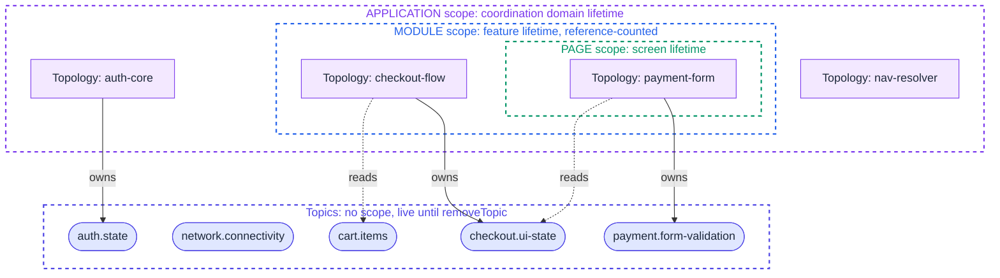
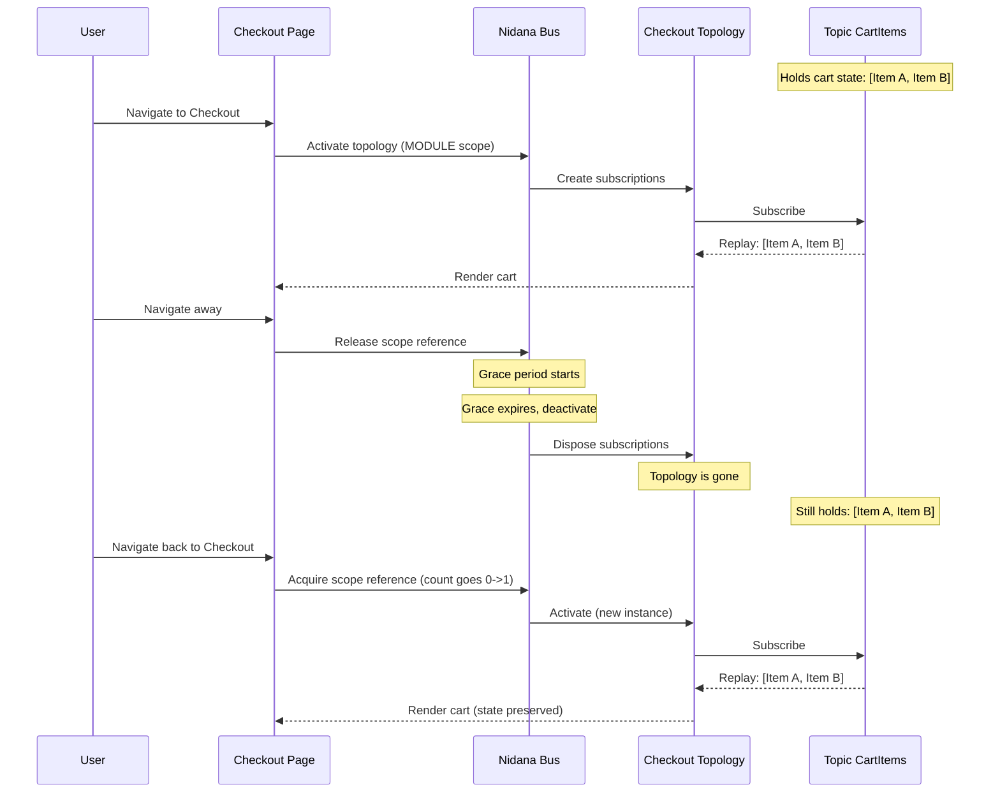
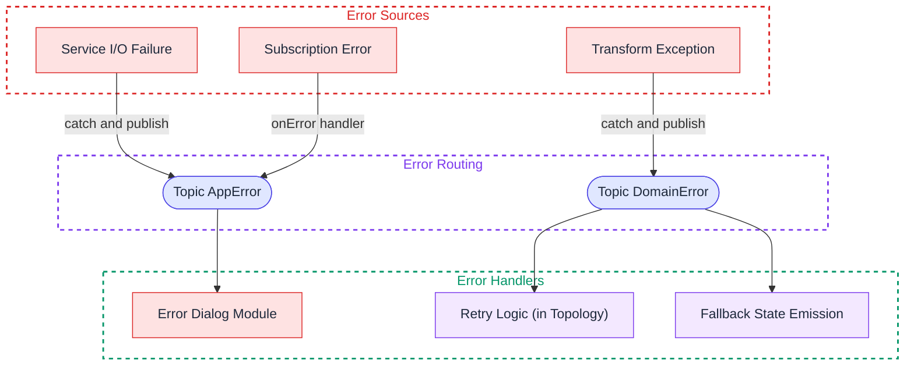

# Nidana Bus Reference Architecture: Specification

**Status:** Draft
**Author:** Purbo
**Version:** 0.15.0
**Date:** 2026-10-09

**Companion documents:** [Rationale and Positioning](nidana-bus-ref-arch-rationale-v0_15_0.md) · [Implementer's Guide](nidana-bus-ref-arch-guide-v0_15_0.md)

## About This Document

This document is normative. Every rule in it binds every implementation of Nidana Bus on every platform. It states what the bus, topics, topologies, scopes and shells must do; it does not argue why. The reasoning behind each rule is in the Rationale; platform mappings, reference patterns, operations and the tooling roadmap are in the Implementer's Guide. An implementer reads this document in full and the other two as needed.

## Table of Contents

- [1. Design Principles](#1-design-principles)
- [2. Core Concepts](#2-core-concepts)
  - [2.1 Topic](#21-topic)
    - [Topic Variants](#topic-variants)
  - [2.2 Topology](#22-topology)
  - [2.3 Bus](#23-bus)
  - [2.4 Message Envelope](#24-message-envelope)
    - [Envelope Field Definitions](#envelope-field-definitions)
    - [Correlation vs. Causation](#correlation-vs-causation)
    - [Envelope Lineage for Multi-Input Combinators](#envelope-lineage-for-multi-input-combinators)
    - [Publishing Context for Shell-Boundary Code](#publishing-context-for-shell-boundary-code)
  - [2.5 Topic Initialization](#25-topic-initialization)
    - [Who Creates Topics?](#who-creates-topics)
    - [`getCurrentValue()` Contract](#getcurrentvalue-contract)
    - [The Rule on Initial Values](#the-rule-on-initial-values)
    - [The Persistence Pattern](#the-persistence-pattern)
- [3. Bus Runtime Contract](#3-bus-runtime-contract)
  - [3.1 Bus Identity and Coordination Domain](#31-bus-identity-and-coordination-domain)
  - [3.2 Subject Lifecycle](#32-subject-lifecycle)
  - [3.3 Ordering Guarantees](#33-ordering-guarantees)
  - [3.4 Reentrant Publish Normalization](#34-reentrant-publish-normalization)
  - [3.5 Envelope Metadata Propagation](#35-envelope-metadata-propagation)
    - [Why This Design](#why-this-design)
    - [Cost](#cost)
    - [Where Envelopes Are Visible](#where-envelopes-are-visible)
    - [Escape Hatch](#escape-hatch)
  - [3.6 Scheduler and Dispatcher Contract](#36-scheduler-and-dispatcher-contract)
  - [3.7 Observer Execution Model](#37-observer-execution-model)
  - [3.8 Cycle Detection](#38-cycle-detection)
  - [3.9 Activation Idempotency](#39-activation-idempotency)
  - [3.10 Thread Safety](#310-thread-safety)
  - [3.11 Single-Writer Ownership](#311-single-writer-ownership)
  - [3.12 StateTopic Deduplication](#312-statetopic-deduplication)
  - [3.13 Startup Barrier](#313-startup-barrier)
- [4. Topic Registry and Type Safety](#4-topic-registry-and-type-safety)
  - [4.1 The Problem With String-Based Topics](#41-the-problem-with-string-based-topics)
  - [4.2 Topic as First-Class Typed Reference](#42-topic-as-first-class-typed-reference)
  - [4.3 Topic Name Uniqueness](#43-topic-name-uniqueness)
  - [4.4 Topic Registry Organization](#44-topic-registry-organization)
  - [4.5 Code Generation Requirement at Scale](#45-code-generation-requirement-at-scale)
  - [4.6 Topology Identity](#46-topology-identity)
- [5. Architectural Layers](#5-architectural-layers)
  - [5.1 Layer Diagram](#51-layer-diagram)
  - [5.2 Symmetry of Services and Pages](#52-symmetry-of-services-and-pages)
  - [5.3 What Lives Where](#53-what-lives-where)
  - [5.4 Upper Shell: Services](#54-upper-shell-services)
  - [5.5 Pure Substrate: Nidana Bus](#55-pure-substrate-nidana-bus)
  - [5.6 Lower Shell: Modules and Pages](#56-lower-shell-modules-and-pages)
- [6. Topology Composition](#6-topology-composition)
  - [6.1 Topology Declaration API](#61-topology-declaration-api)
  - [6.2 Transformer Design](#62-transformer-design)
  - [6.3 Reactive Combinators](#63-reactive-combinators)
  - [6.4 Topology Misuse: The Sequencer Anti-Pattern](#64-topology-misuse-the-sequencer-anti-pattern)
  - [6.5 Topology as Self-Documenting Data](#65-topology-as-self-documenting-data)
    - [Practical Implications](#practical-implications)
- [7. Lifecycle Management](#7-lifecycle-management)
  - [7.1 Lifecycle Scopes](#71-lifecycle-scopes)
    - [Service Topology Scopes](#service-topology-scopes)
  - [7.2 Scope Declaration](#72-scope-declaration)
  - [7.3 Module Scope Binding](#73-module-scope-binding)
  - [7.4 Topic vs. Topology Lifecycle](#74-topic-vs-topology-lifecycle)
  - [7.5 Topic Cleanup](#75-topic-cleanup)
  - [7.6 Initializing Variant for Async Hydration](#76-initializing-variant-for-async-hydration)
- [8. Data Contract Rules](#8-data-contract-rules)
- [9. Observation and Sensitive Data](#9-observation-and-sensitive-data)
  - [9.1 Envelope Observation](#91-envelope-observation)
  - [9.2 Sensitive Data Handling](#92-sensitive-data-handling)
- [10. Error Model](#10-error-model)
  - [10.1 Error Propagation Model](#101-error-propagation-model)
  - [10.2 Principles](#102-principles)
- [11. Runtime Operations](#11-runtime-operations)
  - [11.1 Threading and Scheduler Semantics](#111-threading-and-scheduler-semantics)
  - [11.2 Bus Shutdown and Process Lifecycle](#112-bus-shutdown-and-process-lifecycle)
  - [11.3 Resource Limits](#113-resource-limits)
- [Appendix A: Glossary](#appendix-a-glossary)
  - [A.1 Core Concepts](#a1-core-concepts)
  - [A.2 Topic Variants](#a2-topic-variants)
  - [A.3 Lifecycle](#a3-lifecycle)
  - [A.4 Topology Internals](#a4-topology-internals)
  - [A.5 Bus Runtime](#a5-bus-runtime)
  - [A.6 Navigation](#a6-navigation)
  - [A.7 Testing](#a7-testing)
  - [A.8 Platform-Specific](#a8-platform-specific)
  - [A.9 Tooling](#a9-tooling)

---

## 1. Design Principles

- **Declarative over imperative.** Topologies declare relationships between data streams; the reactive engine executes them.
- **Composable over monolithic.** Each module, service, or page defines its own topology. No single graph owns the system.
- **Contract-based loose coupling.** Components share nothing except data contracts (the types carried by topics). A service and a page that both interact with `Topic<AuthState>` need only agree on the `AuthState` type. They have no knowledge of each other's existence, implementation, or lifecycle.
- **Typed over stringly-typed.** Topics are first-class typed reference objects, not raw strings. A `Topic<AuthState>` is a compile-time-checked, IDE-discoverable reference. The underlying string identifier is an internal implementation detail (see [§4](#4-topic-registry-and-type-safety)).
- **Boundary-aware.** Side effects (I/O, UI rendering) happen at the edges. The bus, its topics, and its topologies are the pure substrate.
- **One owner per state.** Every `StateTopic` has exactly one writer at any time. Shells and pages publish events; a reducer topology owns the canonical state and decides how each event changes it. The few state topics whose source of truth is a shell (a connectivity monitor, the navigation executor) declare that ownership explicitly, and the bus rejects a second claimant ([§3.11](#311-single-writer-ownership)).
- **Complementary to DI, not a replacement.** Dependency injection manages object graph construction at startup: how service instances are created, scoped, and provided with the raw platform infrastructure they need. The bus manages runtime data flow: how values move between components over time. The failure mode this principle prevents is using DI to solve the coordination problem (injecting `AuthService` into `PaymentService` so payment can call `getToken()` directly). That produces the hidden coupling the bus is designed to eliminate. See [Rationale §8](nidana-bus-ref-arch-rationale-v0_15_0.md#8-faq-for-skeptics) for the full DI vs bus discussion.
- **Testable by design.** Because topologies are pure declarations over typed topics, they are testable without mocking frameworks, platform dependencies, or lifecycle simulation. Replace a topic's input with test data, observe the output. Transformers are standalone pure functions. Test them directly by calling them.
- **Resilient by structure.** The architecture eliminates entire categories of runtime failures (race conditions, cascading crashes, lifecycle leaks) through structural constraints rather than developer discipline. Immutable data contracts prevent shared-mutable-state bugs. Topology isolation prevents fault propagation. Explicit scopes prevent resource leaks. (See [Rationale §2](nidana-bus-ref-arch-rationale-v0_15_0.md#2-resilience-properties) for a detailed analysis.)

A note on terminology: "pure substrate" is used in this document in preference to "pure core" to avoid collision with the DDD/hexagonal use of "core" to mean the domain layer. In Nidana Bus, the substrate is infrastructure (the bus runtime, topic registry, active topologies); the domain logic is expressed in transformer functions that run inside the substrate but are separately testable as pure functions.

---

## 2. Core Concepts

### 2.1 Topic

A Topic is a first-class, typed reference to a named channel on the bus. It is the fundamental unit of communication and the sole coupling contract between components.

```
// Topic is a typed reference object, not a raw string
val cartItems = StateTopic<CartItems>(
    name = "checkout.cart-items",
    initial = CartItems.empty(),
)
```

A topic is a typed key. Its identity is the pair `(name, type)`. The bus owns the backing reactive subject and creates it on first runtime access (see [§3.2](#32-subject-lifecycle)). The topic object is a pure immutable value and is shared across bus instances; the backing subject is per-bus-instance.

Topics are not owned by any single module or service. They exist on the bus as shared infrastructure. For `StateTopic`, exactly one topology may write to a given topic at any time; the constraint is enforced structurally by CI and at runtime ([§3.11](#311-single-writer-ownership)) rather than declared on the topic itself. Any topology may read from any topic.

#### Topic Variants

| Variant | Backing Primitive | Semantics | Use Case |
|---|---|---|---|
| **StateTopic** | `BehaviorSubject` (RxDart/RxJS/RxSwift/RxKotlin) or platform equivalent (see [Guide §6.1](nidana-bus-ref-arch-guide-v0_15_0.md#61-reactive-primitives-by-platform)) | Holds latest value, replays immediately to new subscribers. Initial value required at definition time. Deduplicates by default ([§3.12](#312-statetopic-deduplication)). Single-writer by default, enforced structurally ([§3.11](#311-single-writer-ownership)). | Auth state, connectivity, cart items, user profile |
| **EventTopic** | `PublishSubject` / equivalent | Fire-and-forget, no replay. Multi-writer. | Navigation intents, analytics events, toasts |
| **ReplayTopic** | `ReplaySubject(N)` / equivalent | Buffers N most recent values. Multi-writer. | Chat messages, audit logs |

Write-contention behavior depends on the topic variant:

- `StateTopic` is single-writer. The writer is either one topology (declared through `write(topic, ...)`) or one shell publisher that claims the topic at construction ([§2.4](#24-message-envelope) "Publishing Context for Shell-Boundary Code"). Enforcement is structural, not declared on the topic: the bus records the first claimant and rejects any later one, and CI lints scan topology bodies and publisher declarations across the workspace to surface the conflict before merge ([§3.11](#311-single-writer-ownership)). Contributions from several origins are expressed as events on an `EventTopic` plus a reducer topology that owns the canonical `StateTopic` ([§6.4](#64-topology-misuse-the-sequencer-anti-pattern)).
- `EventTopic` and `ReplayTopic` are inherently multi-writer; ordering across writers is per-publication-time, with engine-specific tiebreaking under simultaneous emission ([§3.3](#33-ordering-guarantees)).

### 2.2 Topology

A Topology is a declarative description of how topics relate to each other within a bounded context. It declares which topics it reads from, which it writes to, and what transformations occur between them.

```
Topology {
  topologyId: "checkout"
  scope:      Scope.MODULE
  reads:      [Topic<CartItems>, Topic<AuthState>, Topic<SubmitIntent>]
  writes:     [Topic<CheckoutUIState>, Topic<OrderRequest>]
  transforms: [
    (CartItems, AuthState) -> CheckoutUIState
    (SubmitIntent, CheckoutUIState) -> OrderRequest
  ]
}
```

All transforms operate at the type level: function signatures mapping input types to output types.

A topology is not a global graph. It is a local, self-contained declaration. Multiple topologies can read from and write to the same topics (subject to single-writer constraints on `StateTopic`s). This is how cross-module coordination emerges without coupling.

Critically, a topology is a pure declaration. It contains no side effects. Modules and services define topologies; the bus runs them. When activated, the bus wires the topology's declared relationships into live reactive subscriptions. When deactivated, those subscriptions are disposed. The topology definition itself is inert data describing stream relationships.

### 2.3 Bus

The Bus is the runtime engine. It maintains the topic registry, activates and deactivates topologies, threads envelopes ([§3.5](#35-envelope-metadata-propagation)), enforces ordering and reentrancy guarantees ([§3.3](#33-ordering-guarantees), [§3.4](#34-reentrant-publish-normalization)), and exposes observer and scheduler injection points.

The full normative specification of bus responsibilities is in [§3](#3-bus-runtime-contract) "Bus Runtime Contract." The summary view:

- **Topic registry.** Creates and tracks backing subjects. Enforces topic name uniqueness and single-writer ownership.
- **Topology activation.** Wires a topology declaration into live subscriptions; returns a handle for deactivation.
- **Reactive execution.** Delegated to the underlying library (RxDart, RxJS, Flow, Combine) through a per-platform adapter. The bus does not implement schedulers, backpressure, or stream combinators; it provides ordering, threading, and lifecycle guarantees on top of the engine.
- **Observers.** Bus-level observers receive every envelope through a publish-free interface ([§3.7](#37-observer-execution-model), [§9.1](#91-envelope-observation)). Sensitive-topic envelopes are gated by a capability model ([§9.2](#92-sensitive-data-handling)).
- **Diagnostics.** Detects reentrancy chains, scope violations, and cycles in dev mode ([§3.4](#34-reentrant-publish-normalization), [§3.8](#38-cycle-detection)).

Backpressure and rate-limiting are topology-level concerns, expressed through combinators declared in the topology itself (see [§6.3](#63-reactive-combinators)). Error handling is a shell-boundary concern owned by services and modules (see [§10](#10-error-model)).

### 2.4 Message Envelope

Every value published to a topic is wrapped in a `MessageEnvelope`. The envelope is a single carrier object that holds the payload (`T`) along with metadata fields for observability. Each topic's backing subject carries `MessageEnvelope<T>` values directly; the DSL extracts `payload` before calling pure transformers ([§3.5](#35-envelope-metadata-propagation)), so transformers receive only the unwrapped payload `T`, never the envelope.

```
MessageEnvelope<T> {
  id:                   String
  payload:              T
  correlationId:        String
  causationId:          String?
  parentCorrelationIds: List<String>   // always present, empty by default
  timestamp:            DateTime
  source:               String
  sensitive:            Boolean        // mirrors topic's sensitive flag
}
```

#### Envelope Field Definitions

| Field | Purpose |
|---|---|
| **id** | Unique identifier for this specific message instance. This is what `causationId` in child messages points to. |
| **correlationId** | Groups all messages belonging to the same logical operation. Every message produced as part of a single user-initiated flow shares the same correlationId. |
| **causationId** | Points to the `id` of the direct parent message that caused this message. Forms a causal chain within a correlation group. `null` for root messages. |
| **parentCorrelationIds** | When a multi-input combinator merges streams with different correlationIds, the resulting envelope receives a fresh `correlationId` and the contributing parents are recorded here. Always present (empty for single-correlation flows). |
| **source** | The topology, service, page, or executor that produced this message. Format: `"topology:<id>"`, `"service:<name>"`, `"page:<routeOrName>"`, `"executor:<name>"`. |
| **timestamp** | Wall-clock time of publication. |
| **sensitive** | `true` if the topic this envelope was published to was declared `sensitive` ([§9.2](#92-sensitive-data-handling)). Affects observer visibility and diagnostic redaction. |

#### Correlation vs. Causation

A correlationId is a flat grouping ("these messages are all part of the same operation"). A causationId is a directed edge ("this specific message caused that specific message"). Together they allow full causal chain reconstruction:

```
User taps "Place Order"
  └─ OrderRequest      (id: "msg-001", causationId: null,       correlationId: "ord-123")
       └─ PaymentIntent  (id: "msg-002", causationId: "msg-001", correlationId: "ord-123")
            └─ PaymentResult (id: "msg-003", causationId: "msg-002", correlationId: "ord-123")
       └─ InventoryCheck (id: "msg-004", causationId: "msg-001", correlationId: "ord-123")
```

The correlationId tells you "show me everything related to this order." The causation chain tells you "show me *why* this payment was attempted" by walking the causationId links backward.

#### Envelope Lineage for Multi-Input Combinators

Single-input operators (`map`, `filter`, `switchMap`) have exactly one input envelope per output. The bus uses that envelope's `id` as the output's `causationId` and preserves its `correlationId` and `parentCorrelationIds`.

Multi-input operators (`combine`, `combineLatest`, `withLatestFrom`) receive N input envelopes. The bus determines the causal parent as follows:

| Combinator | Trigger rule | `causationId` source | `correlationId` rule |
|---|---|---|---|
| `withLatestFrom` | Primary stream (left operand) | The primary stream's envelope | Preserve the primary's `correlationId` |
| `combine` / `combineLatest` | Most recently arrived input | The envelope of the input whose new emission caused the operator to fire | See below |

When all input envelopes share the same `correlationId`, that value is preserved. When inputs carry different `correlationId` values (cross-flow combine), the bus generates a fresh `correlationId` for the output and records every contributing input's `correlationId` in `parentCorrelationIds`. Tracing tools that need the full lineage walk `parentCorrelationIds` recursively; tools that need the immediate operation use `correlationId` directly.

Under simultaneous input updates within a single scheduling tick, the implementation chooses the last-delivered input as the trigger. This is engine-specific, but the architectural rule is fixed: exactly one input is the causal parent per output emission.

```
// Same-correlation combine
// cart envelope: id="e-01", correlationId="sess-42", parentCorrelationIds=[]
// auth envelope: id="e-02", correlationId="sess-42", parentCorrelationIds=[]  (same session)
// output envelope:
//   causationId          = "e-02"
//   correlationId        = "sess-42"
//   parentCorrelationIds = []

// Cross-correlation combine
// userPrefs envelope: id="e-10", correlationId="pref-update-5"
// livePrice envelope: id="e-11", correlationId="market-feed-9"
// output envelope:
//   causationId          = "e-11"
//   correlationId        = "derived-77"
//   parentCorrelationIds = ["pref-update-5", "market-feed-9"]
```

#### Publishing Context for Shell-Boundary Code

Within a topology activation, the bus automatically sets the `source` field to `"topology:<topologyId>"`. For imperative publishes at the shell boundary (services, executors, pages, platform adapters), the source must be explicit. The bus provides a publisher factory:

```
val servicePublisher = bus.publisher("service:payment-gateway")
val pagePublisher    = bus.publisher("page:checkout/cart")
```

A publisher may publish to any `EventTopic` or `ReplayTopic`. A `StateTopic` is different: it has one owner ([§3.11](#311-single-writer-ownership)), and a shell component that is that owner declares the claim when the publisher is constructed. The claim is checked once, at construction, and yields a typed writer handle; there is no other path from a publisher to a `StateTopic`.

```
// A shell component that is the source of truth for a state topic claims it up front.
val execPublisher = bus.publisher(
    source = "executor:flutter-navigation",
    writes = setOf(NavigationTopics.currentRoute),      // StateTopics this publisher owns
)
val currentRoute = execPublisher.writer(NavigationTopics.currentRoute)   // StateWriter<RouteState>
currentRoute.publish(routeState)                                         // allowed: claimed
execPublisher.publish(NavigationTopics.history, transition)              // allowed: ReplayTopic
execPublisher.publish(AuthTopics.state, ...)                             // rejected: not claimed
```

Construction fails with a diagnostic naming the current owner if the claimed topic already has a writer, whether that writer is an active topology or another publisher. The claim is released when the publisher is disposed or the bus shuts down; a publisher bound to a module or page scope releases it with that scope.

Most shell components claim nothing. They publish events, and a reducer topology that owns the corresponding state decides what each event means ([§2.5](#25-topic-initialization) "The Persistence Pattern", [§6.4](#64-topology-misuse-the-sequencer-anti-pattern)).

UI integration helpers may auto-derive the page source from routing context; see the platform sections ([Guide §6](nidana-bus-ref-arch-guide-v0_15_0.md#6-platform-mapping), [Guide §7](nidana-bus-ref-arch-guide-v0_15_0.md#7-web-and-typescript)). Imperative publishes through `bus.publish(topic, value)` without a publisher are accepted for `EventTopic` and `ReplayTopic` only, and produce a dev-mode diagnostic with `source = "unknown"`. There is no publisher-less path to a `StateTopic`.

### 2.5 Topic Initialization

#### Who Creates Topics?

A `Topic<T>` object is a pure typed key: a name, a type tag, an optional sensitive flag, and (for `StateTopic`) an initial value. It carries no reactive machinery of its own and is shareable across bus instances. Single-writer ownership is a structural property enforced by tooling and runtime, not a field on the topic (see [§3.11](#311-single-writer-ownership)).

Each bus instance owns its own backing reactive subjects. Subject creation is deferred to first runtime access on that bus: the first `activate()` that includes a `read()` or `write()` for the topic, or the first imperative `publish()`, `observe()`, or `getCurrentValue()` call referencing it. At that point the bus creates the appropriate backing primitive: a `BehaviorSubject` (or platform equivalent) seeded with the declared initial value for `StateTopic`, a `PublishSubject` for `EventTopic`, or a `ReplaySubject(N)` for `ReplayTopic`. See [§3.2](#32-subject-lifecycle) for the complete subject lifecycle, including removal semantics.

Topology declaration does not create subjects. `declare()` runs against a recording builder that captures `read()` and `write()` calls as metadata into a `TopologyDefinition` (see [§6.5](#65-topology-as-self-documenting-data)). The bus interprets this metadata on activation.

```
// Topic<T> is a typed key. No subject, no subscription, no side effect.
abstract class AuthTopics {
  static final state = StateTopic<AuthState>(
    name = "auth.state",
    initial = AuthState.initializing,   // see [§7.6](#76-initializing-variant-for-async-hydration) on initial values
  )
}

// declare() captures metadata. No subject is created here.
class AuthTopology extends Topology {
  override val topologyId = "auth-core"
  override val scope = Scope.APPLICATION

  override fun TopologyBuilder.declare() {
    val auth = read(AuthTopics.state)   // records TopicRef, returns placeholder stream
    // ...
  }
}

// Subject for AuthTopics.state is created here, on first runtime access during activation.
val handle = bus.activate(AuthTopology())
```

#### `getCurrentValue()` Contract

`getCurrentValue(topic: StateTopic<T>): T` is always defined and never throws. If no backing subject exists for the topic on this bus instance, the bus creates one, seeds it with the topic's declared initial value, and returns the result. Subsequent calls return the most recent published value.

This makes `getCurrentValue()` a valid first runtime access for synchronous initial reads (React's `useSyncExternalStore`, SwiftUI's `@StateObject` initializer). The topic holds its declared initial value until a topology or service publishes to it. For state where the initial value differs visibly from the hydrated value, see [§7.6](#76-initializing-variant-for-async-hydration) on the `Initializing` variant rule.

`getCurrentValue()` is not defined on `EventTopic` (compile-time error). `ReplayTopic` exposes `getBufferedValues(): List<T>` instead.

For performance considerations on synchronous render-path access, see [Guide §8.1](nidana-bus-ref-arch-guide-v0_15_0.md#81-performance-and-memory-cost-model).

#### The Rule on Initial Values

Every `StateTopic` must declare a pure initial value at definition time. No I/O, no service calls, no injected dependencies.

```
// Allowed: constant
initial = AuthState.initializing

// Allowed: pure factory (computed once at subject creation, no side effects)
initial = { SessionState.fresh(id = Uuid.v4()) }

// Not allowed: I/O or service dependency
initial = { storage.loadSync() }            // side effect in pure substrate
initial = { serviceLocator.get<Auth>() }    // DI in pure substrate
```

If no meaningful pure initial value seems to exist, that is a design signal, not a technical constraint to work around. See [§7.6](#76-initializing-variant-for-async-hydration) for the resolution patterns (`Initializing`, `Loading`, `Guest` variants in the domain ADT).

#### The Persistence Pattern

Services that load runtime values (persistence, remote config) publish what they loaded as an event, as their first act after the load completes. The reducer topology that owns the state topic folds that event into the state. The topic is not in limbo while they do; it has a valid initial state, and consumers react to the transition from default to real value exactly as they react to any other state change.

```kotlin
// Shared contracts (Layer 1): visible to every module.
// AuthState ADT includes an explicit Initializing variant (see [§7.6](#76-initializing-variant-for-async-hydration))
sealed interface AuthState {
    data object Initializing  : AuthState  // pure initial value
    data object Unauthenticated : AuthState
    data class  Authenticated(val user: User, val token: Token) : AuthState
    data class  Error(val reason: AuthError) : AuthState
}

// Events that may change auth state. Named by what happened, not by the state they produce.
sealed interface AuthEvent {
    data class  Hydrated(val stored: StoredAuth?)              : AuthEvent
    data class  LoggedIn(val user: User, val token: Token)     : AuthEvent
    data object LoggedOut                                      : AuthEvent
    data class  Failed(val reason: AuthError)                  : AuthEvent
}

abstract class AuthTopics {
  static final events = EventTopic<AuthEvent>(name = "auth.events")   // multi-writer
  static final state  = StateTopic<AuthState>(                        // one owner: auth-core
    name = "auth.state",
    initial = AuthState.Initializing,
  )
}
```

```kotlin
// Auth module (module-local): the reducer topology owns auth.state.
fun reduceAuth(state: AuthState, event: AuthEvent): AuthState = when (event) {
    is AuthEvent.Hydrated  -> event.stored?.let { AuthState.Authenticated(it.user, it.token) }
                              ?: AuthState.Unauthenticated
    is AuthEvent.LoggedIn  -> AuthState.Authenticated(event.user, event.token)
    is AuthEvent.LoggedOut -> AuthState.Unauthenticated
    is AuthEvent.Failed    -> AuthState.Error(event.reason)
}

topology("auth-core", scope = Scope.APPLICATION) {
    // Fold events into the topic this topology owns, seeded with the topic's current value
    // (the declared initial value on a fresh bus; the retained value if the owner re-activates).
    reduceInto(AuthTopics.state, read(AuthTopics.events), ::reduceAuth)
}
```

```kotlin
// Persistence service (module-local, upper shell): claims nothing, publishes an event.
class PersistenceService(private val bus: Bus, private val storage: Storage) {
  private val publisher = bus.publisher("service:persistence")

  // Called by the application bootstrapper at the shell boundary.
  suspend fun loadAndPublish() {
    val stored = storage.loadAuthState()           // I/O stays in the shell
    publisher.publish(AuthTopics.events, AuthEvent.Hydrated(stored))
  }
}
```

No two-phase protocol. No bus lifecycle orchestration. No race between the persistence service and whatever else changes auth state: every change arrives at the same reducer, which decides the outcome in a pure function (for instance, whether a late `Hydrated` event may overwrite a `LoggedIn` that already happened). The topic is always readable; consumers react to every state transition including the initial-to-resolved transition. The `Initializing` variant lets the UI render an appropriate splash or skeleton while the persistence service does its work.

---

## 3. Bus Runtime Contract

This section is normative. Every bus implementation across every platform must satisfy these requirements. Where a platform's reactive primitives do not natively provide a guarantee, the implementation must add the necessary machinery (typically a serializing dispatcher, a microtask queue, or a custom subject wrapper).

### 3.1 Bus Identity and Coordination Domain

The Bus is one instance per coordination domain. A coordination domain is the boundary inside which a shared topic namespace is meaningful. The mapping varies by platform:

| Context | Coordination Domain | Bus Instances |
|---|---|---|
| Native mobile app (single window) | Process | One |
| iPad multi-window / multi-scene | Scene | One per scene |
| Browser tab | Tab | One per tab |
| Server-side rendering | HTTP request | One per request |
| Parallel test execution | Test case | One per test (`TestBus`) |

The bus is accessed by explicit reference, not by global accessor. Every site that publishes, subscribes, or activates a topology receives a `Bus` reference (passed through DI, React context, Vue plugin injection, Angular DI, Flutter `InheritedWidget` / `Provider`, or whatever per-platform mechanism the runtime adapter supplies).

This rule is non-negotiable. A global singleton accessor (`Bus.instance`) breaks SSR, breaks parallel testing, and prevents iPad multi-scene support. The platform-specific binding patterns are defined in [Guide §6](nidana-bus-ref-arch-guide-v0_15_0.md#6-platform-mapping) and [Guide §7](nidana-bus-ref-arch-guide-v0_15_0.md#7-web-and-typescript).

`Topic<T>` objects are pure values and are shared across bus instances. `MyTopics.cartItems` is one global object; each bus instance maintains its own backing subject keyed by that object's identity. This separation is what makes parallel `TestBus` instances safe: subjects are per-bus, topic identities are global.

### 3.2 Subject Lifecycle

For each bus instance, a backing subject for a topic is created on first runtime access:

- The first `activate(topology)` call where the topology declares `read(topic)` or `write(topic)`.
- The first imperative `bus.publish(topic, value)`.
- The first `bus.observe(topic)` subscription.
- The first `bus.getCurrentValue(topic)` call (StateTopic only).

Once created, the backing subject persists for the lifetime of the bus instance unless explicitly removed via `bus.removeTopic(topic)`. There is no automatic garbage collection of subjects. Auto-GC was rejected because it interacts badly with the lazy-creation rule: a publisher publishing to a previously-GC'd topic creates a fresh subject, breaking subscribers that hold stream references to the dead one.

Topic cleanup strategies are described in [§7.5](#75-topic-cleanup). The default strategy is "no cleanup": topics live as long as the bus. Explicit `removeTopic` is available for memory-bounded scenarios; the application is responsible for ensuring no live subscribers remain at the time of removal.

### 3.3 Ordering Guarantees

**Per-topic ordering is guaranteed.** All subscribers to a topic observe values in the order they were published, on a single delivery dispatcher per topic per bus instance.

This requires implementation work on platforms where the native reactive primitive does not enforce it. Specifically:

- **Combine (Swift):** subscribers can attach with `.receive(on:)` to any scheduler, producing observed-order divergence across subscribers. The bus must serialize delivery on a single dispatch queue per topic. The bus provides `bus.observe(topic)` which subscribes on this queue; downstream consumers may then `.receive(on:)` for their own thread but the canonical delivery order is fixed.
- **Kotlin Flow:** `MutableSharedFlow` and `MutableStateFlow` deliver on the collector's coroutine context, so per-topic ordering can vary across collectors. The bus serializes emissions on a per-topic `SingleThreadDispatcher` (or `Dispatchers.Main.immediate` for UI-bound topics). `MutableStateFlow` also conflates: a slow collector observes only the latest value. That matches `StateTopic` dedup semantics and is wrong for the other variants, so `EventTopic` and `ReplayTopic` are backed by `MutableSharedFlow` with an explicit `extraBufferCapacity` and `tryEmit`, never by `StateFlow`, and a publisher never suspends on a slow collector.
- **RxDart, RxJS, RxKotlin, RxSwift:** subjects deliver synchronously in publication order to all subscribers, provided they are constructed for synchronous delivery. RxDart subjects default to `sync: false`; the bus constructs them with `sync: true`. No additional machinery is required beyond that, except for reentrancy normalization ([§3.4](#34-reentrant-publish-normalization)).

**Cross-topic ordering is not guaranteed in the general case.** If topology A publishes to topic X then to topic Y in the same activation, subscribers to X and Y may observe the values in either order depending on scheduler behavior.

**Same-topology cross-topic ordering is guaranteed within a single tick.** When a single transformer in topology A produces emissions to multiple output topics (a fan-out), the bus delivers them in declaration order on a single dispatcher and with no intervening external publishes. This is the strongest guarantee that can be made portably; topologies that depend on stricter cross-topic ordering should restructure to publish to a single combined topic.

### 3.4 Reentrant Publish Normalization

A reentrant publish occurs when a subscriber or a transformer publishes to another topic during the handling of an emission. To produce identical observable behavior across reactive engines, reentrant publishes are normalized to the next scheduling boundary.

| Platform | Implementation |
|---|---|
| **Dart/RxDart** | Wrap reentrant publishes in `scheduleMicrotask()`. |
| **Kotlin/Flow** | Reentrant publishes execute via `dispatcher.launch { topicChannel.send(value) }` on the bus's serializing dispatcher. `StateFlow.value = x` is never called directly from inside a collector. |
| **Kotlin/RxKotlin** | Wrap reentrant publishes in the bus's per-topic scheduler via `Schedulers.single()`-equivalent. |
| **Swift/Combine** | Dispatch via `DispatchQueue.main.async` or the bus's per-topic queue using `.receive(on:)` semantics on the publish path. |
| **Swift/RxSwift** | Wrap via `MainScheduler.asyncInstance` or per-topic `SerialDispatchQueueScheduler`. |
| **TypeScript/RxJS** | Wrap reentrant publishes in `queueMicrotask()` or `asapScheduler.schedule(...)`. |

This normalization is mandatory. Without it, the same topology produces different observable behavior on different reactive engines (some deliver synchronously, others defer), silently breaking the portability contract.

**Dev-mode recursion detection.** In debug builds, the bus must detect unbounded reentrant publish chains (A publishes to B, B's subscriber publishes to C, C's subscriber publishes to A) and surface a diagnostic with the full chain. The detection threshold is configurable; a default depth of 10 is recommended.

### 3.5 Envelope Metadata Propagation

Pure transformers operate on the unwrapped payload `T`, never on `MessageEnvelope<T>`. Each topic's backing subject internally carries `MessageEnvelope<T>` values: the envelope (defined in [§2.4](#24-message-envelope)) is the single carrier object that holds the payload as one of its fields, along with `id`, `correlationId`, `causationId`, `parentCorrelationIds`, `timestamp`, `source`, and `sensitive`. The DSL's combinator implementations extract `payload` from each input envelope before calling the user's transformer, then construct a fresh `MessageEnvelope` for the result before publishing it to the next stage or to an output topic.

There is no separate metadata channel. There is no parallel metadata stream. The envelope travels through the pipeline as a single object. The internal stream type is the same on every platform; only the language's stream class differs:

| Platform | Internal value type |
|---|---|
| **Dart/RxDart** | `Stream<MessageEnvelope<T>>` |
| **Kotlin/Flow** | `Flow<MessageEnvelope<T>>` |
| **Kotlin/RxKotlin** | `Observable<MessageEnvelope<T>>` |
| **Swift/Combine** | `AnyPublisher<MessageEnvelope<T>, Never>` |
| **Swift/RxSwift** | `Observable<MessageEnvelope<T>>` |
| **TypeScript/RxJS** | `Observable<MessageEnvelope<T>>` |

The DSL wrapping is shown here in Kotlin/Flow form; the other platforms are mechanically equivalent:

```kotlin
// Conceptually, the bus's combine implementation:
fun <A, B, C> combine(
    a: TopicStream<A>,                          // backed by Flow<MessageEnvelope<A>>
    b: TopicStream<B>,                          // backed by Flow<MessageEnvelope<B>>
    transform: (A, B) -> C,                     // pure function on payloads only
): TopicStream<C> = TopicStream(
    a.flow.combine(b.flow) { aEnv, bEnv ->
        val result = transform(aEnv.payload, bEnv.payload)
        MessageEnvelope(
            id                   = newId(),
            payload              = result,
            correlationId        = mergeCorrelationId(aEnv, bEnv),     // §2.4
            causationId          = bEnv.id,                            // §2.4: trigger
            parentCorrelationIds = mergeParents(aEnv, bEnv),           // §2.4
            timestamp            = now(),
            source               = "topology:${topologyId}",
            sensitive            = aEnv.sensitive || bEnv.sensitive,
        )
    }
)
```

Envelope construction at each stage follows the lineage rules in [§2.4](#24-message-envelope) ("Envelope Lineage for Multi-Input Combinators"):

- Single-input operators (`map`, `filter`) construct a new envelope with a fresh `id` and `timestamp`, set `causationId` to the input's `id`, and preserve `correlationId`, `parentCorrelationIds`, and `sensitive` from the input. `source` becomes the topology that owns the operator.
- Multi-input operators (`combine`, `combineLatest`, `withLatestFrom`) construct new metadata per [§2.4](#24-message-envelope): causation from the triggering input, correlation preserved when shared or freshly generated with `parentCorrelationIds` populated when not.
- Time-shifting operators (`debounce`, `throttle`, `delay`, `sample`, `buffer`) propagate the envelope of the emission that survives the time-shift; envelopes of suppressed emissions are discarded.
- Accumulator operators (`scan`, `reduceInto`) attach the metadata of the most recent input envelope to the accumulated output, with `causationId` pointing to that input.

#### Why This Design

Three properties justify the bookkeeping:

**Transformer ergonomics.** If transformers received `MessageEnvelope<T>` directly, every signature becomes envelope-to-envelope. Domain logic gets tangled with ID generation, correlation propagation, parent tracking, and source attribution. The pure-function testability story collapses into "construct test envelopes and assert on output envelopes." Extracting `payload` before the transformer call preserves the property that `buildCheckoutUI(testCart, testAuth) == expectedUI` is the test.

**Correctness via centralization.** The [§2.4](#24-message-envelope) multi-input lineage rules are mechanical and easy to get wrong, especially the cross-correlation case where a fresh `correlationId` must be generated and `parentCorrelationIds` populated. If every transformer applies them by hand, every transformer is a place to forget the rules. The bus knows the rules. The bus applies them. No transformer in the codebase contains tracing logic.

**Topology purity.** Transformers stay platform-agnostic. A `(CartItems, AuthState) -> CheckoutUIState` function compiles to any target language without dragging in `MessageEnvelope` or its bus-runtime dependencies. The cross-platform portability described in [Rationale §4.1](nidana-bus-ref-arch-rationale-v0_15_0.md#41-cross-platform-logic-portability) depends on this.

#### Cost

The envelope is an object per emission. Constructing each output envelope costs one allocation per pipeline stage. For 60fps UI flows this is well within budget. For high-frequency streams (sensor data, real-time audio), the per-stage allocation is meaningful; see [Guide §8.1](nidana-bus-ref-arch-guide-v0_15_0.md#81-performance-and-memory-cost-model) for the cost model and the `tracing = Tracing.disabled` topic flag that suppresses metadata fields and reuses a singleton "untracked" envelope to bypass the allocation.

#### Where Envelopes Are Visible

The envelope is visible to:

- Bus observers ([§3.7](#37-observer-execution-model)), which receive `(TopicRef, MessageEnvelope<*>)` for every publish on topics they have capability for.
- The publisher API ([§2.4](#24-message-envelope) "Publishing Context for Shell-Boundary Code"), which constructs the envelope for imperative publishes from services, executors, and pages.
- DevTools and observability tooling ([Guide §8.2](nidana-bus-ref-arch-guide-v0_15_0.md#82-production-observability)), which read envelopes through the observer seam.
- The TestBus envelope recorder ([Guide §10.1](nidana-bus-ref-arch-guide-v0_15_0.md#101-testing-strategy-and-testbus)), which captures envelopes for assertion.

The envelope is invisible to transformers, which see only `payload`.

#### Escape Hatch

Topologies that drop down to the raw engine API (using a reactive operator the DSL does not wrap) lose automatic envelope construction at that point. The topology author becomes responsible for extracting `payload` before the raw operator call and constructing the output envelope after, applying the lineage rules manually. This trade-off is per-platform documented in [Guide §6](nidana-bus-ref-arch-guide-v0_15_0.md#6-platform-mapping); raw-engine drop-down is rare and should be justified.

### 3.6 Scheduler and Dispatcher Contract

The bus accepts a `SchedulerProvider` at construction. In production, this defaults to the platform's real-time scheduler. In tests (`TestBus`), a `VirtualScheduler` replaces wall-clock time with controllable virtual time.

```
val config = BusConfig(
    schedulerProvider = VirtualSchedulerProvider(virtualScheduler),
)
val bus = TestBus(config)

interface VirtualScheduler {
    fun advanceTimeBy(duration: Duration)
    fun advanceTimeTo(timestamp: DateTime)
    fun triggerActions()
}
```

All time-dependent operators within topologies (`debounce`, `throttle`, `delay`, `retryWhen`, `timeout`, `sample`) use the injected scheduler. Tests are fully deterministic: no `sleep()`, no flaky timing, no race conditions.

**Per-topic delivery dispatcher.** Each topic has a delivery dispatcher (the queue/scheduler/coroutine context that serializes ordering). The default is platform-dependent:

| Platform | Default per-topic dispatcher |
|---|---|
| **Dart/Flutter** | The single Dart isolate event loop. No additional serialization needed because Dart is single-threaded by isolate. |
| **Kotlin/Android** | A `Dispatchers.Default.limitedParallelism(1)` per topic, or `Dispatchers.Main.immediate` for UI-bound topics. The choice is configurable. |
| **Swift/iOS** | A dedicated `DispatchQueue` per topic, or `DispatchQueue.main` for UI-bound topics. |
| **TypeScript/Web** | The browser event loop's microtask queue. |

Topics may declare a preferred dispatcher in their definition (`StateTopic(..., dispatcher = Dispatchers.Main)`) when they are known to feed UI. The runtime adapter uses this hint where supported.

### 3.7 Observer Execution Model

The bus supports observers that receive every publish event. Observers are mechanically incapable of publishing: the interface does not give them a `Bus` reference. They receive the topic, the envelope, and an `ObserveContext` that exposes only out-of-band sinks (log, metric, span).

```
interface BusObserver {
    val capabilities: Set<ObserverCapability>
    fun onPublish(
        topic:    TopicRef,
        envelope: MessageEnvelope<*>,
        ctx:      ObserveContext,
    )
}

interface ObserveContext {
    fun log(level: LogLevel, message: String, fields: Map<String, Any?> = emptyMap())
    fun metric(name: String, value: Double, tags: Map<String, String> = emptyMap())
    fun span(name: String, attrs: Map<String, Any?> = emptyMap()): SpanHandle
    // No publish. No bus reference. The capability is absent, not merely discouraged.
}

enum class ObserverCapability {
    OBSERVE_ALL,              // sees non-sensitive topics
    OBSERVE_SENSITIVE,        // requires explicit grant; sees sensitive topics
}
```

An observer without `OBSERVE_SENSITIVE` capability never receives envelopes whose `sensitive` flag is `true`. This is the privacy gating mechanism described in [§9.2](#92-sensitive-data-handling).

Observers execute synchronously on the per-topic delivery dispatcher, in registration order, before the value is delivered to subscribers. They cannot mutate the payload, alter the envelope, block delivery, or publish to any topic. The interface contains no path that could perform any of these.

Observers must not throw. An exception in an observer is logged in dev mode and swallowed; it must not disrupt message delivery.

**Why publish capability is absent.** Observers operate outside the topology graph. A publish from inside `onPublish` would be invisible to [§6.5](#65-topology-as-self-documenting-data)'s self-documenting graph, would bypass [§3.8](#38-cycle-detection) cycle detection (observers are not topologies and cannot be analyzed as such), would bypass [§3.11](#311-single-writer-ownership) single-writer enforcement (the workspace AST scan inspects topology bodies and publisher constructions, not observer implementations), and would create a hidden writer for every sensitive topic an `OBSERVE_SENSITIVE` observer is permitted to see. Any feature that genuinely needs to act on bus traffic is a topology; the conversion patterns are catalogued in [Guide §2](nidana-bus-ref-arch-guide-v0_15_0.md#2-patterns-for-cross-cutting-concerns) and [§9.1](#91-envelope-observation).

### 3.8 Cycle Detection

A cycle is a directed path in the read/write dependency graph that returns to a starting topology. Cycles fall into two categories:

- **Inter-topology cycle.** Two or more topologies form a cycle through shared topics: topology A writes X, topology B reads X and writes Y, topology C reads Y and writes X. These are forbidden. The bus detects strongly connected components in the system-wide dependency graph at activation time and rejects the offending activation with a diagnostic identifying the cycle.
- **Intra-topology self-reference.** A single topology reads a topic it also writes. This is allowed only when the read is mediated by a `scan` accumulator (which bounds the feedback loop to one pipeline) or by a stateful operator chain that cannot loop back to the read in zero time. Other forms of intra-topology self-reference are rejected as a cycle. Detection is structural: the bus inspects the `TopologyDefinition` IR and verifies that any read of a self-written topic is reachable from the corresponding write only through a state-bearing operator.

Cycle detection runs at activation time and as a CI lint via the `Catalog.scanTopologies(...)` static analysis ([§3.9](#39-activation-idempotency), [Guide Appendix C](nidana-bus-ref-arch-guide-v0_15_0.md#appendix-c-tooling-roadmap)). Runtime reentrancy detection ([§3.4](#34-reentrant-publish-normalization)) is a defense-in-depth layer for emissions that escape static detection (e.g., dynamic stream sources from services).

### 3.9 Activation Idempotency

`bus.activate(topology)` is idempotent on `topologyId`. Activating a topology with the same `topologyId` twice returns the same handle. If the second activation has a different declaration, scope, or any other observable difference from the first, the bus throws.

This prevents a class of bugs where startup code registers a topology in two places (e.g., a DI module + an explicit `app.start()` call) and the system silently runs duplicate subscription chains, producing double-fired analytics, double UI rerenders, and double publishes to output topics.

A topology's lifecycle ends when its handle is deactivated. Re-activation after deactivation is permitted and creates a fresh handle.

### 3.10 Thread Safety

The topic registry, subject map, observer list, and active topology set on each bus instance are thread-safe. Concurrent `publish`, `subscribe`, `activate`, and `removeTopic` calls from any thread must succeed without data corruption.

Within a single topic's delivery path, ordering is enforced by the per-topic dispatcher ([§3.6](#36-scheduler-and-dispatcher-contract)), so no per-call locking is required for emissions. Registry mutations (creating a new subject, registering a writer) use a registry-wide lock or appropriate concurrent data structure depending on the platform.

Atomicity guarantees:

- A `publish` either delivers to all current subscribers or to none. There is no partial fan-out.
- A `subscribe` either receives the current value (StateTopic replay) and all subsequent emissions, or receives none. There is no partial subscription.
- A `removeTopic` either tears down all subscribers and the subject in a single atomic transition, or fails. There is no half-removed topic.

### 3.11 Single-Writer Ownership

Every `StateTopic` has exactly one writer at any time: either one topology that declares `write(topic, ...)` in its body, or one shell publisher that claims the topic at construction ([§2.4](#24-message-envelope) "Publishing Context for Shell-Boundary Code"). The constraint is structural, not declared on the topic, and it is enforced in two layers. The runtime layer is the guarantee; the CI layer moves the same failure from first run to pull request.

**Layer 1: Runtime first-claim.** The bus keeps one ownership table per instance, keyed by `StateTopic`. Two operations write to it:

- `activate(topology)` indexes the topology's declared writes from its `TopologyDefinition` and records the topology as owner of each `StateTopic` in that set.
- `publisher(source, writes = ...)` records the publisher as owner of each `StateTopic` in its `writes` set.

Either operation is rejected with a diagnostic naming the current owner if any topic in its set is already owned. Ownership is released when the topology is deactivated or the publisher is disposed; the bus does not transfer ownership between live claimants. Because a claim is checked once, at activation or construction, the publish path itself needs no per-emission check: a topology writes only what its IR declares, and a publisher reaches a `StateTopic` only through a writer handle obtained from a successful claim.

```
val handle1 = bus.activate(CheckoutCartReducer())      // claims CheckoutTopics.cartItems
val handle2 = bus.activate(AlternativeCartReducer())   // rejected: cartItems owned by CheckoutCartReducer
val hydrator = bus.publisher(
    source = "service:persistence",
    writes = setOf(CheckoutTopics.cartItems),          // rejected for the same reason
)
```

This layer catches everything, including dynamically constructed topologies, modules shipped as binaries, and publishers whose write set is computed at runtime. It catches it at startup, which is loud and early, but after merge.

**Layer 2: CI lint via workspace AST scan.** The platform's static analyzer walks every topology body across the workspace and collects every `write(topicRef, ...)` call, walks every `bus.publisher(...)` construction and collects every `writes` entry, groups both by topic reference, and asserts that for any `StateTopic` the group size is exactly one. Two claimants on the same `StateTopic` is a build failure. The analyzer uses the platform's mature tooling primitives: `analyzer` and `custom_lint` on Dart, KSP or detekt on Kotlin, SwiftSyntax on Swift, ts-morph or an ESLint rule on TypeScript. The same scan feeds the topology graph generator ([Guide Appendix C](nidana-bus-ref-arch-guide-v0_15_0.md#appendix-c-tooling-roadmap)), where publisher claims appear as `source:` nodes writing their topics, so single-writer enforcement and graph generation share infrastructure. A write set the scan cannot resolve statically is reported as a warning and left to Layer 1.

`EventTopic` and `ReplayTopic` are inherently multi-writer; the constraint and its enforcement apply only to `StateTopic`.

**Shell-owned state topics.** A shell publisher claims a `StateTopic` only when the shell is the source of truth for that state and no topology computes it: the navigation executor for `nav.current-route` ([Guide §3](nidana-bus-ref-arch-guide-v0_15_0.md#3-navigation-as-a-cross-cutting-concern)), a connectivity monitor for `network.connectivity`, a location service, an OS-permission service, a migration bridge standing in for a reducer that does not exist yet ([Guide §9.2](nidana-bus-ref-arch-guide-v0_15_0.md#92-strangler-fig-and-parallel-architecture-coexistence)). Everything else publishes events.

**Closed-source / binary modules.** If a module ships compiled without source available to the workspace AST scan, the module's build step emits a small manifest declaring its write set as a list of topic references: the module's topology writes and its publisher claims, with no topology identifiers. CI aggregates manifests from binary modules with the AST output from source modules and applies the same single-writer assertion uniformly. The manifest documents an external contract (which topics the binary writes to) without exposing any internal topology identity, so binary distribution does not weaken the module-isolation guarantee. Source-available modules need no manifest; the scan reads them directly.

**Contributions from several origins.** When a topic logically needs input from several places (feature flags from remote config, CLI overrides, and developer toggles; auth state from hydration, login, logout, and an SDK callback), the contributions are events on an `EventTopic`, a single reducer topology owns the canonical `StateTopic`, and the canonical state is what consumers read ([§2.5](#25-topic-initialization) "The Persistence Pattern", [§6.4](#64-topology-misuse-the-sequencer-anti-pattern)). The reducer is where the rule for conflicting contributions lives, as a pure function. For state with no such rule, where the latest contribution simply wins, the owner is one line, so the pattern costs nothing:

```
// Last-write-wins owner: the state is the latest requested value.
topology("theme-owner", scope = Scope.APPLICATION) {
    write(SettingsTopics.theme, read(SettingsTopics.themeRequested))
}
```

The bus does not provide a "multi-writer `StateTopic`" mode.

This rule promotes the race-elimination claim in [Rationale §2.1](nidana-bus-ref-arch-rationale-v0_15_0.md#21-eliminated-by-construction) from a discipline to a structural property: no two components, topology or shell, can race on a `StateTopic`'s value because only one can write to it, and the enforcement does not require any module to import any other module's topology identifiers to participate.

### 3.12 StateTopic Deduplication

Every `StateTopic` deduplicates emissions by default. If a publish produces a value that compares equal to the current value, the publish is a no-op: subscribers are not notified, downstream operators do not re-fire.

Equality is determined by the platform's structural equality:

| Platform | Equality |
|---|---|
| **Dart** | `==` operator (overridden by `freezed` and `@immutable` data classes) |
| **Kotlin** | `equals()` (auto-implemented by `data class`) |
| **Swift** | `==` from `Equatable` conformance (auto for `struct` with `Equatable` fields) |
| **TypeScript** | `equals` is required on every `StateTopic` declaration; the factory's type rejects a declaration without it. Reference equality is not an accepted default: transformers return fresh objects on every emission, so reference dedup would never fire and the same topology would rerender on TypeScript and not on the other platforms |

A topology that needs every emission (rare: counters, undo histories, debugging) opts out:

```
val auditLog = StateTopic<AuditLog>(
    name = "audit.log",
    initial = AuditLog.empty(),
    dedup = Dedup.none,           // every publish notifies, even if value unchanged
)

// Topology-side opt-out for a single read
val noisyAuth = read(AuthTopics.state, dedup = Dedup.none)
```

The default-on dedup matches `StateFlow` semantics in Kotlin and is the right default for state. It eliminates a meaningful source of redundant rerender and recompute work.

`EventTopic` and `ReplayTopic` do not deduplicate. Events are events.

### 3.13 Startup Barrier

A bus instance starts in a bootstrapping state. In that state `activate()` and `publisher()` work normally, but nothing is delivered: publishes from shell publishers are queued in publication order, per topic, and no subscriber or observer sees them. `bus.start()` ends bootstrapping, delivers the queue in order, and from then on delivery is immediate.

The purpose is to make activation order irrelevant for the `APPLICATION` scope. Every `APPLICATION` topology is activated between construction and `start()`, in any order; because nothing is delivered before `start()`, no `APPLICATION` topology can miss an event that was published before it subscribed. The deep-link bootstrap in [Guide §3](nidana-bus-ref-arch-guide-v0_15_0.md#3-navigation-as-a-cross-cutting-concern) is an instance of this rule rather than a special case.

`start()` is idempotent. In dev mode the bus logs a diagnostic if a publish has been queued and `start()` has not been called within a configurable window (default 5 s), which is the symptom of a forgotten `start()`. `MODULE` and `PAGE` topologies activate after `start()` and observe only what is published after their activation; a consumer in those scopes that needs earlier values reads a `StateTopic` or `ReplayTopic`, never an `EventTopic` ([§7.4](#74-topic-vs-topology-lifecycle)).

---

## 4. Topic Registry and Type Safety

### 4.1 The Problem With String-Based Topics

Using raw strings as topic identifiers creates several problems at scale:

- **No compile-time safety.** A typo in `"cart.itmes"` is only discovered at runtime, or never (the message just disappears).
- **No discoverability.** A new developer cannot find all available topics without reading every topology definition.
- **No documentation linkage.** The string `"auth.state"` carries no information about the type, owner, or semantics of the topic.
- **Naming collisions.** Two teams independently choose `"user.profile"` for different types.

### 4.2 Topic as First-Class Typed Reference

`Topic<T>` is a typed reference object, not a string. The string name is an internal implementation detail used for serialization, debugging output, and bus-internal routing. Application code never uses raw strings to interact with the bus.

```
// Pseudocode (platform syntax varies)
// Shared contracts (Layer 1): the registry class is visible to every module.
class CheckoutTopics {
  static final cartItems = StateTopic<CartItems>(
    name    = "checkout.cart-items",
    initial = CartItems.empty(),
  )
  static final uiState = StateTopic<CheckoutUIState>(
    name    = "checkout.ui-state",
    initial = CheckoutUIState.idle(),
  )
  static final submitOrder = EventTopic<OrderRequest>(
    name = "checkout.submit-order",
  )
  static final orderResult = StateTopic<Result<OrderConfirmation, OrderError>>(
    name    = "checkout.order-result",
    initial = Result.pending(),
  )
}

// Checkout module (module-local): the topology body. No strings, full type safety.
// The topology identifier is module-local (see §4.6); it does not appear
// in any cross-module contract.
topology("checkout-flow") {
  val cart = read(CheckoutTopics.cartItems)
  val auth = read(AuthTopics.state)

  val ui = combine(cart, auth, ::buildCheckoutUI)
  write(CheckoutTopics.uiState, ui)
}
```

Benefits:

- **Compile-time type checking.** Writing a `String` to a `Topic<CartItems>` is a compiler error.
- **IDE discoverability.** Type `CheckoutTopics.` and autocomplete shows every topic in the checkout domain.
- **Single source of truth.** Each topic is defined once. Changes propagate through all usages at compile time.
- **Self-documenting.** The topic registry class is the documentation: types, names, and sensitivity in one place. Topology identity is deliberately absent from the registry; see [§4.6](#46-topology-identity).

### 4.3 Topic Name Uniqueness

Topic names are unique within a coordination domain. Uniqueness is enforced at three levels:

| Level | When | Mechanism |
|---|---|---|
| **Compile-time / build-time** (required at scale) | Build | Code generation from a schema file ([§4.5](#45-code-generation-requirement-at-scale)) makes duplicates structurally impossible. |
| **CI validation** (required) | Merge | A CI step collects all topic declarations across the codebase and fails the build on any name collision. Required even when codegen is not used. |
| **Bus-level runtime check** (defense in depth) | First registration | On first registration of a topic name on a bus instance, the bus checks its registry. If the name already exists with a different type, it throws. |

Runtime check alone is not acceptable for production deployments at any scale. Two teams can independently ship a colliding name in parallel feature branches, and the runtime crash surfaces only in the combined production build, on the first user who exercises both features. CI validation is mandatory.

### 4.4 Topic Registry Organization

For applications with hundreds of topics, hierarchical organization by domain is essential:

```
topics/
  ├── AuthTopics          { state, loginEvent, logoutEvent, tokenRefresh }
  ├── CheckoutTopics      { cartItems, uiState, submitOrder, orderResult }
  ├── ProfileTopics       { userProfile, preferences, avatarUpdate }
  ├── NetworkTopics       { connectivity, apiHealth }
  └── AppTopics           { featureFlags, appLifecycle, deepLink }
```

Topic names follow a `domain.entity` or `domain.entity.action` pattern. The name is for debugging, serialization, and CI uniqueness checks; the typed reference is for code:

| Pattern | Name | Type | Variant |
|---|---|---|---|
| `domain.entity` | `auth.state` | `AuthState` | StateTopic |
| `domain.entity` | `checkout.cart-items` | `CartItems` | StateTopic |
| `domain.action` | `checkout.submit-order` | `OrderRequest` | EventTopic |
| `domain.entity.event` | `auth.token.refresh` | `TokenRefreshEvent` | EventTopic |

Enforcement and governance:

| Mechanism | Purpose | Implementation |
|---|---|---|
| Compile-time type check | Prevent type mismatches | Topic reference carries generic type; `bus.read(topic)` returns `Stream<T>` |
| Compile-time uniqueness | Prevent name collisions | Code generation or CI validation (see [§4.3](#43-topic-name-uniqueness)) |
| Lint rule | Prevent raw string usage | Custom lint that flags `bus.read("string")` and requires `bus.read(SomeTopics.ref)` ([Guide Appendix C](nidana-bus-ref-arch-guide-v0_15_0.md#appendix-c-tooling-roadmap)) |
| Single-writer enforcement | Prevent multi-writer races on StateTopic | Runtime first-claim at topology activation and publisher construction, plus workspace AST scan over `write(...)` calls and publisher `writes` declarations; no `writer` annotation on the topic ([§3.11](#311-single-writer-ownership)) |
| Sensitive-flag governance | Document data sensitivity | `StateTopic(..., sensitive = true)`; CI lint flags topics carrying PII without the flag ([Guide Appendix C](nidana-bus-ref-arch-guide-v0_15_0.md#appendix-c-tooling-roadmap)) |

### 4.5 Code Generation Requirement at Scale

For organizations with multiple feature teams (typically more than five engineers contributing to topic definitions), schema-driven code generation is required, not optional. CI validation alone is reactive: it tells you about a collision after a developer has written and committed conflicting code. Codegen is preventive: the schema is the single source of truth, and duplicates are syntactically impossible.

```yaml
# topics.yaml
domains:
  auth:
    owner: platform-team
    topics:
      state:
        type: AuthState
        variant: state
        initial: Initializing
        description: "Current authentication state"
      login-event:
        type: LoginCredentials
        variant: event
        sensitive: true
  checkout:
    owner: payments-team
    topics:
      cart-items:
        type: CartItems
        variant: state
        initial: empty
      submit-order:
        type: OrderRequest
        variant: event
```

A generator produces typed registry classes per platform (Dart, Kotlin, Swift, TypeScript). The generator also produces a topic catalog ([Guide §8.2](nidana-bus-ref-arch-guide-v0_15_0.md#82-production-observability)) and a build artifact for documentation.

Smaller teams (under five engineers) may use hand-written registries with CI validation as the safety net. Above that scale, codegen is the only reliable mechanism. [Guide Appendix C](nidana-bus-ref-arch-guide-v0_15_0.md#appendix-c-tooling-roadmap) specifies the codegen tooling per platform.

### 4.6 Topology Identity

Topology identity is strictly module-local. A topology's identifier is owned by the module that defines the topology body and is never imported by any other module. The shared contracts layer (whether hand-written registry classes or codegen output) carries topic types, topic references, and sensitivity flags only; it never carries topology identifiers.

This rule exists because topology identity has no cross-module audience. The only consumers of a topology's identifier are:

- The bus, at activation time, for idempotency ([§3.9](#39-activation-idempotency)).
- The CI single-writer scan ([§3.11](#311-single-writer-ownership)), which operates over source or build manifests, not over imported symbols.
- Diagnostic and debugging output (logs, the topology graph visualizer, OTel span names).

None of those consumers reach the identifier through a cross-module import. The bus receives it via the `TopologyDefinition` produced by `buildDefinition()`. The CI scan parses topology source or reads a build manifest. Diagnostic tools obtain it from the runtime or from the static catalog. A reader of `CheckoutTopics.uiState` who wants to know "which topology writes this?" consults the generated topology graph ([§6.5](#65-topology-as-self-documenting-data)), not the topic registry.

Within a module, the identifier may take any form the platform supports: a plain string passed to `topology("...")`, a typed `TopologyRef` constant declared in a module-private file, or a derived constant. The choice is a module-internal concern.

```dart
// checkout_module/lib/topologies.dart
// Module-local file. Never exported from the module's public surface.
const _checkoutFlow      = TopologyRef("checkout-flow");
const _checkoutCartReducer = TopologyRef("checkout-cart-reducer");

class CheckoutFlowTopology extends Topology {
  @override
  String get topologyId => _checkoutFlow.id;
  // ... topology body uses module-local refs only
}
```

Equivalently, a module may simply use string literals inline; they are still module-local because the strings appear only inside topology bodies within the module and never appear as values in a shared registry.

**The module-isolation guarantee.** Under this rule, a topology can be renamed, split, merged, or replaced entirely without any change to any file outside its own module, as long as the resulting set of writes still satisfies single-writer ([§3.11](#311-single-writer-ownership)). No consumer of a topic the topology writes is affected by the renaming, because no consumer ever knew the topology's name.

**Tooling implications.** The codegen specification ([§4.5](#45-code-generation-requirement-at-scale)) emits topic registries and never emits topology registries. Static analysis tools that need a cross-module view of which topologies write which topics produce that view from AST scans or build manifests, not from any imported symbol. [Guide Appendix C](nidana-bus-ref-arch-guide-v0_15_0.md#appendix-c-tooling-roadmap) specifies the corresponding lints (`raw-string-topology-id` is intentionally not a lint, because module-local string identifiers are acceptable; what the architecture forbids is topology identifiers crossing module boundaries, and that is enforced by the absence of an export rather than by a positive lint).

---

## 5. Architectural Layers

The architecture defines three layers. The bus and all active topologies form the pure substrate at the center. Side effects push outward in both directions: upward toward I/O services and downward toward UI pages.

The key insight: modules and services define topologies (as pure declarations), but topologies run inside the bus (the pure substrate). A module or service hands a topology definition to the bus, which activates it. The module or service then interacts with the bus only through topic publish/subscribe at the boundary.

### 5.1 Layer Diagram

```mermaid
graph TB
    subgraph SHELL_UPPER ["Imperative Shell: Services (Side Effects: I/O)"]
        direction LR
        S1["Auth Service<br/><i>network I/O</i>"]
        S2["Payment Service<br/><i>network I/O</i>"]
        S3["Persistence Service<br/><i>disk I/O</i>"]
    end

    subgraph PURE_CORE ["Pure Substrate: Nidana Bus"]
        subgraph TOPOS ["Active Topologies (pure transformations)"]
            direction LR
            TOPO_AUTH["Topology:<br/>Auth"]
            TOPO_PAY["Topology:<br/>Payment"]
            TOPO_CACHE["Topology:<br/>Cache"]
            TOPO_CHECKOUT["Topology:<br/>Checkout Flow"]
            TOPO_PROFILE["Topology:<br/>Profile"]
            TOPO_ANALYTICS["Topology:<br/>Analytics"]
        end

        subgraph TOPICS ["Topic Registry"]
            direction LR
            T1(["AuthState"])
            T2(["CartItems"])
            T3(["OrderResult"])
            T4(["UIEvent"])
            T5(["Connectivity"])
        end
    end

    subgraph SHELL_LOWER ["Imperative Shell: UI (Side Effects: Rendering)"]
        direction LR
        P1["Page: Login"]
        P2["Page: Cart"]
        P3["Page: Payment"]
        P4["Page: Settings"]
    end

    S1 -.->|"defines"| TOPO_AUTH
    S2 -.->|"defines"| TOPO_PAY
    S3 -.->|"defines"| TOPO_CACHE

    S1 <-->|"pub/sub"| T1
    S2 <-->|"pub/sub"| T3
    S3 <-->|"pub/sub"| T2

    TOPO_AUTH --- T1
    TOPO_PAY --- T3
    TOPO_CACHE --- T2
    TOPO_CHECKOUT --- T2
    TOPO_CHECKOUT --- T3
    TOPO_ANALYTICS --- T4

    P1 <-->|"pub/sub"| T1
    P2 <-->|"pub/sub"| T2
    P3 <-->|"pub/sub"| T3
    P4 <-->|"pub/sub"| T1

    P2 -.->|"defines"| TOPO_CHECKOUT
    P4 -.->|"defines"| TOPO_PROFILE

    style SHELL_UPPER fill:none,stroke:#d97706,stroke-dasharray: 5 5,stroke-width:2px,color:#d97706
    style PURE_CORE fill:none,stroke:#7c3aed,stroke-dasharray: 5 5,stroke-width:2px,color:#7c3aed
    style TOPOS fill:none,stroke:#7c3aed,stroke-dasharray: 5 5,stroke-width:2px,color:#7c3aed
    style TOPICS fill:none,stroke:#2563eb,stroke-dasharray: 5 5,stroke-width:2px,color:#2563eb
    style SHELL_LOWER fill:none,stroke:#059669,stroke-dasharray: 5 5,stroke-width:2px,color:#059669

    style S1 fill:#fef3c7,stroke:#d97706,color:#1e293b
    style S2 fill:#fef3c7,stroke:#d97706,color:#1e293b
    style S3 fill:#fef3c7,stroke:#d97706,color:#1e293b
    style TOPO_AUTH fill:#f3e8ff,stroke:#7c3aed,color:#1e293b
    style TOPO_PAY fill:#f3e8ff,stroke:#7c3aed,color:#1e293b
    style TOPO_CACHE fill:#f3e8ff,stroke:#7c3aed,color:#1e293b
    style TOPO_CHECKOUT fill:#f3e8ff,stroke:#7c3aed,color:#1e293b
    style TOPO_PROFILE fill:#f3e8ff,stroke:#7c3aed,color:#1e293b
    style TOPO_ANALYTICS fill:#f3e8ff,stroke:#7c3aed,color:#1e293b
    style T1 fill:#e0e7ff,stroke:#4f46e5,color:#1e293b
    style T2 fill:#e0e7ff,stroke:#4f46e5,color:#1e293b
    style T3 fill:#e0e7ff,stroke:#4f46e5,color:#1e293b
    style T4 fill:#e0e7ff,stroke:#4f46e5,color:#1e293b
    style T5 fill:#e0e7ff,stroke:#4f46e5,color:#1e293b
    style P1 fill:#dbeafe,stroke:#2563eb,color:#1e293b
    style P2 fill:#dbeafe,stroke:#2563eb,color:#1e293b
    style P3 fill:#dbeafe,stroke:#2563eb,color:#1e293b
    style P4 fill:#dbeafe,stroke:#2563eb,color:#1e293b
```



### 5.2 Symmetry of Services and Pages

Services and pages are structurally identical in their relationship to the bus. Both are imperative shell components that:

1. Define a topology (pure declaration).
2. Register that topology with the bus (the bus activates it in the pure substrate).
3. Interact with the bus exclusively through topic publish/subscribe at the boundary. Both publish events; neither writes a `StateTopic` unless it has claimed ownership of it ([§3.11](#311-single-writer-ownership)).
4. Perform side effects at the edge. Services face machines (network, disk, sensors); pages face humans (rendering, gestures, navigation).

This symmetry is deliberate. From the bus's perspective, there is no structural difference between a service and a page. Both are external components that define topologies and communicate through topics. The distinction is purely about which kind of side effect they perform.

### 5.3 What Lives Where

| Component | Layer | Domain effects? | Responsibility |
|---|---|---|---|
| Topic Registry | Pure Substrate | None | Type-safe topic references, compile-time contracts |
| Topic instances (reactive subjects) | Pure Substrate | None | Hold state, route messages |
| Active topologies (running subscriptions) | Pure Substrate | None | Pure stream transformations |
| Bus / Runtime | Pure Substrate | None | Lifecycle management, subscription wiring, envelope threading |
| Service | Upper Shell | I/O | I/O side effects (network, disk, sensors) |
| Page / Widget | Lower Shell | Rendering | Rendering side effects (UI, gestures, navigation) |
| Module | Organizational | n/a | Groups related pages and defines their topologies |

A note on "pure substrate": components in this layer perform no domain side effects (no network I/O, no disk access, no UI rendering). The bus runtime does perform infrastructure effects (creating reactive subjects, managing subscriptions, wiring lifecycle events), and topic instances hold mutable state internally (the backing subject's current value). These are infrastructure mechanics, not domain logic. "Pure substrate" means the layer is free of application-level side effects, not that every internal operation satisfies strict referential transparency. Topology definitions and transformers are genuinely pure in the FP sense. The bus runtime that executes them is not.

### 5.4 Upper Shell: Services

Services are the outward-facing I/O boundary. Each service:

- Defines a topology declaring which topics it reads from and writes to.
- Registers that topology with the bus at the appropriate lifecycle scope.
- Performs side effects: network calls, database operations, sensor reads, file I/O.
- Publishes results back to the bus as events. A service writes a `StateTopic` directly only when it is the declared owner of that topic (a connectivity monitor, a location service); otherwise a reducer topology owns the state and folds the service's events into it ([§3.11](#311-single-writer-ownership)).

Services do not know about each other. They coordinate exclusively through topics. A `PaymentService` does not call `AuthService.getToken()`. Instead, it reads from `Topic<AuthState>` and reacts when the token changes.

### 5.5 Pure Substrate: Nidana Bus

The substrate layer contains:

- The topic registry (typed topic references and their backing reactive subjects).
- Active topology instances (the live reactive subscriptions wired from topology declarations).
- The topology activation/deactivation machinery (see [§7](#7-lifecycle-management)).
- Envelope threading and metadata propagation ([§3.5](#35-envelope-metadata-propagation)).
- The observer execution path ([§3.7](#37-observer-execution-model), [§9.1](#91-envelope-observation)).

No domain side effects occur in this layer. Topologies are pure transformations: given input streams, produce output streams. The bus wires them together and threads the metadata.

### 5.6 Lower Shell: Modules and Pages

The UI boundary is structured as Modules containing Pages.

- A Module is a logical grouping of related screens and business logic (checkout, onboarding, settings). It defines topologies that it registers with the bus.
- A Page is a single screen or route. It subscribes to topics (via the bus) and renders UI. User interactions are published back to topics.

The relationship between modules, topologies, and pages is flexible:

| Relationship | Example |
|---|---|
| 1 module : 1 topology : 1 page | Simple settings screen |
| 1 module : 1 topology : N pages | Checkout flow (cart → payment → confirmation) sharing state |
| 1 module : M topologies : N pages | Dashboard with independent data panels |
| N modules : shared topics | Auth state consumed by every module |

---

## 6. Topology Composition

Topologies compose through shared topics, not through direct references. This is the key architectural insight: topics are the composition boundary, and data contracts (types) are the sole coupling.

Each topology is independently testable: provide test input values on the source topics, observe the output topics. The composition emerges at runtime when multiple topologies are active on the same bus, reading and writing shared topics.

No topology knows which other topologies exist. The Auth topology does not know that the Checkout topology reads `AuthState`. This is the contract-based coupling principle in action: the only shared knowledge is the `AuthState` type definition.

### 6.1 Topology Declaration API

The topology DSL uses typed topic references (from the Topic Registry) rather than raw strings:

```
topology("checkout-flow", scope = Scope.MODULE) {
  val cart = read(CheckoutTopics.cartItems)   // Stream<CartItems>
  val auth = read(AuthTopics.state)           // Stream<AuthState>

  val uiState = combine(cart, auth, ::buildCheckoutUI)
  write(CheckoutTopics.uiState, uiState)

  // Event-driven pipeline
  val orderRequests = read(CheckoutTopics.submitOrder)
      .map(::toOrderRequest)
  write(OrderTopics.request, orderRequests)
}
```

`topology(id, scope) { ... }` is the builder shorthand used throughout this document. Each platform DSL also provides the class form shown in [Guide §6.3](nidana-bus-ref-arch-guide-v0_15_0.md#63-topology-dsl-per-platform), a `Topology` subclass whose `declare()` receives the builder. The two forms produce the same `TopologyDefinition`; the choice is a module-local style decision.

**What the topology body may and may not do.** The builder block contains only stream wiring operations (`read`, `write`, `combine`, `withLatestFrom`, `map`, `filter`, `switchMap`, `scan`, and other DSL combinator calls). It must not perform I/O, access external state, or contain imperative logic that depends on runtime values.

Conditional wiring based on compile-time configuration (e.g., a build-time feature flag constant) is acceptable. Reading a topic's current value synchronously to decide which streams to wire is not, because it introduces path dependence on activation order. If wiring must vary at runtime, model it as a data-driven topology that reads a configuration topic and uses reactive operators (e.g., `switchMap` on a feature flag stream) to select between pipelines.

These restrictions are enforced by review and by the lints in [Guide Appendix C](nidana-bus-ref-arch-guide-v0_15_0.md#appendix-c-tooling-roadmap), not by the type system, with one structural aid: `read()` returns an opaque stream handle with no synchronous value accessor, so the most tempting violation, reading a current value to decide wiring, does not compile.

### 6.2 Transformer Design

Transformers should be named, standalone pure functions, not inline closures. The topology is the wiring (which streams connect to which); transformers are the logic (what happens to the data).

```
// Pure function: testable without bus, topics, or any framework
fun buildCheckoutUI(cart: CartItems, auth: AuthState): CheckoutUIState =
  CheckoutUIState(
    items       = cart.items,
    isLoggedIn  = auth.isLoggedIn,
    canCheckout = auth.isLoggedIn && cart.items.isNotEmpty(),
  )

// Topology: just wiring
topology("checkout-flow", scope = Scope.MODULE) {
  val uiState = combine(
    read(CheckoutTopics.cartItems),
    read(AuthTopics.state),
    ::buildCheckoutUI,
  )
  write(CheckoutTopics.uiState, uiState)
}
```

This separation enables:

- **Direct unit testing.** Call `buildCheckoutUI(testCart, testAuth)` and assert the result. No bus, no subscriptions, no mocking.
- **Implementation swap.** Replace `::buildCheckoutUI` with `::buildCheckoutUIV2` in the topology for A/B testing or gradual migration.
- **Cross-platform translation.** Pure functions are mechanically translatable across languages within the constraints described in [Rationale §4.2](nidana-bus-ref-arch-rationale-v0_15_0.md#42-ai-agent-affordances).

Transformers see the unwrapped payload type only. The DSL extracts `payload` from each input envelope before calling the transformer and constructs the output envelope after ([§3.5](#35-envelope-metadata-propagation)). There is no transformer-level access to the envelope; tracing inside a pipeline is the observer seam's job ([§9.1](#91-envelope-observation)).

### 6.3 Reactive Combinators

The topology DSL exposes a curated set of combinators that handle envelope threading transparently:

| Combinator | Purpose | Example |
|---|---|---|
| `map` | 1:1 transformation | Raw API response → domain model |
| `filter` | Conditional pass-through | Only emit when auth is valid |
| `combine` / `combineLatest` | Merge N streams, emit on any change | Cart + Auth → UI state |
| `withLatestFrom` | Merge N streams, emit only when primary changes | Submit event + latest cart |
| `switchMap` | Cancel previous async on new emission | API call on search query change |
| `scan` | Accumulate state over time | Running total, undo history |
| `debounce` | Suppress emissions until quiet for N ms | Search-as-you-type |
| `throttle` | Emit at most once per time window | Button tap rate limiting |
| `buffer` | Collect emissions into batches | Batch analytics events |
| `sample` | Emit latest value at fixed intervals | High-frequency sensor → UI |
| `pairwise` | Emit (previous, current) pairs | State transitions |
| `reduceInto(topic, events, f)` | Fold an event stream into the `StateTopic` this topology owns, seeded with the topic's current value | Reducer topologies; state survives owner re-activation ([§7.2](#72-scope-declaration)) |
| `distinctUntilChanged` | Suppress unchanged consecutive values | Topic-side dedup is on by default for StateTopic; this operator is for explicit per-pipeline dedup |

The full reactive engine vocabulary is available via raw engine drop-down for advanced use cases, but combinators reached this way lose automatic envelope threading and the topology author becomes responsible for metadata propagation. This trade-off is documented per platform ([Guide §6](nidana-bus-ref-arch-guide-v0_15_0.md#6-platform-mapping), [Guide §7](nidana-bus-ref-arch-guide-v0_15_0.md#7-web-and-typescript)).

**Effectful stream sources and the purity boundary.** Some combinators (notably `switchMap`) subscribe to inner streams that may originate from effectful sources, for example an API call triggered by a search query change. This does not make the topology itself effectful. The topology's builder block is pure wiring; it composes streams and connects them to topics. It does not know or care whether an input stream is backed by a `BehaviorSubject`, a shell-provided HTTP stream, or a test stub. The effect (the actual network call) is owned by the shell adapter that produces the stream. The topology only sees a typed `Stream<T>`.

In concrete terms: a service at the shell boundary exposes an effectful operation as a stream factory (e.g., `searchApi(query) → Stream<SearchResult>`). The topology wires it via `switchMap`. The topology's code is still pure wiring; the side effect lives in the service.

Error-handling operators (`retryWhen`, `catchError`, `onErrorResumeNext`) follow the same principle. They appear inside topology pipelines to catch exceptions from effectful stream sources and convert them to typed error values on topics. They are the mechanism by which shell-boundary failures enter the topology's error-as-values model ([§10](#10-error-model)).

**Backpressure ownership.** The four time-shaping combinators (`debounce`, `throttle`, `buffer`, `sample`) are the mechanism for all backpressure and rate-limiting in the architecture. They are topology-level choices, made deliberately per stream by the developer who knows that stream's semantics. The bus imposes no global backpressure policy. Different topics have legitimately different needs. A `NavCommand` topic and a high-frequency sensor topic have nothing in common; any global policy would either over-constrain some streams or under-protect others.

**Static completeness scope.** All topic-to-topic read and write dependencies are captured statically in the `TopologyDefinition` IR. Topologies that incorporate service-provided streams via `switchMap` or similar are responsible for ensuring those streams do not themselves publish to topics outside the topology's declared writes; this is a discipline, not a structural guarantee. A CI lint warns when a service exposes a stream factory and that same service publishes to topics, since the combination can produce data flows invisible to the IR.

### 6.4 Topology Misuse: The Sequencer Anti-Pattern

A topology can technically contain an arbitrary number of reads, combines, and writes. There is no structural limit. Large fan-in/fan-out topologies that merge many concurrent state sources into a single derived value are a legitimate and expected use case.

However, there is a specific misuse pattern to recognize: **using event topics to simulate a sequential procedure inside a topology.**

```
// Anti-pattern: topology-as-sequencer
// Each step's output is only consumed by the next step in the same topology.
// The intermediate topics are queued function calls in disguise.
topology("checkout-flow") {
  val paymentInit = read(CheckoutTopics.submitOrder)
      .map(::preparePayment)
  write(PaymentTopics.initRequest, paymentInit)

  val reservation = read(PaymentTopics.initResult)
      .map(::prepareReservation)
  write(InventoryTopics.reserveRequest, reservation)

  val confirmation = read(InventoryTopics.reserveResult)
      .map(::prepareConfirmation)
  write(OrderTopics.confirmRequest, confirmation)
}
```

This looks declarative but is an imperative procedure written in topology syntax. The giveaway is that each intermediate topic has exactly one producer (the previous `write()` in the same topology) and one consumer (the next `read()` in the same topology). The topics are not shared infrastructure; they are thread-safe function call plumbing.

The structural consequence is that the intermediate topics pollute the topic registry with concepts that are not system-wide coordination contracts. They are internal implementation details of a sequential process, and the topology DSL is the wrong place for them.

**The correct model: an ordered, multi-step process with its own state is a state machine. Express it as one.**

```
sealed class CheckoutProcess {
  data object Idle                                         : CheckoutProcess()
  data class  AwaitingPayment(val order: OrderRequest)     : CheckoutProcess()
  data class  AwaitingInventory(val paymentRef: String)    : CheckoutProcess()
  data class  Confirmed(val confirmation: OrderConfirmation): CheckoutProcess()
  data class  Failed(val reason: CheckoutFailure)          : CheckoutProcess()
}

// Pure function: full state machine logic, testable in isolation
fun reduceCheckout(state: CheckoutProcess, event: CheckoutEvent): CheckoutProcess { ... }

// Topology: just the wiring. The fold is seeded with the topic's current value,
// so the process survives a module exit and re-entry.
topology("checkout-flow") {
  reduceInto(CheckoutTopics.process, read(CheckoutTopics.events), ::reduceCheckout)
}
```

This keeps the bus clean: `CheckoutTopics.process` is a genuine shared contract. The state machine logic lives in a pure function that is independently testable with no bus or topology involved. The topology wire count stays minimal.

**Heuristic for spotting the anti-pattern:**

> If an intermediate topic's only writer is the previous step in the same topology and its only reader is the next step in the same topology, you are modeling a state machine. Express it as one.

A CI lint can detect single-producer/single-consumer topic chains and flag them; see [Guide Appendix C](nidana-bus-ref-arch-guide-v0_15_0.md#appendix-c-tooling-roadmap).

**A related smell: setter events.** Because every `StateTopic` has one owner ([§3.11](#311-single-writer-ownership)), contributions from elsewhere arrive as events. An event named for the state it wants to produce (`SetAuthStateUnauthenticated`, `SetCartItems(items)`) is a write with extra steps: the reducer becomes an identity function and the decision about conflicting contributions is made nowhere. Name events by what happened or what was requested (`LoggedOut`, `ItemAdded(sku)`, `LogoutRequested`) and let the reducer decide what the state becomes. The one legitimate identity reducer is the last-write-wins owner in [§3.11](#311-single-writer-ownership), for state that genuinely has no conflict rule.

### 6.5 Topology as Self-Documenting Data

A topology's `declare()` method runs against a `RecordingBuilder` that captures all `read()`, `write()`, and combinator calls as structured metadata into a `TopologyDefinition` value type. No reactive subjects are created, no subscriptions are wired. The result is a pure, inert description of stream relationships.

```
TopologyDefinition {
  topologyId: String
  scope:      Scope
  reads:      Set<TopicRef>
  writes:     Set<TopicRef>
  transforms: List<TransformEdge>
}

TransformEdge {
  inputs:      List<TopicRef>
  output:      TopicRef
  combinator:  CombinatorKind        // map, combine, withLatestFrom, switchMap, scan, ...
  transformer: FunctionRef           // reference to the named pure function
}
```

Because `TopologyDefinition` is a value type with no behavior, it is directly serializable to any graph representation. Every element needed for a diagram is already present:

| IR element | Graph element |
|---|---|
| `reads` entry | Incoming edge: `Topic → topology` |
| `writes` entry | Outgoing edge: `topology → Topic` |
| `TransformEdge` | Internal node with labeled combinator and transformer |

This enables `toGraph()` at zero cost: no bus activation, no runtime, no side effects. The bus interprets the same IR for live activation, ensuring the graph and the running system are structurally identical.

```
val definition = CheckoutTopology()

// Phase 1: extract IR (pure, no activation)
val ir: TopologyDefinition = definition.buildDefinition()
val graph: TopologyGraph   = ir.toGraph()

val mermaid: String = graph.render(MermaidRenderer())
val dot: String     = graph.render(GraphvizRenderer())
val json: String    = graph.render(JsonRenderer())

// Phase 2: activate (creates subjects, wires subscriptions)
val handle: TopologyHandle = bus.activate(definition)
```

**Static vs runtime graph: an important distinction.**

- `bus.toGraph()` returns the **currently active** graph: only topologies whose handles are alive. Module- and page-scoped topologies that are not currently active are absent.
- `Catalog.scanTopologies(packages = [...])` returns the **static, full** graph. The catalog walks the source tree (or compiled artifacts), instantiates every topology class, calls `buildDefinition()`, and aggregates the IRs. This is what CI lints and build-time documentation generators use.

The static scan requires that topology classes have either zero-argument constructors or a build-time DI configuration that supplies their dependencies. Build-time DI configuration is supported via a `@Topology` registration mechanism per platform; see [Guide Appendix C](nidana-bus-ref-arch-guide-v0_15_0.md#appendix-c-tooling-roadmap).

#### Practical Implications

**Build-time documentation.** A build step calls `Catalog.scanTopologies(...)` and emits diagrams into the project's documentation directory. The documentation is always current because it is generated from the declarations.

**Topology diff as a review tool.** Two `TopologyGraph` instances can be structurally compared. A CI step reports "this PR adds a read dependency from `CheckoutTopics.cartItems` to `AnalyticsTopology`" as a first-class review comment, surfacing architectural changes that would otherwise be invisible in a code diff.

**DevTools foundation.** The JSON renderer produces input for a live browser-based DevTools panel showing the running system graph (via `bus.toGraph()`), highlighted in real time as messages flow through topics.

**AI agent context.** A compact graph representation of a topology is a high-signal context document for an AI coding agent working on that topology. The agent can see the full data flow contract (inputs, outputs, transformers) without loading the entire codebase.

---

## 7. Lifecycle Management

This is the most consequential design area in the architecture. Topologies are reactive subscriptions; they consume resources and must be cleaned up. The question is: who decides when a topology lives and dies?

### 7.1 Lifecycle Scopes

Three scopes cover the full range of real-world patterns. Scopes apply to topologies only; topics have no scope and live until removed ([§7.4](#74-topic-vs-topology-lifecycle)).



| Scope | Lifetime | Activation | Deactivation | Examples |
|---|---|---|---|---|
| **APPLICATION** | Coordination domain start to end | At app/scene/tab/request startup, before `bus.start()` ([§3.13](#313-startup-barrier)) | Never (only when the coordination domain ends) | Auth, connectivity, analytics, feature flags, navigation resolver, payment flow |
| **MODULE** | Feature entry to feature exit | When the user enters the feature (navigation event) | When the user fully exits the feature (reference count drops to zero after grace period) | Checkout flow, onboarding wizard, chat session |
| **PAGE** | Screen mount to screen unmount | On page mount | On page unmount | Form validation, scroll-linked loading, animations |

#### Service Topology Scopes

Services almost always use `APPLICATION` scope because they represent system-level capabilities (auth, networking, persistence) that must be available regardless of which screen the user is on. Activating a topology is cheap: it wires subscriptions. What is expensive is the work behind some services (a payment gateway SDK, a Bluetooth scanner, an ML model), and that work lives in the shell, where it is deferred without any help from the scope system.

**Deferred initialization.** The service subscribes eagerly and works lazily. Its publisher claims a `StateTopic` that describes the readiness of the expensive resource; the service subscribes at startup to the events that need the resource; the first such event triggers initialization; consumers render or gate on the readiness topic.

```kotlin
// Shared contracts (Layer 1)
sealed interface PaymentSdkState {
    data object NotLoaded : PaymentSdkState
    data object Loading   : PaymentSdkState
    data object Ready     : PaymentSdkState
    data class  Failed(val reason: SdkError) : PaymentSdkState
}
```

```kotlin
// Payment service (upper shell): owns the readiness topic and the result topic, defers the SDK load.
class PaymentSdkService(private val bus: Bus, private val sdk: PaymentSdk, private val scope: CoroutineScope) {
    private val publisher = bus.publisher(
        source = "service:payment-sdk",
        writes = setOf(PaymentTopics.sdkState, PaymentTopics.result),
    )
    private val sdkState = publisher.writer(PaymentTopics.sdkState)
    private val result   = publisher.writer(PaymentTopics.result)
    private val pending  = ArrayDeque<PaymentRequest>()
    private var loading: Job? = null

    init {
        // Subscribed from startup, so the first request is never lost.
        bus.observe(PaymentTopics.request).listen { request ->
            pending += request
            ensureLoaded()       // the first call starts the SDK load; later calls are no-ops
        }
    }

    private fun ensureLoaded() {
        if (loading != null) return
        sdkState.publish(PaymentSdkState.Loading)
        loading = scope.launch {
            runCatching { sdk.initialize() }
                .onSuccess { sdkState.publish(PaymentSdkState.Ready); drainPending() }
                .onFailure { sdkState.publish(PaymentSdkState.Failed(it.toSdkError())) }
        }
    }

    private suspend fun drainPending() {
        while (pending.isNotEmpty()) result.publish(sdk.charge(pending.removeFirst()).toResult())
    }
}
```

```kotlin
// Payment module (module-local): forwarding is unconditional; readiness feeds the UI.
topology("payment-flow", scope = Scope.APPLICATION) {
    write(PaymentTopics.request, read(CheckoutTopics.submitOrder).map(::toPaymentRequest))
    write(PaymentTopics.uiState, combine(read(PaymentTopics.sdkState), read(PaymentTopics.result), ::buildPaymentUI))
}
```

The topology is `APPLICATION`-scoped and active from startup, so the static graph is complete and activation order is irrelevant ([§3.13](#313-startup-barrier)). A request published before the SDK is ready is observed by the service, which loads the SDK and then handles it. Nothing in the substrate knows the SDK was loaded late, and the readiness topic gives the UI a value to render ("preparing payment") that a lazily activated topology could not have provided.

Conditional activation (start/stop based on a runtime condition) is intentionally not a scope. A topology that must behave differently under a runtime condition reads the condition as a topic and selects between pipelines with `switchMap` ([§6.1](#61-topology-declaration-api)); the topology itself stays active.

### 7.2 Scope Declaration

Every topology declares its scope explicitly:

```
topology("checkout-flow",           scope = Scope.MODULE)       { ... }
topology("payment-form-validation", scope = Scope.PAGE)         { ... }
topology("auth-core",               scope = Scope.APPLICATION)  { ... }
```

The bus enforces the lifecycle:

- `APPLICATION` topologies are activated at coordination domain startup, before `bus.start()` ([§3.13](#313-startup-barrier)), and deactivated when the domain ends.
- `MODULE` topologies are activated on module entry and deactivated when the module's reference count drops to zero (after the grace period; see [§7.3](#73-module-scope-binding)).
- `PAGE` topologies are activated on page mount and deactivated on page unmount.

**Scope compatibility.** Because a `StateTopic` outlives any topology ([§7.4](#74-topic-vs-topology-lifecycle)), the hazard is an owner that dies before its readers: after a `PAGE`-scoped owner deactivates, the topic holds its last value and an `APPLICATION`-scoped reader cannot tell "page gone" from "page present with that value". The rule: a `StateTopic`'s owner must have a scope at least as long as every topology that reads the topic. A `PAGE`-scoped topology may own state read only by `PAGE`-scoped topologies; a `MODULE`-scoped owner may be read by `MODULE` and `PAGE` topologies; an `APPLICATION`-scoped owner by anyone. A shell publisher that claims a topic ([§2.4](#24-message-envelope)) declares the scope it is bound to; an unbound publisher counts as `APPLICATION`. Detection runs at activation time from the ownership table ([§3.11](#311-single-writer-ownership)) and the readers' declared scopes, and as a CI lint over the aggregated IR ([Guide Appendix C](nidana-bus-ref-arch-guide-v0_15_0.md#appendix-c-tooling-roadmap)).

**Retention across activations.** A `StateTopic` owned by a `MODULE` or `PAGE` topology keeps its last value while the owner is inactive. When the owner re-activates, `reduceInto` ([§6.3](#63-reactive-combinators)) seeds the fold with that retained value, so the state resumes rather than resets; this is what makes state survive a module exit and re-entry. An owner that must start fresh handles a `Reset` event, or the module calls `bus.removeTopic` on exit ([§7.5](#75-topic-cleanup)).

### 7.3 Module Scope Binding

Module scope is defined semantically as: lives across navigations within a route subtree, ends when navigation leaves the subtree. The implementation is reference-counted with a configurable grace period; this is the only correct implementation pattern across all platforms.

The mechanics:

1. When the user enters a route within the module's subtree, a scope reference is acquired. If this is the first reference, the module's topologies are activated.
2. When the user navigates from one in-subtree route to another, the count balances (release from old, acquire on new) without crossing zero.
3. When the user navigates out of the subtree, the count drops to zero. The bus starts a grace timer.
4. If a new in-subtree route is entered before the grace timer expires, the count returns to non-zero and the topologies remain alive.
5. If the grace timer expires with count at zero, the topologies are deactivated.

The default grace period is 100 ms. It is configurable per module to handle slow transition animations or deferred route resolutions. A grace period of 0 disables the smoothing behavior; topologies tear down immediately on the last release.

Per-platform binding (the runtime adapter implements the scope-reference pattern):

| Platform | Mechanism |
|---|---|
| **Flutter** | `RouteObserver` plus a route prefix match. The runtime observes route push/pop and acquires/releases the scope reference. |
| **Compose** | `NavBackStackEntry.lifecycle.observe` on the entry that hosts the module subtree. |
| **SwiftUI** | A view modifier (`.module(checkoutModule)`) on the layout view that wraps the subtree. The modifier acquires/releases on `.onAppear` / `.onDisappear`. |
| **React** | A `<NidanaModule topology={checkoutFlow} grace={Duration.ms(100)}>` wrapper component on the layout component for the route subtree. The wrapper acquires/releases via `useEffect`. **React StrictMode caveat:** strict mode mounts components twice in dev. The wrapper must use the registered scope reference (not direct activation) so that the second mount finds the existing scope and the deactivate-on-first-unmount is offset by the second mount's acquire. The runtime adapter handles this transparently. |
| **Vue** | A composable (`useNidanaModule(checkoutFlow)`) called in the layout component, with `onMounted`/`onUnmounted` for acquire/release. |
| **Angular** | Route-level provider scope (`providers: [provideNidanaModule(checkoutFlow)]`) on the parent route configuration. The scope reference is acquired on route activation and released on deactivation. |

**Common pitfall: false teardown on rapid transitions.** Without the grace period, going from `/checkout/cart` (page A unmounts) to `/checkout/payment` (page B mounts) can briefly drop the module's reference count to zero between the unmount and the mount, producing a teardown/setup cycle. The grace period prevents this. Set it generously rather than aggressively.

### 7.4 Topic vs. Topology Lifecycle

A critical distinction: topics and topologies have different lifecycles.

| Concept | Lifecycle | State Retention |
|---|---|---|
| **StateTopic** | Subject created on first reference; persists until explicit `removeTopic` or bus destruction | Always holds current value. Replays immediately to new subscribers. |
| **EventTopic** | Same | No retention. Events emitted before subscription are lost. |
| **ReplayTopic** | Same | Buffers last N values. New subscribers receive the buffered history immediately, then continue live. |
| **Topology** | Exists only while its scope is active | Subscriptions torn down on deactivation |

This separation gives state persistence across navigation for free. When a user leaves the checkout module and returns, the `Topic<CartItems>` still holds its last value on the bus. When the checkout topology reactivates, it subscribes to the topic and immediately receives the current cart state via the StateTopic's replay-on-subscribe behavior.



### 7.5 Topic Cleanup

The default cleanup strategy is "no cleanup": topics persist for the lifetime of the bus instance. This is correct for most state topics (auth, profile, connectivity) and for the typical mobile app footprint (low hundreds of topics, each holding a small immutable value).

For applications with very large topic counts or topics carrying large payloads (image caches, file buffers, stream snapshots), explicit cleanup is available:

```
bus.removeTopic(LocalCacheTopics.thumbnailCache)
```

Removal is atomic ([§3.10](#310-thread-safety)). The application is responsible for ensuring no live subscribers remain at the time of removal. A removal with active subscribers is rejected (returns `false` or throws, per platform convention) unless `force = true` is specified, in which case subscribers receive a final error signal and the subject is torn down.

Auto-cleanup strategies (TTL-based, subscriber-count-based) are rejected because they interact badly with lazy subject creation ([§3.2](#32-subject-lifecycle)): a publisher publishing to a previously-cleaned topic creates a fresh subject, breaking subscribers that hold stream references to the dead one. Manual cleanup is the only safe pattern.

For the long-lived-tab and large-SPA cases on the web, see [Guide §8.1](nidana-bus-ref-arch-guide-v0_15_0.md#81-performance-and-memory-cost-model) on memory cost modeling.

### 7.6 Initializing Variant for Async Hydration

State topics that participate in startup hydration (loaded from disk, fetched from a remote config service, derived from an OS API) must include an explicit `Initializing` variant in their domain ADT. This is a structural rule, not a recommendation.

Why it matters: [§2.5](#25-topic-initialization) endorses calling `getCurrentValue` synchronously in render paths (React's `useSyncExternalStore`, SwiftUI's `@StateObject` initializer). The first render after app launch will see the topic's declared initial value. If the initial value is `Unauthenticated` and the persistence service later resolves it to `Authenticated`, the UI flashes a logged-out screen. Without an explicit `Initializing` state, every consumer must independently distinguish "we haven't loaded yet" from "we loaded and the user is unauthenticated."

The rule:

```
// AuthState includes Initializing as the pure default
sealed interface AuthState {
    data object Initializing  : AuthState  // ← required when state hydrates async
    data object Unauthenticated : AuthState
    data class  Authenticated(val user: User, val token: Token) : AuthState
    data class  Error(val reason: AuthError) : AuthState
}

val state = StateTopic<AuthState>(
    name = "auth.state",
    initial = AuthState.Initializing,  // explicit Initializing as initial
)
```

UI matches on the `Initializing` variant to render a splash, skeleton, or loading state. The persistence service publishes the resolved value once loading completes. The transition from `Initializing` to `Authenticated`/`Unauthenticated` is observable; downstream consumers react normally.

When this rule does *not* apply: state topics whose initial value is semantically meaningful and not subject to async resolution (`CartItems.empty()`, `FeatureFlags.defaults()`, `ConnectivityState.unknown()` if used as the genuine "we don't know yet" terminal value) do not need an `Initializing` variant. The rule applies only when the initial value is a placeholder that will be overwritten by an async load and the UI must distinguish placeholder from resolved.

A CI lint warns when a `StateTopic` with `initial = X` has a corresponding service whose first publish is `Y != X` and the type lacks an `Initializing`-equivalent variant. See [Guide Appendix C](nidana-bus-ref-arch-guide-v0_15_0.md#appendix-c-tooling-roadmap).

---

## 8. Data Contract Rules

The data contract (the type `T` in `Topic<T>`) is the sole coupling point between components. Its design deserves careful consideration.

1. **Always use a named structure, even for primitives.** A `Topic<bool>` for "is user logged in" is semantically void. Prefer `Topic<AuthState>` where `AuthState` is a sealed type with `Authenticated(user, token)` and `Unauthenticated` variants. The structure carries intent, enables future evolution, and prevents accidental cross-wiring of unrelated booleans.
2. **Immutability is mandatory.** Every value published to a topic must be immutable. Mutable objects on a topic create shared-state bugs that the architecture is specifically designed to prevent.
3. **Backward compatibility on evolution.** Adding a field to a contract should not break existing consumers. Removing or renaming a field must be a coordinated migration. See [Guide §8.6](nidana-bus-ref-arch-guide-v0_15_0.md#86-topic-deprecation-and-contract-evolution) for deprecation patterns.

---

## 9. Observation and Sensitive Data

Cross-cutting concerns are not special-cased. They are modules and services with topologies, just like any other component. At the topology level the architecture has no privileged observers: no topology has special access to traffic that other topologies cannot see. The bus runtime itself has internal access to all traffic (it is the execution substrate); bus-level observers ([§9.1](#91-envelope-observation)) leverage this for tooling and observability, gated by a capability model ([§9.2](#92-sensitive-data-handling)) and structurally prevented from publishing back into the bus ([§3.7](#37-observer-execution-model)).

### 9.1 Envelope Observation

For concerns like logging and tracing that need to observe all traffic, two approaches:

**Approach A: Bus-level observers (recommended).** The bus supports observers that receive every publish event on any topic for which they have capability ([§3.7](#37-observer-execution-model), [§9.2](#92-sensitive-data-handling)). Observers receive an `ObserveContext` that exposes only out-of-band sinks (log, metric, span). They cannot publish back into the bus; the interface does not give them a `Bus` reference.

```kotlin
class LoggingObserver : BusObserver {
    override val capabilities = setOf(ObserverCapability.OBSERVE_ALL)
    // No OBSERVE_SENSITIVE: this observer never sees sensitive topic envelopes.

    override fun onPublish(
        topic:    TopicRef,
        envelope: MessageEnvelope<*>,
        ctx:      ObserveContext,
    ) {
        ctx.log(
            LogLevel.Info,
            "topic publish",
            fields = mapOf(
                "topic"        to topic.name,
                "id"           to envelope.id,
                "correlation"  to envelope.correlationId,
                "causation"    to envelope.causationId,
                "source"       to envelope.source,
            ),
        )
    }
}

bus.addObserver(LoggingObserver())
```

Observers execute synchronously on the per-topic delivery dispatcher in registration order, before the value is delivered to subscribers. An observer that throws is logged in dev mode and the exception is swallowed; it must not disrupt message delivery.

**Why publish capability is absent.** A publish from inside `onPublish` would be invisible to the topology graph ([§6.5](#65-topology-as-self-documenting-data)), would bypass cycle detection ([§3.8](#38-cycle-detection)), would bypass single-writer enforcement ([§3.11](#311-single-writer-ownership)), and would create a hidden writer for every sensitive topic a privileged observer is permitted to see. Anything that genuinely needs to act on bus traffic is a topology. See [Guide §2](nidana-bus-ref-arch-guide-v0_15_0.md#2-patterns-for-cross-cutting-concerns) for the conversion patterns (a reactive condition handler is an ordinary topology; a guard is a guard topology; rate-limiting is a topology with `throttle`/`debounce`; an audit trail is a topology feeding a persistence service; observation feeding an external sink is exactly what `ObserveContext` covers).

**Approach B: Dedicated audit topic.** Every `publish` operation also emits a copy to a global `Topic<AuditEntry>`. Cross-cutting services subscribe to this topic. Simpler bus implementation but doubles message volume.

**Recommendation:** Approach A for production logging/tracing (lower overhead, no message duplication). Approach B for development/debugging tooling where a subscribable stream of all traffic is convenient (e.g., feeding a DevTools envelope inspector).

### 9.2 Sensitive Data Handling

Topics carrying sensitive data (auth tokens, payment data, PII, health information, credentials) declare the `sensitive` flag at definition time:

```
val state = StateTopic<AuthState>(
    name = "auth.state",
    initial = AuthState.Initializing,
    sensitive = true,
)

val paymentResult = StateTopic<PaymentResult>(
    name = "payment.result",
    initial = PaymentResult.pending(),
    sensitive = true,
)
```

The flag has three architectural consequences:

1. **Observer capability gating.** An observer without `ObserverCapability.OBSERVE_SENSITIVE` does not receive envelopes from sensitive topics. The bus filters at the dispatch path. The capability is granted explicitly in observer construction:

   ```kotlin
   class TraceObserver : BusObserver {
       override val capabilities = setOf(
           ObserverCapability.OBSERVE_ALL,
           ObserverCapability.OBSERVE_SENSITIVE,
       )
       override fun onPublish(
           topic:    TopicRef,
           envelope: MessageEnvelope<*>,
           ctx:      ObserveContext,
       ) {
           // This observer sees sensitive envelopes. It must redact appropriately
           // before forwarding to any external system via the ctx sinks.
       }
   }
   ```

2. **Diagnostic and devtools redaction.** Dev-mode logs, the envelope inspector in `nidana-devtools`, and the `TestBus` envelope recorder default to redacting sensitive payloads (showing the type and a truncated hash). Explicit opt-in is required to view raw sensitive payloads.

3. **Persistence and serialization defaults.** Topics flagged `sensitive` are not serialized by the persistence machinery ([Guide §10.5](nidana-bus-ref-arch-guide-v0_15_0.md#105-persistence-and-hydration)) unless an explicit secure-storage pathway is configured. Auto-snapshot opt-in is rejected for sensitive topics; explicit opt-in with a key-management binding is required.

A CI lint verifies that topics whose declared type is in a known-sensitive list (types named `*Token`, `*Credential`, `*PaymentInfo`, types annotated `@Sensitive`, types in a configurable list) are flagged `sensitive = true`. See [Guide Appendix C](nidana-bus-ref-arch-guide-v0_15_0.md#appendix-c-tooling-roadmap).

For data-retention and compliance considerations (GDPR right-to-be-forgotten across the bus, PCI-DSS audit boundaries), see [Guide §8.2](nidana-bus-ref-arch-guide-v0_15_0.md#82-production-observability) on production observability, which covers retention and erasure. The architecture's structural property (bus envelopes flow through a single observation seam) makes compliance auditing tractable; the discipline is in flagging the topics correctly.

---

## 10. Error Model

Error handling in a reactive data-flow architecture requires careful thought. Errors can occur at multiple levels and must not silently kill streams.

### 10.1 Error Propagation Model



### 10.2 Principles

1. **Errors are values, not exceptions.** Use ADTs (sealed classes, enums with associated values) to model error states. A `Topic<Result<OrderResponse, OrderError>>` is self-describing.

2. **Never let an error terminate a stream.** In reactive engines, an `onError` signal terminates the subscription. The bus provides no automatic recovery: topology authors are solely responsible for preventing stream termination by applying `catchError`, `onErrorResumeNext`, or equivalent operators in their pipelines. This is a development discipline, not a runtime guarantee. If a pipeline does terminate due to an unhandled exception, the bus logs the failure in dev mode (see [§3](#3-bus-runtime-contract) and [Rationale §2.1](nidana-bus-ref-arch-rationale-v0_15_0.md#21-eliminated-by-construction)) but does not restart the pipeline.

3. **Distinguish recoverable from fatal.** Recoverable errors (network timeout, validation failure) are routed to domain-specific topics and handled by retry logic or fallback states. Fatal errors (corrupt state, unrecoverable crash) are routed to `Topic<AppError>` for global handling.

4. **Transformers must not throw.** Throwing an exception inside a `map` or `combine` operator terminates the topology's pipeline. Developers must catch expected exceptions at the shell boundary or within the transformer and emit them as values (e.g., using `Result<T, E>`). Side effects inside operators are at the developer's own risk and are strongly advised against.

---

## 11. Runtime Operations

### 11.1 Threading and Scheduler Semantics

The bus contract specifies a per-topic delivery dispatcher ([§3.6](#36-scheduler-and-dispatcher-contract)). The choice of dispatcher determines which thread subscribers' callbacks run on.

**UI-bound topics** (anything a page or widget subscribes to and renders directly) should use a UI-thread dispatcher. The runtime adapter's defaults satisfy this: `Dispatchers.Main.immediate` on Android, `MainScheduler` on iOS, `DispatchQueue.main` on Combine, the JS event loop on browsers, the Dart isolate event loop on Flutter (Flutter's UI runs on the platform thread, which is the same isolate as the rest of the Dart code).

**Background-computation topics** (analytics aggregation, persistence flushing, heavy data transformation) should use a background dispatcher. The topic declaration can specify a hint:

```kotlin
val analyticsAggregate = StateTopic<AnalyticsAggregate>(
    name = "analytics.aggregate",
    initial = AnalyticsAggregate.empty(),
    dispatcher = Dispatchers.Default,
)
```

**Mixing.** A topic published on a background dispatcher cannot be subscribed to from a UI thread without an explicit hop. The runtime adapter's `useTopic` / `bus.observe` implementations handle this: when a UI consumer subscribes, the adapter hops the emission to the UI dispatcher transparently. This costs one dispatch per emission per UI subscriber; it is the right default for ergonomics.

### 11.2 Bus Shutdown and Process Lifecycle

A bus instance has a lifecycle:

1. **Construction.** `bus = createBus(config)`. Empty registry, no topologies active.
2. **Bootstrap.** Application code activates `APPLICATION` topologies, instantiates services (whose publishers claim the state topics they own), registers observers, then calls `bus.start()` ([§3.13](#313-startup-barrier)). Publishes before `start()` are queued, not delivered.
3. **Running.** Pages mount and unmount, modules enter and exit, topics emit, subscribers receive.
4. **Shutdown.** `bus.shutdown()` deactivates all topologies, releases all subjects, calls `dispose()` on the executor and other shell-side services, drains pending dispatches, and rejects new operations.

Shutdown is required at the end of the coordination domain's life:

| Context | Shutdown trigger |
|---|---|
| Native mobile app | `AppDelegate.applicationWillTerminate` (iOS), `Application.onTerminate` (Android, advisory only) |
| iPad scene | `UIWindowSceneDelegate.sceneWillDisconnect` |
| Browser tab | `beforeunload` handler |
| SSR request | After response is sent, before the request scope is freed |
| Test | After each test case, in `tearDown` / `afterEach` |

`bus.shutdown()` is idempotent. After shutdown, all `publish`/`observe`/`activate` calls reject (return failure or throw, per platform convention).

In long-running browser tabs, the bus typically lives until the tab closes. There is no application-driven mid-life shutdown unless the application explicitly tears down (e.g., a logout flow that re-creates the bus from scratch). For the logout case, the recommended pattern is to publish to a `LogoutEvent` topic that all relevant topologies observe and clear their state in response, rather than tearing down and recreating the bus.

### 11.3 Resource Limits

The bus is configured at construction with optional limits:

```kotlin
val config = BusConfig(
    maxTopics = 1000,                    // hard cap; activate fails if exceeded
    maxActiveTopologies = 200,
    maxObservers = 20,
    maxReentrancyDepth = 10,             // dev-mode diagnostic threshold
    moduleScopeGracePeriod = 100.ms,
    schedulerProvider = ...,
)
```

The defaults are generous; most apps will not approach them. Limits exist as guardrails against runaway registration (e.g., a bug that creates topics in a loop) and as documentation of the architecture's operational envelope. Production deployments should set explicit limits matching the application's expected size.

---

## Appendix A: Glossary

This glossary defines terms used throughout the document. Terms are grouped by area.

### A.1 Core Concepts

**Bus.** The runtime engine that manages topics, activates topologies, threads envelopes, and exposes observer and scheduler injection points. One instance per coordination domain ([§3.1](#31-bus-identity-and-coordination-domain)). Accessed by explicit reference, never as a global singleton.

**Coordination Domain.** The boundary inside which a shared topic namespace is meaningful: a process for native mobile apps, a scene for iPad multi-window, a tab for web, a request for SSR, a test case for parallel tests. Each coordination domain has exactly one bus instance.

**Topic.** A first-class typed reference to a named channel on the bus. The unit of communication and the sole coupling contract between components. Topics are pure values (immutable typed keys); their backing reactive subjects are per-bus-instance and created lazily on first access.

**Topology.** A declarative description of how topics relate to each other within a bounded context. Pure data, not behavior; the bus interprets the declaration to wire live subscriptions on activation.

**Transformer.** A pure function that converts input values to output values within a topology. Named, standalone, testable in isolation. Transformers see the unwrapped payload type only, not the envelope.

**MessageEnvelope.** The carrier object for every value published to a topic. Holds `payload` (`T`) along with metadata fields: `id`, `correlationId`, `causationId`, `parentCorrelationIds`, `timestamp`, `source`, and `sensitive` flag. Each topic's subject carries `MessageEnvelope<T>` values directly; the DSL extracts `payload` before calling transformers ([§3.5](#35-envelope-metadata-propagation)). Visible to bus observers, publishers at the shell boundary, and observability tooling; invisible to transformers.

**Publisher.** The handle through which shell-boundary code (services, executors, pages, bridges) publishes to the bus with an explicit `source`. Publishes freely to `EventTopic` and `ReplayTopic`; reaches a `StateTopic` only through a writer handle obtained by claiming that topic at construction ([§2.4](#24-message-envelope), [§3.11](#311-single-writer-ownership)).

**Owner.** The single component permitted to write a given `StateTopic`: either the topology that declares `write(topic, ...)` or the shell publisher that claimed it. Recorded per bus instance at activation or publisher construction; a second claimant is rejected ([§3.11](#311-single-writer-ownership)).

**Reducer topology.** A topology that owns a `StateTopic` and derives it by folding an `EventTopic` into the topic with `reduceInto`, a `scan` seeded with the topic's current value, over a pure reducer function. The architecture's answer whenever several components contribute to one piece of state ([§2.5](#25-topic-initialization), [§6.4](#64-topology-misuse-the-sequencer-anti-pattern)).

### A.2 Topic Variants

**StateTopic.** A topic that holds the latest value and replays it to new subscribers. Backed by a `BehaviorSubject` or platform equivalent. Single-writer by default; deduplicates by default.

**EventTopic.** A topic for fire-and-forget events with no replay. Backed by a `PublishSubject` or platform equivalent. Multi-writer.

**ReplayTopic.** A topic that buffers the N most recent values and replays them to new subscribers. Backed by a `ReplaySubject(N)` or platform equivalent. Multi-writer.

### A.3 Lifecycle

**Scope.** A topology's lifetime declaration. Three scopes are defined: `APPLICATION`, `MODULE`, `PAGE` ([§7.1](#71-lifecycle-scopes)). Topics have no scope.

**Module.** A logical grouping of related screens and business logic. Defines topologies that are activated when the user enters the module's route subtree and deactivated when they leave (after a grace period).

**Activation.** The act of wiring a topology declaration into live reactive subscriptions. Idempotent on `topologyId` ([§3.9](#39-activation-idempotency)). Returns a `TopologyHandle`.

**Deactivation.** The disposal of a topology's active subscriptions. Triggered by scope exit or explicit handle disposal.

**Reference Counting.** The implementation pattern for module scope: the runtime acquires a reference when the user enters an in-module route, releases when they leave, and tears down the topology when the count reaches zero (after the grace period; [§7.3](#73-module-scope-binding)).

**Grace Period.** A configurable delay (default 100ms) between the module reference count reaching zero and the topology being torn down. Prevents teardown/setup cycles during in-module navigations.

**Initializing Variant.** A required ADT variant for state topics that participate in async hydration ([§7.6](#76-initializing-variant-for-async-hydration)). Distinguishes "we have not loaded yet" from "we loaded and the result is X."

### A.4 Topology Internals

**RecordingBuilder.** The builder type used during `declare()` to capture `read`/`write`/combinator calls as metadata into a `TopologyDefinition`, without creating reactive subjects.

**TopologyDefinition.** The pure-data IR (intermediate representation) of a topology, containing its ID, scope, reads, writes, and transform edges. Serializable, inspectable, used by the bus for activation and by tooling for graph generation.

**TopologyGraph.** A renderable representation of a topology, derived from `TopologyDefinition`. Renders to Mermaid, GraphViz, JSON, and other graph formats.

**TopologyHandle.** The handle returned by `bus.activate(topology)`. Used to deactivate the topology explicitly.

**TopologyBuilder.** The builder type passed to a topology's `declare()` method, providing `read()`, `write()`, and combinator methods.

**TopicRef.** A serializable reference to a topic, used in `TopologyDefinition` to identify reads and writes without holding the live subject.

**TransformEdge.** A node in the `TopologyDefinition` describing a single transformation: its inputs (a list of `TopicRef`), output (a `TopicRef`), combinator kind, and transformer function reference.

**CombinatorKind.** An enum identifying the type of reactive combinator used in a transform edge: `Map`, `Filter`, `CombineLatest`, `WithLatestFrom`, `SwitchMap`, `Scan`, `Debounce`, `Throttle`, etc.

**FunctionRef.** A serializable reference to a named transformer function, allowing the IR to remain pure data without embedding closures.

### A.5 Bus Runtime

**Per-Topic Dispatcher.** The scheduler/queue/coroutine context that serializes ordering for a single topic. Choice varies by platform ([§3.6](#36-scheduler-and-dispatcher-contract), [Guide §6.5](nidana-bus-ref-arch-guide-v0_15_0.md#65-ordering-and-scheduler-implementation-per-platform)). UI-bound topics use a UI-thread dispatcher; background topics use a background dispatcher.

**Reentrancy Normalization.** The mechanism that defers reentrant publishes (publishes that occur inside a subscriber's callback) to the next scheduling boundary, ensuring identical behavior across reactive engines ([§3.4](#34-reentrant-publish-normalization)).

**Cycle Detection.** Static and runtime mechanisms for rejecting topology graphs that contain dependency cycles ([§3.8](#38-cycle-detection)). Inter-topology cycles are forbidden; intra-topology self-reference is allowed only when mediated by a stateful operator (typically `scan`).

**SchedulerProvider.** A configurable factory for the scheduler used by time-dependent operators inside topologies. Defaults to the platform's real-time scheduler in production; replaced by `VirtualSchedulerProvider` in `TestBus`.

**VirtualScheduler.** A test scheduler that replaces wall-clock time with controllable virtual time, supporting `advanceTimeBy`, `advanceTimeTo`, and `triggerActions` for deterministic time-based testing.

**BusConfig.** The configuration value type passed to bus construction. Specifies the scheduler provider, resource limits, default grace periods, and platform-specific bindings.

**BusObserver.** An observer that receives every envelope flowing through the bus on topics for which it has capability ([§3.7](#37-observer-execution-model), [§9.1](#91-envelope-observation)). Receives an `ObserveContext` that exposes only out-of-band sinks (log, metric, span); mechanically incapable of publishing. Cannot mutate the envelope or block delivery.

**ObserveContext.** The context object passed to a `BusObserver`'s `onPublish` method. Exposes `log`, `metric`, and `span` operations for forwarding observation to external sinks. Does not expose any `Bus` reference or `publish` method; this is what makes observers structurally incapable of writing to topics.

**ObserverCapability.** An enum gating observer visibility: `OBSERVE_ALL` for non-sensitive topics, `OBSERVE_SENSITIVE` for sensitive topics. Sensitive topics are invisible to observers lacking the capability.

### A.6 Navigation

**NavIntent.** The pre-resolution sealed type capturing the navigation vocabulary: `GoTo`, `Replace`, `Back`, `BackTo`, `DeepLink`, `ShowModal`, `DismissModal` ([Guide §3](nidana-bus-ref-arch-guide-v0_15_0.md#3-navigation-as-a-cross-cutting-concern)).

**ResolvedNavIntent.** The post-resolution sealed type, identical to `NavIntent` except that `DeepLink` is impossible by construction (resolved to a typed intent before reaching the executor).

**NavigationExecutor.** The shell-side adapter that subscribes to `resolvedIntent`, performs platform navigation, and writes both `currentRoute` and `history` atomically when the platform confirms the transition. Per-platform implementation (Flutter, Compose, SwiftUI, web frameworks).

**Route.** A typed route reference, analogous to `Topic<T>`. Defined in a `RouteRegistry` for compile-time safety.

**RouteRegistry.** The collection of `Route` definitions for an application or feature, providing typed references for use in `NavIntent.GoTo`, `NavIntent.Replace`, `NavIntent.BackTo`, and access policy declarations.

**RouteState.** The confirmed current-route value: `route`, `args`, `pathParams`, `queryParams`. Written by the executor to `nav.current-route` after the platform router confirms a transition.

**RouteTransition.** A confirmed navigation transition: `from`, `to`, `intent`, `timestamp`. Written by the executor to `nav.history` atomically with the corresponding `RouteState` update.

**RouteAccessRequirement.** The access policy for a route: `Public`, `Authenticated`, `Role(roles)`, or `Custom(predicate)`. Used by `applyAuthGuard` to determine whether to redirect.

**RouteAccessPolicy.** A map from `Route` to `RouteAccessRequirement`. Static (compile-time constant) or reactive (read from a topic). Single signature for `applyAuthGuard` covers both cases.

### A.7 Testing

**TestBus.** A bus instance configured with a `VirtualSchedulerProvider` for deterministic testing. Records all envelopes for assertion. One per test case.

### A.8 Platform-Specific

**`nidana-runtime-flutter`.** The Flutter runtime adapter package, providing `BusProvider`, `RouteObserver`-based module scope binding, and `FlutterNavigationExecutor`.

**`nidana-runtime-react`.** The React runtime adapter package, providing `BusProvider`, `useBus`, `useTopic`, `usePublisher`, `<NidanaModule>` wrapper, and React Server Components integration helpers.

**`nidana-runtime-compose`.** The Jetpack Compose runtime adapter package, providing `LocalBus`, `useTopic`-equivalent composables, and `NavBackStackEntry`-based module scope binding.

**`nidana-runtime-swiftui`.** The SwiftUI runtime adapter package, providing `@Environment(\.bus)`, view modifiers for module scope, and `SwiftUINavigationExecutor`.

### A.9 Tooling

**Topic Catalog.** A build-time artifact derived from the topic registry and the workspace AST scan, listing all topics, their types, sensitivity, owning teams (from the schema's `owner` field), and the topologies that read/write them (derived from `TopologyDefinition` IRs, not from any field on the topic). Used for documentation and observability.

**Topology Graph (live).** The runtime topology graph, available via `bus.toGraph()`. Reflects only currently active topologies ([§6.5](#65-topology-as-self-documenting-data)).

**Topology Graph (static).** The full static topology graph, available via `Catalog.scanTopologies(packages = [...])`. Used by CI lints and build-time documentation generators.

**`Catalog.scanTopologies(packages)`.** The static analysis entry point that walks topology classes, calls `buildDefinition()` on each, and aggregates the IRs into a single graph for cycle detection, orphan analysis, and documentation generation.
