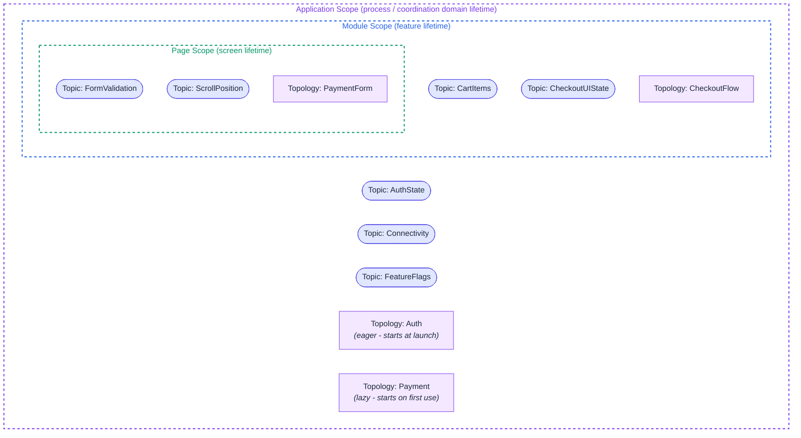
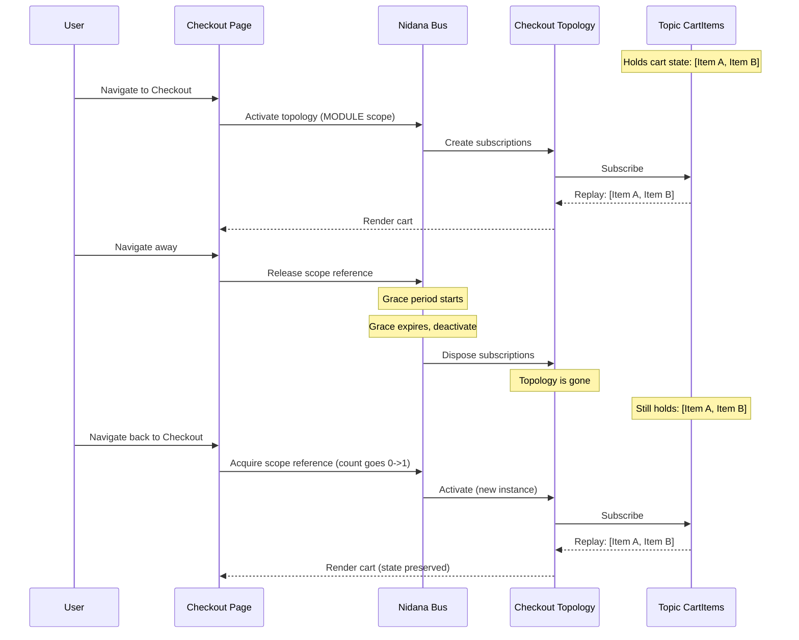
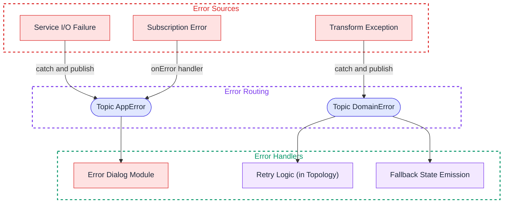
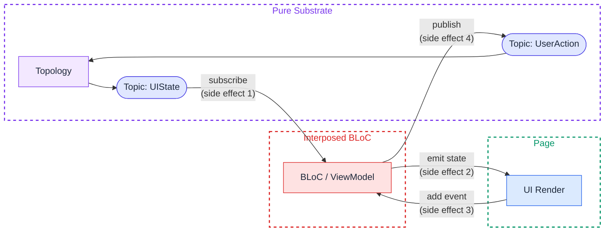
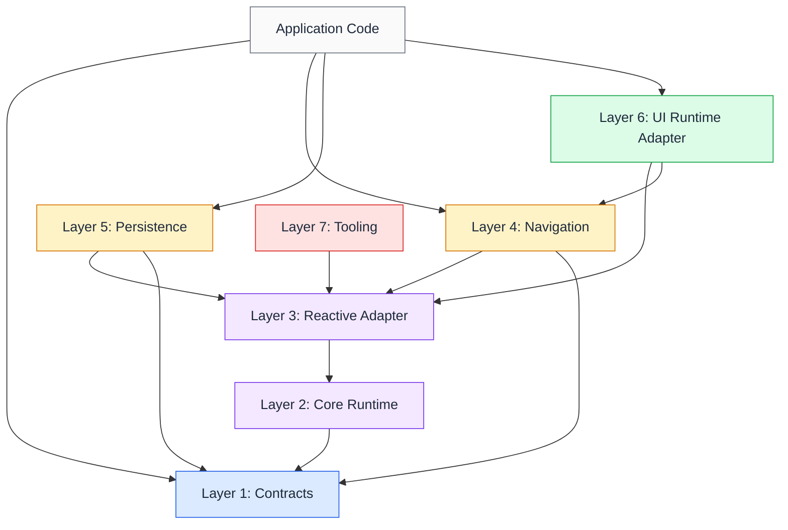

# Nidana Bus: A Reactive Data-Flow Architecture for Mobile and Web Applications

**Status:** Draft
**Author:** Purbo
**Version:** 0.13.0
**Date:** 2026-05-09

## Abstract

Nidana Bus is a platform-agnostic architectural pattern for mobile and web applications that positions a reactive event bus as the central coordination layer between side-effecting boundaries. Rather than coupling components through dependency injection graphs or direct service references, Nidana Bus introduces typed topics and declarative topologies as the primary abstraction for system-wide data flow.

The architecture enforces a pure-substrate / imperative-shell separation: the bus, its topic registry, and all active topologies form a declarative, composable substrate. Services (I/O, network, persistence) and UI pages/components (rendering, user interaction) form the imperative shells at the system boundaries.

This reference documents the architectural concepts, the bus runtime contract, the layered structure, lifecycle management strategies, data contract design, resilience properties, operational concerns, and platform mapping for Dart/Flutter, Kotlin/Android, Swift/iOS, and TypeScript/Web.

## Changes Since v0.11

This version revises and restructures earlier drafts based on a critical implementation review. Substantive changes:

- New §3 "Bus Runtime Contract" consolidates ordering, lifecycle, envelope threading, scheduling, and concurrency requirements into a single normative section.
- Single-writer ownership for `StateTopic` is now the default rather than an optional governance practice.
- `StateTopic` deduplicates by default (`distinctUntilChanged` semantics).
- The DSL extracts the payload from each emission's MessageEnvelope before calling transformers, so transformers genuinely see only the unwrapped payload type.
- The navigation topology has been split into two topologies (resolver + history) to remove the self-cycle that previously contradicted the cycle-rejection policy.
- Module scope is now defined semantically and binds via reference counting with a grace period on every platform.
- A sensitive-data flag and interceptor capability model address the privacy gap.
- New §18 "What This Architecture Does Not Solve" sets explicit expectations.
- New §19 "Operational Concerns" covers threading, shutdown, performance, observability, and concurrency.
- New §20 "Migration and Adoption" provides incremental adoption guidance.
- New Appendix D "Tooling Roadmap" specifies static-analysis and codegen requirements per platform.
- The category-theoretic and Curry-Howard treatment in §12 has been condensed to the architectural claims that hold without a paper-length supporting argument.
- The bus is no longer described as a process singleton; it is one instance per coordination domain, accessed through explicit reference, with platform-specific binding patterns.

## Table of Contents

- [Nidana Bus: A Reactive Data-Flow Architecture for Mobile and Web Applications](#nidana-bus-a-reactive-data-flow-architecture-for-mobile-and-web-applications)
  - [Abstract](#abstract)
  - [Changes Since v0.11](#changes-since-v011)
  - [Table of Contents](#table-of-contents)
  - [1. Motivation](#1-motivation)
    - [1.1 Design Principles](#11-design-principles)
  - [2. Core Concepts](#2-core-concepts)
    - [2.1 Topic](#21-topic)
      - [Topic Variants](#topic-variants)
    - [2.2 Topology](#22-topology)
    - [2.3 Bus](#23-bus)
    - [2.4 Message Envelope](#24-message-envelope)
      - [Envelope Field Definitions](#envelope-field-definitions)
      - [Correlation vs. Causation](#correlation-vs-causation)
      - [Envelope Lineage for Multi-Input Combinators](#envelope-lineage-for-multi-input-combinators)
      - [Publishing Context for Shell-Boundary Code](#publishing-context-for-shell-boundary-code)
    - [2.5 Topic Initialization](#25-topic-initialization)
      - [Who Creates Topics?](#who-creates-topics)
      - [`getCurrentValue()` Contract](#getcurrentvalue-contract)
      - [The Rule on Initial Values](#the-rule-on-initial-values)
      - [The Persistence Pattern](#the-persistence-pattern)
  - [3. Bus Runtime Contract](#3-bus-runtime-contract)
    - [3.1 Bus Identity and Coordination Domain](#31-bus-identity-and-coordination-domain)
    - [3.2 Subject Lifecycle](#32-subject-lifecycle)
    - [3.3 Ordering Guarantees](#33-ordering-guarantees)
    - [3.4 Reentrant Publish Normalization](#34-reentrant-publish-normalization)
    - [3.5 Envelope Metadata Propagation](#35-envelope-metadata-propagation)
      - [Why This Design](#why-this-design)
      - [Cost](#cost)
      - [Where Envelopes Are Visible](#where-envelopes-are-visible)
      - [Escape Hatch](#escape-hatch)
    - [3.6 Scheduler and Dispatcher Contract](#36-scheduler-and-dispatcher-contract)
    - [3.7 Interceptor Execution Model](#37-interceptor-execution-model)
    - [3.8 Cycle Detection](#38-cycle-detection)
    - [3.9 Activation Idempotency](#39-activation-idempotency)
    - [3.10 Thread Safety](#310-thread-safety)
    - [3.11 Single-Writer Ownership](#311-single-writer-ownership)
    - [3.12 StateTopic Deduplication](#312-statetopic-deduplication)
  - [4. Topic Registry and Type Safety](#4-topic-registry-and-type-safety)
    - [4.1 The Problem With String-Based Topics](#41-the-problem-with-string-based-topics)
    - [4.2 Topic as First-Class Typed Reference](#42-topic-as-first-class-typed-reference)
    - [4.3 Topic Name Uniqueness](#43-topic-name-uniqueness)
    - [4.4 Topic Registry Organization](#44-topic-registry-organization)
    - [4.5 Code Generation Requirement at Scale](#45-code-generation-requirement-at-scale)
  - [5. Architectural Layers](#5-architectural-layers)
    - [5.1 Layer Diagram](#51-layer-diagram)
    - [5.2 Symmetry of Services and Pages](#52-symmetry-of-services-and-pages)
    - [5.3 What Lives Where](#53-what-lives-where)
    - [5.4 Upper Shell: Services](#54-upper-shell-services)
    - [5.5 Pure Substrate: Nidana Bus](#55-pure-substrate-nidana-bus)
    - [5.6 Lower Shell: Modules and Pages](#56-lower-shell-modules-and-pages)
  - [6. Topology Composition](#6-topology-composition)
    - [6.1 Topology Declaration API](#61-topology-declaration-api)
    - [6.2 Transformer Design](#62-transformer-design)
    - [6.3 Reactive Combinators](#63-reactive-combinators)
    - [6.4 Topology Misuse: The Sequencer Anti-Pattern](#64-topology-misuse-the-sequencer-anti-pattern)
    - [6.5 Topology as Self-Documenting Data](#65-topology-as-self-documenting-data)
      - [Practical Implications](#practical-implications)
  - [7. Lifecycle Management](#7-lifecycle-management)
    - [7.1 Lifecycle Scopes](#71-lifecycle-scopes)
      - [Service Topology Scopes](#service-topology-scopes)
    - [7.2 Scope Declaration](#72-scope-declaration)
    - [7.3 Module Scope Binding](#73-module-scope-binding)
    - [7.4 Topic vs. Topology Lifecycle](#74-topic-vs-topology-lifecycle)
    - [7.5 Topic Cleanup](#75-topic-cleanup)
    - [7.6 Initializing Variant for Async Hydration](#76-initializing-variant-for-async-hydration)
  - [8. Data Contracts](#8-data-contracts)
    - [8.1 Principles](#81-principles)
    - [8.2 Recommended Approach: Platform-Native Immutable Data Classes](#82-recommended-approach-platform-native-immutable-data-classes)
    - [8.3 Alternative: Protocol Buffers](#83-alternative-protocol-buffers)
    - [8.4 Alternative: JSON Schema](#84-alternative-json-schema)
    - [8.5 Decision Matrix and Persistence Implications](#85-decision-matrix-and-persistence-implications)
  - [9. Cross-Cutting Concerns](#9-cross-cutting-concerns)
    - [9.1 Patterns for Cross-Cutting Concerns](#91-patterns-for-cross-cutting-concerns)
    - [9.2 Envelope Interception](#92-envelope-interception)
    - [9.3 Sensitive Data Handling](#93-sensitive-data-handling)
    - [9.4 Navigation as a Cross-Cutting Concern](#94-navigation-as-a-cross-cutting-concern)
      - [The Problem with Distributed Navigation](#the-problem-with-distributed-navigation)
      - [Navigation Intent as a Data Contract](#navigation-intent-as-a-data-contract)
      - [Navigation Topics](#navigation-topics)
      - [The Two-Topology Navigation Model](#the-two-topology-navigation-model)
      - [Deep Link Startup Ordering](#deep-link-startup-ordering)
      - [Navigation Result Handling](#navigation-result-handling)
      - [When Direct Navigation Is Acceptable](#when-direct-navigation-is-acceptable)
  - [10. Error Handling Strategies](#10-error-handling-strategies)
    - [10.1 Error Propagation Model](#101-error-propagation-model)
    - [10.2 Principles](#102-principles)
    - [10.3 Error Handling Approaches](#103-error-handling-approaches)
      - [`AppError` Contract](#apperror-contract)
      - [Circuit Breaker as Stream State](#circuit-breaker-as-stream-state)
  - [11. Resilience Properties](#11-resilience-properties)
    - [11.1 Eliminated by Construction](#111-eliminated-by-construction)
    - [11.2 Requires Discipline (Guardrails Provided)](#112-requires-discipline-guardrails-provided)
    - [11.3 Quantifiable Impact](#113-quantifiable-impact)
    - [11.4 What This Means in Practice](#114-what-this-means-in-practice)
  - [12. Formal Properties and Determinism](#12-formal-properties-and-determinism)
    - [12.1 Compositional Algebra](#121-compositional-algebra)
    - [12.2 Determinism](#122-determinism)
      - [Time-Dependent Operators: Controlled Non-Determinism](#time-dependent-operators-controlled-non-determinism)
    - [12.3 Type-System-As-Proof](#123-type-system-as-proof)
    - [12.4 What Cannot Be Verified at the Type Level](#124-what-cannot-be-verified-at-the-type-level)
    - [12.5 Verification Property Map](#125-verification-property-map)
    - [12.6 Automated Verification Pipeline](#126-automated-verification-pipeline)
  - [13. Emergent Architectural Properties](#13-emergent-architectural-properties)
    - [13.1 Cross-Platform Logic Portability](#131-cross-platform-logic-portability)
      - [Strategy 1: Portable DSL](#strategy-1-portable-dsl)
      - [Strategy 2: Single-Language SSOT with Code Generation](#strategy-2-single-language-ssot-with-code-generation)
      - [The Portability Constraint as Architectural Pressure](#the-portability-constraint-as-architectural-pressure)
    - [13.2 AI-Agent Affordances](#132-ai-agent-affordances)
  - [14. Integration With Existing UI Patterns](#14-integration-with-existing-ui-patterns)
    - [14.1 The Recommended Path: Topology Output Directly to UI](#141-the-recommended-path-topology-output-directly-to-ui)
    - [14.2 The BLoC / MVVM / MVI Interposition Problem](#142-the-bloc--mvvm--mvi-interposition-problem)
    - [14.3 When Interposition Might Be Acceptable](#143-when-interposition-might-be-acceptable)
    - [14.4 Summary](#144-summary)
  - [15. Platform Mapping](#15-platform-mapping)
    - [15.1 Reactive Primitives by Platform](#151-reactive-primitives-by-platform)
    - [15.2 Engine Choice: Rx vs Native](#152-engine-choice-rx-vs-native)
    - [15.3 Topology DSL Per Platform](#153-topology-dsl-per-platform)
      - [Dart/Flutter](#dartflutter)
      - [Kotlin/Android (Flow)](#kotlinandroid-flow)
      - [Swift/iOS (Combine)](#swiftios-combine)
      - [TypeScript/Web (RxJS)](#typescriptweb-rxjs)
    - [15.4 Bus Reference Acquisition Per Platform](#154-bus-reference-acquisition-per-platform)
    - [15.5 Ordering and Scheduler Implementation Per Platform](#155-ordering-and-scheduler-implementation-per-platform)
  - [16. Web and TypeScript](#16-web-and-typescript)
    - [16.1 Bus Lifecycle in Browser Contexts](#161-bus-lifecycle-in-browser-contexts)
    - [16.2 React Integration](#162-react-integration)
      - [React Hooks](#react-hooks)
      - [Bus Provider](#bus-provider)
      - [React StrictMode](#react-strictmode)
      - [React Server Components](#react-server-components)
    - [16.3 Angular Integration](#163-angular-integration)
    - [16.4 Vue Integration](#164-vue-integration)
    - [16.5 Web-Specific Considerations](#165-web-specific-considerations)
  - [17. Comparison With Existing Patterns](#17-comparison-with-existing-patterns)
  - [18. What This Architecture Does Not Solve](#18-what-this-architecture-does-not-solve)
    - [18.1 Ephemeral and Component-Local UI State](#181-ephemeral-and-component-local-ui-state)
    - [18.2 Domain-Specific Modeling](#182-domain-specific-modeling)
    - [18.3 Non-Reactive Third-Party SDKs](#183-non-reactive-third-party-sdks)
    - [18.4 Real-Time Collaborative Editing and CRDTs](#184-real-time-collaborative-editing-and-crdts)
    - [18.5 Cross-Process and Cross-Device Coordination](#185-cross-process-and-cross-device-coordination)
    - [18.6 Backend / Server-Side Architecture](#186-backend--server-side-architecture)
    - [18.7 Performance Optimization for Specialized Workloads](#187-performance-optimization-for-specialized-workloads)
    - [18.8 Authentication, Authorization, and Security Mechanisms](#188-authentication-authorization-and-security-mechanisms)
  - [19. Operational Concerns](#19-operational-concerns)
    - [19.1 Threading and Scheduler Semantics](#191-threading-and-scheduler-semantics)
    - [19.2 Bus Shutdown and Process Lifecycle](#192-bus-shutdown-and-process-lifecycle)
    - [19.3 Performance and Memory Cost Model](#193-performance-and-memory-cost-model)
    - [19.4 Resource Limits](#194-resource-limits)
    - [19.5 Production Observability](#195-production-observability)
    - [19.6 Internationalization](#196-internationalization)
    - [19.7 Multi-Process Considerations](#197-multi-process-considerations)
    - [19.8 Concurrency Model](#198-concurrency-model)
    - [19.9 Topic Deprecation and Contract Evolution](#199-topic-deprecation-and-contract-evolution)
    - [19.10 Dynamic and Per-Entity Topics](#1910-dynamic-and-per-entity-topics)
  - [20. Migration and Adoption](#20-migration-and-adoption)
    - [20.1 Adoption Sequencing](#201-adoption-sequencing)
    - [20.2 Strangler Fig and Parallel-Architecture Coexistence](#202-strangler-fig-and-parallel-architecture-coexistence)
    - [20.3 Coexistence With Existing State Management](#203-coexistence-with-existing-state-management)
    - [20.4 Rollout Strategy](#204-rollout-strategy)
    - [20.5 Team Adoption](#205-team-adoption)
  - [21. Open Questions](#21-open-questions)
    - [21.1 Testing Strategy and TestBus](#211-testing-strategy-and-testbus)
    - [21.2 DevTools and Observability](#212-devtools-and-observability)
    - [21.3 Scaling to Multiple Feature Teams](#213-scaling-to-multiple-feature-teams)
    - [21.4 Server-Driven Topologies](#214-server-driven-topologies)
    - [21.5 Persistence and Hydration](#215-persistence-and-hydration)
  - [22. FAQ for Skeptics](#22-faq-for-skeptics)
    - [22.1 "Isn't this just an event bus with extra steps?"](#221-isnt-this-just-an-event-bus-with-extra-steps)
    - [22.2 "Why not just use Redux/NgRx/MobX/Zustand/Pinia?"](#222-why-not-just-use-reduxngrxmobxzustandpinia)
    - [22.3 "Reactive programming has a steep learning curve."](#223-reactive-programming-has-a-steep-learning-curve)
    - [22.4 "The bus is a god object. Singletons are bad."](#224-the-bus-is-a-god-object-singletons-are-bad)
    - [22.5 "Why not let pages subscribe directly to services?"](#225-why-not-let-pages-subscribe-directly-to-services)
    - [22.6 "What about performance overhead?"](#226-what-about-performance-overhead)
    - [22.7 "DI already solves coordination."](#227-di-already-solves-coordination)
    - [22.8 "This will not work for our app, which is X."](#228-this-will-not-work-for-our-app-which-is-x)
  - [Appendix A: Glossary](#appendix-a-glossary)
    - [Core Concepts](#core-concepts)
    - [Topic Variants](#topic-variants-1)
    - [Lifecycle](#lifecycle)
    - [Topology Internals](#topology-internals)
    - [Bus Runtime](#bus-runtime)
    - [Navigation](#navigation)
    - [Testing](#testing)
    - [Platform-Specific](#platform-specific)
    - [Tooling](#tooling)
  - [Appendix B: Full System Diagram](#appendix-b-full-system-diagram)
  - [Appendix C: Library Modularization](#appendix-c-library-modularization)
    - [C.1 Seven-Layer Stack](#c1-seven-layer-stack)
    - [C.2 Per-Platform Package Layout](#c2-per-platform-package-layout)
      - [Dart / Flutter (pub.dev)](#dart--flutter-pubdev)
      - [Kotlin / Android (Maven Central)](#kotlin--android-maven-central)
      - [Swift / iOS (Swift Package Manager)](#swift--ios-swift-package-manager)
      - [TypeScript / Web (npm)](#typescript--web-npm)
    - [C.3 Cross-Platform Naming Convention](#c3-cross-platform-naming-convention)
    - [C.4 Dependency Graph](#c4-dependency-graph)
  - [Appendix D: Tooling Roadmap](#appendix-d-tooling-roadmap)
    - [D.1 Static Analysis Coverage](#d1-static-analysis-coverage)
    - [D.2 Per-Platform Tooling Status](#d2-per-platform-tooling-status)
      - [Dart / Flutter](#dart--flutter)
      - [Kotlin / Android](#kotlin--android)
      - [Swift / iOS](#swift--ios)
      - [TypeScript / Web](#typescript--web)
    - [D.3 Codegen Inputs and Outputs](#d3-codegen-inputs-and-outputs)
    - [D.4 Devtools Roadmap](#d4-devtools-roadmap)
    - [D.5 Verification Mapping](#d5-verification-mapping)

---

## 1. Motivation

Mobile and web applications face a coordination problem. Features are vertically sliced (auth, checkout, profile), yet real-world data flows are often horizontal: a network connectivity change affects every feature, an auth token expiration ripples across all API calls, an analytics event must observe every user action without coupling to any specific screen.

A frontend application is a fundamentally asynchronous environment. Sensor readings arrive unpredictably. Users tap, swipe, and type at their own pace. Backend responses return after variable latency, sometimes out of order, sometimes not at all. OS-level events (connectivity changes, permission prompts, lifecycle transitions) interrupt at arbitrary moments. Every meaningful interaction is concurrent with every other. Modeling this reality as a collection of synchronous request/response procedures is a mismatch: it forces developers to bolt concurrency onto an abstraction that assumes sequential control flow, producing the callback tangles, race conditions, and state synchronization bugs that plague conventional architectures. A reactive data-flow model treats asynchrony as the default, not the exception. Streams are the natural representation of values that change over time, and topologies are the natural way to declare how those changing values relate to each other.

Traditional approaches (dependency injection, service locators, shared singletons) solve the wiring problem but not the data-flow problem. They tell you *where* to find a dependency, not *how data moves* through the system over time.

Nidana Bus addresses this by making data flow explicit, typed, and declarative. The bus is not a god object; it is a substrate, a shared namespace of typed channels (topics) through which decoupled components communicate via reactive streams. The actual coordination logic lives in topologies: local, composable declarations of how topics relate to each other.

### 1.1 Design Principles

- **Declarative over imperative.** Topologies declare relationships between data streams; the reactive engine executes them.
- **Composable over monolithic.** Each module, service, or page defines its own topology. No single graph owns the system.
- **Contract-based loose coupling.** Components share nothing except data contracts (the types carried by topics). A service and a page that both interact with `Topic<AuthState>` need only agree on the `AuthState` type. They have no knowledge of each other's existence, implementation, or lifecycle.
- **Typed over stringly-typed.** Topics are first-class typed reference objects, not raw strings. A `Topic<AuthState>` is a compile-time-checked, IDE-discoverable reference. The underlying string identifier is an internal implementation detail (see §4).
- **Boundary-aware.** Side effects (I/O, UI rendering) happen at the edges. The bus, its topics, and its topologies are the pure substrate.
- **Complementary to DI, not a replacement.** Dependency injection manages object graph construction at startup: how service instances are created, scoped, and provided with the raw platform infrastructure they need. The bus manages runtime data flow: how values move between components over time. The failure mode this principle prevents is using DI to solve the coordination problem (injecting `AuthService` into `PaymentService` so payment can call `getToken()` directly). That produces the hidden coupling the bus is designed to eliminate. See §22 for the full DI vs bus discussion.
- **Testable by design.** Because topologies are pure declarations over typed topics, they are testable without mocking frameworks, platform dependencies, or lifecycle simulation. Replace a topic's input with test data, observe the output. Transformers are standalone pure functions. Test them directly by calling them.
- **Resilient by structure.** The architecture eliminates entire categories of runtime failures (race conditions, cascading crashes, lifecycle leaks) through structural constraints rather than developer discipline. Immutable data contracts prevent shared-mutable-state bugs. Topology isolation prevents fault propagation. Explicit scopes prevent resource leaks. (See §11 for a detailed analysis.)

A note on terminology: "pure substrate" is used in this document in preference to "pure core" to avoid collision with the DDD/hexagonal use of "core" to mean the domain layer. In Nidana Bus, the substrate is infrastructure (the bus runtime, topic registry, active topologies); the domain logic is expressed in transformer functions that run inside the substrate but are separately testable as pure functions.

---

## 2. Core Concepts

### 2.1 Topic

A Topic is a first-class, typed reference to a named channel on the bus. It is the fundamental unit of communication and the sole coupling contract between components.

```
// Topic is a typed reference object, not a raw string
val cartItems = StateTopic<CartItems>(
    name = "checkout.cart-items",
    initial = CartItems.empty(),
    writer = TopologyId("checkout-cart-reducer"),  // single-writer by default
)
```

A topic is a typed key. Its identity is the pair `(name, type)`. The bus owns the backing reactive subject and creates it on first runtime access (see §3.2). The topic object is a pure immutable value and is shared across bus instances; the backing subject is per-bus-instance.

Topics are not owned by any single module or service. They exist on the bus as shared infrastructure. Any topology that satisfies the topic's writer constraint may write to it; any topology may read from it.

#### Topic Variants

| Variant | Backing Primitive | Semantics | Use Case |
|---|---|---|---|
| **StateTopic** | `BehaviorSubject` (RxDart/RxJS/RxSwift/RxKotlin) or platform equivalent (see §15.1) | Holds latest value, replays immediately to new subscribers. Initial value required at definition time. Deduplicates by default (§3.12). Single-writer by default (§3.11). | Auth state, connectivity, cart items, user profile |
| **EventTopic** | `PublishSubject` / equivalent | Fire-and-forget, no replay. Multi-writer. | Navigation intents, analytics events, toasts |
| **ReplayTopic** | `ReplaySubject(N)` / equivalent | Buffers N most recent values. Multi-writer. | Chat messages, audit logs |

Write-contention behavior depends on the topic variant:

- `StateTopic` is single-writer by default. Multiple writers require explicit opt-in (§3.11). When multiple writers are permitted, last-write-wins; logical read-modify-write contention is a design error and should be expressed via the reducer pattern (§6.4).
- `EventTopic` and `ReplayTopic` are inherently multi-writer; ordering across writers is per-publication-time, with engine-specific tiebreaking under simultaneous emission (§3.3).

### 2.2 Topology

A Topology is a declarative description of how topics relate to each other within a bounded context. It declares which topics it reads from, which it writes to, and what transformations occur between them.

```
Topology {
  topologyId: "checkout"
  scope:      Scope.MODULE
  reads:      [Topic<CartItems>, Topic<AuthState>, Topic<SubmitIntent>]
  writes:     [Topic<CheckoutUIState>, Topic<OrderRequest>]
  transforms: [
    (CartItems, AuthState) -> CheckoutUIState
    (SubmitIntent, CheckoutUIState) -> OrderRequest
  ]
}
```

All transforms operate at the type level: function signatures mapping input types to output types.

A topology is not a global graph. It is a local, self-contained declaration. Multiple topologies can read from and write to the same topics (subject to single-writer constraints on `StateTopic`s). This is how cross-module coordination emerges without coupling.

Critically, a topology is a pure declaration. It contains no side effects. Modules and services define topologies; the bus runs them. When activated, the bus wires the topology's declared relationships into live reactive subscriptions. When deactivated, those subscriptions are disposed. The topology definition itself is inert data describing stream relationships.

### 2.3 Bus

The Bus is the runtime engine. It maintains the topic registry, activates and deactivates topologies, threads envelopes (§3.5), enforces ordering and reentrancy guarantees (§3.3, §3.4), and exposes interceptor and scheduler injection points.

The full normative specification of bus responsibilities is in §3 "Bus Runtime Contract." The summary view:

- **Topic registry.** Creates and tracks backing subjects. Enforces topic name uniqueness and single-writer ownership.
- **Topology activation.** Wires a topology declaration into live subscriptions; returns a handle for deactivation.
- **Reactive execution.** Delegated to the underlying library (RxDart, RxJS, Flow, Combine) through a per-platform adapter. The bus does not implement schedulers, backpressure, or stream combinators; it provides ordering, threading, and lifecycle guarantees on top of the engine.
- **Interceptors.** Bus-level observers receive every envelope (§3.7, §9.2). Sensitive-topic envelopes are gated by a capability model (§9.3).
- **Diagnostics.** Detects reentrancy chains, scope violations, and cycles in dev mode (§3.4, §3.8).

Backpressure and rate-limiting are topology-level concerns, expressed through combinators declared in the topology itself (see §6.3). Error handling is a shell-boundary concern owned by services and modules (see §10).

### 2.4 Message Envelope

Every value published to a topic is wrapped in a MessageEnvelope. The envelope is a single carrier object that holds the payload (`T`) along with metadata fields for observability. Each topic's backing subject carries `MessageEnvelope<T>` values directly; the DSL extracts `payload` before calling pure transformers (§3.5), so transformers receive only the unwrapped payload `T`, never the envelope.

```
MessageEnvelope<T> {
  id:                   String
  payload:              T
  correlationId:        String
  causationId:          String?
  parentCorrelationIds: List<String>   // always present, empty by default
  timestamp:            DateTime
  source:               String
  sensitive:            Boolean        // mirrors topic's sensitive flag
}
```

#### Envelope Field Definitions

| Field | Purpose |
|---|---|
| **id** | Unique identifier for this specific message instance. This is what `causationId` in child messages points to. |
| **correlationId** | Groups all messages belonging to the same logical operation. Every message produced as part of a single user-initiated flow shares the same correlationId. |
| **causationId** | Points to the `id` of the direct parent message that caused this message. Forms a causal chain within a correlation group. `null` for root messages. |
| **parentCorrelationIds** | When a multi-input combinator merges streams with different correlationIds, the resulting envelope receives a fresh `correlationId` and the contributing parents are recorded here. Always present (empty for single-correlation flows). |
| **source** | The topology, service, page, or executor that produced this message. Format: `"topology:<id>"`, `"service:<name>"`, `"page:<routeOrName>"`, `"executor:<name>"`. |
| **timestamp** | Wall-clock time of publication. |
| **sensitive** | `true` if the topic this envelope was published to was declared `sensitive` (§9.3). Affects interceptor visibility and diagnostic redaction. |

#### Correlation vs. Causation

A correlationId is a flat grouping ("these messages are all part of the same operation"). A causationId is a directed edge ("this specific message caused that specific message"). Together they allow full causal chain reconstruction:

```
User taps "Place Order"
  └─ OrderRequest      (id: "msg-001", causationId: null,       correlationId: "ord-123")
       └─ PaymentIntent  (id: "msg-002", causationId: "msg-001", correlationId: "ord-123")
            └─ PaymentResult (id: "msg-003", causationId: "msg-002", correlationId: "ord-123")
       └─ InventoryCheck (id: "msg-004", causationId: "msg-001", correlationId: "ord-123")
```

The correlationId tells you "show me everything related to this order." The causation chain tells you "show me *why* this payment was attempted" by walking the causationId links backward.

#### Envelope Lineage for Multi-Input Combinators

Single-input operators (`map`, `filter`, `switchMap`) have exactly one input envelope per output. The bus uses that envelope's `id` as the output's `causationId` and preserves its `correlationId` and `parentCorrelationIds`.

Multi-input operators (`combine`, `combineLatest`, `withLatestFrom`) receive N input envelopes. The bus determines the causal parent as follows:

| Combinator | Trigger rule | `causationId` source | `correlationId` rule |
|---|---|---|---|
| `withLatestFrom` | Primary stream (left operand) | The primary stream's envelope | Preserve the primary's `correlationId` |
| `combine` / `combineLatest` | Most recently arrived input | The envelope of the input whose new emission caused the operator to fire | See below |

When all input envelopes share the same `correlationId`, that value is preserved. When inputs carry different `correlationId` values (cross-flow combine), the bus generates a fresh `correlationId` for the output and records every contributing input's `correlationId` in `parentCorrelationIds`. Tracing tools that need the full lineage walk `parentCorrelationIds` recursively; tools that need the immediate operation use `correlationId` directly.

Under simultaneous input updates within a single scheduling tick, the implementation chooses the last-delivered input as the trigger. This is engine-specific, but the architectural rule is fixed: exactly one input is the causal parent per output emission.

```
// Same-correlation combine
// cart envelope: id="e-01", correlationId="sess-42", parentCorrelationIds=[]
// auth envelope: id="e-02", correlationId="sess-42", parentCorrelationIds=[]  (same session)
// output envelope:
//   causationId          = "e-02"
//   correlationId        = "sess-42"
//   parentCorrelationIds = []

// Cross-correlation combine
// userPrefs envelope: id="e-10", correlationId="pref-update-5"
// livePrice envelope: id="e-11", correlationId="market-feed-9"
// output envelope:
//   causationId          = "e-11"
//   correlationId        = "derived-77"
//   parentCorrelationIds = ["pref-update-5", "market-feed-9"]
```

#### Publishing Context for Shell-Boundary Code

Within a topology activation, the bus automatically sets the `source` field to `"topology:<topologyId>"`. For imperative publishes at the shell boundary (services, executors, pages, platform adapters), the source must be explicit. The bus provides a publisher factory:

```
val servicePublisher = bus.publisher("service:payment-gateway")
val pagePublisher    = bus.publisher("page:checkout/cart")
val execPublisher    = bus.publisher("executor:flutter-navigation")
```

UI integration helpers may auto-derive the page source from routing context; see the platform sections (§15, §16). Imperative publishes through `bus.publish(topic, value)` without a publisher are accepted but produce a dev-mode diagnostic with `source = "unknown"`.

### 2.5 Topic Initialization

#### Who Creates Topics?

A `Topic<T>` object is a pure typed key: a name, a type tag, an optional writer constraint, an optional sensitive flag, and (for `StateTopic`) an initial value. It carries no reactive machinery of its own and is shareable across bus instances.

Each bus instance owns its own backing reactive subjects. Subject creation is deferred to first runtime access on that bus: the first `activate()` that includes a `read()` or `write()` for the topic, or the first imperative `publish()`, `observe()`, or `getCurrentValue()` call referencing it. At that point the bus creates the appropriate backing primitive: a `BehaviorSubject` (or platform equivalent) seeded with the declared initial value for `StateTopic`, a `PublishSubject` for `EventTopic`, or a `ReplaySubject(N)` for `ReplayTopic`. See §3.2 for the complete subject lifecycle, including removal semantics.

Topology declaration does not create subjects. `declare()` runs against a recording builder that captures `read()` and `write()` calls as metadata into a `TopologyDefinition` (see §6.5). The bus interprets this metadata on activation.

```
// Topic<T> is a typed key. No subject, no subscription, no side effect.
abstract class AuthTopics {
  static final state = StateTopic<AuthState>(
    name = "auth.state",
    initial = AuthState.initializing,   // see §7.6 on initial values
    writer = TopologyId("auth-core"),
  )
}

// declare() captures metadata. No subject is created here.
class AuthTopology extends Topology {
  override val topologyId = "auth-core"
  override val scope = Scope.APPLICATION_EAGER

  override fun TopologyBuilder.declare() {
    val auth = read(AuthTopics.state)   // records TopicRef, returns placeholder stream
    // ...
  }
}

// Subject for AuthTopics.state is created here, on first runtime access during activation.
val handle = bus.activate(AuthTopology())
```

#### `getCurrentValue()` Contract

`getCurrentValue(topic: StateTopic<T>): T` is always defined and never throws. If no backing subject exists for the topic on this bus instance, the bus creates one, seeds it with the topic's declared initial value, and returns the result. Subsequent calls return the most recent published value.

This makes `getCurrentValue()` a valid first runtime access for synchronous initial reads (React's `useSyncExternalStore`, SwiftUI's `@StateObject` initializer). The topic holds its declared initial value until a topology or service publishes to it. For state where the initial value differs visibly from the hydrated value, see §7.6 on the `Initializing` variant rule.

`getCurrentValue()` is not defined on `EventTopic` (compile-time error). `ReplayTopic` exposes `getBufferedValues(): List<T>` instead.

For performance considerations on synchronous render-path access, see §19.3.

#### The Rule on Initial Values

Every `StateTopic` must declare a pure initial value at definition time. No I/O, no service calls, no injected dependencies.

```
// Allowed: constant
initial = AuthState.initializing

// Allowed: pure factory (computed once at subject creation, no side effects)
initial = { SessionState.fresh(id = Uuid.v4()) }

// Not allowed: I/O or service dependency
initial = { storage.loadSync() }            // side effect in pure substrate
initial = { serviceLocator.get<Auth>() }    // DI in pure substrate
```

If no meaningful pure initial value seems to exist, that is a design signal, not a technical constraint to work around. See §7.6 for the resolution patterns (`Initializing`, `Loading`, `Guest` variants in the domain ADT).

#### The Persistence Pattern

Services that load runtime values (persistence, remote config) publish as their first act after the load completes. The topic is not in limbo while they do; it has a valid initial state, and consumers react to the transition from default to real value exactly as they react to any other state change.

```kotlin
// AuthState ADT includes an explicit Initializing variant (see §7.6)
sealed interface AuthState {
    data object Initializing  : AuthState  // pure initial value
    data object Unauthenticated : AuthState
    data class  Authenticated(val user: User, val token: Token) : AuthState
    data class  Error(val reason: AuthError) : AuthState
}

abstract class AuthTopics {
  static final state = StateTopic<AuthState>(
    name = "auth.state",
    initial = AuthState.Initializing,
    writer = TopologyId("auth-core"),
  )
}

class PersistenceService(private val bus: Bus, private val storage: Storage) {
  private val publisher = bus.publisher("service:persistence")

  // Called by the application bootstrapper at the shell boundary.
  // declare() (if present) is pure wiring, no I/O.
  suspend fun loadAndPublish() {
    val stored = storage.loadAuthState()
    val resolved = if (stored != null) AuthState.Authenticated(stored.user, stored.token)
                   else                AuthState.Unauthenticated
    publisher.publish(AuthTopics.state, resolved)
  }
}
```

No two-phase protocol. No bus lifecycle orchestration. No race conditions between services. The topic is always readable; services publish when they're ready; consumers react to every state transition including the initial-to-resolved transition. The `Initializing` variant lets the UI render an appropriate splash or skeleton while the persistence service does its work.

---

## 3. Bus Runtime Contract

This section is normative. Every bus implementation across every platform must satisfy these requirements. Where a platform's reactive primitives do not natively provide a guarantee, the implementation must add the necessary machinery (typically a serializing dispatcher, a microtask queue, or a custom subject wrapper).

### 3.1 Bus Identity and Coordination Domain

The Bus is one instance per coordination domain. A coordination domain is the boundary inside which a shared topic namespace is meaningful. The mapping varies by platform:

| Context | Coordination Domain | Bus Instances |
|---|---|---|
| Native mobile app (single window) | Process | One |
| iPad multi-window / multi-scene | Scene | One per scene |
| Browser tab | Tab | One per tab |
| Server-side rendering | HTTP request | One per request |
| Parallel test execution | Test case | One per test (`TestBus`) |

The bus is accessed by explicit reference, not by global accessor. Every site that publishes, subscribes, or activates a topology receives a `Bus` reference (passed through DI, React context, Vue plugin injection, Angular DI, Flutter `InheritedWidget` / `Provider`, or whatever per-platform mechanism the runtime adapter supplies).

This rule is non-negotiable. A global singleton accessor (`Bus.instance`) breaks SSR, breaks parallel testing, and prevents iPad multi-scene support. The platform-specific binding patterns are defined in §15 and §16.

`Topic<T>` objects are pure values and are shared across bus instances. `MyTopics.cartItems` is one global object; each bus instance maintains its own backing subject keyed by that object's identity. This separation is what makes parallel `TestBus` instances safe: subjects are per-bus, topic identities are global.

### 3.2 Subject Lifecycle

For each bus instance, a backing subject for a topic is created on first runtime access:

- The first `activate(topology)` call where the topology declares `read(topic)` or `write(topic)`.
- The first imperative `bus.publish(topic, value)`.
- The first `bus.observe(topic)` subscription.
- The first `bus.getCurrentValue(topic)` call (StateTopic only).

Once created, the backing subject persists for the lifetime of the bus instance unless explicitly removed via `bus.removeTopic(topic)`. There is no automatic garbage collection of subjects. Auto-GC was rejected because it interacts badly with the lazy-creation rule: a publisher publishing to a previously-GC'd topic creates a fresh subject, breaking subscribers that hold stream references to the dead one.

Topic cleanup strategies are described in §7.5. The default strategy is "no cleanup": topics live as long as the bus. Explicit `removeTopic` is available for memory-bounded scenarios; the application is responsible for ensuring no live subscribers remain at the time of removal.

### 3.3 Ordering Guarantees

**Per-topic ordering is guaranteed.** All subscribers to a topic observe values in the order they were published, on a single delivery dispatcher per topic per bus instance.

This requires implementation work on platforms where the native reactive primitive does not enforce it. Specifically:

- **Combine (Swift):** subscribers can attach with `.receive(on:)` to any scheduler, producing observed-order divergence across subscribers. The bus must serialize delivery on a single dispatch queue per topic. The bus provides `bus.observe(topic)` which subscribes on this queue; downstream consumers may then `.receive(on:)` for their own thread but the canonical delivery order is fixed.
- **Kotlin Flow:** `MutableSharedFlow` and `MutableStateFlow` deliver on the collector's coroutine context, so per-topic ordering can vary across collectors. The bus serializes emissions on a per-topic `SingleThreadDispatcher` (or `Dispatchers.Main.immediate` for UI-bound topics).
- **RxDart, RxJS, RxKotlin, RxSwift:** subjects deliver synchronously in publication order to all subscribers. No additional machinery required, except for reentrancy normalization (§3.4).

**Cross-topic ordering is not guaranteed in the general case.** If topology A publishes to topic X then to topic Y in the same activation, subscribers to X and Y may observe the values in either order depending on scheduler behavior.

**Same-topology cross-topic ordering is guaranteed within a single tick.** When a single transformer in topology A produces emissions to multiple output topics (a fan-out), the bus delivers them in declaration order on a single dispatcher and with no intervening external publishes. This is the strongest guarantee that can be made portably; topologies that depend on stricter cross-topic ordering should restructure to publish to a single combined topic.

### 3.4 Reentrant Publish Normalization

A reentrant publish occurs when a subscriber, an interceptor, or a transformer publishes to another topic during the handling of an emission. To produce identical observable behavior across reactive engines, reentrant publishes are normalized to the next scheduling boundary.

| Platform | Implementation |
|---|---|
| **Dart/RxDart** | Wrap reentrant publishes in `scheduleMicrotask()`. |
| **Kotlin/Flow** | Reentrant publishes execute via `dispatcher.launch { topicChannel.send(value) }` on the bus's serializing dispatcher. `StateFlow.value = x` is never called directly from inside a collector. |
| **Kotlin/RxKotlin** | Wrap reentrant publishes in the bus's per-topic scheduler via `Schedulers.single()`-equivalent. |
| **Swift/Combine** | Dispatch via `DispatchQueue.main.async` or the bus's per-topic queue using `.receive(on:)` semantics on the publish path. |
| **Swift/RxSwift** | Wrap via `MainScheduler.asyncInstance` or per-topic `SerialDispatchQueueScheduler`. |
| **TypeScript/RxJS** | Wrap reentrant publishes in `queueMicrotask()` or `asapScheduler.schedule(...)`. |

This normalization is mandatory. Without it, the same topology produces different observable behavior on different reactive engines (some deliver synchronously, others defer), silently breaking the portability contract.

**Dev-mode recursion detection.** In debug builds, the bus must detect unbounded reentrant publish chains (A publishes to B, B's subscriber publishes to C, C's subscriber publishes to A) and surface a diagnostic with the full chain. The detection threshold is configurable; a default depth of 10 is recommended.

### 3.5 Envelope Metadata Propagation

Pure transformers operate on the unwrapped payload `T`, never on `MessageEnvelope<T>`. Each topic's backing subject internally carries `MessageEnvelope<T>` values: the envelope (defined in §2.4) is the single carrier object that holds the payload as one of its fields, along with `id`, `correlationId`, `causationId`, `parentCorrelationIds`, `timestamp`, `source`, and `sensitive`. The DSL's combinator implementations extract `payload` from each input envelope before calling the user's transformer, then construct a fresh `MessageEnvelope` for the result before publishing it to the next stage or to an output topic.

There is no separate metadata channel. There is no parallel metadata stream. The envelope travels through the pipeline as a single object. The internal stream type is the same on every platform; only the language's stream class differs:

| Platform | Internal value type |
|---|---|
| **Dart/RxDart** | `Stream<MessageEnvelope<T>>` |
| **Kotlin/Flow** | `Flow<MessageEnvelope<T>>` |
| **Kotlin/RxKotlin** | `Observable<MessageEnvelope<T>>` |
| **Swift/Combine** | `AnyPublisher<MessageEnvelope<T>, Never>` |
| **Swift/RxSwift** | `Observable<MessageEnvelope<T>>` |
| **TypeScript/RxJS** | `Observable<MessageEnvelope<T>>` |

The DSL wrapping is shown here in Kotlin/Flow form; the other platforms are mechanically equivalent:

```kotlin
// Conceptually, the bus's combine implementation:
fun <A, B, C> combine(
    a: TopicStream<A>,                          // backed by Flow<MessageEnvelope<A>>
    b: TopicStream<B>,                          // backed by Flow<MessageEnvelope<B>>
    transform: (A, B) -> C,                     // pure function on payloads only
): TopicStream<C> = TopicStream(
    a.flow.combine(b.flow) { aEnv, bEnv ->
        val result = transform(aEnv.payload, bEnv.payload)
        MessageEnvelope(
            id                   = newId(),
            payload              = result,
            correlationId        = mergeCorrelationId(aEnv, bEnv),     // §2.4
            causationId          = bEnv.id,                            // §2.4: trigger
            parentCorrelationIds = mergeParents(aEnv, bEnv),           // §2.4
            timestamp            = now(),
            source               = "topology:${topologyId}",
            sensitive            = aEnv.sensitive || bEnv.sensitive,
        )
    }
)
```

Envelope construction at each stage follows the lineage rules in §2.4 ("Envelope Lineage for Multi-Input Combinators"):

- Single-input operators (`map`, `filter`) construct a new envelope with a fresh `id` and `timestamp`, set `causationId` to the input's `id`, and preserve `correlationId`, `parentCorrelationIds`, and `sensitive` from the input. `source` becomes the topology that owns the operator.
- Multi-input operators (`combine`, `combineLatest`, `withLatestFrom`) construct new metadata per §2.4: causation from the triggering input, correlation preserved when shared or freshly generated with `parentCorrelationIds` populated when not.
- Time-shifting operators (`debounce`, `throttle`, `delay`, `sample`, `buffer`) propagate the envelope of the emission that survives the time-shift; envelopes of suppressed emissions are discarded.
- Accumulator operators (`scan`) attach the metadata of the most recent input envelope to the accumulated output, with `causationId` pointing to that input.

#### Why This Design

Three properties justify the bookkeeping:

**Transformer ergonomics.** If transformers received `MessageEnvelope<T>` directly, every signature becomes envelope-to-envelope. Domain logic gets tangled with ID generation, correlation propagation, parent tracking, and source attribution. The pure-function testability story collapses into "construct test envelopes and assert on output envelopes." Extracting `payload` before the transformer call preserves the property that `buildCheckoutUI(testCart, testAuth) == expectedUI` is the test.

**Correctness via centralization.** The §2.4 multi-input lineage rules are mechanical and easy to get wrong, especially the cross-correlation case where a fresh `correlationId` must be generated and `parentCorrelationIds` populated. If every transformer applies them by hand, every transformer is a place to forget the rules. The bus knows the rules. The bus applies them. No transformer in the codebase contains tracing logic.

**Topology purity.** Transformers stay platform-agnostic. A `(CartItems, AuthState) -> CheckoutUIState` function compiles to any target language without dragging in `MessageEnvelope` or its bus-runtime dependencies. The cross-platform portability described in §13.1 depends on this.

#### Cost

The envelope is an object per emission. Constructing each output envelope costs one allocation per pipeline stage. For 60fps UI flows this is well within budget. For high-frequency streams (sensor data, real-time audio), the per-stage allocation is meaningful; see §19.3 for the cost model and the `tracing = Tracing.disabled` topic flag that suppresses metadata fields and reuses a singleton "untracked" envelope to bypass the allocation.

#### Where Envelopes Are Visible

The envelope is visible to:

- Bus interceptors (§3.7), which receive `(TopicRef, MessageEnvelope<*>)` for every publish on topics they have capability for.
- The publisher API (§2.4 "Publishing Context for Shell-Boundary Code"), which constructs the envelope for imperative publishes from services, executors, and pages.
- DevTools and observability tooling (§19.5), which read envelopes through the interceptor seam.
- The TestBus envelope recorder (§21.1), which captures envelopes for assertion.

The envelope is invisible to transformers, which see only `payload`.

#### Escape Hatch

Topologies that drop down to the raw engine API (using a reactive operator the DSL does not wrap) lose automatic envelope construction at that point. The topology author becomes responsible for extracting `payload` before the raw operator call and constructing the output envelope after, applying the lineage rules manually. This trade-off is per-platform documented in §15; raw-engine drop-down is rare and should be justified.

### 3.6 Scheduler and Dispatcher Contract

The bus accepts a `SchedulerProvider` at construction. In production, this defaults to the platform's real-time scheduler. In tests (`TestBus`), a `VirtualScheduler` replaces wall-clock time with controllable virtual time.

```
val config = BusConfig(
    schedulerProvider = VirtualSchedulerProvider(virtualScheduler),
)
val bus = TestBus(config)

interface VirtualScheduler {
    fun advanceTimeBy(duration: Duration)
    fun advanceTimeTo(timestamp: DateTime)
    fun triggerActions()
}
```

All time-dependent operators within topologies (`debounce`, `throttle`, `delay`, `retryWhen`, `timeout`, `sample`) use the injected scheduler. Tests are fully deterministic: no `sleep()`, no flaky timing, no race conditions.

**Per-topic delivery dispatcher.** Each topic has a delivery dispatcher (the queue/scheduler/coroutine context that serializes ordering). The default is platform-dependent:

| Platform | Default per-topic dispatcher |
|---|---|
| **Dart/Flutter** | The single Dart isolate event loop. No additional serialization needed because Dart is single-threaded by isolate. |
| **Kotlin/Android** | A `Dispatchers.Default.limitedParallelism(1)` per topic, or `Dispatchers.Main.immediate` for UI-bound topics. The choice is configurable. |
| **Swift/iOS** | A dedicated `DispatchQueue` per topic, or `DispatchQueue.main` for UI-bound topics. |
| **TypeScript/Web** | The browser event loop's microtask queue. |

Topics may declare a preferred dispatcher in their definition (`StateTopic(..., dispatcher = Dispatchers.Main)`) when they are known to feed UI. The runtime adapter uses this hint where supported.

### 3.7 Interceptor Execution Model

The bus supports interceptors that observe every publish event. Interceptors are observe-only: they receive the `MessageEnvelope` and the target topic reference, but cannot mutate the payload, block delivery, or alter the envelope.

```
interface BusInterceptor {
    val capabilities: Set<InterceptorCapability>
    fun onPublish(topic: TopicRef, envelope: MessageEnvelope<*>)
}

enum class InterceptorCapability {
    OBSERVE_ALL,              // sees non-sensitive topics
    OBSERVE_SENSITIVE,        // requires explicit grant; sees sensitive topics
}
```

An interceptor without `OBSERVE_SENSITIVE` capability never receives envelopes whose `sensitive` flag is `true`. This is the privacy gating mechanism described in §9.3.

Interceptors execute synchronously on the per-topic delivery dispatcher, in registration order, before the value is delivered to subscribers. An interceptor publishing during `onPublish` triggers reentrancy normalization (§3.4); the inner publish defers to the next scheduling boundary.

Interceptors must not throw. An exception in an interceptor is logged in dev mode and swallowed; it must not disrupt message delivery.

### 3.8 Cycle Detection

A cycle is a directed path in the read/write dependency graph that returns to a starting topology. Cycles fall into two categories:

- **Inter-topology cycle.** Two or more topologies form a cycle through shared topics: topology A writes X, topology B reads X and writes Y, topology C reads Y and writes X. These are forbidden. The bus detects strongly connected components in the system-wide dependency graph at activation time and rejects the offending activation with a diagnostic identifying the cycle.
- **Intra-topology self-reference.** A single topology reads a topic it also writes. This is allowed only when the read is mediated by a `scan` accumulator (which bounds the feedback loop to one pipeline) or by a stateful operator chain that cannot loop back to the read in zero time. Other forms of intra-topology self-reference are rejected as a cycle. Detection is structural: the bus inspects the `TopologyDefinition` IR and verifies that any read of a self-written topic is reachable from the corresponding write only through a state-bearing operator.

Cycle detection runs at activation time and as a CI lint via the `Catalog.scanTopologies(...)` static analysis (§3.9, Appendix D). Runtime reentrancy detection (§3.4) is a defense-in-depth layer for emissions that escape static detection (e.g., dynamic stream sources from services).

### 3.9 Activation Idempotency

`bus.activate(topology)` is idempotent on `topologyId`. Activating a topology with the same `topologyId` twice returns the same handle. If the second activation has a different declaration, scope, or any other observable difference from the first, the bus throws.

This prevents a class of bugs where startup code registers a topology in two places (e.g., a DI module + an explicit `app.start()` call) and the system silently runs duplicate subscription chains, producing double-fired analytics, double UI rerenders, and double publishes to output topics.

A topology's lifecycle ends when its handle is deactivated. Re-activation after deactivation is permitted and creates a fresh handle.

### 3.10 Thread Safety

The topic registry, subject map, interceptor list, and active topology set on each bus instance are thread-safe. Concurrent `publish`, `subscribe`, `activate`, and `removeTopic` calls from any thread must succeed without data corruption.

Within a single topic's delivery path, ordering is enforced by the per-topic dispatcher (§3.6), so no per-call locking is required for emissions. Registry mutations (creating a new subject, registering a writer) use a registry-wide lock or appropriate concurrent data structure depending on the platform.

Atomicity guarantees:

- A `publish` either delivers to all current subscribers or to none. There is no partial fan-out.
- A `subscribe` either receives the current value (StateTopic replay) and all subsequent emissions, or receives none. There is no partial subscription.
- A `removeTopic` either tears down all subscribers and the subject in a single atomic transition, or fails. There is no half-removed topic.

### 3.11 Single-Writer Ownership

By default, every `StateTopic` declares its sole writer:

```
val cartItems = StateTopic<CartItems>(
    name = "checkout.cart-items",
    initial = CartItems.empty(),
    writer = TopologyId("checkout-cart-reducer"),
)
```

The bus rejects writes to a single-writer topic from any topology other than the declared writer, throwing at activation time if a non-writer topology declares a `write(cartItems)`, and throwing at runtime if an imperative `bus.publish(cartItems, ...)` is issued by a publisher whose source does not match the writer.

`EventTopic` and `ReplayTopic` are inherently multi-writer; they have no `writer` field.

Topics that require multi-writer semantics on `StateTopic` opt in explicitly:

```
val featureFlags = StateTopic<FeatureFlags>(
    name = "app.feature-flags",
    initial = FeatureFlags.empty(),
    writer = MultipleWriters,  // explicit opt-in; logical contention is the team's responsibility
)
```

Multi-writer `StateTopic`s require the team to either (a) treat last-write-wins as semantically correct (e.g., feature flags overwritten by remote config and CLI overrides interchangeably), or (b) restructure as an `EventTopic` of update intents with a single reducer topology owning the canonical state (§6.4). The bus does not protect multi-writer topics from logical contention.

This rule promotes the race-elimination claim in §11.1 from a discipline to a structural property: by default, no two topologies can race on a `StateTopic`'s value because only one is permitted to write.

### 3.12 StateTopic Deduplication

Every `StateTopic` deduplicates emissions by default. If a publish produces a value that compares equal to the current value, the publish is a no-op: subscribers are not notified, downstream operators do not re-fire.

Equality is determined by the platform's structural equality:

| Platform | Equality |
|---|---|
| **Dart** | `==` operator (overridden by `freezed` and `@immutable` data classes) |
| **Kotlin** | `equals()` (auto-implemented by `data class`) |
| **Swift** | `==` from `Equatable` conformance (auto for `struct` with `Equatable` fields) |
| **TypeScript** | Reference equality by default; structural equality via opt-in `equals` parameter on the topic |

A topology that needs every emission (rare: counters, undo histories, debugging) opts out:

```
val auditLog = StateTopic<AuditLog>(
    name = "audit.log",
    initial = AuditLog.empty(),
    writer = TopologyId("audit-recorder"),
    dedup = Dedup.none,           // every publish notifies, even if value unchanged
)

// Topology-side opt-out for a single read
val noisyAuth = read(AuthTopics.state, dedup = Dedup.none)
```

The default-on dedup matches `StateFlow` semantics in Kotlin and is the right default for state. It eliminates a meaningful source of redundant rerender and recompute work that previous drafts forced every team to rediscover.

`EventTopic` and `ReplayTopic` do not deduplicate. Events are events.

---

## 4. Topic Registry and Type Safety

### 4.1 The Problem With String-Based Topics

Using raw strings as topic identifiers creates several problems at scale:

- **No compile-time safety.** A typo in `"cart.itmes"` is only discovered at runtime, or never (the message just disappears).
- **No discoverability.** A new developer cannot find all available topics without reading every topology definition.
- **No documentation linkage.** The string `"auth.state"` carries no information about the type, owner, or semantics of the topic.
- **Naming collisions.** Two teams independently choose `"user.profile"` for different types.

### 4.2 Topic as First-Class Typed Reference

`Topic<T>` is a typed reference object, not a string. The string name is an internal implementation detail used for serialization, debugging output, and bus-internal routing. Application code never uses raw strings to interact with the bus.

```
// Pseudocode (platform syntax varies)
class CheckoutTopics {
  static final cartItems = StateTopic<CartItems>(
    name    = "checkout.cart-items",
    initial = CartItems.empty(),
    writer  = TopologyId("checkout-cart-reducer"),
  )
  static final uiState = StateTopic<CheckoutUIState>(
    name    = "checkout.ui-state",
    initial = CheckoutUIState.idle(),
    writer  = TopologyId("checkout-flow"),
  )
  static final submitOrder = EventTopic<OrderRequest>(
    name = "checkout.submit-order",
  )
  static final orderResult = StateTopic<Result<OrderConfirmation, OrderError>>(
    name    = "checkout.order-result",
    initial = Result.pending(),
    writer  = TopologyId("checkout-flow"),
  )
}

// Usage in topology (no strings, full type safety)
topology("checkout-flow") {
  val cart = read(CheckoutTopics.cartItems)
  val auth = read(AuthTopics.state)

  val ui = combine(cart, auth, ::buildCheckoutUI)
  write(CheckoutTopics.uiState, ui)
}
```

Benefits:

- **Compile-time type checking.** Writing a `String` to a `Topic<CartItems>` is a compiler error.
- **IDE discoverability.** Type `CheckoutTopics.` and autocomplete shows every topic in the checkout domain.
- **Single source of truth.** Each topic is defined once. Changes propagate through all usages at compile time.
- **Self-documenting.** The topic registry class is the documentation: types, names, owners, sensitivity, and organization in one place.

### 4.3 Topic Name Uniqueness

Topic names are unique within a coordination domain. Uniqueness is enforced at three levels:

| Level | When | Mechanism |
|---|---|---|
| **Compile-time / build-time** (required at scale) | Build | Code generation from a schema file (§4.5) makes duplicates structurally impossible. |
| **CI validation** (required) | Merge | A CI step collects all topic declarations across the codebase and fails the build on any name collision. Required even when codegen is not used. |
| **Bus-level runtime check** (defense in depth) | First registration | On first registration of a topic name on a bus instance, the bus checks its registry. If the name already exists with a different type or different writer, it throws. |

Runtime check alone is not acceptable for production deployments at any scale. Two teams can independently ship a colliding name in parallel feature branches, and the runtime crash surfaces only in the combined production build, on the first user who exercises both features. CI validation is mandatory.

### 4.4 Topic Registry Organization

For applications with hundreds of topics, hierarchical organization by domain is essential:

```
topics/
  ├── AuthTopics          { state, loginEvent, logoutEvent, tokenRefresh }
  ├── CheckoutTopics      { cartItems, uiState, submitOrder, orderResult }
  ├── ProfileTopics       { userProfile, preferences, avatarUpdate }
  ├── NetworkTopics       { connectivity, apiHealth }
  └── AppTopics           { featureFlags, appLifecycle, deepLink }
```

Topic names follow a `domain.entity` or `domain.entity.action` pattern. The name is for debugging, serialization, and CI uniqueness checks; the typed reference is for code:

| Pattern | Name | Type | Variant |
|---|---|---|---|
| `domain.entity` | `auth.state` | `AuthState` | StateTopic |
| `domain.entity` | `checkout.cart-items` | `CartItems` | StateTopic |
| `domain.action` | `checkout.submit-order` | `OrderRequest` | EventTopic |
| `domain.entity.event` | `auth.token.refresh` | `TokenRefreshEvent` | EventTopic |

Enforcement and governance:

| Mechanism | Purpose | Implementation |
|---|---|---|
| Compile-time type check | Prevent type mismatches | Topic reference carries generic type; `bus.read(topic)` returns `Stream<T>` |
| Compile-time uniqueness | Prevent name collisions | Code generation or CI validation (see §4.3) |
| Lint rule | Prevent raw string usage | Custom lint that flags `bus.read("string")` and requires `bus.read(SomeTopics.ref)` (Appendix D) |
| Single-writer enforcement | Prevent multi-writer races on StateTopic | Bus runtime + CI lint cross-checks `writer` declarations |
| Sensitive-flag governance | Document data sensitivity | `StateTopic(..., sensitive = true)`; CI lint flags topics carrying PII without the flag (Appendix D) |

### 4.5 Code Generation Requirement at Scale

For organizations with multiple feature teams (typically more than five engineers contributing to topic definitions), schema-driven code generation is required, not optional. CI validation alone is reactive: it tells you about a collision after a developer has written and committed conflicting code. Codegen is preventive: the schema is the single source of truth, and duplicates are syntactically impossible.

```yaml
# topics.yaml
domains:
  auth:
    owner: platform-team
    topics:
      state:
        type: AuthState
        variant: state
        writer: auth-core-topology
        initial: Initializing
        description: "Current authentication state"
      login-event:
        type: LoginCredentials
        variant: event
        sensitive: true
  checkout:
    owner: payments-team
    topics:
      cart-items:
        type: CartItems
        variant: state
        writer: checkout-cart-reducer
        initial: empty
      submit-order:
        type: OrderRequest
        variant: event
```

A generator produces typed registry classes per platform (Dart, Kotlin, Swift, TypeScript). The generator also produces a topic catalog (§19.5) and a build artifact for documentation.

Smaller teams (under five engineers) may use hand-written registries with CI validation as the safety net. Above that scale, codegen is the only reliable mechanism. Appendix D specifies the codegen tooling per platform.

---

## 5. Architectural Layers

The architecture defines three layers. The bus and all active topologies form the pure substrate at the center. Side effects push outward in both directions: upward toward I/O services and downward toward UI pages.

The key insight: modules and services define topologies (as pure declarations), but topologies run inside the bus (the pure substrate). A module or service hands a topology definition to the bus, which activates it. The module or service then interacts with the bus only through topic publish/subscribe at the boundary.

### 5.1 Layer Diagram

```mermaid
graph TB
    subgraph SHELL_UPPER ["Imperative Shell: Services (Side Effects: I/O)"]
        direction LR
        S1["Auth Service<br/><i>network I/O</i>"]
        S2["Payment Service<br/><i>network I/O</i>"]
        S3["Persistence Service<br/><i>disk I/O</i>"]
    end

    subgraph PURE_CORE ["Pure Substrate: Nidana Bus"]
        subgraph TOPOS ["Active Topologies (pure transformations)"]
            direction LR
            TOPO_AUTH["Topology:<br/>Auth"]
            TOPO_PAY["Topology:<br/>Payment"]
            TOPO_CACHE["Topology:<br/>Cache"]
            TOPO_CHECKOUT["Topology:<br/>Checkout Flow"]
            TOPO_PROFILE["Topology:<br/>Profile"]
            TOPO_ANALYTICS["Topology:<br/>Analytics"]
        end

        subgraph TOPICS ["Topic Registry"]
            direction LR
            T1(["AuthState"])
            T2(["CartItems"])
            T3(["OrderResult"])
            T4(["UIEvent"])
            T5(["Connectivity"])
        end
    end

    subgraph SHELL_LOWER ["Imperative Shell: UI (Side Effects: Rendering)"]
        direction LR
        P1["Page: Login"]
        P2["Page: Cart"]
        P3["Page: Payment"]
        P4["Page: Settings"]
    end

    S1 -.->|"defines"| TOPO_AUTH
    S2 -.->|"defines"| TOPO_PAY
    S3 -.->|"defines"| TOPO_CACHE

    S1 <-->|"pub/sub"| T1
    S2 <-->|"pub/sub"| T3
    S3 <-->|"pub/sub"| T2

    TOPO_AUTH --- T1
    TOPO_PAY --- T3
    TOPO_CACHE --- T2
    TOPO_CHECKOUT --- T2
    TOPO_CHECKOUT --- T3
    TOPO_ANALYTICS --- T4

    P1 <-->|"pub/sub"| T1
    P2 <-->|"pub/sub"| T2
    P3 <-->|"pub/sub"| T3
    P4 <-->|"pub/sub"| T1

    P2 -.->|"defines"| TOPO_CHECKOUT
    P4 -.->|"defines"| TOPO_PROFILE

    style SHELL_UPPER fill:none,stroke:#d97706,stroke-dasharray: 5 5,stroke-width:2px,color:#d97706
    style PURE_CORE fill:none,stroke:#7c3aed,stroke-dasharray: 5 5,stroke-width:2px,color:#7c3aed
    style TOPOS fill:none,stroke:#7c3aed,stroke-dasharray: 5 5,stroke-width:2px,color:#7c3aed
    style TOPICS fill:none,stroke:#2563eb,stroke-dasharray: 5 5,stroke-width:2px,color:#2563eb
    style SHELL_LOWER fill:none,stroke:#059669,stroke-dasharray: 5 5,stroke-width:2px,color:#059669

    style S1 fill:#fef3c7,stroke:#d97706,color:#1e293b
    style S2 fill:#fef3c7,stroke:#d97706,color:#1e293b
    style S3 fill:#fef3c7,stroke:#d97706,color:#1e293b
    style TOPO_AUTH fill:#f3e8ff,stroke:#7c3aed,color:#1e293b
    style TOPO_PAY fill:#f3e8ff,stroke:#7c3aed,color:#1e293b
    style TOPO_CACHE fill:#f3e8ff,stroke:#7c3aed,color:#1e293b
    style TOPO_CHECKOUT fill:#f3e8ff,stroke:#7c3aed,color:#1e293b
    style TOPO_PROFILE fill:#f3e8ff,stroke:#7c3aed,color:#1e293b
    style TOPO_ANALYTICS fill:#f3e8ff,stroke:#7c3aed,color:#1e293b
    style T1 fill:#e0e7ff,stroke:#4f46e5,color:#1e293b
    style T2 fill:#e0e7ff,stroke:#4f46e5,color:#1e293b
    style T3 fill:#e0e7ff,stroke:#4f46e5,color:#1e293b
    style T4 fill:#e0e7ff,stroke:#4f46e5,color:#1e293b
    style T5 fill:#e0e7ff,stroke:#4f46e5,color:#1e293b
    style P1 fill:#dbeafe,stroke:#2563eb,color:#1e293b
    style P2 fill:#dbeafe,stroke:#2563eb,color:#1e293b
    style P3 fill:#dbeafe,stroke:#2563eb,color:#1e293b
    style P4 fill:#dbeafe,stroke:#2563eb,color:#1e293b
```



### 5.2 Symmetry of Services and Pages

Services and pages are structurally identical in their relationship to the bus. Both are imperative shell components that:

1. Define a topology (pure declaration).
2. Register that topology with the bus (the bus activates it in the pure substrate).
3. Interact with the bus exclusively through topic publish/subscribe at the boundary.
4. Perform side effects at the edge. Services face machines (network, disk, sensors); pages face humans (rendering, gestures, navigation).

This symmetry is deliberate. From the bus's perspective, there is no structural difference between a service and a page. Both are external components that define topologies and communicate through topics. The distinction is purely about which kind of side effect they perform.

### 5.3 What Lives Where

| Component | Layer | Domain effects? | Responsibility |
|---|---|---|---|
| Topic Registry | Pure Substrate | None | Type-safe topic references, compile-time contracts |
| Topic instances (reactive subjects) | Pure Substrate | None | Hold state, route messages |
| Active topologies (running subscriptions) | Pure Substrate | None | Pure stream transformations |
| Bus / Runtime | Pure Substrate | None | Lifecycle management, subscription wiring, envelope threading |
| Service | Upper Shell | I/O | I/O side effects (network, disk, sensors) |
| Page / Widget | Lower Shell | Rendering | Rendering side effects (UI, gestures, navigation) |
| Module | Organizational | n/a | Groups related pages and defines their topologies |

A note on "pure substrate": components in this layer perform no domain side effects (no network I/O, no disk access, no UI rendering). The bus runtime does perform infrastructure effects (creating reactive subjects, managing subscriptions, wiring lifecycle events), and topic instances hold mutable state internally (the backing subject's current value). These are infrastructure mechanics, not domain logic. "Pure substrate" means the layer is free of application-level side effects, not that every internal operation satisfies strict referential transparency. Topology definitions and transformers are genuinely pure in the FP sense. The bus runtime that executes them is not.

### 5.4 Upper Shell: Services

Services are the outward-facing I/O boundary. Each service:

- Defines a topology declaring which topics it reads from and writes to.
- Registers that topology with the bus at the appropriate lifecycle scope.
- Performs side effects: network calls, database operations, sensor reads, file I/O.
- Publishes results back to topics on the bus.

Services do not know about each other. They coordinate exclusively through topics. A `PaymentService` does not call `AuthService.getToken()`. Instead, it reads from `Topic<AuthState>` and reacts when the token changes.

### 5.5 Pure Substrate: Nidana Bus

The substrate layer contains:

- The topic registry (typed topic references and their backing reactive subjects).
- Active topology instances (the live reactive subscriptions wired from topology declarations).
- The topology activation/deactivation machinery (see §7).
- Envelope threading and metadata propagation (§3.5).
- The interceptor execution path (§3.7, §9.2).

No domain side effects occur in this layer. Topologies are pure transformations: given input streams, produce output streams. The bus wires them together and threads the metadata.

### 5.6 Lower Shell: Modules and Pages

The UI boundary is structured as Modules containing Pages.

- A Module is a logical grouping of related screens and business logic (checkout, onboarding, settings). It defines topologies that it registers with the bus.
- A Page is a single screen or route. It subscribes to topics (via the bus) and renders UI. User interactions are published back to topics.

The relationship between modules, topologies, and pages is flexible:

| Relationship | Example |
|---|---|
| 1 module : 1 topology : 1 page | Simple settings screen |
| 1 module : 1 topology : N pages | Checkout flow (cart → payment → confirmation) sharing state |
| 1 module : M topologies : N pages | Dashboard with independent data panels |
| N modules : shared topics | Auth state consumed by every module |

---

## 6. Topology Composition

Topologies compose through shared topics, not through direct references. This is the key architectural insight: topics are the composition boundary, and data contracts (types) are the sole coupling.

Each topology is independently testable: provide test input values on the source topics, observe the output topics. The composition emerges at runtime when multiple topologies are active on the same bus, reading and writing shared topics.

No topology knows which other topologies exist. The Auth topology does not know that the Checkout topology reads `AuthState`. This is the contract-based coupling principle in action: the only shared knowledge is the `AuthState` type definition.

### 6.1 Topology Declaration API

The topology DSL uses typed topic references (from the Topic Registry) rather than raw strings:

```
topology("checkout-flow", scope = Scope.MODULE) {
  val cart = read(CheckoutTopics.cartItems)   // Stream<CartItems>
  val auth = read(AuthTopics.state)           // Stream<AuthState>

  val uiState = combine(cart, auth, ::buildCheckoutUI)
  write(CheckoutTopics.uiState, uiState)

  // Event-driven pipeline
  val orderRequests = read(CheckoutTopics.submitOrder)
      .map(::toOrderRequest)
  write(OrderTopics.request, orderRequests)
}
```

**What the topology body may and may not do.** The builder block contains only stream wiring operations (`read`, `write`, `combine`, `withLatestFrom`, `map`, `filter`, `switchMap`, `scan`, and other DSL combinator calls). It must not perform I/O, access external state, or contain imperative logic that depends on runtime values.

Conditional wiring based on compile-time configuration (e.g., a build-time feature flag constant) is acceptable. Reading a topic's current value synchronously to decide which streams to wire is not, because it introduces path dependence on activation order. If wiring must vary at runtime, model it as a data-driven topology that reads a configuration topic and uses reactive operators (e.g., `switchMap` on a feature flag stream) to select between pipelines.

### 6.2 Transformer Design

Transformers should be named, standalone pure functions, not inline closures. The topology is the wiring (which streams connect to which); transformers are the logic (what happens to the data).

```
// Pure function: testable without bus, topics, or any framework
fun buildCheckoutUI(cart: CartItems, auth: AuthState): CheckoutUIState =
  CheckoutUIState(
    items       = cart.items,
    isLoggedIn  = auth.isLoggedIn,
    canCheckout = auth.isLoggedIn && cart.items.isNotEmpty(),
  )

// Topology: just wiring
topology("checkout-flow", scope = Scope.MODULE) {
  val uiState = combine(
    read(CheckoutTopics.cartItems),
    read(AuthTopics.state),
    ::buildCheckoutUI,
  )
  write(CheckoutTopics.uiState, uiState)
}
```

This separation enables:

- **Direct unit testing.** Call `buildCheckoutUI(testCart, testAuth)` and assert the result. No bus, no subscriptions, no mocking.
- **Implementation swap.** Replace `::buildCheckoutUI` with `::buildCheckoutUIV2` in the topology for A/B testing or gradual migration.
- **Cross-platform translation.** Pure functions are mechanically translatable across languages within the constraints described in §13.2.

Transformers see the unwrapped payload type only. The DSL extracts `payload` from each input envelope before calling the transformer and constructs the output envelope after (§3.5). Transformers that need envelope context (rare; usually only for tracing inside a complex transform) should be expressed as a wrapping topology pattern rather than by exposing the envelope directly.

### 6.3 Reactive Combinators

The topology DSL exposes a curated set of combinators that handle envelope threading transparently:

| Combinator | Purpose | Example |
|---|---|---|
| `map` | 1:1 transformation | Raw API response → domain model |
| `filter` | Conditional pass-through | Only emit when auth is valid |
| `combine` / `combineLatest` | Merge N streams, emit on any change | Cart + Auth → UI state |
| `withLatestFrom` | Merge N streams, emit only when primary changes | Submit event + latest cart |
| `switchMap` | Cancel previous async on new emission | API call on search query change |
| `scan` | Accumulate state over time | Running total, undo history |
| `debounce` | Suppress emissions until quiet for N ms | Search-as-you-type |
| `throttle` | Emit at most once per time window | Button tap rate limiting |
| `buffer` | Collect emissions into batches | Batch analytics events |
| `sample` | Emit latest value at fixed intervals | High-frequency sensor → UI |
| `pairwise` | Emit (previous, current) pairs | State transitions |
| `distinctUntilChanged` | Suppress unchanged consecutive values | Topic-side dedup is on by default for StateTopic; this operator is for explicit per-pipeline dedup |

The full reactive engine vocabulary is available via raw engine drop-down for advanced use cases, but combinators reached this way lose automatic envelope threading and the topology author becomes responsible for metadata propagation. This trade-off is documented per platform (§15, §16).

**Effectful stream sources and the purity boundary.** Some combinators (notably `switchMap`) subscribe to inner streams that may originate from effectful sources, for example an API call triggered by a search query change. This does not make the topology itself effectful. The topology's builder block is pure wiring; it composes streams and connects them to topics. It does not know or care whether an input stream is backed by a `BehaviorSubject`, a shell-provided HTTP stream, or a test stub. The effect (the actual network call) is owned by the shell adapter that produces the stream. The topology only sees a typed `Stream<T>`.

In concrete terms: a service at the shell boundary exposes an effectful operation as a stream factory (e.g., `searchApi(query) → Stream<SearchResult>`). The topology wires it via `switchMap`. The topology's code is still pure wiring; the side effect lives in the service.

Error-handling operators (`retryWhen`, `catchError`, `onErrorResumeNext`) follow the same principle. They appear inside topology pipelines to catch exceptions from effectful stream sources and convert them to typed error values on topics. They are the mechanism by which shell-boundary failures enter the topology's error-as-values model (§10).

**Backpressure ownership.** The four time-shaping combinators (`debounce`, `throttle`, `buffer`, `sample`) are the mechanism for all backpressure and rate-limiting in the architecture. They are topology-level choices, made deliberately per stream by the developer who knows that stream's semantics. The bus imposes no global backpressure policy. Different topics have legitimately different needs. A `NavCommand` topic and a high-frequency sensor topic have nothing in common; any global policy would either over-constrain some streams or under-protect others.

**Static completeness scope.** All topic-to-topic read and write dependencies are captured statically in the `TopologyDefinition` IR. Topologies that incorporate service-provided streams via `switchMap` or similar are responsible for ensuring those streams do not themselves publish to topics outside the topology's declared writes; this is a discipline, not a structural guarantee. A CI lint warns when a service exposes a stream factory and that same service publishes to topics, since the combination can produce data flows invisible to the IR.

### 6.4 Topology Misuse: The Sequencer Anti-Pattern

A topology can technically contain an arbitrary number of reads, combines, and writes. There is no structural limit. Large fan-in/fan-out topologies that merge many concurrent state sources into a single derived value are a legitimate and expected use case.

However, there is a specific misuse pattern to recognize: **using event topics to simulate a sequential procedure inside a topology.**

```
// Anti-pattern: topology-as-sequencer
// Each step's output is only consumed by the next step in the same topology.
// The intermediate topics are queued function calls in disguise.
topology("checkout-flow") {
  val paymentInit = read(CheckoutTopics.submitOrder)
      .map(::preparePayment)
  write(PaymentTopics.initRequest, paymentInit)

  val reservation = read(PaymentTopics.initResult)
      .map(::prepareReservation)
  write(InventoryTopics.reserveRequest, reservation)

  val confirmation = read(InventoryTopics.reserveResult)
      .map(::prepareConfirmation)
  write(OrderTopics.confirmRequest, confirmation)
}
```

This looks declarative but is an imperative procedure written in topology syntax. The giveaway is that each intermediate topic has exactly one producer (the previous `write()` in the same topology) and one consumer (the next `read()` in the same topology). The topics are not shared infrastructure; they are thread-safe function call plumbing.

The structural consequence is that the intermediate topics pollute the topic registry with concepts that are not system-wide coordination contracts. They are internal implementation details of a sequential process, and the topology DSL is the wrong place for them.

**The correct model: an ordered, multi-step process with its own state is a state machine. Express it as one.**

```
sealed class CheckoutProcess {
  data object Idle                                         : CheckoutProcess()
  data class  AwaitingPayment(val order: OrderRequest)     : CheckoutProcess()
  data class  AwaitingInventory(val paymentRef: String)    : CheckoutProcess()
  data class  Confirmed(val confirmation: OrderConfirmation): CheckoutProcess()
  data class  Failed(val reason: CheckoutFailure)          : CheckoutProcess()
}

// Pure function: full state machine logic, testable in isolation
fun reduceCheckout(state: CheckoutProcess, event: CheckoutEvent): CheckoutProcess { ... }

// Topology: just the wiring
topology("checkout-flow") {
  val process = scan(
    read(CheckoutTopics.events),
    CheckoutProcess.Idle,
    ::reduceCheckout,
  )
  write(CheckoutTopics.process, process)
}
```

This keeps the bus clean: `CheckoutTopics.process` is a genuine shared contract. The state machine logic lives in a pure function that is independently testable with no bus or topology involved. The topology wire count stays minimal.

**Heuristic for spotting the anti-pattern:**

> If an intermediate topic's only writer is the previous step in the same topology and its only reader is the next step in the same topology, you are modeling a state machine. Express it as one.

A CI lint can detect single-producer/single-consumer topic chains and flag them; see Appendix D.

### 6.5 Topology as Self-Documenting Data

A topology's `declare()` method runs against a `RecordingBuilder` that captures all `read()`, `write()`, and combinator calls as structured metadata into a `TopologyDefinition` value type. No reactive subjects are created, no subscriptions are wired. The result is a pure, inert description of stream relationships.

```
TopologyDefinition {
  topologyId: String
  scope:      Scope
  reads:      Set<TopicRef>
  writes:     Set<TopicRef>
  transforms: List<TransformEdge>
}

TransformEdge {
  inputs:      List<TopicRef>
  output:      TopicRef
  combinator:  CombinatorKind        // map, combine, withLatestFrom, switchMap, scan, ...
  transformer: FunctionRef           // reference to the named pure function
}
```

Because `TopologyDefinition` is a value type with no behavior, it is directly serializable to any graph representation. Every element needed for a diagram is already present:

| IR element | Graph element |
|---|---|
| `reads` entry | Incoming edge: `Topic → topology` |
| `writes` entry | Outgoing edge: `topology → Topic` |
| `TransformEdge` | Internal node with labeled combinator and transformer |

This enables `toGraph()` at zero cost: no bus activation, no runtime, no side effects. The bus interprets the same IR for live activation, ensuring the graph and the running system are structurally identical.

```
val definition = CheckoutTopology()

// Phase 1: extract IR (pure, no activation)
val ir: TopologyDefinition = definition.buildDefinition()
val graph: TopologyGraph   = ir.toGraph()

val mermaid: String = graph.render(MermaidRenderer())
val dot: String     = graph.render(GraphvizRenderer())
val json: String    = graph.render(JsonRenderer())

// Phase 2: activate (creates subjects, wires subscriptions)
val handle: TopologyHandle = bus.activate(definition)
```

**Static vs runtime graph: an important distinction.**

- `bus.toGraph()` returns the **currently active** graph: only topologies whose handles are alive. Module-scoped and lazy-scoped topologies that have not been activated yet are absent.
- `Catalog.scanTopologies(packages = [...])` returns the **static, full** graph. The catalog walks the source tree (or compiled artifacts), instantiates every topology class, calls `buildDefinition()`, and aggregates the IRs. This is what CI lints and build-time documentation generators use.

The static scan requires that topology classes have either zero-argument constructors or a build-time DI configuration that supplies their dependencies. Build-time DI configuration is supported via a `@Topology` registration mechanism per platform; see Appendix D.

#### Practical Implications

**Build-time documentation.** A build step calls `Catalog.scanTopologies(...)` and emits diagrams into the project's documentation directory. The documentation is always current because it is generated from the declarations.

**Topology diff as a review tool.** Two `TopologyGraph` instances can be structurally compared. A CI step reports "this PR adds a read dependency from `CheckoutTopics.cartItems` to `AnalyticsTopology`" as a first-class review comment, surfacing architectural changes that would otherwise be invisible in a code diff.

**DevTools foundation.** The JSON renderer produces input for a live browser-based DevTools panel showing the running system graph (via `bus.toGraph()`), highlighted in real time as messages flow through topics.

**AI agent context.** A compact graph representation of a topology is a high-signal context document for an AI coding agent working on that topology. The agent can see the full data flow contract (inputs, outputs, transformers) without loading the entire codebase.


---

## 7. Lifecycle Management

This is the most consequential design area in the architecture. Topologies are reactive subscriptions; they consume resources and must be cleaned up. The question is: who decides when a topology lives and dies?

### 7.1 Lifecycle Scopes

Four scopes cover the full range of real-world patterns:



| Scope | Lifetime | Activation | Deactivation | Examples |
|---|---|---|---|---|
| **APPLICATION_EAGER** | Coordination domain start to end | At app/scene/tab/request startup, unconditionally | Never (only when the coordination domain ends) | Auth, connectivity, analytics, feature flags |
| **APPLICATION_LAZY** | First use to coordination domain end | On first `read` or `write` to a topic the topology handles | Never (once started, stays alive) | Payment gateway initialization, heavy SDK bootstrapping |
| **MODULE** | Feature entry to feature exit | When the user enters the feature (navigation event) | When the user fully exits the feature (reference count drops to zero after grace period) | Checkout flow, onboarding wizard, chat session |
| **PAGE** | Screen mount to screen unmount | On page mount | On page unmount | Form validation, scroll-linked loading, animations |

#### Service Topology Scopes

Services almost always use application scope because they represent system-level capabilities (auth, networking, persistence) that must be available regardless of which screen the user is on. Activation timing varies:

- **Eager application scope** is for services that must be ready immediately: auth state, connectivity monitoring, analytics. Activate at app launch.
- **Lazy application scope** is for services that are expensive to initialize but never need to shut down once started: payment gateway SDKs, Bluetooth scanners, ML model loaders. Defer activation until the first topology or page actually needs them. Once activated, they remain alive for the coordination domain lifetime. This avoids front-loading all service initialization at startup, which is critical for app launch time.

Conditional activation (start/stop based on a runtime condition) is intentionally not a first-class scope. It is achievable as a composition pattern: an `APPLICATION_EAGER` meta-topology that watches a condition stream and activates or deactivates a child topology via `switchMap` semantics. Modeling it this way keeps the scope set small and clearly defined.

### 7.2 Scope Declaration

Every topology declares its scope explicitly:

```
topology("checkout-flow",       scope = Scope.MODULE)              { ... }
topology("payment-form-validation", scope = Scope.PAGE)            { ... }
topology("auth-core",           scope = Scope.APPLICATION_EAGER)   { ... }
topology("payment-sdk",         scope = Scope.APPLICATION_LAZY)    { ... }
```

The bus enforces the lifecycle:

- `APPLICATION_EAGER` topologies are activated at coordination domain startup and deactivated when the domain ends.
- `APPLICATION_LAZY` topologies are activated on first interaction and deactivated when the domain ends.
- `MODULE` topologies are activated on module entry and deactivated when the module's reference count drops to zero (after the grace period; see §7.3).
- `PAGE` topologies are activated on page mount and deactivated on page unmount.

The bus rejects writes from a `PAGE`-scoped topology to an `APPLICATION`-scoped state topic owned by another scope; this is a scope violation. Detection runs at activation time via cross-reference of topology scope declarations with topic writer constraints. CI lints catch these at PR review time.

### 7.3 Module Scope Binding

Module scope is defined semantically as: lives across navigations within a route subtree, ends when navigation leaves the subtree. The implementation is reference-counted with a configurable grace period; this is the only correct implementation pattern across all platforms.

The mechanics:

1. When the user enters a route within the module's subtree, a scope reference is acquired. If this is the first reference, the module's topologies are activated.
2. When the user navigates from one in-subtree route to another, the count balances (release from old, acquire on new) without crossing zero.
3. When the user navigates out of the subtree, the count drops to zero. The bus starts a grace timer.
4. If a new in-subtree route is entered before the grace timer expires, the count returns to non-zero and the topologies remain alive.
5. If the grace timer expires with count at zero, the topologies are deactivated.

The default grace period is 100 ms. It is configurable per module to handle slow transition animations or deferred route resolutions. A grace period of 0 disables the smoothing behavior; topologies tear down immediately on the last release.

Per-platform binding (the runtime adapter implements the scope-reference pattern):

| Platform | Mechanism |
|---|---|
| **Flutter** | `RouteObserver` plus a route prefix match. The runtime observes route push/pop and acquires/releases the scope reference. |
| **Compose** | `NavBackStackEntry.lifecycle.observe` on the entry that hosts the module subtree. |
| **SwiftUI** | A view modifier (`.module(checkoutModule)`) on the layout view that wraps the subtree. The modifier acquires/releases on `.onAppear` / `.onDisappear`. |
| **React** | A `<NidanaModule topology={checkoutFlow} grace={Duration.ms(100)}>` wrapper component on the layout component for the route subtree. The wrapper acquires/releases via `useEffect`. **React StrictMode caveat:** strict mode mounts components twice in dev. The wrapper must use the registered scope reference (not direct activation) so that the second mount finds the existing scope and the deactivate-on-first-unmount is offset by the second mount's acquire. The runtime adapter handles this transparently. |
| **Vue** | A composable (`useNidanaModule(checkoutFlow)`) called in the layout component, with `onMounted`/`onUnmounted` for acquire/release. |
| **Angular** | Route-level provider scope (`providers: [provideNidanaModule(checkoutFlow)]`) on the parent route configuration. The scope reference is acquired on route activation and released on deactivation. |

**Common pitfall: false teardown on rapid transitions.** Without the grace period, going from `/checkout/cart` (page A unmounts) to `/checkout/payment` (page B mounts) can briefly drop the module's reference count to zero between the unmount and the mount, producing a teardown/setup cycle. The grace period prevents this. Set it generously rather than aggressively.

### 7.4 Topic vs. Topology Lifecycle

A critical distinction: topics and topologies have different lifecycles.

| Concept | Lifecycle | State Retention |
|---|---|---|
| **StateTopic** | Subject created on first reference; persists until explicit `removeTopic` or bus destruction | Always holds current value. Replays immediately to new subscribers. |
| **EventTopic** | Same | No retention. Events emitted before subscription are lost. |
| **ReplayTopic** | Same | Buffers last N values. New subscribers receive the buffered history immediately, then continue live. |
| **Topology** | Exists only while its scope is active | Subscriptions torn down on deactivation |

This separation gives state persistence across navigation for free. When a user leaves the checkout module and returns, the `Topic<CartItems>` still holds its last value on the bus. When the checkout topology reactivates, it subscribes to the topic and immediately receives the current cart state via the StateTopic's replay-on-subscribe behavior.



### 7.5 Topic Cleanup

The default cleanup strategy is "no cleanup": topics persist for the lifetime of the bus instance. This is correct for most state topics (auth, profile, connectivity) and for the typical mobile app footprint (low hundreds of topics, each holding a small immutable value).

For applications with very large topic counts or topics carrying large payloads (image caches, file buffers, stream snapshots), explicit cleanup is available:

```
bus.removeTopic(LocalCacheTopics.thumbnailCache)
```

Removal is atomic (§3.10). The application is responsible for ensuring no live subscribers remain at the time of removal. A removal with active subscribers is rejected (returns `false` or throws, per platform convention) unless `force = true` is specified, in which case subscribers receive a final error signal and the subject is torn down.

Auto-cleanup strategies (TTL-based, subscriber-count-based) were considered and rejected in earlier drafts. They interact badly with lazy subject creation (§3.2): a publisher publishing to a previously-cleaned topic creates a fresh subject, breaking subscribers that hold stream references to the dead one. Manual cleanup is the only safe pattern.

For the long-lived-tab and large-SPA cases on the web, see §19.3 on memory cost modeling.

### 7.6 Initializing Variant for Async Hydration

State topics that participate in startup hydration (loaded from disk, fetched from a remote config service, derived from an OS API) must include an explicit `Initializing` variant in their domain ADT. This is a structural rule, not a recommendation.

Why it matters: §2.5 endorses calling `getCurrentValue` synchronously in render paths (React's `useSyncExternalStore`, SwiftUI's `@StateObject` initializer). The first render after app launch will see the topic's declared initial value. If the initial value is `Unauthenticated` and the persistence service later resolves it to `Authenticated`, the UI flashes a logged-out screen. Without an explicit `Initializing` state, every consumer must independently distinguish "we haven't loaded yet" from "we loaded and the user is unauthenticated."

The rule:

```
// AuthState includes Initializing as the pure default
sealed interface AuthState {
    data object Initializing  : AuthState  // ← required when state hydrates async
    data object Unauthenticated : AuthState
    data class  Authenticated(val user: User, val token: Token) : AuthState
    data class  Error(val reason: AuthError) : AuthState
}

val state = StateTopic<AuthState>(
    name = "auth.state",
    initial = AuthState.Initializing,  // explicit Initializing as initial
    writer = TopologyId("auth-core"),
)
```

UI matches on the `Initializing` variant to render a splash, skeleton, or loading state. The persistence service publishes the resolved value once loading completes. The transition from `Initializing` to `Authenticated`/`Unauthenticated` is observable; downstream consumers react normally.

When this rule does *not* apply: state topics whose initial value is semantically meaningful and not subject to async resolution (`CartItems.empty()`, `FeatureFlags.defaults()`, `ConnectivityState.unknown()` if used as the genuine "we don't know yet" terminal value) do not need an `Initializing` variant. The rule applies only when the initial value is a placeholder that will be overwritten by an async load and the UI must distinguish placeholder from resolved.

A CI lint warns when a `StateTopic` with `initial = X` has a corresponding service whose first publish is `Y != X` and the type lacks an `Initializing`-equivalent variant. See Appendix D.

---

## 8. Data Contracts

The data contract (the type `T` in `Topic<T>`) is the sole coupling point between components. Its design deserves careful consideration.

### 8.1 Principles

1. **Always use a named structure, even for primitives.** A `Topic<bool>` for "is user logged in" is semantically void. Prefer `Topic<AuthState>` where `AuthState` is a sealed type with `Authenticated(user, token)` and `Unauthenticated` variants. The structure carries intent, enables future evolution, and prevents accidental cross-wiring of unrelated booleans.
2. **Immutability is mandatory.** Every value published to a topic must be immutable. Mutable objects on a topic create shared-state bugs that the architecture is specifically designed to prevent.
3. **Backward compatibility on evolution.** Adding a field to a contract should not break existing consumers. Removing or renaming a field must be a coordinated migration. See §19.9 for deprecation patterns.

### 8.2 Recommended Approach: Platform-Native Immutable Data Classes

For most applications (especially single-platform or small-team projects) platform-native immutable data classes are the right default:

| Platform | Mechanism | Example |
|---|---|---|
| **Dart** | `freezed` or `@immutable` data class | `@freezed class AuthState with _$AuthState { ... }` |
| **Kotlin** | `data class` (copy-on-write semantics) | `data class AuthState(val user: User, val token: String)` |
| **Swift** | `struct` (value type) | `struct AuthState { let user: User; let token: String }` |
| **TypeScript** | `Readonly<T>` interfaces, `as const` literals, or libraries like `immer` | `interface AuthState { readonly user: User; readonly token: string; }` |

ADTs for state modeling: use sealed classes, sealed interfaces, or enums with associated values for states with distinct variants.

```kotlin
sealed interface AuthState {
  data object Initializing  : AuthState
  data object Unauthenticated : AuthState
  data class  Authenticating(val provider: String) : AuthState
  data class  Authenticated(val user: User, val token: Token) : AuthState
  data class  Error(val reason: AuthError) : AuthState
}
```

**Pros:** Zero overhead, full IDE support, native pattern matching, no serialization layer needed for in-process communication. The compiler enforces immutability and exhaustiveness.

**Cons:** No cross-platform schema sharing. No built-in backward/forward compatibility guarantees. Evolving a contract requires touching every consumer.

### 8.3 Alternative: Protocol Buffers

For cross-platform projects, large organizations, or applications that need topic persistence with compatibility guarantees, Protocol Buffers offer stronger contracts.

```protobuf
// contracts/auth.proto
syntax = "proto3";
package nidana.auth;

message AuthState {
  oneof state {
    Initializing initializing = 1;
    Unauthenticated unauthenticated = 2;
    Authenticated authenticated = 3;
  }
}

message Authenticated {
  User user = 1;
  string token = 2;
  // Field 3 can be added later without breaking existing consumers.
}
```

**Pros:**
- Backward and forward compatibility by design.
- Cross-platform schema sharing: one `.proto` file generates Dart, Kotlin, Swift, and TypeScript contracts.
- Self-documenting: the `.proto` file is the schema registry.

**Cons:**
- Verbosity and friction. Protobuf-generated classes are less ergonomic than native data classes; pattern matching on `oneof` fields is clunky.
- Build complexity: protobuf compiler in the build pipeline, generated code committed or generated on-the-fly, version management of `.proto` files.
- Overhead for in-process communication: protobuf serialization is unnecessary when data never leaves the process. The bus operates on deserialized objects internally; protobuf becomes a contract-definition tool rather than a wire format.

### 8.4 Alternative: JSON Schema

For teams that want schema-driven contracts without the protobuf build pipeline:

```json
{
  "$id": "nidana://auth/state",
  "type": "object",
  "properties": {
    "status": { "enum": ["initializing", "unauthenticated", "authenticating", "authenticated", "error"] },
    "user": { "$ref": "nidana://auth/user" },
    "token": { "type": "string" }
  },
  "required": ["status"]
}
```

**Pros:** Human-readable, widely tooled, no binary compilation step. Useful for server-driven topologies where the server defines contracts at runtime (§21.4).

**Cons:** No compile-time type safety; validation is runtime-only. Verbose for complex ADTs. Inferior to both native data classes (ergonomics) and protobuf (compatibility guarantees).

### 8.5 Decision Matrix and Persistence Implications

| Factor | Native Data Classes | Protobuf | JSON Schema |
|---|---|---|---|
| Ergonomics | Excellent | Moderate | Poor |
| Compile-time safety | Full | Full (generated) | None |
| Pattern matching / ADTs | Native | Clunky | None |
| Cross-platform sharing | None | Excellent | Good |
| Backward/forward compat | Manual discipline | By design | Manual discipline |
| Persistence/hydration | Needs serializer | Built-in | Built-in |
| Build complexity | None | Moderate | Low |
| Team adoption friction | Low | Moderate-High | Low |

**This is a load-bearing decision when persistence is on the roadmap.** Persisted data is the most demanding serialization scenario: a value written to disk by v1 of the app must be readable by v2 after fields have been added, renamed, or removed. Native data classes have no built-in answer for this. Once persistence is in production with native classes, switching to protobuf later requires a migration pass over every persisted value.

**Default recommendation by project type:**

- **Single-platform mobile app, single team, no persistence on roadmap:** native data classes.
- **Single-platform mobile app, persistence likely:** start with native data classes for prototyping; plan protobuf migration before shipping persistence.
- **Cross-platform from day one:** protobuf for contracts shared across platforms; native for purely platform-internal types.
- **Large organization, many feature teams:** protobuf as the lingua franca, with code generation from a centralized `.proto` repository.
- **Server-driven topologies on the roadmap (§21.4):** JSON Schema for the dynamic contract layer; native or protobuf for the rest.

Regardless of technology, the rule is: never use bare primitives on a topic. Wrap them in a named structure. `Topic<ConnectionState>`, not `Topic<bool>`. `Topic<SearchQuery>`, not `Topic<String>`.

---

## 9. Cross-Cutting Concerns

Cross-cutting concerns are not special-cased. They are modules and services with topologies, just like any other component. At the topology level the architecture has no privileged observers: no topology has special access to traffic that other topologies cannot see. The bus runtime itself has internal access to all traffic (it is the execution substrate); bus-level interceptors (§9.2) leverage this for tooling and observability, gated by a capability model (§9.3).

### 9.1 Patterns for Cross-Cutting Concerns

| Concern | Type | Topology Pattern |
|---|---|---|
| Analytics | Service | Reads from multiple event topics, performs side effect (send to backend). No writes to bus. |
| Error handling | Module (has UI) | Reads from `Topic<AppError>`, transforms into error dialog state, renders UI. |
| Network monitoring | Service | Observes OS connectivity APIs (side effect), writes to `Topic<Connectivity>`. |
| Logging / tracing | Service | Reads via envelope interception (§9.2). No writes. |
| Feature flags | Service | Reads from remote config (side effect), writes to `Topic<FeatureFlags>`. |
| Navigation | Service + topologies | Pages publish `NavIntent` events; resolver topology produces resolved intents; executor performs platform navigation. See §9.4. |
| Deep linking | Service | Reads OS intent/URL (side effect), writes to `Topic<NavIntent>`. Subsumed into navigation. |
| Device location | Service | Observes OS location APIs (side effect), writes to `Topic<DeviceLocation>`. |
| OS permissions | Service | Queries and requests OS permissions (side effect), writes to `Topic<PermissionGrant>`. Guard topologies can block intents until permission is granted. |

### 9.2 Envelope Interception

For concerns like logging and tracing that need to observe all traffic, two approaches:

**Approach A: Bus-level interceptors (recommended).** The bus supports interceptors that observe every publish event on any topic for which they have capability (§3.7, §9.3). Interceptors are observe-only.

```kotlin
class LoggingInterceptor : BusInterceptor {
    override val capabilities = setOf(InterceptorCapability.OBSERVE_ALL)
    // No OBSERVE_SENSITIVE: this interceptor never sees sensitive topic envelopes.

    override fun onPublish(topic: TopicRef, envelope: MessageEnvelope<*>) {
        logger.info(
            "topic={} id={} correlation={} causation={} source={}",
            topic.name, envelope.id, envelope.correlationId,
            envelope.causationId, envelope.source,
        )
    }
}

bus.addInterceptor(LoggingInterceptor())
```

Interceptors execute synchronously on the per-topic delivery dispatcher in registration order, before the value is delivered to subscribers. An interceptor that throws is logged in dev mode and the exception is swallowed; it must not disrupt message delivery.

**Approach B: Dedicated audit topic.** Every `publish` operation also emits a copy to a global `Topic<AuditEntry>`. Cross-cutting services subscribe to this topic. Simpler bus implementation but doubles message volume.

**Recommendation:** Approach A for production logging/tracing (lower overhead, no message duplication). Approach B for development/debugging tooling where a subscribable stream of all traffic is convenient (e.g., feeding a DevTools envelope inspector).

### 9.3 Sensitive Data Handling

Topics carrying sensitive data (auth tokens, payment data, PII, health information, credentials) declare the `sensitive` flag at definition time:

```
val state = StateTopic<AuthState>(
    name = "auth.state",
    initial = AuthState.Initializing,
    writer = TopologyId("auth-core"),
    sensitive = true,
)

val paymentResult = StateTopic<PaymentResult>(
    name = "payment.result",
    initial = PaymentResult.pending(),
    writer = TopologyId("payment-flow"),
    sensitive = true,
)
```

The flag has three architectural consequences:

1. **Interceptor capability gating.** An interceptor without `InterceptorCapability.OBSERVE_SENSITIVE` does not receive envelopes from sensitive topics. The bus filters at the dispatch path. The capability is granted explicitly in interceptor construction:

   ```kotlin
   class TraceInterceptor : BusInterceptor {
       override val capabilities = setOf(
           InterceptorCapability.OBSERVE_ALL,
           InterceptorCapability.OBSERVE_SENSITIVE,
       )
       override fun onPublish(topic: TopicRef, envelope: MessageEnvelope<*>) {
           // This interceptor sees sensitive envelopes. It must redact appropriately
           // before forwarding to any external system.
       }
   }
   ```

2. **Diagnostic and devtools redaction.** Dev-mode logs, the envelope inspector in `nidana-devtools`, and the `TestBus` envelope recorder default to redacting sensitive payloads (showing the type and a truncated hash). Explicit opt-in is required to view raw sensitive payloads.

3. **Persistence and serialization defaults.** Topics flagged `sensitive` are not serialized by the persistence machinery (§21.5) unless an explicit secure-storage pathway is configured. Auto-snapshot opt-in is rejected for sensitive topics; explicit opt-in with a key-management binding is required.

A CI lint verifies that topics whose declared type is in a known-sensitive list (types named `*Token`, `*Credential`, `*PaymentInfo`, types annotated `@Sensitive`, types in a configurable list) are flagged `sensitive = true`. See Appendix D.

For data-retention and compliance considerations (GDPR right-to-be-forgotten across the bus, PCI-DSS audit boundaries), see §19.5 on production observability and §19.6 on retention. The architecture's structural property (bus envelopes flow through a single observation seam) makes compliance auditing tractable; the discipline is in flagging the topics correctly.

### 9.4 Navigation as a Cross-Cutting Concern

Navigation is a side effect. The architecture's rule is: side effects happen at the shell boundary. In conventional applications, navigation calls are scattered across every page that needs to move the user somewhere. A page calls `Navigator.push(...)` or `router.navigate(...)` directly, performing the side effect inline.

This creates three problems that the rest of the architecture is designed to eliminate for other concerns.

#### The Problem with Distributed Navigation

**Invisible coordination.** When user logout requires navigating to the login screen, clearing the cart, disconnecting websockets, and emitting analytics, each of these lives in a different module. If navigation is a direct call inside the auth module, the other modules must independently detect the auth change and decide whether to navigate. The coordination is implicit.

**Unobservable transitions.** Analytics cannot observe screen transitions without being wired into every page's navigation code. Deep link resolution logic is duplicated or centralized in a fragile router configuration that cannot react to runtime state.

**Guard logic scatters.** Auth guards ("redirect to login if not authenticated") end up as boilerplate in each page's initialization, or as middleware in the router that must be kept in sync with the topology's understanding of auth state.

The solution follows the same principle the architecture applies everywhere else: pages express *intent*, a centralized service performs the *effect*.

#### Navigation Intent as a Data Contract

Pages publish navigation intents to an `EventTopic<NavIntent>`. A dedicated `NavigationExecutor` at the upper shell consumes resolved intents and performs the actual platform navigation calls. The `NavIntent` sealed type captures the vocabulary:

```
sealed interface NavIntent {
    data class GoTo(val route: Route, val args: Map<String, Any>? = null) : NavIntent
    data class Replace(val route: Route, val args: Map<String, Any>? = null) : NavIntent
    data object Back : NavIntent
    data class BackTo(val route: Route) : NavIntent  // synthesized via repeated Back on platforms lacking native popUntil
    data class DeepLink(val uri: Uri) : NavIntent    // pre-resolution only; resolved before reaching executor
    data class ShowModal(val route: Route, val args: Map<String, Any>? = null) : NavIntent
    data object DismissModal : NavIntent
}

// Post-resolution ADT: excludes DeepLink (all deep links resolved to typed intents)
sealed interface ResolvedNavIntent {
    data class GoTo(val route: Route, val args: Map<String, Any>? = null) : ResolvedNavIntent
    data class Replace(val route: Route, val args: Map<String, Any>? = null) : ResolvedNavIntent
    data object Back : ResolvedNavIntent
    data class BackTo(val route: Route) : ResolvedNavIntent
    data class ShowModal(val route: Route, val args: Map<String, Any>? = null) : ResolvedNavIntent
    data object DismissModal : ResolvedNavIntent
}

// Confirmed route state, written by the executor after the platform router has completed the transition
data class RouteState(
    val route: Route,
    val args: Map<String, Any>,
    val pathParams: Map<String, String>,
    val queryParams: Map<String, String>,
)

// A confirmed route transition, written atomically by the executor
data class RouteTransition(
    val from: RouteState,
    val to: RouteState,
    val intent: ResolvedNavIntent,
    val timestamp: DateTime,
)
```

`Route` is a typed reference, analogous to `Topic<T>`. A `RouteRegistry` provides compile-time route safety:

```
object CheckoutRoutes {
    val cart         = Route("checkout/cart")
    val payment      = Route("checkout/payment")
    val confirmation = Route("checkout/confirmation")
}

object AuthRoutes {
    val login    = Route("auth/login")
    val register = Route("auth/register")
}
```

Whether `Route` carries type parameters for arguments (`Route<PaymentArgs>`) is a platform-specific design decision; typed route arguments add compile-time safety at the cost of registry complexity. Platform implementations should choose based on their routing framework's capabilities.

`BackTo` is part of the portable ADT. On platforms with native popUntil (Flutter `Navigator.popUntil`), the executor uses it directly. On platforms without (some configurations of GoRouter, React Router), the executor synthesizes `BackTo(route)` as repeated `Back` until the target route is at the top of the stack.

#### Navigation Topics

```
abstract class NavigationTopics {
    // Input: pages publish intents here
    static final intent = EventTopic<NavIntent>(
        name = "nav.intent",
    )

    // Internal: post-guard, post-deep-link-resolution intents for the executor
    static final resolvedIntent = EventTopic<ResolvedNavIntent>(
        name = "nav.resolved-intent",
    )

    // Output: confirmed current route, written by the executor
    static final currentRoute = StateTopic<RouteState>(
        name = "nav.current-route",
        initial = RouteState.initial(),
        writer = TopologyId("nav-executor-bridge"),
    )

    // Output: confirmed navigation history, written by the executor
    static final history = ReplayTopic<RouteTransition>(
        name = "nav.history",
        bufferSize = 20,
    )

    // Optional: reactive access policy for role-based authorization
    static final accessPolicy = StateTopic<RouteAccessPolicy>(
        name = "nav.access-policy",
        initial = RouteAccessPolicy.empty(),
        writer = TopologyId("policy-loader"),
    )
}
```

#### The Two-Topology Navigation Model

Earlier drafts of this architecture defined a single navigation topology that read `currentRoute` and wrote `resolvedIntent`, while also reading its own writes. That structure violated the cycle policy in §3.8. Version 0.13 splits navigation into two topologies and an executor adapter, eliminating any cycle in the system-wide read/write graph.

**Topology 1: `nav-resolver` (APPLICATION_EAGER).**

```
topology("nav-resolver", scope = Scope.APPLICATION_EAGER) {
    val intents      = read(NavigationTopics.intent)
    val auth         = read(AuthTopics.state)
    val accessPolicy = read(NavigationTopics.accessPolicy)

    // Guard: redirect unauthenticated/unauthorized users.
    // withLatestFrom: emit only when a new intent arrives, using latest auth/policy as context.
    val guarded = intents
        .withLatestFrom(auth, accessPolicy, ::applyAuthGuard)

    // Deep link resolution: convert raw URIs to typed routes
    val resolved = guarded.map(::resolveDeepLinks)

    write(NavigationTopics.resolvedIntent, resolved)
}

// Pure function: testable without any navigation framework
fun applyAuthGuard(
    intent: NavIntent,
    auth: AuthState,
    policy: RouteAccessPolicy,
): NavIntent {
    val target = intent.targetRoute() ?: return intent
    val requirement = policy.requirementFor(target) ?: return intent
    return when {
        requirement is RouteAccessRequirement.Authenticated
            && auth !is AuthState.Authenticated ->
            NavIntent.GoTo(AuthRoutes.login, args = mapOf("returnTo" to target))

        requirement is RouteAccessRequirement.Role
            && (auth as? AuthState.Authenticated)?.user?.role !in requirement.roles ->
            NavIntent.GoTo(CommonRoutes.unauthorized, args = mapOf("attempted" to target))

        else -> intent
    }
}

// Pure function: converts DeepLink URIs to typed intents.
fun resolveDeepLinks(intent: NavIntent): ResolvedNavIntent = when (intent) {
    is NavIntent.DeepLink     -> resolveUri(intent.uri)
    is NavIntent.GoTo         -> ResolvedNavIntent.GoTo(intent.route, intent.args)
    is NavIntent.Replace      -> ResolvedNavIntent.Replace(intent.route, intent.args)
    is NavIntent.Back         -> ResolvedNavIntent.Back
    is NavIntent.BackTo       -> ResolvedNavIntent.BackTo(intent.route)
    is NavIntent.ShowModal    -> ResolvedNavIntent.ShowModal(intent.route, intent.args)
    is NavIntent.DismissModal -> ResolvedNavIntent.DismissModal
}
```

`applyAuthGuard` has one signature everywhere: `(intent, auth, policy) → NavIntent`. The static-policy case passes a build-time constant `RouteAccessPolicy`. The reactive case (where policy comes from a topic) reads the policy as a stream input. The function is the same.

**The Executor (shell boundary).** The `NavigationExecutor` is not a topology; it is a shell-side adapter that subscribes to `resolvedIntent`, performs the platform navigation call, and writes both `currentRoute` and `history` atomically when the platform confirms the transition.

```
abstract class NavigationExecutor {
    abstract fun execute(intent: ResolvedNavIntent)
    abstract fun observeRouteChanges(): Stream<PlatformRouteEvent>
}

class FlutterNavigationExecutor(
    private val router: GoRouter,
    private val bus: Bus,
) : NavigationExecutor {
    private val publisher = bus.publisher("executor:flutter-navigation")
    private val subscriptions = CompositeSubscription()

    init {
        // Subscribe to resolved intents and execute them
        subscriptions += bus.observe(NavigationTopics.resolvedIntent)
            .listen(::execute)

        // Convert platform router feedback into RouteState + RouteTransition,
        // writing them atomically so history and currentRoute always agree.
        subscriptions += observeRouteChanges()
            .scan(initial = null as PlatformRouteEvent?) { _, current -> current }
            .pairwise()
            .filterNotNull()
            .listen { (prev, curr) ->
                val transition = RouteTransition(
                    from      = prev.toRouteState(),
                    to        = curr.toRouteState(),
                    intent    = curr.causingIntent,
                    timestamp = DateTime.now(),
                )
                // Atomic-ish: both publishes happen on the per-topic dispatcher in this order.
                publisher.publish(NavigationTopics.currentRoute, curr.toRouteState())
                publisher.publish(NavigationTopics.history, transition)
            }
    }

    override fun execute(intent: ResolvedNavIntent) {
        when (intent) {
            is GoTo         -> router.go(intent.route.path, extra = intent.args)
            is Replace      -> router.pushReplacement(intent.route.path, extra = intent.args)
            is Back         -> router.pop()
            is BackTo       -> router.popUntil(intent.route.path)
            is ShowModal    -> router.push(intent.route.path, extra = intent.args)
            is DismissModal -> router.pop()
        }
    }

    override fun observeRouteChanges(): Stream<PlatformRouteEvent> { ... }

    fun dispose() {
        subscriptions.dispose()
    }
}
```

The executor's `init` block subscribes to `resolvedIntent`. The disposal contract is explicit: callers (the runtime adapter's bootstrap code) hold a reference to the executor and call `dispose()` when the coordination domain ends. The executor is single-instance per coordination domain and registered as APPLICATION-scoped infrastructure.

`RouteTransition.intent` is sourced from the platform router's confirmed event, not from the topic. The platform routing framework knows which intent caused the transition (passed through to the framework call). This design eliminates the cross-topic ordering dependency that the v0.11 history-from-topology approach had: history and currentRoute are written together by a single writer (the executor), with intent provenance attached by the framework, not reconstructed from observed topic emissions.

The executor switch is exhaustive over `ResolvedNavIntent`. `DeepLink` is impossible by construction (resolved before reaching the executor).

Each platform provides its own executor: `FlutterNavigationExecutor`, `ComposeNavigationExecutor`, `SwiftUINavigationExecutor`, and per-framework web executors. The resolver topology is identical across platforms; only the executor differs.

#### Deep Link Startup Ordering

OS deep link delivery (Android `Intent`, iOS `openURL`, web initial URL) may arrive before the resolver topology has activated. The platform's bootstrap code must buffer the initial OS intent and replay it after `nav-resolver` has acquired its subscription on `NavigationTopics.intent`.

The recommended pattern: the navigation bootstrap activates `nav-resolver` as `APPLICATION_EAGER`, instantiates the executor (which subscribes to `resolvedIntent`), and only then enables OS intent delivery. This is a deterministic startup sequence with no need for ad-hoc replay topics.

Where deferred OS delivery is impossible (some Android intent flows), the bootstrap may use `bus.publish(NavigationTopics.intent, deepLinkIntent)` directly *after* the resolver activation, as part of the bootstrap completion, rather than relying on the OS callback timing.

#### Navigation Result Handling

Some navigation patterns expect a result from the destination screen ("pick a photo and return the selected image"). The stream model handles this through typed result topics, not through untyped payloads on the navigation intent:

```
// Source page publishes the intent
sourcePagePublisher.publish(NavigationTopics.intent, NavIntent.GoTo(MediaRoutes.photoPicker))

// Destination page publishes the result before navigating back
destinationPagePublisher.publish(MediaTopics.pickerResult, PhotoPickResult.selected(photo))
destinationPagePublisher.publish(NavigationTopics.intent, NavIntent.Back)

// Source page's topology reads the typed result topic
topology("profile-editor", scope = Scope.PAGE) {
    val pickerResult = read(MediaTopics.pickerResult)
    // ... react to the selected photo
}
```

The result flows through a typed `EventTopic<PhotoPickResult>`. The result topic is module-scoped (or page-scoped, depending on the use case) and cleaned up when its scope exits, preventing stale results from leaking across unrelated navigation sequences. The `correlationId` in the message envelope links the original navigation intent to its result for traceability: the destination page's publish carries the same `correlationId` as the originating `GoTo` intent (the bus threads this; see §3.5), and the source topology can match on it if multiple concurrent picker flows are possible.

#### When Direct Navigation Is Acceptable

Not every app needs centralized navigation. For small applications with a handful of screens and no cross-module navigation coordination, direct navigation calls are simpler and sufficient. The stream-based model adds value when:

- Multiple modules need to react to the same navigation event (e.g., logout clears state across features and navigates to login).
- Auth guards or conditional routing logic is currently duplicated across pages.
- Analytics needs to observe all screen transitions without per-page instrumentation.
- Deep link resolution must consider runtime state (auth, onboarding completion, feature flags).
- The app targets multiple platforms and the navigation logic should be shared while only the execution differs.

The pattern is opt-in. The `nidana-navigation` package (Appendix C) is an optional dependency. Apps that do not need centralized navigation simply omit it.


---

## 10. Error Handling Strategies

Error handling in a reactive data-flow architecture requires careful thought. Errors can occur at multiple levels and must not silently kill streams.

### 10.1 Error Propagation Model



### 10.2 Principles

1. **Errors are values, not exceptions.** Use ADTs (sealed classes, enums with associated values) to model error states. A `Topic<Result<OrderResponse, OrderError>>` is self-describing.

2. **Never let an error terminate a stream.** In reactive engines, an `onError` signal terminates the subscription. The bus provides no automatic recovery: topology authors are solely responsible for preventing stream termination by applying `catchError`, `onErrorResumeNext`, or equivalent operators in their pipelines. This is a development discipline, not a runtime guarantee. If a pipeline does terminate due to an unhandled exception, the bus logs the failure in dev mode (see §3 and §11.1) but does not restart the pipeline.

3. **Distinguish recoverable from fatal.** Recoverable errors (network timeout, validation failure) are routed to domain-specific topics and handled by retry logic or fallback states. Fatal errors (corrupt state, unrecoverable crash) are routed to `Topic<AppError>` for global handling.

4. **Transformers must not throw.** Throwing an exception inside a `map` or `combine` operator terminates the topology's pipeline. Developers must catch expected exceptions at the shell boundary or within the transformer and emit them as values (e.g., using `Result<T, E>`). Side effects inside operators are at the developer's own risk and are strongly advised against.

### 10.3 Error Handling Approaches

| Approach | Mechanism | When To Use |
|---|---|---|
| Result ADT | `Topic<Result<T, E>>` carries success or error in the type | Domain-specific errors within a feature |
| Error topic | Catch error, publish to `ErrorTopics.appError` | Cross-feature error reporting |
| Retry with backoff | `retryWhen` operator in topology transform | Transient I/O failures |
| Fallback emission | `onErrorResumeNext` / `catchError` emitting default state | UI must never show blank screen |
| Circuit breaker | `scan` accumulator over failure events; threshold check via `filter` | Prevent cascading failures |

#### `AppError` Contract

`AppError` is the cross-feature error type published to the global error topic.

```
data class AppError(
    val kind:          ErrorKind,
    val message:       String,
    val correlationId: String,
    val source:        String,
    val recoverable:   Boolean,
    val cause:         Throwable?,  // platform-specific; null in cross-platform contexts
)

enum class ErrorKind { Network, Validation, Authorization, Internal, Unknown }

abstract class ErrorTopics {
    static final appError = EventTopic<AppError>(
        name = "error.app",
    )
}
```

Services and topologies catch exceptions at the shell boundary or via `catchError` operators and publish structured `AppError` values. The error handling module (§9.1) subscribes to `ErrorTopics.appError` and renders appropriate UI (toast, dialog, error page) based on `kind` and `recoverable`.

`AppError` should not carry the underlying token, password, or PII payload of a sensitive operation. The `correlationId` allows correlating with the original sensitive operation envelope without copying its payload. Treat `AppError` topics as non-sensitive by default (the error is shown to users and logged); ensure error construction redacts any sensitive values.

#### Circuit Breaker as Stream State

A circuit breaker expressed as mutable state inside the topology body would violate the pure-wiring constraint. Instead, model it as a `scan` accumulator over a failure-event stream. All state lives in the stream operator, not the topology body.

```
val failures = read(PaymentTopics.result)
    .filter { it is Result.Failure }

val circuitOpen = failures
    .scan(0) { count, _ -> count + 1 }
    .map { count -> count >= 3 }

val retryableRequests = read(PaymentTopics.request)
    .withLatestFrom(circuitOpen) { request, open -> if (!open) request else null }
    .filterNotNull()
```

A successful result resets the counter by folding successes into the same `scan`. The circuit breaker is a pure stream transformation, testable by publishing a sequence of `Result.Failure` and `Result.Success` values and asserting on the gating output.

---

## 11. Resilience Properties

The architecture, applied with discipline, produces applications with measurably lower crash rates and ANR (Application Not Responding) incidents. This is not a marketing claim; it is a structural consequence of specific design constraints. Intellectual honesty requires distinguishing between failures the architecture eliminates by construction (no discipline needed; the structure makes them impossible) and failures it makes unlikely but still possible (the architecture provides guardrails, but developer discipline is still required).

### 11.1 Eliminated by Construction

These failure categories become structurally impossible when the architecture is followed:

| Failure Category | How the Architecture Eliminates It | Traditional Equivalent |
|---|---|---|
| **Race conditions on shared mutable state on `StateTopic`** | Data contracts on topics are immutable. A `Topic<CartItems>` emits immutable snapshots. Single-writer ownership (§3.11) is the default for `StateTopic`, so memory races and logical read-modify-write contention are both prevented at the type-and-runtime level. `EventTopic` and `ReplayTopic` are multi-writer; for state derived from multi-writer events, the reducer pattern (§6.4) gives a single canonical writer to the corresponding `StateTopic`. | `ConcurrentModificationException`, null pointer on partially-mutated state, corrupted shared singleton |
| **Cascading failures across features** | Topologies are isolated. An error in the payment topology does not propagate to the auth topology or the analytics topology. Each topology's error boundary is self-contained. *Note:* this is fault isolation (exception propagation). If a topology writes corrupted data to a shared topic, downstream topologies will still read it. Data integrity is a contract-level concern, not a runtime isolation property. | An unhandled exception in a callback chain taking down unrelated components |
| **Unhandled exceptions in business logic** | Transformers are pure functions. When errors are modeled as values (`Result<T, E>`) per §10, there is no exception to throw. The failure is data on a topic, not a stack-unwinding crash. The architecture *enables* exception-free business logic but does not *enforce* it; a developer can still throw, index out of bounds, or unwrap null inside a transformer. Such exceptions are confined to the topology's error boundary: the underlying reactive framework terminates that topology's subscription, not the backing subject itself. Other topologies subscribed to the same topic are unaffected. | `NullPointerException` deep in a ViewModel, uncaught `Future` errors |
| **Zombie subscriptions / listener leaks** | Explicit lifecycle scopes (APPLICATION, MODULE, PAGE) tie topology activation to well-defined boundaries. When a scope ends, all its subscriptions are disposed automatically. | Forgotten `removeListener` / `dispose` calls causing memory pressure, leading to OOM or ANR |
| **Invisible coupling failures** | Components couple only through typed data contracts. Changing a service's internal implementation cannot break a page that reads from the same topic. There are no hidden interface dependencies to violate. | Service interface change silently breaking a consumer three layers away |
| **Type mismatch at runtime** | Topic references carry compile-time type information. Publishing a `String` to a `Topic<CartItems>` is a compiler error. | `ClassCastException` from untyped event buses or stringly-typed message passing |
| **Inter-topology dependency cycles** | Cycles in the cross-topology read/write graph are rejected at activation time and detected as a CI lint via static analysis (§3.8, §6.5). | Hidden circular service dependencies producing infinite loops or deadlocks |
| **Activation duplication** | `activate(topology)` is idempotent on `topologyId` (§3.9). Double-registration is detected and either deduplicated or rejected. | Double-registered listeners producing duplicated side effects |

### 11.2 Requires Discipline (Guardrails Provided)

These failure categories are significantly mitigated but not eliminated. The architecture provides structural guidance, but the developer can still violate the constraints:

| Failure Category | Guardrail | What Can Still Go Wrong |
|---|---|---|
| **Blocking the main thread (ANR)** | Reactive streams are inherently asynchronous. The topology model naturally pushes I/O to background streams. Services perform side effects outside the main thread by convention. Per-topic dispatcher selection (§3.6). | A developer writes a synchronous network call inside a service before publishing to a topic. A transformer performs O(n²) computation on a large dataset on the main thread. |
| **Unbounded memory growth** | Manual topic cleanup (§7.5), explicit buffer limits on `ReplayTopic`, scope-based topology teardown. | A `StateTopic` accumulates large objects without cleanup. A `ReplayTopic` is configured with an excessively large buffer. |
| **Topology-as-sequencer** | §6.4 guidance, CI lint for single-producer/single-consumer topic chains. | A developer implements a multi-step sequential process as a chain of single-consumer read/write steps within a single topology. Functionally correct but semantically wrong. |
| **Stale state on rehydration** | Per-topic persistence opt-in prevents accidental rehydration of transient state (§21.5). Sensitive flag prevents auto-snapshot of credentials (§9.3). | Developer enables persistence on a topic carrying network state, causing the app to render stale data on restart. |
| **Slow transformers causing jank** | Pure function design makes transformers easy to profile and benchmark in isolation. Scheduler control allows offloading heavy transforms to background threads. | A transformer doing expensive serialization or image processing on the main thread scheduler. |
| **Multi-writer logical contention** | `StateTopic` is single-writer by default (§3.11). Multi-writer requires explicit opt-in. | A team uses `MultipleWriters` for convenience and produces logical races. The reducer pattern (§6.4) is the correct alternative. |
| **Privacy leakage via interceptors** | Sensitive flag (§9.3) gates interceptor visibility. CI lint flags sensitive types not marked. | A developer adds an `OBSERVE_SENSITIVE` interceptor that logs raw envelopes to an external system without redaction. |

### 11.3 Quantifiable Impact

The following table maps common production stability metrics to the architectural properties that improve them:

| Metric | Contributing Architecture Property | Expected Impact |
|---|---|---|
| Crash-free rate | Immutable contracts, error-as-values, topology isolation, single-writer ownership | Eliminates the majority of non-platform, non-native crashes. The remaining crashes are platform bugs, OOM from external causes, and native code failures. |
| ANR rate (Android) | Async-by-default reactive streams, explicit lifecycle, no blocking I/O in the pure substrate | Significantly reduced. The primary remaining ANR risk is blocking calls in service implementations, which are visible, isolated, and auditable at the shell boundary. |
| Memory leak rate | Scope-based topology disposal, explicit topic cleanup, no long-lived closures capturing references | Structurally reduced. Leak sources are confined to the imperative shells. |
| Mean time to diagnose | Correlation/causation IDs, topology graph visualization, inspectable topic state | Significantly reduced. Every data flow is traceable. |

These are expected impacts based on architectural properties. Concrete benchmarks against real applications are not yet available; see §19.3 for the cost model and benchmark methodology. Teams should treat the impact column as a hypothesis and measure on their own workload.

### 11.4 What This Means in Practice

The honest claim is not "Nidana Bus guarantees zero crashes." The honest claim is:

**The architecture eliminates, by construction, several common categories of runtime failure in mobile and web applications: shared-state races on state topics, cascading failures, listener leaks, dependency cycles, and unhandled exceptions in business logic. The remaining failure categories (main-thread blocking, unbounded memory, slow transforms) are confined to well-defined boundaries where they are visible, auditable, and testable. The net effect is a more stable application with crash causes that are easier to diagnose and fix when they do occur.**

This is a structural property of the architecture, not a claim about any specific implementation. An implementation that violates the constraints (mutable data on topics, side effects in transformers, missing lifecycle scopes, multi-writer state topics without reducer discipline) loses these guarantees.

---

## 12. Formal Properties and Determinism

This section makes a deliberately modest set of architectural claims. The architecture preserves type-system-as-proof and stream-composition algebra that traditional reactive architectures dilute via shared mutable state and interleaved side effects. That preservation is not unique to Nidana Bus; it is what any FP-discipline architecture provides when applied consistently. What this section does *not* attempt is a paper-length category-theoretic exposition; the previous draft included one and the gain in clarity did not justify the cost.

### 12.1 Compositional Algebra

The bus is a substrate for arrow-style composition: typed streams compose sequentially through shared topics and in parallel through combinators (`combineLatest`, `merge`, `zip`). The algebra is associative and identity-preserving in the standard ways:

- Sequential composition: `(F then G) then H ≡ F then (G then H)`.
- Identity: a topology that simply forwards its input is a no-op composition.
- Parallel composition: when two topologies operate on disjoint topics, their parallel composition commutes.

The practical consequence is that the order of topology activation does not change the data flow result, and refactoring chains of topologies through intermediate topics preserves behavior.

The reactive engines underlying topics (`Observable`, `Flow`, `Publisher`) satisfy the monad laws: `of`/`just` is *return*, `flatMap`/`switchMap` is *bind*. Stream transformations compose predictably: `map(f).map(g) ≡ map(g ∘ f)`, and `flatMap` is associative. Refactoring a chain of stream operations into a composed operation preserves behavior.

### 12.2 Determinism

The architecture provides a determinism guarantee stronger than traditional reactive patterns. The precise claim:

**Given the same sequence of input values on source topics, a topology composed entirely of pure transformers and non-time-dependent operators produces the same sequence of output values on destination topics.**

This is referential transparency at the topology level: the topology is a pure function from input event sequences to output event sequences.

Why traditional architectures lack this property:

- In MVVM/BLoC/MVI built on shared mutable state, a ViewModel reads and writes shared state. The result of a state mutation depends on what other ViewModels have written before. Behavior is path-dependent.
- Two callbacks updating the same state object can interleave, producing different results depending on thread scheduling. Behavior is schedule-dependent.
- A BLoC that calls a service method directly may get different results depending on the service's internal cache state. Behavior is history-dependent.

In Nidana Bus:

- Topics carry immutable values. There is no shared mutable state to create path dependence.
- Topologies are pure transformations on streams. Same input sequence, same output sequence.
- Services interact with topics through publish/subscribe, not direct method calls. Topology behavior does not depend on any service's internal state.

#### Time-Dependent Operators: Controlled Non-Determinism

Certain reactive operators introduce a dependency on wall-clock time:

| Operator | Non-determinism Source | Mitigation |
|---|---|---|
| `debounce(300ms)` | Output depends on timing between input events | Inject a virtual scheduler in tests |
| `throttle(1s)` | Output depends on when events arrive relative to the throttle window | Same |
| `timeout(5s)` | Emits error if no event within window | Same |
| `delay(100ms)` | Shifts events in time | Same |
| `sample(interval)` | Samples latest value at fixed intervals | Same |

These operators are the only source of non-determinism in a topology. They are:

1. Explicitly declared in the topology definition, making them visible and auditable.
2. Replaceable via scheduler injection. In tests, a virtual time scheduler makes them deterministic.
3. Confined to specific points in the stream pipeline. The rest of the topology remains fully deterministic.

The architecture achieves determinism-by-default with opt-in, controlled, testable non-determinism. This is a stronger property than traditional architectures where non-determinism pervades the entire system via shared mutable state and uncontrolled concurrency.

### 12.3 Type-System-As-Proof

When a transformer signature `(CartItems, AuthState) → CheckoutUIState` type-checks, the compiler has verified that the output is constructible from the inputs. This is mechanical correctness verification, available on every target platform without exotic tooling.

The architecture exploits this in two specific patterns:

**State space exhaustiveness.** The sealed ADT state machine pattern (§6.4) is the most practically powerful application:

```kotlin
sealed interface CheckoutProcess { ... five variants ... }

fun reduceCheckout(state: CheckoutProcess, event: CheckoutEvent): CheckoutProcess =
    when (state) {        // exhaustive (compiler enforced on Kotlin and Swift)
        is Idle              -> ...
        is AwaitingPayment   -> ...
        is AwaitingInventory -> ...
        is Confirmed         -> ...
        is Failed            -> ...
    }
// Adding a sixth variant forces every `when` to be updated.
```

This gives mechanically verified correctness over the full state space of a process on standard platforms, with no external tooling.

**Phantom types and tagged wrappers.** Domain invariants encoded at the type level are verified at compile time with no runtime cost:

```kotlin
@JvmInline value class Validated<T>(val value: T)

fun validateOrder(raw: OrderRequest): Result<Validated<OrderRequest>, ValidationError>

// Topic<Validated<OrderRequest>> can only be populated by the validation function.
val validatedOrder = StateTopic<Validated<OrderRequest>>(
    name = "checkout.validated-order",
    initial = ...,
    writer = TopologyId("validation-topology"),
)
```

This encodes "invalid orders never reach the payment service" at the type level.

### 12.4 What Cannot Be Verified at the Type Level

What standard type systems cannot verify is **semantic correctness**: that `buildCheckoutUI` produces the right `CheckoutUIState`, not just *a* `CheckoutUIState`. The signature `(CartItems, AuthState) → CheckoutUIState` says nothing about whether `canCheckout` is correctly computed.

Closing this gap fully requires dependent types (Idris, Agda, Coq) or refinement types (Liquid Haskell). These are unavailable on the target platforms.

The practical substitute is **property-based testing**: express semantic propositions as properties and verify them against arbitrary generated inputs. This is not compile-time proof, but it is mechanized verification of semantic claims, which is what matters in practice.

```
// Proposition: canCheckout implies isLoggedIn
forAll(cartItems, authState) { cart, auth ->
  val result = buildCheckoutUI(cart, auth)
  if (result.canCheckout) assert(auth.isLoggedIn)
}

// Proposition: empty cart implies canCheckout is false
forAll(authState) { auth ->
  val result = buildCheckoutUI(CartItems.empty(), auth)
  assert(!result.canCheckout)
}
```

No mocking, no framework, no bus. The pure function is the unit under test.

For system-level safety and liveness properties ("after a logout event, all feature modules eventually reach an unauthenticated state"), tools like TLA+ or Alloy can model the topology graph. These are external tooling, useful for safety-critical flows (payment, auth) where "this bad state can never be reached" must be proven, not just tested.

### 12.5 Verification Property Map

| Property | Verified by | Mechanism | Platform availability |
|---|---|---|---|
| Topic type compatibility | Compiler | Static type checking | All target platforms |
| Transformer input/output compatibility | Compiler | Function signatures | All target platforms |
| State space exhaustiveness | Compiler | Sealed ADT + exhaustive match | Kotlin, Swift, Dart (partial), TypeScript (via discriminated unions) |
| Domain invariants (structural) | Compiler | Phantom types, tagged wrappers | All target platforms |
| Semantic transformer correctness | Property-based tests | Arbitrary input generation | All target platforms |
| Topology wiring correctness | Wiring tests + TestBus | Controlled scheduler, synthetic inputs | All target platforms |
| Liveness / safety (temporal) | Model checker | TLA+, Alloy | External tooling |
| Side-effect correctness | Integration tests | External systems required | All target platforms |
| Real-time properties | Load testing | System performance required | All target platforms |

### 12.6 Automated Verification Pipeline

The verification strategies above are automatable, because topologies are introspectable data structures, not opaque imperative code.

A topology declares its reads, writes, and transforms as structured metadata. A tool can:

1. **Extract the topology graph at build time.** `Catalog.scanTopologies(packages = [...])` enumerates topology classes, calls `buildDefinition()` to obtain `TopologyDefinition` IRs, and aggregates them.

2. **Detect structural violations automatically:**

| Check | Automated? | Mechanism |
|---|---|---|
| Topic name uniqueness | Yes | Static analysis of all TopicRegistry declarations |
| Inter-topology cycle detection | Yes | Strongly connected component detection on the read/write graph |
| Intra-topology self-cycle without scan | Yes | Inspect `TopologyDefinition` IR for read-of-self-write paths not mediated by stateful operators |
| Unreachable topics (defined but never read) | Yes | Graph reachability analysis |
| Orphan topologies (reads from a topic that no topology writes to, ignoring shell-publish sources) | Warning only | Reverse reachability analysis with allowlist for shell-published topics |
| Type mismatches | Yes | Caught by the compiler; cross-platform validation by codegen |
| Scope violations (page-scoped topology writing to app-scoped state) | Yes | Cross-reference topology scope declarations with topic writer constraints |
| Multi-writer on `StateTopic` without explicit opt-in | Yes | Static scan for `write(stateTopicWithSingleWriter)` from non-owner topologies |
| Sequencer anti-pattern | Yes | Single-producer/single-consumer chain detection within one topology |
| Sensitive topics not flagged | Warning | Heuristic match on type name and configurable keyword list |

3. **Generate property-based tests automatically.** Given a transformer with signature `(CartItems, AuthState) → CheckoutUIState`, a generator produces a property-based test harness that feeds random inputs and checks invariants declared via annotations:

```
@invariant("canCheckout implies isLoggedIn")
@invariant("empty cart implies canCheckout is false")
fun buildCheckoutUI(cart: CartItems, auth: AuthState): CheckoutUIState
```

A code generator produces the test from these annotations.

4. **Generate topology wiring tests.** Given the topology declaration, a tool produces a test that activates the topology on a `TestBus`, publishes synthetic values on input topics, and asserts that output topics receive values of the correct type. This is a structural smoke test.

5. **Produce a live topology catalog.** Build-time tooling generates a browsable catalog: all topics, their types, sensitivity, owners, writers, which topologies read/write them, and their lifecycle scopes. Documentation that is always up to date because it is derived from code.

CI integration: steps 1-4 run as CI checks. A merge request that introduces a cycle, an orphan topic, a scope violation, or an unflagged sensitive type fails the build before code review. Per-platform tooling is specified in Appendix D.

---

## 13. Emergent Architectural Properties

The pure-substrate / imperative-shell separation produces benefits beyond the immediate goals of decoupling and testability. This section documents properties that follow structurally from the architecture's constraints, particularly from the requirement that transformers are pure functions and topologies are declarative data structures.

### 13.1 Cross-Platform Logic Portability

The pure substrate is portable in a specific, bounded sense. A transformer is a pure function with signature `(InputTypes...) → OutputType`. If the function uses only types and operations available across all target platforms, it translates mechanically to any platform. The topology wiring is a declarative data structure that translates similarly.

What the architecture *guarantees portable*:

- The topology wiring (which topics connect through which combinators).
- Pure transformers that operate on a documented cross-platform standard library (basic collections, primitive types, project-defined ADTs, standard math operations).
- The data contracts when defined via Protobuf or a similar cross-platform schema language (§8.3).

What the architecture does *not* guarantee portable:

- Transformers that use platform-specific libraries (currency formatters, date manipulation, locale-aware operations, regex with platform-specific dialects).
- Effects (network, persistence, sensors, navigation execution).
- UI rendering.
- Anything in the imperative shells.

A meaningful but minority subset of business logic falls outside the portable substrate. For most apps, that subset will include critical-path code: monetary arithmetic, date math, validation against locale-specific rules. Plan accordingly.

#### Strategy 1: Portable DSL

Define both transformers and topology wiring in a platform-neutral DSL. A code generator emits platform-specific implementations.

```yaml
# topology: pricing
sources:
  - topic: CartItems
  - topic: UserTier

sink: PricingResult

transform: computePricing
  rules:
    - apply_discount(items, tier)
    - apply_tax(discounted, region)
```

The DSL approach works when transformers stay within the expression language's capabilities. Anything that exceeds them signals logic that may belong in a service (the imperative shell) rather than the pure substrate.

#### Strategy 2: Single-Language SSOT with Code Generation

Write transformers and topology definitions in one language, then generate equivalent code for other platforms. The state of the art:

- **Kotlin Multiplatform (KMP):** mature for Kotlin → JVM/native iOS/JavaScript. The Kotlin → idiomatic Swift generation works via Objective-C interop with significant ergonomic cost on the Swift side. Acceptable for shared substrate code, awkward for surface APIs.
- **Dart → other platforms:** no production-grade codegen exists for Dart → Kotlin/Swift/TypeScript. Dart-as-SSOT is viable only when Flutter is the primary platform and other platforms are secondary.
- **TypeScript → other platforms:** TypeScript-to-C# tooling exists (Bridge.NET); TypeScript-to-Swift/Kotlin is not mature enough for production.

Realistic recommendation: choose KMP if cross-platform sharing is a primary requirement and Swift ergonomic awkwardness is acceptable. Otherwise, plan for per-platform reimplementation of the non-trivial transformer subset, with the topology wiring shared via a DSL or a hand-translated convention.

#### The Portability Constraint as Architectural Pressure

The portability constraint functions as a design-time enforcement mechanism. The moment a developer attempts to introduce a network call, database access, or platform API invocation into a transformer, the portability guarantee breaks visibly. The function can no longer be generated for other platforms. This creates constructive pressure to keep the pure substrate genuinely pure, pushing effects outward to services where they belong.

A linter or code generator can reject any transformer that imports platform-specific packages, which makes the pure-substrate boundary structurally enforceable.

### 13.2 AI-Agent Affordances

The architecture is designed to be friendly to AI-assisted development. This is design intent, not measurement: the document does not yet contain benchmarks comparing AI agent performance on Nidana Bus codebases vs. traditional architectures. Treat the claims below as hypotheses to validate empirically.

The structural properties that should help:

- **Bounded transformer scope.** A transformer is a pure function with typed inputs and outputs. Its specification is complete in its signature. An agent can generate, test, and iterate on a transformer without understanding the rest of the system.
- **Explicit dependency manifests.** A topology declares exactly which topics it reads and writes. There are no hidden dependencies for an agent to miss.
- **Side-effect isolation.** The pure substrate has no side effects. An agent can work on the substrate (the majority of business logic) without reasoning about lifecycle, threading, or I/O.
- **Mechanical test generation.** Given a function signature, generating property-based tests is a well-defined task.
- **Compact context windows.** A single transformer plus its topic types typically fits in a few hundred tokens.

What the architecture does *not* solve for AI agents:

- Feature work that touches multiple files (registry, topology, page, persistence) is still cross-cutting; the bounded-transformer property does not extend to feature-level work.
- The agent must still understand the architecture's conventions; without architectural literacy, the agent generates code that violates the constraints.

The strongest claim that can be made without measurement is: the architecture does not introduce gratuitous obstacles to AI-assisted work. Whether it produces measurably better outputs than traditional architectures is an open empirical question.

---

## 14. Integration With Existing UI Patterns

### 14.1 The Recommended Path: Topology Output Directly to UI

The simplest and most architecturally consistent approach is to let the topology output stream drive the UI directly, and let user interactions publish directly to topic inputs. The topology is the state management layer. The UI is a pure rendering function of the topology's output.

```
class CartPage {
  void build(context) {
    final uiState = bus.subscribe(CheckoutTopics.uiState);
    return StreamBuilder(
      stream: uiState,
      builder: (context, state) => renderCart(state),
    );
  }

  void onAddItem(item) {
    bus.publish(CheckoutTopics.addItem, item);
  }
}
```

This creates a clean, single-loop data flow:

```
User Interaction → Topic (input) → Topology (pure transform) → Topic (output) → UI Render
```

No intermediary. No second event loop. No redundant state management layer.

### 14.2 The BLoC / MVVM / MVI Interposition Problem

It is technically possible to place an existing state management pattern (BLoC, ViewModel, MVI) between the topology and the UI. This introduces a structural problem that teams must understand clearly before choosing this path.



What goes wrong:

1. **Redundant event loop.** BLoC is itself a stream-based event-to-state machine. The topology is also a stream-based data flow. Two reactive loops doing state transformation where one suffices. The BLoC adds zero value; it just relays.

2. **Side effects escape the edge.** With BLoC interposed, the BLoC becomes a side-effecting middleman that subscribes to topics, transforms state, and emits to the UI. This is the kind of uncontrolled side-effect proliferation the architecture is designed to prevent.

3. **State synchronization risk.** Two state holders (the topic and the BLoC's internal state) can drift. If the BLoC caches, buffers, or transforms the topic's output, the UI may show stale data while the topic holds fresh data. This category of bug cannot exist when the UI subscribes directly to the topic.

4. **Testing complexity doubles.** You now need to test the topology (does it produce correct output?) *and* the BLoC (does it correctly relay the topology's output?) for what is functionally a single data flow.

### 14.3 When Interposition Might Be Acceptable

There are narrow cases where a screen-local state manager adds value:

- **Ephemeral UI state** that the topology should not know about: animation states, focus tracking, scroll position, tab selection. These are page-scoped concerns that live and die with the screen. A lightweight local state holder for these is fine, but it should not sit between the topology and the UI for domain state.
- **Gradual migration.** If an existing app already uses BLoC/MVVM extensively, wrapping topology subscriptions in existing ViewModels/BLoCs can be a pragmatic migration step. Teams should understand this is transitional, not the target architecture.

### 14.4 Summary

| Approach | Data Flow | Side Effects | Recommended? |
|---|---|---|---|
| Direct: Topology → UI | Single loop, minimal indirection | Only at the edge (UI boundary) | Yes (target architecture) |
| Interposed: Topology → BLoC → UI | Dual loop, redundant state management | Spread across BLoC and UI | No, unless migrating incrementally |
| Hybrid: Topology for domain, local state for ephemeral UI | Domain via topology, UI chrome via local state | Domain at edge only, UI state scoped to page | Acceptable; keep boundaries clear |


---

## 15. Platform Mapping

The architecture is reactive-engine-agnostic. The bus runtime delegates stream behavior to the underlying library on each platform. This section maps the architecture to the dominant reactive primitives on each target.

### 15.1 Reactive Primitives by Platform

| Platform | Primary Engine | StateTopic backing | EventTopic backing | ReplayTopic backing |
|---|---|---|---|---|
| **Dart/Flutter** | RxDart | `BehaviorSubject<T>` | `PublishSubject<T>` | `ReplaySubject<T>(maxSize: N)` |
| **Kotlin/Android** | Kotlin Flow | `MutableStateFlow<T>` | `MutableSharedFlow<T>(replay = 0)` | `MutableSharedFlow<T>(replay = N)` |
| **Kotlin/Android (alt)** | RxKotlin | `BehaviorSubject<T>` | `PublishSubject<T>` | `ReplaySubject<T>` |
| **Swift/iOS** | Combine | `CurrentValueSubject<T, Never>` | `PassthroughSubject<T, Never>` | Custom (Combine has no native ReplaySubject; implemented via custom subject) |
| **Swift/iOS (alt)** | RxSwift | `BehaviorSubject<T>` | `PublishSubject<T>` | `ReplaySubject<T>` |
| **TypeScript/Web** | RxJS | `BehaviorSubject<T>` | `Subject<T>` | `ReplaySubject<T>(N)` |

### 15.2 Engine Choice: Rx vs Native

On Kotlin and Swift, the choice between the Rx variant and the native engine (Flow, Combine) is a per-application decision, not a per-topology one. Mixing within a single application is possible but requires bridging at every boundary and is not recommended.

| Factor | Native engines (Flow, Combine) | Rx engines |
|---|---|---|
| Idiomatic on platform | Yes; first-class language support | Less; requires engine library |
| Cross-platform consistency | Each platform's native engine differs | Same operators across all platforms |
| Operator coverage | Smaller core, more deliberate | Very large; some operators have nuanced semantics |
| Backpressure model | Built-in (Flow) or none (Combine) | Explicit operators (`onBackpressureBuffer`, etc.) |
| Test ergonomics | Native test schedulers | Rx test schedulers; mature |
| Coroutine integration (Kotlin) | Native | Requires `kotlinx-coroutines-rx*` |

The recommendation: use the native engine on each platform unless the team specifically values Rx operator compatibility across platforms. The bus contract (§3) is identical regardless of choice.

### 15.3 Topology DSL Per Platform

The topology DSL is implemented per platform with idioms appropriate to the language. The conceptual contract is identical; the syntax adapts.

#### Dart/Flutter

```dart
class CheckoutTopology extends Topology {
  @override
  String get topologyId => 'checkout-flow';

  @override
  Scope get scope => Scope.module;

  @override
  void declare(TopologyBuilder b) {
    final cart = b.read(CheckoutTopics.cartItems);
    final auth = b.read(AuthTopics.state);

    final ui = Streams.combineLatest2(cart, auth, buildCheckoutUI);
    b.write(CheckoutTopics.uiState, ui);
  }
}

CheckoutUIState buildCheckoutUI(CartItems cart, AuthState auth) {
  // pure function
}
```

#### Kotlin/Android (Flow)

```kotlin
class CheckoutTopology : Topology() {
    override val topologyId = "checkout-flow"
    override val scope = Scope.MODULE

    override fun TopologyBuilder.declare() {
        val cart = read(CheckoutTopics.cartItems)
        val auth = read(AuthTopics.state)

        val ui = combine(cart, auth, ::buildCheckoutUI)
        write(CheckoutTopics.uiState, ui)
    }
}

fun buildCheckoutUI(cart: CartItems, auth: AuthState): CheckoutUIState =
    CheckoutUIState(...)
```

#### Swift/iOS (Combine)

```swift
final class CheckoutTopology: Topology {
    override var topologyId: String { "checkout-flow" }
    override var scope: Scope { .module }

    override func declare(_ b: TopologyBuilder) {
        let cart = b.read(CheckoutTopics.cartItems)
        let auth = b.read(AuthTopics.state)

        let ui = cart.combineLatest(auth, buildCheckoutUI)
        b.write(CheckoutTopics.uiState, source: ui)
    }
}

func buildCheckoutUI(_ cart: CartItems, _ auth: AuthState) -> CheckoutUIState {
    // pure function
}
```

#### TypeScript/Web (RxJS)

```ts
class CheckoutTopology extends Topology {
    readonly topologyId = 'checkout-flow';
    readonly scope = Scope.MODULE;

    declare(b: TopologyBuilder): void {
        const cart = b.read(CheckoutTopics.cartItems);
        const auth = b.read(AuthTopics.state);

        const ui = combineLatest([cart, auth]).pipe(
            map(([cart, auth]) => buildCheckoutUI(cart, auth)),
        );
        b.write(CheckoutTopics.uiState, ui);
    }
}

function buildCheckoutUI(cart: CartItems, auth: AuthState): CheckoutUIState {
    // pure function
}
```

### 15.4 Bus Reference Acquisition Per Platform

The bus is accessed by explicit reference, never via global accessor. Each platform's runtime adapter provides the canonical mechanism for reaching the bus from a service, page, or component.

| Platform | Bus binding | Acquisition site |
|---|---|---|
| **Flutter** | `Provider<Bus>` or `InheritedWidget` at the app root | `Provider.of<Bus>(context)` or `context.read<Bus>()` in widgets |
| **Compose** | `CompositionLocal<Bus>` at the app root | `LocalBus.current` in composables |
| **SwiftUI** | `@Environment` or `@EnvironmentObject` | `@Environment(\.bus) var bus` in views |
| **UIKit** | Constructor injection from app delegate / scene delegate | DI container (Swinject, Resolver, manual) |
| **React** | `BusContext.Provider` at the app root | `useBus()` hook |
| **Vue** | `app.provide('bus', bus)` at the app root | `inject('bus')` in setup |
| **Angular** | DI provider (`{ provide: BUS, useValue: bus }`) | Constructor injection |

For server-side rendering and parallel testing, the runtime adapter creates one bus instance per request/test and binds it to the appropriate scope (request scope, test scope). The application code does not change; only the bootstrap differs.

### 15.5 Ordering and Scheduler Implementation Per Platform

This is the implementation surface of §3.3 (ordering) and §3.6 (scheduler). The bus contract is fixed; the platform-specific machinery to satisfy it varies.

| Platform | Per-topic ordering | Per-topic scheduler | Reentrancy normalization |
|---|---|---|---|
| **Dart/RxDart** | Native (subjects deliver synchronously in publication order) | `EventLoopScheduler` (single Dart isolate); virtual scheduler in `TestBus` | `scheduleMicrotask()` |
| **Kotlin/Flow** | Per-topic `limitedParallelism(1)` dispatcher; `Dispatchers.Main.immediate` for UI topics | Same; injected via `BusConfig` | `dispatcher.launch { channel.send(value) }` |
| **Kotlin/RxKotlin** | Per-topic `Schedulers.single()`-equivalent | Same; pluggable | `MainScheduler.asyncInstance` or per-topic serial |
| **Swift/Combine** | Per-topic `DispatchQueue` (`.serial`); `.main` for UI topics | Same; injected scheduler | `DispatchQueue.async` on per-topic queue |
| **Swift/RxSwift** | Per-topic `SerialDispatchQueueScheduler` | Same | `MainScheduler.asyncInstance` or per-topic serial |
| **TypeScript/RxJS** | Browser microtask queue (single-threaded JS) | `asapScheduler` / virtual scheduler in `TestBus` | `queueMicrotask()` or `asapScheduler` |

Implementations must verify the per-topic ordering property with a regression test that publishes a deterministic sequence on a topic and asserts that all subscribers observe the same sequence. The regression test is mandatory; the test harness in `nidana-test-utils` (Appendix C) provides it.

---

## 16. Web and TypeScript

The web platform deserves its own section because of the additional complexity introduced by browser-specific concerns (long-lived tabs, server-side rendering, hydration), the diversity of UI frameworks (React, Angular, Vue), and the cultural differences in how the JS ecosystem approaches state management.

### 16.1 Bus Lifecycle in Browser Contexts

| Context | Coordination domain | Bus instance lifetime |
|---|---|---|
| **Single-page app, client-only** | Tab | Bus is created on app mount, lives until tab close or navigation away |
| **Server-side rendering (SSR)** | HTTP request | One bus per request; values published during render flow into the HTML response; client hydrates from a serialized snapshot |
| **Long-lived single-tab app** (in-app browser, electron) | Process | Bus lives for the entire process; topic memory growth is a real concern (see §19.3) |
| **Multi-tab interaction** | One bus per tab | Cross-tab coordination via `BroadcastChannel` or `localStorage` events is application-level, not bus-level |

The architecture takes no position on cross-tab coordination. If two tabs of the same app need to share state, the application is responsible for replicating relevant topic emissions across tabs. A future `nidana-multi-tab` adapter is plausible but not in scope.

### 16.2 React Integration

React is the largest single web framework segment and the integration point that requires the most explicit explanation, partly because the React community has well-established state management patterns (Redux, Zustand, Jotai, TanStack Query) that the bus may appear to compete with.

The position: Nidana Bus does not replace TanStack Query for server-state caching, nor does it replace Zustand for trivial component-local state. The bus operates at a different layer: cross-cutting application data flow that spans multiple features. A React app can use Nidana Bus for coordination concerns (auth, navigation, app-wide state), TanStack Query for server cache, and Zustand or component state for component-local UI. They are complementary.

#### React Hooks

The `nidana-react` package provides hooks that integrate with React's data flow primitives:

```tsx
import { useBus, useTopic, useTopicValue, usePublisher } from '@nidana/react';

function CheckoutPage() {
    const ui = useTopic(CheckoutTopics.uiState);  // Suspense-compatible
    const submit = usePublisher(CheckoutTopics.submitOrder);

    return <CartView state={ui} onSubmit={submit} />;
}
```

`useTopic` is implemented on top of `useSyncExternalStore`. The synchronous initial read is `bus.getCurrentValue(topic)` (§2.5), which is always defined for `StateTopic`. This makes the hook compatible with React 18 concurrent rendering: no tearing, correct initial render, no double-fetch.

`usePublisher(topic)` returns a stable callback that publishes to the topic with `source = "page:<componentName>"` (auto-derived where possible from the component's display name).

#### Bus Provider

The runtime adapter installs the bus via React context:

```tsx
import { BusProvider, createBus } from '@nidana/react';

function App() {
    const bus = useMemo(() => createBus({ /* config */ }), []);

    return (
        <BusProvider bus={bus}>
            <Router>{/* app */}</Router>
        </BusProvider>
    );
}
```

The `useBus()` hook returns the contextual bus. There is no global accessor. This is what makes the architecture safe for SSR, parallel test execution, and component-level testing.

#### React StrictMode

In dev mode, React 18 StrictMode mounts components twice to surface effects bugs. The runtime adapter handles this transparently for module scope (§7.3): the scope reference is acquired on first mount and released on first unmount; the second mount finds the existing scope and the deactivate-on-first-unmount is offset by the second mount's acquire. Topologies do not double-activate; subscriptions do not double-fire.

#### React Server Components

React Server Components (RSC) introduce a server-side rendering pass that runs without client state. The bus is not directly usable inside RSC (server components have no `useState`, `useEffect`, or context in the React-DOM sense). The pattern: server components fetch and render based on props; client components consume `useTopic` for live state. The boundary between server and client components is the natural boundary between server-rendered shell and bus-driven interactivity.

For full SSR with hydration (Next.js Pages Router, Remix), the bus is created per-request on the server, populated with initial values, serialized, and the client deserializes into a fresh bus instance during hydration. The `nidana-react/ssr` subpackage provides serialization helpers.

### 16.3 Angular Integration

Angular has first-class RxJS integration, which makes Nidana Bus a natural fit. The `nidana-angular` package provides a bus token, a Topic decorator, and lifecycle helpers that integrate with Angular's DI and component lifecycle.

```ts
@Component({...})
class CheckoutComponent {
    constructor(@Inject(BUS) private bus: Bus) {}

    readonly ui$ = this.bus.observe(CheckoutTopics.uiState);
    readonly submit = (req: OrderRequest) =>
        this.bus.publisher('page:checkout').publish(CheckoutTopics.submitOrder, req);
}
```

The bus is provided at the application level via Angular DI:

```ts
bootstrapApplication(AppComponent, {
    providers: [
        { provide: BUS, useFactory: () => createBus({ /* config */ }) },
    ],
});
```

Module scope binds to Angular's route-level providers via `provideNidanaModule(checkoutFlow)`.

### 16.4 Vue Integration

The `nidana-vue` package exposes the bus via Vue's provide/inject and supplies composables:

```ts
// main.ts
import { createNidanaPlugin } from '@nidana/vue';

const bus = createBus({ /* config */ });
const app = createApp(App);
app.use(createNidanaPlugin(bus));

// CheckoutPage.vue
<script setup>
import { useTopic, usePublisher } from '@nidana/vue';

const ui = useTopic(CheckoutTopics.uiState);
const submit = usePublisher(CheckoutTopics.submitOrder);
</script>

<template>
  <CartView :state="ui" @submit="submit" />
</template>
```

`useTopic` returns a Vue ref that reflects the topic's current value, integrating with Vue's reactivity system. Module scope is provided via a `useNidanaModule(checkoutFlow)` composable used in the layout component.

### 16.5 Web-Specific Considerations

**Bundle size.** The bus runtime, topic registry, and reactive engine adapter add to the JS bundle. RxJS is the largest dependency at ~30KB minified+gzipped. Tree-shaking ensures only used operators are included. The bus runtime itself is small (a few KB). Total overhead for a typical app is under 50KB.

**Hydration mismatches.** When SSR pre-populates topics and the client hydrates, the topic state must match between server and client at hydration time. The serialization helpers ensure this; topology activation is deferred until after hydration to prevent the server's pre-rendered HTML from disagreeing with the client's first render.

**Long-lived tabs.** A SaaS app left open for days accumulates topic state. Persistence opt-out for transient topics (chat history, search results, ephemeral UI) is essential. See §19.3 for the cost model.

---

## 17. Comparison With Existing Patterns

| Pattern | Where it lives | What it does | Relationship to Nidana Bus |
|---|---|---|---|
| **Redux / NgRx** | App-wide | Single store, dispatch actions, reducers produce new state | Conceptually similar (single source of truth for state). Differences: Redux/NgRx use a single root state; Nidana Bus uses many independent topics. NgRx feature stores narrow this gap; topics are still finer-grained than feature stores and can be added/removed without modifying a global registry. Selectors are absent in Nidana Bus; topology combinators play a similar role. |
| **Redux Toolkit Query / RTK Query** | Server cache | Caches server queries, manages loading/error state | Complementary. Use RTK Query for server-state caching; use Nidana Bus for app-coordination concerns. |
| **TanStack Query** | Server cache | Caches server queries with stale-while-revalidate | Complementary, like RTK Query. |
| **Zustand / Jotai / Recoil** | App-wide or scoped | Atom-based state with subscriptions | Similar grain to topics. Zustand stores and Jotai atoms are lightweight and scoped; topics are similar but explicitly typed and lifecycle-managed. Either pattern can coexist with Nidana Bus or can be replaced by it. |
| **BLoC (Flutter)** | Per-feature | Stream-based event-to-state machines per feature | Interposable but redundant. See §14.2. |
| **MVI** | Per-screen | Model-View-Intent triad with unidirectional data flow | Same data-flow shape as topology + UI. The architecture is MVI extended to the cross-feature boundary, with topics as the shared model layer. |
| **Combine ObservableObject (SwiftUI)** | Per-screen | A class that publishes property changes | Local state holder, not a coordination layer. Coexists with Nidana Bus for component-local state. |
| **EventBus / NotificationCenter** | App-wide | Untyped publish/subscribe | Architectural ancestor. Nidana Bus is a strongly-typed, lifecycle-managed, declarative-topology evolution of the same idea. |
| **Reactive Manifesto applications** | System-wide | Responsive, resilient, elastic, message-driven systems | Conceptual alignment. Nidana Bus brings these properties to the frontend, where backend tools (Akka, Vert.x, Reactor) have always operated. |
| **Elm Architecture / TEA** | App-wide | Pure model-update-view loop | Strong alignment. Nidana Bus is a multi-topic generalization of TEA, with each topology playing the role of a sub-update function and topics as the shared model. |
| **MobX / Vue reactivity** | App-wide | Implicit dependency tracking on observable properties | Different model. MobX/Vue track property reads and rebuild reactions automatically; Nidana Bus declares dependencies explicitly via topologies. The explicit declaration is heavier but produces the static topology graph that enables visualization and lints. |

The architecture is not a wholesale replacement for any of the above; it is a coordination substrate that complements server-cache layers, replaces conceptually overlapping patterns where the team chooses to, and provides a more rigorous treatment of cross-feature data flow than any of the per-feature patterns offer.

---

## 18. What This Architecture Does Not Solve

A reference architecture is more useful when it is honest about its scope. Nidana Bus is a coordination substrate for application-level data flow. It does not address every concern in a frontend application. This section enumerates the explicit non-goals.

### 18.1 Ephemeral and Component-Local UI State

Form input values, animation states, focus tracking, scroll positions, hover states, tooltip visibility, and other ephemeral UI state are not Nidana Bus concerns. They are component-local, screen-scoped, and have no architectural value in a system-wide topic. Use the platform's idiomatic local state mechanism: `setState`/hooks in React, `@State` in SwiftUI, `mutableStateOf` in Compose, `data` in Vue.

The boundary heuristic: if state is meaningful to more than one screen, or persists across navigation, or affects business logic, it belongs on a topic. If it is invisible to the rest of the app and dies with the screen, it does not.

### 18.2 Domain-Specific Modeling

Nidana Bus does not prescribe a domain model. It does not tell you how to structure your `CartItems`, `Order`, `User`, or `Payment` types. It does not provide ORMs, schema migration tools, or validation libraries. Domain modeling is the team's responsibility. The architecture only requires that domain types are immutable and form valid data contracts (§8).

### 18.3 Non-Reactive Third-Party SDKs

Many third-party SDKs are imperative: callback-based, promise-based, or direct method-call APIs. The architecture does not magically reactify them. The recommended pattern is to wrap the SDK in a service that adapts its imperative surface to topic-based publish/subscribe at the shell boundary.

```kotlin
class FirebaseAuthService(private val bus: Bus, private val firebaseAuth: FirebaseAuth) {
    private val publisher = bus.publisher("service:firebase-auth")

    init {
        firebaseAuth.addAuthStateListener { user ->
            val state = if (user != null) AuthState.Authenticated(...) else AuthState.Unauthenticated
            publisher.publish(AuthTopics.state, state)
        }
    }

    suspend fun signIn(email: String, password: String) {
        val result = firebaseAuth.signInWithEmailAndPassword(email, password).await()
        // Auth state listener above handles the topic publish.
    }
}
```

The wrapping is straightforward but is real work. SDKs with complex stateful behavior, callbacks that fire from arbitrary threads, or non-cancelable operations require careful adapter design.

### 18.4 Real-Time Collaborative Editing and CRDTs

The bus is not designed for CRDT-based document synchronization (collaborative text editing, multi-cursor design tools, real-time whiteboards). These workloads require operation-based merge semantics, vector clocks, and convergence guarantees that the bus's last-write-wins (or single-writer) model does not provide.

Applications that need CRDT can use a dedicated CRDT library (Automerge, Y.js) for the document layer and Nidana Bus for the coordination concerns around it (auth, presence indicators, document list, save-status UI).

### 18.5 Cross-Process and Cross-Device Coordination

Each bus instance is per-coordination-domain (process, scene, tab, request). The bus provides no inter-process communication, inter-device sync, or distributed-state guarantees. Multi-window mobile apps, multi-tab web apps, and multi-device experiences (phone + watch + TV) are not bus-level concerns.

For cross-tab coordination on the web, applications can use `BroadcastChannel` to replicate selected topic emissions across tabs. This is a thin application-level adapter, not a bus feature. Cross-device sync requires a backend.

### 18.6 Backend / Server-Side Architecture

Nidana Bus is a frontend pattern. The architecture has nothing to say about how to build the backend. Server-side reactive frameworks (Akka, Vert.x, Spring WebFlux) are conceptually adjacent but solve different problems (request routing, persistence consistency, distributed coordination) that are out of scope here.

### 18.7 Performance Optimization for Specialized Workloads

The architecture is designed for typical mobile/web app workloads: dozens of active topologies, hundreds of topics, message rates measured in tens to low thousands per second across the application. It is not designed for:

- High-frequency sensor pipelines requiring zero-allocation hot paths (game engines, AR/VR, real-time audio).
- Batch processing with millions of items.
- Sub-millisecond latency requirements.

For these workloads, the per-message envelope allocation, the per-stage metadata threading, and the dispatcher hops introduce measurable overhead. Profile early, and consider whether parts of the workload should bypass the bus for direct stream pipelines. See §19.3 for the cost model.

### 18.8 Authentication, Authorization, and Security Mechanisms

The architecture provides patterns for distributing auth state (`Topic<AuthState>`) and gating navigation by role (`applyAuthGuard`, §9.4). It does not provide the auth implementation itself: token storage, refresh logic, biometric flows, OAuth handshakes, certificate pinning, jailbreak detection, and other security mechanisms are the responsibility of the auth service.

Similarly, the sensitive flag (§9.3) provides an architectural seam for compliance auditing but does not implement compliance. PII handling, data retention, audit logging, and regulatory requirements (GDPR, CCPA, HIPAA, PCI-DSS) require dedicated tooling and processes beyond the bus.

---

## 19. Operational Concerns

This section covers the production-engineering aspects of running Nidana Bus applications: threading, lifecycle, performance, observability, and the mechanics that turn the architectural pattern into a working production system.

### 19.1 Threading and Scheduler Semantics

The bus contract specifies a per-topic delivery dispatcher (§3.6). The choice of dispatcher determines which thread subscribers' callbacks run on.

**UI-bound topics** (anything a page or widget subscribes to and renders directly) should use a UI-thread dispatcher. The runtime adapter's defaults satisfy this: `Dispatchers.Main.immediate` on Android, `MainScheduler` on iOS, `DispatchQueue.main` on Combine, the JS event loop on browsers, the Dart isolate event loop on Flutter (Flutter's UI runs on the platform thread, which is the same isolate as the rest of the Dart code).

**Background-computation topics** (analytics aggregation, persistence flushing, heavy data transformation) should use a background dispatcher. The topic declaration can specify a hint:

```kotlin
val analyticsAggregate = StateTopic<AnalyticsAggregate>(
    name = "analytics.aggregate",
    initial = AnalyticsAggregate.empty(),
    writer = TopologyId("analytics-aggregator"),
    dispatcher = Dispatchers.Default,
)
```

**Mixing.** A topic published on a background dispatcher cannot be subscribed to from a UI thread without an explicit hop. The runtime adapter's `useTopic` / `bus.observe` implementations handle this: when a UI consumer subscribes, the adapter hops the emission to the UI dispatcher transparently. This costs one dispatch per emission per UI subscriber; it is the right default for ergonomics.

### 19.2 Bus Shutdown and Process Lifecycle

A bus instance has a lifecycle:

1. **Construction.** `bus = createBus(config)`. Empty registry, no topologies active.
2. **Bootstrap.** Application code activates `APPLICATION_EAGER` topologies, instantiates services, registers interceptors.
3. **Running.** Pages mount and unmount, modules enter and exit, topics emit, subscribers receive.
4. **Shutdown.** `bus.shutdown()` deactivates all topologies, releases all subjects, calls `dispose()` on the executor and other shell-side services, drains pending dispatches, and rejects new operations.

Shutdown is required at the end of the coordination domain's life:

| Context | Shutdown trigger |
|---|---|
| Native mobile app | `AppDelegate.applicationWillTerminate` (iOS), `Application.onTerminate` (Android, advisory only) |
| iPad scene | `UIWindowSceneDelegate.sceneWillDisconnect` |
| Browser tab | `beforeunload` handler |
| SSR request | After response is sent, before the request scope is freed |
| Test | After each test case, in `tearDown` / `afterEach` |

`bus.shutdown()` is idempotent. After shutdown, all `publish`/`observe`/`activate` calls reject (return failure or throw, per platform convention).

In long-running browser tabs, the bus typically lives until the tab closes. There is no application-driven mid-life shutdown unless the application explicitly tears down (e.g., a logout flow that re-creates the bus from scratch). For the logout case, the recommended pattern is to publish to a `LogoutEvent` topic that all relevant topologies observe and clear their state in response, rather than tearing down and recreating the bus.

### 19.3 Performance and Memory Cost Model

The architecture has measurable per-message overhead. This section provides a cost model so teams can decide whether the overhead is acceptable for their workload.

**Per-message overhead.** Each emission incurs:

1. The reactive engine's per-emission cost (subject notification, operator pipeline traversal). This is engine-specific but typically a handful of allocations.
2. Envelope metadata allocation: 1 record per emission (id, correlationId, causationId, parentCorrelationIds, source, timestamp, sensitive). On platforms with object pooling, this can be amortized; a default implementation allocates fresh.
3. Per-operator metadata threading: 1 tuple/pair per pipeline stage that propagates metadata.
4. Interceptor dispatch: 1 call per registered interceptor with capability for the topic.
5. Reentrancy normalization: 1 microtask/queued continuation if the publish is reentrant.

**Order of magnitude.** Per-emission overhead in a typical implementation is in the tens of microseconds on modern devices, with allocation pressure proportional to pipeline depth. For 60fps UI flows, this is well under one frame budget per emission, but a hot path emitting 1000 values per second consumes meaningful time and produces meaningful GC pressure.

**Hot-path techniques.** When a topic genuinely emits at high rates:

- Use `sample` or `throttle` to reduce emission frequency at the topology boundary.
- Mark the topic with `dedup` enabled (default for `StateTopic`) so identical values are suppressed.
- Move the hot computation off the topology graph entirely; the topology subscribes to a coarsened summary topic, and the raw stream is consumed directly by the service that needs it.
- Disable envelope metadata for the topic (a `tracing = Tracing.disabled` flag on the topic declaration). The runtime emits without metadata; observability tooling does not see the topic. This is a deliberate trade-off and should be documented in the topic registry.

**Memory cost model.** Each topic holds:

| Topic type | Memory cost |
|---|---|
| `StateTopic<T>` | One reference to the latest value of type `T`, plus one entry in the bus's topic-to-subject map. |
| `EventTopic<T>` | One subject; no retained values. |
| `ReplayTopic<T>(N)` | Up to N references to recent values, plus the subject. |

The dominant cost in long-running tabs is the cumulative size of values held by `StateTopic`s and `ReplayTopic` buffers. Topics holding large values (image caches, stream snapshots, large derived state) should use explicit `bus.removeTopic` for cleanup (§7.5) or be designed to hold compact summaries with the heavy data fetched on demand.

**Benchmark methodology.** A reference benchmark suite is provided in `nidana-perf-suite` (Appendix C). It measures: per-emission latency at varying pipeline depths, allocation rate per emission, throughput at various subscriber counts, scope acquire/release cost, and topology activation time. Teams should run the suite on their target hardware and adjust the architecture's usage (envelope tracing flags, per-topic dispatchers, hot-path bypasses) accordingly.

### 19.4 Resource Limits

The bus is configured at construction with optional limits:

```kotlin
val config = BusConfig(
    maxTopics = 1000,                    // hard cap; activate fails if exceeded
    maxActiveTopologies = 200,
    maxInterceptors = 20,
    maxReentrancyDepth = 10,             // dev-mode diagnostic threshold
    moduleScopeGracePeriod = 100.ms,
    schedulerProvider = ...,
)
```

The defaults are generous; most apps will not approach them. Limits exist as guardrails against runaway registration (e.g., a bug that creates topics in a loop) and as documentation of the architecture's operational envelope. Production deployments should set explicit limits matching the application's expected size.

### 19.5 Production Observability

The bus's structural property (every meaningful data flow passes through a known seam) makes production observability tractable.

**Telemetry mapping.** A standard `OpenTelemetry` mapping is provided in `nidana-otel`:

| Bus event | OpenTelemetry concept |
|---|---|
| Publish to a topic | Span (named after the topic) with attributes for `id`, `correlationId`, `causationId`, `source`, `payloadType` |
| Topology activation | Span with `topologyId`, `scope` |
| Causation chain | Span links via `causationId` |
| Sensitive topic | Attribute `nidana.sensitive=true`; payload redacted |

The mapping allows correlating a user-reported issue (with a known timestamp and rough action description) to the exact causation chain through the application.

**Topic catalog.** The build-time topology catalog (§6.5) is available as a runtime artifact. Production tools can render the topology graph, show recent emissions per topic, and trace causation chains.

**Sampling.** Production observability requires sampling, especially for high-frequency topics. The interceptor model (§3.7) supports sampling: a `SamplingInterceptor` retains a configurable fraction of envelopes for export. The remainder are observed for in-process metrics (counts, latency histograms) without export overhead.

**Compliance considerations.** GDPR right-to-be-forgotten implies that user data flowing through topics must be erasable on request. The architecture provides the seam: topics flagged `sensitive = true` and persisted (§21.5) are tracked in a per-user index that the persistence layer uses for erasure. Audit logging (PCI-DSS, HIPAA) similarly flows through interceptors with `OBSERVE_SENSITIVE` capability and an explicit redaction policy.

### 19.6 Internationalization

The architecture is localization-neutral. Topics carry domain values (a `Money` type with amount and currency, a `DateTime` with timezone), not localized strings. Localization happens at the rendering boundary: pages take domain values and the active locale and produce localized UI.

```
// Topic carries domain value
val price = StateTopic<Money>(...)

// Page renders with locale-aware formatting
val formatted = MoneyFormatter(locale).format(money)  // locale is platform-provided
```

For locale changes during a session (the user switches language in settings), the platform's locale is exposed via a `Topic<Locale>`. Consuming pages observe both the domain value and the locale and re-render on changes. This is a regular reactive pattern, not a bus feature.

### 19.7 Multi-Process Considerations

The bus instance is per-process (one of the coordination domain examples in §3.1). Apps with background workers (Android `WorkManager`, iOS background tasks, web service workers) run in a separate process or context with no shared bus.

The pattern: the worker performs its task and persists results. When the foreground process resumes, it loads the persisted state and publishes to the relevant topics. The bus is not crossing the process boundary; durable storage is.

For platforms with multi-window or multi-scene support (iPadOS, Android multi-window, browser multi-tab), each window/scene/tab is a separate coordination domain with its own bus instance. Cross-window coordination (if needed) is application-level: a shared persistence layer plus replicated topic publishes, or a `BroadcastChannel` adapter on the web.

### 19.8 Concurrency Model

The architecture's concurrency model is the union of three layers:

1. **The reactive engine's concurrency.** Flow uses coroutines; Combine uses dispatch queues and schedulers; RxJS uses synchronous microtasks; RxDart and Rx variants use schedulers. The bus delegates emission delivery to the engine.
2. **The bus's per-topic dispatcher.** Serializes ordering for each topic. Implementations vary by platform (§15.5).
3. **The topology DSL's purity constraint.** Transformers are pure functions. They do not introduce concurrency; they are called by the engine in whatever context the dispatcher specifies.

The combined property: within a single topic's delivery path, ordering is fully serial. Across topics, behavior depends on engine and dispatcher choices, but the bus provides per-topology cross-topic ordering for emissions originating from the same transformer (§3.3).

Topologies that need stronger inter-topic ordering should restructure their data model. The recommended pattern is a single combined state topic (e.g., `CheckoutState` containing both cart and confirmation status) instead of two separate topics that must be observed in lockstep.

### 19.9 Topic Deprecation and Contract Evolution

Topics evolve. A team renames `cart.items` to `cart.line-items`. A field is added to `CheckoutUIState`. A topic is split into two for separation of concerns. The architecture supports evolution through three mechanisms:

**Field-level evolution.** Native data classes do not provide automatic compatibility. Adding a non-required field with a default value is safe; renaming or removing fields requires a coordinated migration. Protobuf provides automatic compatibility for additions and ignores unknown fields, making it the right choice when frequent field-level evolution is expected (§8.5).

**Topic-level deprecation.** A topic can be marked `deprecated` in its declaration:

```kotlin
@Deprecated("Use CheckoutTopics.lineItems", replaceWith = ReplaceWith("CheckoutTopics.lineItems"))
val cartItems = StateTopic<CartItems>(name = "cart.items", ...)
```

The deprecation is a CI lint that warns on any new use of the old topic. A migration topology may bridge old and new topics during the transition period:

```kotlin
topology("cart-items-bridge", scope = Scope.APPLICATION_EAGER) {
    val newItems = read(CheckoutTopics.lineItems)
        .map { lineItems -> lineItems.toLegacyCartItems() }
    write(CheckoutTopics.cartItems, newItems)
}
```

The bridge is removed when no consumers of the old topic remain.

**Schema versioning for persisted topics.** Topics whose values are persisted (§21.5) include a schema version in their persistence record. The persistence layer applies a registered migration function when loading a value with an old version. Without persistence, schema versioning is unnecessary.

### 19.10 Dynamic and Per-Entity Topics

Some applications need a topic per entity instance: per-user state, per-document state, per-conversation state. Defining a static `Topic<UserState>` per user is impractical when the user count is unbounded.

The pattern: a single topic of `Map<UserId, UserState>` with a single writer that handles all per-user updates. Consumers select their user's state through a transformation:

```kotlin
val allUsers = StateTopic<Map<UserId, UserState>>(
    name = "users.by-id",
    initial = emptyMap(),
    writer = TopologyId("user-state-aggregator"),
)

topology("user-detail", scope = Scope.PAGE) {
    val users = read(UserTopics.allUsers)
    val currentUserId = read(UserTopics.currentlyViewedUserId)
    val currentUser = combine(users, currentUserId) { map, id -> map[id] }
    write(UserTopics.currentUserView, currentUser)
}
```

For very large entity sets (thousands of users with frequent updates), the aggregate topic becomes a memory and emission-rate hotspot. The alternative is a topic factory: `bus.topicForUser(userId)` returns or lazily creates a `Topic<UserState>` keyed by user ID. The factory pattern requires extending the topic registry to support dynamic creation; a future `nidana-dynamic-topics` package may provide this. For most applications, the aggregate-topic pattern is sufficient.

---

## 20. Migration and Adoption

The architecture is most valuable when adopted holistically, but greenfield rewrites are rarely the path. This section provides incremental adoption guidance for teams introducing Nidana Bus into existing codebases.

### 20.1 Adoption Sequencing

A practical introduction sequence:

1. **Pick one cross-cutting concern.** Auth is the canonical example. Replace the existing auth-state distribution mechanism (DI singleton, callbacks, a global event bus) with a `Topic<AuthState>` and a single auth service that publishes to it.
2. **Migrate consumers incrementally.** Existing pages that read auth from the old mechanism continue to work. New pages, or pages being touched anyway, switch to subscribing to the topic.
3. **Add the next concern.** Connectivity, feature flags, navigation, error reporting are good candidates. Each is independent.
4. **Migrate per-feature state.** When a feature is being rewritten or significantly modified, introduce its topology and topic registry.
5. **Eventually retire the old patterns.** Once enough of the app is on the bus, the old patterns become more friction than value and can be removed.

The architecture is designed for this kind of strangler-fig migration. Topics are additive; existing code does not have to know they exist. A page can subscribe to a topic without affecting any other consumer of the underlying data.

### 20.2 Strangler Fig and Parallel-Architecture Coexistence

During migration, the bus and the legacy architecture coexist. The legacy code continues to use its existing patterns (singletons, callbacks, ViewModels); the new code uses the bus. The two communicate through bridge components.

**Bridge from legacy to bus.** A legacy singleton publishes to a topic so bus consumers can observe it:

```kotlin
class LegacyAuthBridge(private val bus: Bus, private val legacyAuthSingleton: AuthManager) {
    private val publisher = bus.publisher("bridge:legacy-auth")

    init {
        legacyAuthSingleton.addListener { newState ->
            val busState = newState.toBusAuthState()
            publisher.publish(AuthTopics.state, busState)
        }
    }
}
```

**Bridge from bus to legacy.** A topology observes a topic and calls a legacy callback:

```kotlin
class BusToLegacyBridge(private val bus: Bus, private val legacyCart: LegacyCartApi) {
    init {
        bus.observe(CheckoutTopics.cartItems).listen { items ->
            legacyCart.replaceContents(items.toLegacyCartItems())
        }
    }
}
```

Bridges are honest about their nature: they are not topologies, they are imperative shells. They live in the migration code path and are removed when the legacy side is retired.

### 20.3 Coexistence With Existing State Management

For React apps already on Redux, Zustand, or TanStack Query, coexistence is straightforward:

- **Redux:** the bus is a separate state mechanism from the Redux store. Adopt incrementally feature by feature. Bridge components dispatch Redux actions in response to topic emissions, or publish to topics in response to Redux state changes.
- **TanStack Query:** continue to use TanStack Query for server cache. The bus carries app-coordination state. They do not overlap.
- **Zustand / Jotai:** can coexist or be replaced. Zustand stores feel similar to topics but are not lifecycle-managed. A team may keep Zustand for component-local state and use the bus for cross-feature coordination.

For Flutter apps already on BLoC or Provider:

- **BLoC:** §14.2 describes the interposition pitfall. During migration, BLoCs that wrap topics are acceptable if the team understands the redundancy and has a plan to retire them.
- **Provider:** topics replace Provider's cross-cutting state distribution. Pages that consume a Provider switch to consuming a topic. Component-local state continues to use Provider or `setState`.

### 20.4 Rollout Strategy

For risk-averse organizations, the bus can be introduced behind a feature flag:

```kotlin
val authStateSource: Stream<AuthState> = if (featureFlags.useBusForAuth) {
    bus.observe(AuthTopics.state)
} else {
    legacyAuthManager.asObservable()
}
```

The flag allows progressive rollout: enable in dev, then in beta, then in a percentage of production users, with metrics monitored at each step. The bus's observability properties (correlation IDs, structured envelopes) make problem isolation straightforward when issues arise.

### 20.5 Team Adoption

The architecture has a learning curve. Teams new to reactive programming will need to develop fluency with stream operators. Teams new to FP-discipline architectures will need to internalize the pure-substrate boundary.

Recommended introduction:

1. **Workshop on reactive primitives.** A few hours covering subjects, operators, schedulers, and the most common combinators (`map`, `filter`, `combineLatest`, `withLatestFrom`, `switchMap`, `scan`, `debounce`).
2. **Workshop on the bus contract.** Topics, topologies, scopes, the lifecycle model, and the pure-substrate boundary.
3. **Pair-programming on the first feature.** The team builds the first topology together, with an experienced facilitator. The artifacts (topology code, transformer tests, topology graph) become reference templates.
4. **Code review checklists.** Reviewers explicitly check for: pure transformers, no side effects in topology bodies, scope declarations, single-writer compliance, sensitive flag presence on PII topics. The checklist becomes muscle memory over a few months.

Teams that skip the foundational reactive workshop tend to write topologies that are imperatively-shaped: chained `map` operators that internally mutate state, side effects in transformers, missing scope declarations. The fix is reactive fluency, not architecture-specific tooling.

---

## 21. Open Questions

These are architectural decisions or detailed specifications that are not yet resolved. Each represents a place where additional design work or production experience is needed before the architecture is fully prescriptive.

### 21.1 Testing Strategy and TestBus

The `TestBus` is referenced throughout the document as the deterministic test substrate. Its concrete contract requires further specification:

- **Synthetic clock control.** What is the precise API for `advanceTime`, `triggerActions`, and interaction with platform-specific time sources (Flutter's `WidgetTester`, Compose's `TestScheduler`, RxJS's `TestScheduler`)?
- **Envelope recording.** The TestBus records all envelopes for assertion. What is the assertion API? Pattern matching, equality, custom predicates?
- **Topology test isolation.** How does a test activate a single topology under test without dragging in `APPLICATION_EAGER` topologies that the test does not need?
- **Cross-platform test parity.** The same test scenarios should run on every platform with identical assertions. How is this enforced?

A `nidana-test-utils` package will provide the implementation; the contract document is in progress.

### 21.2 DevTools and Observability

The build-time topology catalog (§6.5) and the production telemetry mapping (§19.5) are specified. The interactive devtools layer is not. Open questions:

- A live topology graph visualizer with real-time emission highlighting.
- An envelope inspector that filters by topic, correlation ID, source, time window.
- A causation tree explorer that walks `causationId` chains.
- Performance profiling: per-topic emission rates, per-topology activation times, allocation pressure.
- Integration with platform devtools (Flutter DevTools, React DevTools, Chrome DevTools).

These are tooling concerns rather than architectural ones, but they will shape what production observability feels like in practice.

### 21.3 Scaling to Multiple Feature Teams

Topic registry organization (§4.4) and code generation (§4.5) address the technical aspects of scale. The organizational aspects are open:

- **Ownership boundaries.** Who owns a topic that is read by five teams and written by one? The writer team is the natural owner; mechanisms to enforce this in code review are not yet specified.
- **Cross-team contracts.** A team adding a field to a contract must coordinate with consumers. What is the workflow? RFC documents, schema review meetings, contract version management?
- **Module decomposition.** When does a feature warrant its own topology repository, its own published library? At what scale does a monorepo with shared topic registries become unmanageable?

These are not architectural decisions; they are organizational patterns that the architecture enables. Larger deployments will surface the right answers.

### 21.4 Server-Driven Topologies

Two distinct concepts share this name:

- **Server-controlled topology rewiring.** The server emits configuration that the running app uses to switch among pre-shipped topologies (e.g., enable a new pipeline for A/B testing). This is straightforward: the configuration arrives on a topic; a meta-topology uses `switchMap` to swap among pre-defined topologies.
- **Server-shipped topology code.** The server delivers topology *code* (not just configuration) that the app executes. This requires sandboxed execution, code signing, security review, and is incompatible with the architecture's compile-time-typed topology model.

The first is supportable now. The second is a separate research area that the architecture does not currently target. Documents that conflate them produce confusion; this section is a clear separation.

### 21.5 Persistence and Hydration

Topics often need to survive process restarts: auth state, cart contents, draft documents, user preferences. The architecture provides the seam (topics are discrete units of state) but not the persistence implementation. Open questions:

- **Per-topic opt-in syntax.** A topic declaration includes `persistence = Persistence.toDisk` or similar.
- **Storage backend.** Per-platform: `Hive` / `Drift` (Flutter), `DataStore` / `Room` (Android), `UserDefaults` / `Core Data` (iOS), `IndexedDB` / `localStorage` (web).
- **Schema migration.** §19.9 describes the deprecation flow; concrete migration mechanics for persisted state are open.
- **Sensitive-data persistence.** Topics flagged `sensitive` are not auto-persisted (§9.3). What is the explicit secure-storage opt-in? `SecureStorage` (mobile keychain), `WebCrypto` + `IndexedDB` (web)?
- **Hydration timing.** When does the persistence service publish loaded values to topics? §2.5 establishes the pattern; specific bootstrap orchestration for multi-topic hydration (with dependencies) requires more detail.

A `nidana-persistence` package is in design; this section captures the open questions.

---

## 22. FAQ for Skeptics

This section addresses questions that experienced engineers commonly raise after reading the architecture for the first time. The goal is not to win every debate; it is to make the architecture's trade-offs explicit so teams can decide on the merits.

### 22.1 "Isn't this just an event bus with extra steps?"

A traditional event bus is untyped, lifecycle-naive, and has no notion of declarative composition. Components publish strings; subscribers parse the payload at runtime; there is no static graph; there is no scope management; there is no ordering guarantee.

Nidana Bus shares the publish/subscribe model with traditional event buses, but every other property is different: typed topic references, declarative topologies, lifecycle scopes, single-writer ownership, ordering guarantees, envelope causation chains, structural cycle detection. The result is closer to a build-time-verified data flow graph than a runtime event broadcaster.

### 22.2 "Why not just use Redux/NgRx/MobX/Zustand/Pinia?"

These are state management libraries. They solve the problem of "where does my state live and how do I update it." Nidana Bus solves the problem of "how do components in different parts of the app coordinate over time."

A Redux store has one root reducer over one global state. Nidana Bus has many independent topics with topologies wiring them together. The two models can coexist: a Redux store can sit on a topic; a topology can publish actions to a Redux store. They overlap in capability but differ in granularity and lifecycle.

For an app that already works well with Redux, the case for switching is weak. For a new app, or one struggling with cross-cutting coordination problems, Nidana Bus offers a different model that may fit better. The §17 comparison table is the detailed answer.

### 22.3 "Reactive programming has a steep learning curve."

It does. The §20.5 adoption guidance assumes the team will invest in reactive fluency. Without that investment, the architecture's value diminishes; topologies become opaque pipelines that nobody on the team feels comfortable modifying.

The counterweight: reactive fluency is a transferable skill. Teams that learn it for Nidana Bus can apply it to Combine, Flow, RxJS, ReactiveX, and any modern reactive library. The investment compounds across the engineering career.

### 22.4 "The bus is a god object. Singletons are bad."

The bus is not a global singleton. There is one bus instance per coordination domain (process, scene, tab, request), accessed through explicit reference, not a global accessor (§3.1, §15.4). Tests run with isolated `TestBus` instances. SSR creates one bus per request. Multi-scene support gets one bus per scene. The "god object" objection is structurally invalid for the architecture as specified.

The bus is centralized in the sense that it is the single mediator of cross-component data flow. This is intentional. The alternative, every component holding direct references to every other component, is the structural problem the architecture is designed to solve.

### 22.5 "Why not let pages subscribe directly to services?"

This is the design choice the architecture rejects. When pages subscribe to services directly:

- The page knows about the service's interface, lifecycle, and error model.
- Services accumulate page-specific accessors (`AuthService.isLoggedIn`, `AuthService.currentUserName`, `AuthService.profileImage`) instead of exposing a single coherent state.
- Cross-cutting features (analytics, error reporting) require explicit wiring into every service the page uses.
- Testing the page requires mocking every service it consumes.

When pages subscribe to topics:

- The page knows about a typed contract (`Topic<AuthState>`). It does not know which service produces the state.
- Services produce one state per topic, exposing internal complexity through the contract's structure rather than through getter methods.
- Cross-cutting features observe the bus once and see all relevant emissions.
- Testing the page requires only a `TestBus` with synthetic topic values.

The argument is not that direct subscription is wrong; it is that topic-mediated subscription is structurally superior for the kinds of apps the architecture targets.

### 22.6 "What about performance overhead?"

§19.3 is the honest answer. The architecture has measurable per-message overhead (envelope allocation, metadata threading, dispatcher hops, interceptor dispatch). For typical app workloads, the overhead is negligible. For specialized workloads (high-frequency sensors, real-time audio, game loops), it is meaningful and may force topics to be bypassed for direct stream pipelines.

The benchmark suite in `nidana-perf-suite` (Appendix C) measures the overhead on each platform. Teams should run it on their hardware before adopting the architecture for performance-critical paths.

### 22.7 "DI already solves coordination."

DI solves object graph construction. It tells you how to instantiate a `PaymentService` with its dependencies. It does not tell you how `PaymentService` and `AuthService` coordinate over time when an auth token expires mid-payment.

Teams that try to solve coordination with DI end up with services holding references to other services and calling methods on them directly. The §1.1 design principles address this: "Complementary to DI, not a replacement." Use DI for construction, the bus for runtime data flow. Mixing the two roles is the failure mode the architecture is designed to prevent.

### 22.8 "This will not work for our app, which is X."

Possibly true. The architecture is a coordination substrate for application-level data flow. §18 is the explicit list of non-goals. Apps that are primarily server-cache-driven (TanStack Query is the architecture), document-collaborative (CRDT is the architecture), real-time game engines (custom message passing is the architecture), or extremely simple (no cross-cutting concerns at all) may not benefit.

The architecture is most valuable for apps with multiple features that share state, multiple platforms with shared logic, and a multi-year roadmap that requires evolution. If those properties do not apply, simpler patterns may be sufficient.


---

## Appendix A: Glossary

This glossary defines terms used throughout the document. Terms are grouped by area.

### Core Concepts

**Bus.** The runtime engine that manages topics, activates topologies, threads envelopes, and exposes interceptor and scheduler injection points. One instance per coordination domain (§3.1). Accessed by explicit reference, never as a global singleton.

**Coordination Domain.** The boundary inside which a shared topic namespace is meaningful: a process for native mobile apps, a scene for iPad multi-window, a tab for web, a request for SSR, a test case for parallel tests. Each coordination domain has exactly one bus instance.

**Topic.** A first-class typed reference to a named channel on the bus. The unit of communication and the sole coupling contract between components. Topics are pure values (immutable typed keys); their backing reactive subjects are per-bus-instance and created lazily on first access.

**Topology.** A declarative description of how topics relate to each other within a bounded context. Pure data, not behavior; the bus interprets the declaration to wire live subscriptions on activation.

**Transformer.** A pure function that converts input values to output values within a topology. Named, standalone, testable in isolation. Transformers see the unwrapped payload type only, not the envelope.

**MessageEnvelope.** The carrier object for every value published to a topic. Holds `payload` (`T`) along with metadata fields: `id`, `correlationId`, `causationId`, `parentCorrelationIds`, `timestamp`, `source`, and `sensitive` flag. Each topic's subject carries `MessageEnvelope<T>` values directly; the DSL extracts `payload` before calling transformers (§3.5). Visible to bus interceptors, publishers at the shell boundary, and observability tooling; invisible to transformers.

### Topic Variants

**StateTopic.** A topic that holds the latest value and replays it to new subscribers. Backed by a `BehaviorSubject` or platform equivalent. Single-writer by default; deduplicates by default.

**EventTopic.** A topic for fire-and-forget events with no replay. Backed by a `PublishSubject` or platform equivalent. Multi-writer.

**ReplayTopic.** A topic that buffers the N most recent values and replays them to new subscribers. Backed by a `ReplaySubject(N)` or platform equivalent. Multi-writer.

### Lifecycle

**Scope.** A topology's lifetime declaration. Four scopes are defined: `APPLICATION_EAGER`, `APPLICATION_LAZY`, `MODULE`, `PAGE` (§7.1).

**Module.** A logical grouping of related screens and business logic. Defines topologies that are activated when the user enters the module's route subtree and deactivated when they leave (after a grace period).

**Activation.** The act of wiring a topology declaration into live reactive subscriptions. Idempotent on `topologyId` (§3.9). Returns a `TopologyHandle`.

**Deactivation.** The disposal of a topology's active subscriptions. Triggered by scope exit or explicit handle disposal.

**Reference Counting.** The implementation pattern for module scope: the runtime acquires a reference when the user enters an in-module route, releases when they leave, and tears down the topology when the count reaches zero (after the grace period; §7.3).

**Grace Period.** A configurable delay (default 100ms) between the module reference count reaching zero and the topology being torn down. Prevents teardown/setup cycles during in-module navigations.

**Initializing Variant.** A required ADT variant for state topics that participate in async hydration (§7.6). Distinguishes "we have not loaded yet" from "we loaded and the result is X."

### Topology Internals

**RecordingBuilder.** The builder type used during `declare()` to capture `read`/`write`/combinator calls as metadata into a `TopologyDefinition`, without creating reactive subjects.

**TopologyDefinition.** The pure-data IR (intermediate representation) of a topology, containing its ID, scope, reads, writes, and transform edges. Serializable, inspectable, used by the bus for activation and by tooling for graph generation.

**TopologyGraph.** A renderable representation of a topology, derived from `TopologyDefinition`. Renders to Mermaid, GraphViz, JSON, and other graph formats.

**TopologyHandle.** The handle returned by `bus.activate(topology)`. Used to deactivate the topology explicitly.

**TopologyBuilder.** The builder type passed to a topology's `declare()` method, providing `read()`, `write()`, and combinator methods.

**TopicRef.** A serializable reference to a topic, used in `TopologyDefinition` to identify reads and writes without holding the live subject.

**TransformEdge.** A node in the `TopologyDefinition` describing a single transformation: its inputs (a list of `TopicRef`), output (a `TopicRef`), combinator kind, and transformer function reference.

**CombinatorKind.** An enum identifying the type of reactive combinator used in a transform edge: `Map`, `Filter`, `CombineLatest`, `WithLatestFrom`, `SwitchMap`, `Scan`, `Debounce`, `Throttle`, etc.

**FunctionRef.** A serializable reference to a named transformer function, allowing the IR to remain pure data without embedding closures.

### Bus Runtime

**Per-Topic Dispatcher.** The scheduler/queue/coroutine context that serializes ordering for a single topic. Choice varies by platform (§3.6, §15.5). UI-bound topics use a UI-thread dispatcher; background topics use a background dispatcher.

**Reentrancy Normalization.** The mechanism that defers reentrant publishes (publishes that occur inside a subscriber's callback) to the next scheduling boundary, ensuring identical behavior across reactive engines (§3.4).

**Cycle Detection.** Static and runtime mechanisms for rejecting topology graphs that contain dependency cycles (§3.8). Inter-topology cycles are forbidden; intra-topology self-reference is allowed only when mediated by a stateful operator (typically `scan`).

**SchedulerProvider.** A configurable factory for the scheduler used by time-dependent operators inside topologies. Defaults to the platform's real-time scheduler in production; replaced by `VirtualSchedulerProvider` in `TestBus`.

**VirtualScheduler.** A test scheduler that replaces wall-clock time with controllable virtual time, supporting `advanceTimeBy`, `advanceTimeTo`, and `triggerActions` for deterministic time-based testing.

**BusConfig.** The configuration value type passed to bus construction. Specifies the scheduler provider, resource limits, default grace periods, and platform-specific bindings.

**BusInterceptor.** An observer that receives every envelope flowing through the bus on topics for which it has capability (§3.7, §9.2). Observe-only; cannot mutate or block.

**InterceptorCapability.** An enum gating interceptor visibility: `OBSERVE_ALL` for non-sensitive topics, `OBSERVE_SENSITIVE` for sensitive topics. Sensitive topics are invisible to interceptors lacking the capability.

### Navigation

**NavIntent.** The pre-resolution sealed type capturing the navigation vocabulary: `GoTo`, `Replace`, `Back`, `BackTo`, `DeepLink`, `ShowModal`, `DismissModal` (§9.4).

**ResolvedNavIntent.** The post-resolution sealed type, identical to `NavIntent` except that `DeepLink` is impossible by construction (resolved to a typed intent before reaching the executor).

**NavigationExecutor.** The shell-side adapter that subscribes to `resolvedIntent`, performs platform navigation, and writes both `currentRoute` and `history` atomically when the platform confirms the transition. Per-platform implementation (Flutter, Compose, SwiftUI, web frameworks).

**Route.** A typed route reference, analogous to `Topic<T>`. Defined in a `RouteRegistry` for compile-time safety.

**RouteRegistry.** The collection of `Route` definitions for an application or feature, providing typed references for use in `NavIntent.GoTo`, `NavIntent.Replace`, `NavIntent.BackTo`, and access policy declarations.

**RouteState.** The confirmed current-route value: `route`, `args`, `pathParams`, `queryParams`. Written by the executor to `nav.current-route` after the platform router confirms a transition.

**RouteTransition.** A confirmed navigation transition: `from`, `to`, `intent`, `timestamp`. Written by the executor to `nav.history` atomically with the corresponding `RouteState` update.

**RouteAccessRequirement.** The access policy for a route: `Public`, `Authenticated`, `Role(roles)`, or `Custom(predicate)`. Used by `applyAuthGuard` to determine whether to redirect.

**RouteAccessPolicy.** A map from `Route` to `RouteAccessRequirement`. Static (compile-time constant) or reactive (read from a topic). Single signature for `applyAuthGuard` covers both cases.

### Testing

**TestBus.** A bus instance configured with a `VirtualSchedulerProvider` for deterministic testing. Records all envelopes for assertion. One per test case.

### Platform-Specific

**`nidana-runtime-flutter`.** The Flutter runtime adapter package, providing `BusProvider`, `RouteObserver`-based module scope binding, and `FlutterNavigationExecutor`.

**`nidana-runtime-react`.** The React runtime adapter package, providing `BusProvider`, `useBus`, `useTopic`, `usePublisher`, `<NidanaModule>` wrapper, and React Server Components integration helpers.

**`nidana-runtime-compose`.** The Jetpack Compose runtime adapter package, providing `LocalBus`, `useTopic`-equivalent composables, and `NavBackStackEntry`-based module scope binding.

**`nidana-runtime-swiftui`.** The SwiftUI runtime adapter package, providing `@Environment(\.bus)`, view modifiers for module scope, and `SwiftUINavigationExecutor`.

### Tooling

**Topic Catalog.** A build-time artifact derived from the topic registry, listing all topics, their types, sensitivity, owners, writers, and the topologies that read/write them. Used for documentation and observability.

**Topology Graph (live).** The runtime topology graph, available via `bus.toGraph()`. Reflects only currently active topologies (§6.5).

**Topology Graph (static).** The full static topology graph, available via `Catalog.scanTopologies(packages = [...])`. Used by CI lints and build-time documentation generators.

**`Catalog.scanTopologies(packages)`.** The static analysis entry point that walks topology classes, calls `buildDefinition()` on each, and aggregates the IRs into a single graph for cycle detection, orphan analysis, and documentation generation.

---

## Appendix B: Full System Diagram

The following diagram shows a complete instance of the architecture in a realistic application context. It includes services, modules, the bus, navigation, and observability layers.

```mermaid
graph TB
    subgraph SHELL_TOP ["Imperative Shell: Services and Executors"]
        direction LR
        AUTH_SVC["Auth Service"]
        PAY_SVC["Payment Service"]
        PERS_SVC["Persistence Service"]
        NET_SVC["Network Monitor"]
        ANALYTICS_SVC["Analytics Service"]
        NAV_EXEC["Navigation Executor"]
    end

    subgraph PURE ["Pure Substrate: Nidana Bus"]
        subgraph TOPOLOGIES ["Active Topologies"]
            direction LR
            TOPO_AUTH["auth-core<br/>(APP_EAGER)"]
            TOPO_PAY["payment-flow<br/>(APP_LAZY)"]
            TOPO_NAV_RES["nav-resolver<br/>(APP_EAGER)"]
            TOPO_CHECKOUT["checkout-flow<br/>(MODULE)"]
            TOPO_FORM["payment-form<br/>(PAGE)"]
        end

        subgraph TOPICS ["Topic Registry"]
            direction LR
            T_AUTH(["auth.state<br/>(StateTopic, sensitive)"])
            T_CART(["cart.items<br/>(StateTopic)"])
            T_PAY_REQ(["payment.request<br/>(EventTopic, sensitive)"])
            T_PAY_RES(["payment.result<br/>(StateTopic, sensitive)"])
            T_NAV_INT(["nav.intent<br/>(EventTopic)"])
            T_NAV_RES_INT(["nav.resolved-intent<br/>(EventTopic)"])
            T_NAV_CUR(["nav.current-route<br/>(StateTopic)"])
            T_NAV_HIST(["nav.history<br/>(ReplayTopic)"])
            T_ERR(["error.app<br/>(EventTopic)"])
        end

        subgraph INTERCEPTORS ["Bus Interceptors"]
            INT_LOG["LoggingInterceptor<br/>(OBSERVE_ALL)"]
            INT_TRACE["TraceInterceptor<br/>(OBSERVE_ALL +<br/>OBSERVE_SENSITIVE)"]
        end
    end

    subgraph SHELL_BOTTOM ["Imperative Shell: Pages"]
        direction LR
        PAGE_LOGIN["Page: Login"]
        PAGE_CART["Page: Cart"]
        PAGE_PAY["Page: Payment"]
        PAGE_CONFIRM["Page: Confirmation"]
    end

    AUTH_SVC <-->|"pub/sub"| T_AUTH
    PAY_SVC <-->|"pub/sub"| T_PAY_REQ
    PAY_SVC <-->|"pub/sub"| T_PAY_RES
    PERS_SVC <-->|"hydrate"| T_AUTH
    PERS_SVC <-->|"hydrate"| T_CART
    NET_SVC -->|"connectivity"| TOPO_AUTH
    ANALYTICS_SVC -.->|"observes via interceptor"| INT_LOG
    NAV_EXEC -->|"executes"| T_NAV_RES_INT
    NAV_EXEC -->|"writes"| T_NAV_CUR
    NAV_EXEC -->|"writes"| T_NAV_HIST

    TOPO_AUTH --- T_AUTH
    TOPO_PAY --- T_PAY_REQ
    TOPO_PAY --- T_PAY_RES
    TOPO_PAY --- T_AUTH
    TOPO_NAV_RES --- T_NAV_INT
    TOPO_NAV_RES --- T_NAV_RES_INT
    TOPO_NAV_RES --- T_AUTH
    TOPO_CHECKOUT --- T_CART
    TOPO_CHECKOUT --- T_PAY_REQ
    TOPO_FORM --- T_PAY_REQ

    PAGE_LOGIN <-->|"pub/sub"| T_AUTH
    PAGE_LOGIN -->|"intent"| T_NAV_INT
    PAGE_CART <-->|"pub/sub"| T_CART
    PAGE_CART -->|"intent"| T_NAV_INT
    PAGE_PAY <-->|"pub/sub"| T_PAY_REQ
    PAGE_PAY <-->|"pub/sub"| T_PAY_RES
    PAGE_CONFIRM <-->|"observes"| T_PAY_RES

    INT_LOG -.->|"observes non-sensitive"| TOPICS
    INT_TRACE -.->|"observes all incl. sensitive"| TOPICS

    style SHELL_TOP fill:none,stroke:#d97706,stroke-dasharray: 5 5,stroke-width:2px,color:#d97706
    style PURE fill:none,stroke:#7c3aed,stroke-dasharray: 5 5,stroke-width:2px,color:#7c3aed
    style TOPOLOGIES fill:none,stroke:#7c3aed,stroke-dasharray: 5 5,stroke-width:2px,color:#7c3aed
    style TOPICS fill:none,stroke:#2563eb,stroke-dasharray: 5 5,stroke-width:2px,color:#2563eb
    style INTERCEPTORS fill:none,stroke:#dc2626,stroke-dasharray: 5 5,stroke-width:2px,color:#dc2626
    style SHELL_BOTTOM fill:none,stroke:#059669,stroke-dasharray: 5 5,stroke-width:2px,color:#059669

    style AUTH_SVC fill:#fef3c7,stroke:#d97706,color:#1e293b
    style PAY_SVC fill:#fef3c7,stroke:#d97706,color:#1e293b
    style PERS_SVC fill:#fef3c7,stroke:#d97706,color:#1e293b
    style NET_SVC fill:#fef3c7,stroke:#d97706,color:#1e293b
    style ANALYTICS_SVC fill:#fef3c7,stroke:#d97706,color:#1e293b
    style NAV_EXEC fill:#fef3c7,stroke:#d97706,color:#1e293b
    style TOPO_AUTH fill:#f3e8ff,stroke:#7c3aed,color:#1e293b
    style TOPO_PAY fill:#f3e8ff,stroke:#7c3aed,color:#1e293b
    style TOPO_NAV_RES fill:#f3e8ff,stroke:#7c3aed,color:#1e293b
    style TOPO_CHECKOUT fill:#f3e8ff,stroke:#7c3aed,color:#1e293b
    style TOPO_FORM fill:#f3e8ff,stroke:#7c3aed,color:#1e293b
    style T_AUTH fill:#fee2e2,stroke:#dc2626,color:#1e293b
    style T_CART fill:#e0e7ff,stroke:#4f46e5,color:#1e293b
    style T_PAY_REQ fill:#fee2e2,stroke:#dc2626,color:#1e293b
    style T_PAY_RES fill:#fee2e2,stroke:#dc2626,color:#1e293b
    style T_NAV_INT fill:#e0e7ff,stroke:#4f46e5,color:#1e293b
    style T_NAV_RES_INT fill:#e0e7ff,stroke:#4f46e5,color:#1e293b
    style T_NAV_CUR fill:#e0e7ff,stroke:#4f46e5,color:#1e293b
    style T_NAV_HIST fill:#e0e7ff,stroke:#4f46e5,color:#1e293b
    style T_ERR fill:#e0e7ff,stroke:#4f46e5,color:#1e293b
    style INT_LOG fill:#fee2e2,stroke:#dc2626,color:#1e293b
    style INT_TRACE fill:#fee2e2,stroke:#dc2626,color:#1e293b
    style PAGE_LOGIN fill:#dbeafe,stroke:#2563eb,color:#1e293b
    style PAGE_CART fill:#dbeafe,stroke:#2563eb,color:#1e293b
    style PAGE_PAY fill:#dbeafe,stroke:#2563eb,color:#1e293b
    style PAGE_CONFIRM fill:#dbeafe,stroke:#2563eb,color:#1e293b
```



Notable structural points illustrated by the diagram:

- The bus instance contains the topic registry, the active topologies, and the interceptor list. All three are owned by the same bus.
- Services and the navigation executor live in the upper shell. Pages live in the lower shell. Both publish to and subscribe from topics; neither knows about the other.
- The navigation flow follows the two-topology model: `nav-resolver` reads `nav.intent` and writes `nav.resolved-intent`; the executor (in the upper shell) consumes resolved intents and writes the confirmed `nav.current-route` and `nav.history`. No cycle in the cross-topology graph.
- Sensitive topics (`auth.state`, `payment.request`, `payment.result`) are visible to `TraceInterceptor` (which has `OBSERVE_SENSITIVE`) but not to `LoggingInterceptor`.
- The persistence service hydrates auth and cart state by publishing to the corresponding `StateTopic`s after loading from disk. Topics with `Initializing` variants in their ADTs render appropriate UI during hydration.
- `payment-flow` is `APPLICATION_LAZY`: it activates only when payment is first needed. The payment SDK initialization is deferred from app launch to first use.
- `checkout-flow` is `MODULE`-scoped: it activates when the user enters any checkout route and deactivates (after grace period) when they leave the checkout subtree.
- `payment-form` is `PAGE`-scoped: tied to the lifetime of the payment page.

---

## Appendix C: Library Modularization

The architecture is delivered as a layered package hierarchy. Lower layers are pure and platform-independent; upper layers are platform-specific. Applications depend on the layers they need.

### C.1 Seven-Layer Stack

| Layer | Purpose | Platform | Optional? |
|---|---|---|---|
| 1. Contracts | Topic, MessageEnvelope, Topology, NavIntent, RouteState ADTs | Cross-platform (per-language reimplementation or codegen) | No |
| 2. Core Runtime | Bus runtime, topic registry, topology activation, envelope threading | Per-platform | No |
| 3. Reactive Adapter | Adapts the platform's reactive engine to the bus contract | Per-platform | No |
| 4. Navigation | NavigationExecutor, RouteRegistry, nav-resolver topology template, applyAuthGuard | Per-platform | Yes |
| 5. Persistence | Topic persistence, schema migration, secure storage for sensitive topics | Per-platform | Yes |
| 6. UI Runtime Adapter | BusProvider, useTopic-equivalent, module scope binding | Per-framework (React, Compose, SwiftUI, Flutter, Vue, Angular) | No (one required per platform) |
| 7. Tooling | Codegen, lints, devtools, perf benchmarks | Per-platform | Yes |

### C.2 Per-Platform Package Layout

The package naming follows platform conventions. Cross-platform consistency in concept; per-platform consistency in package style.

#### Dart / Flutter (pub.dev)

```
nidana_dart_contracts            # Layer 1
nidana_dart_runtime              # Layer 2
nidana_dart_runtime_rxdart       # Layer 3 (RxDart adapter)
nidana_dart_navigation           # Layer 4
nidana_dart_persistence          # Layer 5
nidana_dart_runtime_flutter      # Layer 6 (Flutter UI adapter)
nidana_dart_codegen              # Layer 7 tooling
nidana_dart_lint                 # Layer 7 (custom_lint rules)
nidana_dart_devtools             # Layer 7
nidana_dart_perf_suite           # Layer 7
```

#### Kotlin / Android (Maven Central)

```
io.nidana.kotlin:contracts                # Layer 1
io.nidana.kotlin:runtime                  # Layer 2
io.nidana.kotlin:runtime-flow             # Layer 3 (Flow adapter)
io.nidana.kotlin:runtime-rxkotlin         # Layer 3 (RxKotlin adapter)
io.nidana.kotlin:navigation               # Layer 4
io.nidana.kotlin:persistence              # Layer 5
io.nidana.kotlin:runtime-compose          # Layer 6 (Compose UI adapter)
io.nidana.kotlin:runtime-android-views    # Layer 6 (legacy Views adapter)
io.nidana.kotlin:codegen-ksp              # Layer 7 (KSP codegen)
io.nidana.kotlin:detekt-rules             # Layer 7 (Detekt lint rules)
io.nidana.kotlin:devtools                 # Layer 7
io.nidana.kotlin:perf-suite               # Layer 7
```

#### Swift / iOS (Swift Package Manager)

```
NidanaContracts                  # Layer 1
NidanaRuntime                    # Layer 2
NidanaRuntimeCombine             # Layer 3 (Combine adapter)
NidanaRuntimeRxSwift             # Layer 3 (RxSwift adapter)
NidanaNavigation                 # Layer 4
NidanaPersistence                # Layer 5
NidanaRuntimeSwiftUI             # Layer 6 (SwiftUI adapter)
NidanaRuntimeUIKit               # Layer 6 (UIKit adapter)
NidanaCodegen                    # Layer 7 (build plugin)
NidanaSwiftLintRules             # Layer 7
NidanaDevtools                   # Layer 7
NidanaPerfSuite                  # Layer 7
```

#### TypeScript / Web (npm)

```
@nidana/contracts                # Layer 1
@nidana/runtime                  # Layer 2
@nidana/runtime-rxjs             # Layer 3
@nidana/navigation               # Layer 4
@nidana/persistence              # Layer 5
@nidana/react                    # Layer 6
@nidana/angular                  # Layer 6
@nidana/vue                      # Layer 6
@nidana/codegen                  # Layer 7
@nidana/eslint-config            # Layer 7
@nidana/devtools                 # Layer 7
@nidana/perf-suite               # Layer 7
```

### C.3 Cross-Platform Naming Convention

| Concept | Dart | Kotlin | Swift | TypeScript |
|---|---|---|---|---|
| Bus | `Bus` | `Bus` | `Bus` | `Bus` |
| Topic factory (state) | `StateTopic` | `StateTopic` | `StateTopic` | `StateTopic` |
| Topic factory (event) | `EventTopic` | `EventTopic` | `EventTopic` | `EventTopic` |
| Topology base | `Topology` | `Topology` | `Topology` | `Topology` |
| Builder | `TopologyBuilder` | `TopologyBuilder` | `TopologyBuilder` | `TopologyBuilder` |
| Read | `b.read(...)` | `read(...)` | `b.read(...)` | `b.read(...)` |
| Write | `b.write(topic, src)` | `write(topic, src)` | `b.write(topic, source: src)` | `b.write(topic, src)` |
| Combine | `Streams.combineLatest2/3/...` | `combine(a, b, transform)` | `a.combineLatest(b, transform)` | `combineLatest([a, b]).pipe(map(...))` |
| With Latest From | `a.withLatestFrom(b, transform)` | `a.withLatestFrom(b, transform)` | `a.withLatestFrom(b, transform)` | `a.pipe(withLatestFrom(b), map(...))` |
| Switch Map | `a.switchMap(f)` | `a.flatMapLatest { f(it) }` | `a.flatMap(.latest, f)` | `a.pipe(switchMap(f))` |
| Activate | `bus.activate(topology)` | `bus.activate(topology)` | `bus.activate(topology)` | `bus.activate(topology)` |
| Observe | `bus.observe(topic)` | `bus.observe(topic)` | `bus.observe(topic)` | `bus.observe(topic)` |
| Publisher | `bus.publisher(source)` | `bus.publisher(source)` | `bus.publisher(source: ...)` | `bus.publisher(source)` |
| Module scope wrapper | `NidanaModule(topology, child)` | `NidanaModule(topology) { ... }` | `.module(topology)` view modifier | `<NidanaModule topology={...}>` |
| Test bus | `TestBus(config)` | `TestBus(config)` | `TestBus(config: ...)` | `TestBus(config)` |

The conceptual operations are identical; the surface syntax adapts to each language's conventions.

### C.4 Dependency Graph



A minimal application depends on Layers 1, 2, 3, and 6 (the platform's UI adapter pulls in the rest as transitive dependencies). Navigation, persistence, and tooling are opt-in.

---

## Appendix D: Tooling Roadmap

The architecture relies on tooling for many of its structural guarantees. This appendix specifies the per-platform tooling status and roadmap.

### D.1 Static Analysis Coverage

The following checks are required for production deployment. The "Status" column reflects the v1 release plan (the architecture's first stable release); v2 features are planned for a subsequent release.

| Check | Description | Mechanism | Status |
|---|---|---|---|
| Topic name uniqueness | No two topic declarations share a name within the coordination domain | Build-time scan or codegen schema | v1 (codegen), v1 (scan-based for hand-written registries) |
| Single-writer enforcement | A `StateTopic` with a declared `writer` is not written by any other topology | Static analysis of `TopologyDefinition.writes` cross-referenced with `Topic.writer` | v1 |
| Inter-topology cycle detection | The cross-topology read/write graph contains no strongly connected component with more than one topology | SCC algorithm on the aggregated `TopologyDefinition` IRs | v1 |
| Intra-topology self-cycle (without scan) | A topology that reads a topic it also writes does so only via a state-bearing operator | Inspection of `TopologyDefinition.transforms` for paths from write to read | v1 |
| Scope violation | A `PAGE`-scoped topology does not write to an `APPLICATION`-scoped state topic owned by another scope | Cross-reference of topology scope and topic writer | v1 |
| Sequencer anti-pattern | No topology contains a chain of single-producer/single-consumer topics that should be a state machine | Pattern-matching on `TopologyDefinition.transforms` | v2 |
| Sensitive flag presence | Topics carrying types in a known-sensitive list are flagged `sensitive = true` | Heuristic match on type name and configurable keyword list | v1 (warning), v2 (configurable error) |
| Unreachable topics | Topics defined in a registry that no topology reads or writes | Reverse reachability analysis | v2 |
| Orphan reads | A topology reads a topic that no other topology writes (with allowlist for shell-published topics) | Reverse reachability with allowlist | v2 |
| Pure-substrate purity | A transformer function imports only allow-listed packages (no platform-specific or I/O imports) | Import-graph analysis | v2 |

### D.2 Per-Platform Tooling Status

Status conventions: **shipped v1** = available in the v1 stable release; **shipped v2** = planned for the v2 release; **third-party** = relies on a third-party tool that the team configures, not provided by Nidana itself.

#### Dart / Flutter

| Tool | Purpose | Status |
|---|---|---|
| `nidana_dart_codegen` | Schema-driven topic registry generation, topic catalog generation, build-time topology graph emission | shipped v1 |
| `nidana_dart_lint` (custom_lint) | Single-writer, scope, sensitive-flag, raw-string-topic, sequencer anti-pattern lints | shipped v1 (single-writer, scope, raw-string), shipped v2 (sensitive-flag, sequencer) |
| `build_runner` integration | Codegen runs as part of standard Flutter build | shipped v1 |
| Coverage tool integration | Pure-function transformer test coverage reports | third-party (`coverage` package) |

#### Kotlin / Android

| Tool | Purpose | Status |
|---|---|---|
| `io.nidana.kotlin:codegen-ksp` | KSP-based topic registry generation, schema migration code generation | shipped v1 |
| `io.nidana.kotlin:detekt-rules` | Single-writer, scope, sensitive-flag, raw-string-topic, sequencer anti-pattern rules | shipped v1 (single-writer, scope, raw-string), shipped v2 (sensitive-flag, sequencer) |
| Gradle plugin | Codegen integration into Android Gradle build | shipped v1 |
| Android Studio plugin | Topic catalog browser, topology graph visualizer | shipped v2 |

#### Swift / iOS

| Tool | Purpose | Status |
|---|---|---|
| `NidanaCodegen` (SwiftPM build plugin) | Topic registry generation from schema | shipped v1 |
| `NidanaSwiftLintRules` | Single-writer, scope, sensitive-flag, raw-string-topic, sequencer anti-pattern rules | shipped v1 (single-writer, scope, raw-string), shipped v2 (sensitive-flag, sequencer) |
| Xcode build phase script | Codegen integration | shipped v1 |
| Xcode source extension | Topic catalog browser | shipped v2 |

#### TypeScript / Web

| Tool | Purpose | Status |
|---|---|---|
| `@nidana/codegen` | Topic registry generation, schema migration code generation | shipped v1 |
| `@nidana/eslint-config` | Single-writer, scope, sensitive-flag, raw-string-topic, sequencer anti-pattern rules | shipped v1 (single-writer, scope, raw-string), shipped v2 (sensitive-flag, sequencer) |
| Webpack/Vite plugin | Codegen integration into build pipeline | shipped v1 |
| Browser extension | Topic catalog browser, live topology graph, envelope inspector | shipped v2 |

### D.3 Codegen Inputs and Outputs

The codegen tooling consumes a schema file (`topics.yaml`, `routes.yaml`, `policies.yaml`) and emits per-platform code:

```yaml
# topics.yaml (single source of truth)
domains:
  auth:
    owner: platform-team
    topics:
      state:
        type: AuthState
        variant: state
        writer: auth-core-topology
        initial: Initializing
        sensitive: true
        description: "Current authentication state"
```

Emitted artifacts per platform:

| Platform | Output |
|---|---|
| Dart | `auth_topics.dart` containing `class AuthTopics { static final state = StateTopic<AuthState>(...); }` |
| Kotlin | `AuthTopics.kt` containing `object AuthTopics { val state = StateTopic<AuthState>(...) }` |
| Swift | `AuthTopics.swift` containing `enum AuthTopics { static let state = StateTopic<AuthState>(...) }` |
| TypeScript | `auth-topics.ts` containing `export const AuthTopics = { state: stateTopic<AuthState>({...}) } as const` |
| Documentation | `topics.md` browsable topic catalog with cross-references |
| CI lint manifest | `topology-graph.json` for cycle detection and orphan analysis |

The schema file is the single source of truth. Adding a topic, changing a type, or marking sensitive happens in one place; all platforms regenerate in sync.

### D.4 Devtools Roadmap

| Tool | Purpose | Status |
|---|---|---|
| Topology graph visualizer (build-time) | Static graph in HTML, served alongside generated docs | shipped v1 |
| Topology graph visualizer (runtime) | Live `bus.toGraph()` rendered in a browser overlay or platform devtools panel | shipped v2 |
| Envelope inspector | Stream of recent envelopes with filters by topic, correlation, source, time | shipped v2 |
| Causation tree explorer | Walk `causationId` chains to reconstruct user-action lineage | shipped v2 |
| Performance profiler | Per-topic emission rates, per-topology activation times, allocation pressure | v2 (basic metrics), v3 (full profiler) |
| TestBus envelope recorder | Capture, replay, and assertion APIs for tests | shipped v1 |
| OpenTelemetry exporter | Span/attribute mapping from envelopes to OTel | shipped v1 |

### D.5 Verification Mapping

Each architectural rule maps to a tooling implementation. Teams adopting the architecture can verify their tooling stack covers the rules they care about.

| Rule | v1 Tooling | v2 Tooling | Manual Discipline (no tool) |
|---|---|---|---|
| §3.1 Bus reference (no global singleton) | Lint flags global `Bus.instance` accessors | Lint flags imports of bus from non-DI contexts | Review checklist |
| §3.2 No auto-GC of subjects | N/A (architectural) | N/A | N/A |
| §3.3 Per-topic ordering | Regression test in `nidana-test-utils` | Production tracing via OTel | N/A |
| §3.4 Reentrancy normalization | Dev-mode diagnostic when threshold exceeded | Production tracing | N/A |
| §3.8 Cycle detection | CI lint via topology graph SCC | Same | Review |
| §3.9 Activation idempotency | Runtime check; throws on duplicate `topologyId` with different declaration | Lint for two `bus.activate(...)` calls in same scope | Review |
| §3.11 Single-writer | Codegen / runtime check / CI lint | Same | N/A |
| §3.12 StateTopic dedup | Architectural default; no tool required | N/A | N/A |
| §6.4 Sequencer anti-pattern | N/A | CI lint for single-producer/single-consumer chains | Review checklist |
| §7.1 Scope correctness | CI lint for scope violations | Same | Review |
| §7.6 Initializing variant | N/A | CI lint when persistence is configured for a topic without Initializing variant in its ADT | Review checklist |
| §9.3 Sensitive flag | CI lint warns on PII types without flag | CI lint becomes error (configurable) | Review checklist |
| §9.4 Navigation graph well-formedness | Cycle detection covers it | Specialized lint for nav-resolver/executor pattern | Review |
| §10.2 No throwing transformers | N/A | Lint for `throw` in transformer body | Review |
| §13.1 Pure substrate purity | N/A | Import-graph analysis for transformers | Review |

The rules without v1 tool support are enforced by CI lints in v2 or by review discipline. Adopting the architecture without v2 tooling places more weight on review process; teams should plan accordingly.

