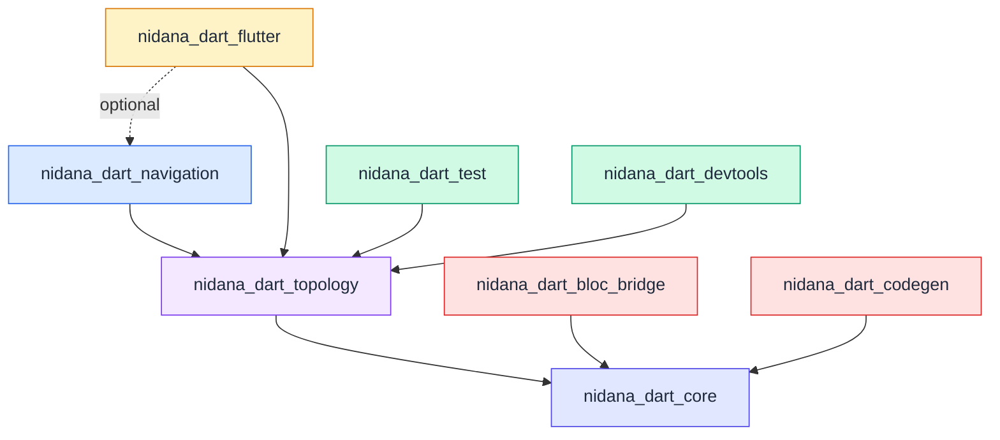

# Nidana Dart/Flutter — High-Level Implementation Specification

**Status:** Draft  
**Author:** Purbo  
**Version:** 0.1.0  
**Date:** 2026-04-09  
**Reference:** `arch/nidana-bus-ref-arch-v0_10.md` (v0.10.2)

## 1. Purpose and Scope

This document is a high-level implementation specification for the Dart/Flutter platform realization of the Nidana Bus reference architecture. It translates the platform-agnostic concepts from the reference architecture into concrete Dart idioms, package boundaries, public API surfaces, and design decisions. It is intended to be broken down into per-package detailed specs before implementation begins.

### 1.1 What This Document Covers

- The Dart package decomposition and dependency graph.
- The public API surface for each package (types, classes, functions) at the signature level.
- Dart-specific design decisions: reactive primitive choices, immutability strategy, sealed class modeling, lifecycle binding approach.
- Constraints that all packages must satisfy (dependency rules, naming conventions, testing requirements).
- Development sequencing and milestone criteria.

### 1.2 What This Document Does Not Cover

- Detailed internal implementation of each package (deferred to per-package specs).
- UI widget design or application-layer architecture patterns.
- Non-Dart platforms (Kotlin, Swift, TypeScript).
- Server-driven topologies, persistence/hydration, and other open questions from the reference architecture (§17).

### 1.3 Reference Architecture Traceability

Every section in this spec traces to one or more sections in the reference architecture. Where this spec makes a Dart-specific choice not mandated by the reference architecture, the rationale is stated explicitly.

## 2. Package Decomposition

*Reference: Appendix C (§C.1–C.6)*

The Dart implementation lives in a single repository (`nidana-dart`) and is published as multiple packages on pub.dev. The decomposition follows the reference architecture's modularization exactly, with Dart naming conventions applied.

### 2.1 Package Dependency Graph



### 2.2 Package Summary

| Package | pub.dev Name | Description | External Dependencies |
|---|---|---|---|
| **Core** | `nidana_dart_core` | Bus runtime, topics (all variants), envelopes, topic registry, publish/subscribe | `rxdart` |
| **Topology** | `nidana_dart_topology` | TopologyBuilder DSL, TopologyDefinition, TopologyGraph, scope declarations, activation/deactivation | `nidana_dart_core` |
| **Navigation** | `nidana_dart_navigation` | NavIntent ADT, Route, NavigationTopics, guard topology, abstract NavigationExecutor | `nidana_dart_topology` |
| **Flutter Runtime** | `nidana_dart_flutter` | Flutter lifecycle binding (app/module/page scopes), concrete NavigationExecutor (GoRouter) | `nidana_dart_topology`, `flutter`, optionally `nidana_dart_navigation` |
| **Test** | `nidana_dart_test` | TestBus, synthetic publishers, assertion helpers, virtual time scheduler | `nidana_dart_topology` |
| **DevTools** | `nidana_dart_devtools` | Graph renderers (Mermaid, Graphviz, JSON), topology diff, envelope inspector, catalog generator | `nidana_dart_topology` |
| **BLoC Bridge** | `nidana_dart_bloc_bridge` | BLoC adapter for gradual migration from existing flutter_bloc codebases | `nidana_dart_core`, `flutter_bloc` |
| **Codegen** | `nidana_dart_codegen` | Topic registry generator from `topics.yaml` schema | `nidana_dart_core`, `build_runner` |

### 2.3 Dependency Rules

*Reference: §C.5*

These rules are inviolable and must be enforced by CI:

1. **No upward dependencies.** `nidana_dart_core` must never import `nidana_dart_topology`. `nidana_dart_topology` must never import `nidana_dart_flutter`.
2. **No cross-platform dependencies.** The Flutter runtime package must not depend on any non-Dart platform package.
3. **Optional dependencies are explicit.** `nidana_dart_flutter`'s dependency on `nidana_dart_navigation` is optional. If navigation is absent from the dependency graph, the runtime package must compile and function without it. Use conditional imports or a plugin registration pattern.
4. **RxDart is a hard dependency of core.** All higher packages inherit it transitively.
5. **Flutter framework dependency is confined to `nidana_dart_flutter`.** The core, topology, navigation, test, and devtools packages are pure Dart with no Flutter dependency. They must be usable in a Dart-only context (CLI tools, server-side Dart, non-Flutter tests).

## 3. Package: `nidana_dart_core`

*Reference: §2.1–2.5, §3, §7, §C.3*

The foundational layer. Usable standalone as a typed event bus with envelope tracing.

### 3.1 Topic Types

*Reference: §2.1*

Three topic variants, each backed by an RxDart subject:

```dart
/// Base class for all topic variants. A topic is a typed key, not a subject.
/// The bus creates the backing subject on first reference.
abstract class Topic<T> {
  String get name;
  TopicVariant get variant;
}

/// Holds latest value, replays immediately to new subscribers.
/// Backed by BehaviorSubject.
class StateTopic<T> extends Topic<T> {
  final String name;
  final T initialValue;
  // Alternatively: final T Function() initialFactory;
  TopicVariant get variant => TopicVariant.state;
  
  const StateTopic(this.name, {required T initial}) : initialValue = initial;
}

/// Fire-and-forget, no replay. Backed by PublishSubject.
class EventTopic<T> extends Topic<T> {
  final String name;
  TopicVariant get variant => TopicVariant.event;
  
  const EventTopic(this.name);
}

/// Buffers N most recent values. Backed by ReplaySubject.
class ReplayTopic<T> extends Topic<T> {
  final String name;
  final int bufferSize;
  TopicVariant get variant => TopicVariant.replay;
  
  const ReplayTopic(this.name, {required this.bufferSize});
}
```

**Design decisions:**

- `StateTopic` accepts either a constant `initial` value or a pure factory `() => T`. No I/O, no service calls, no injected dependencies in the factory (enforced by documentation and code review, not by the type system).
- `Topic<T>` is `const`-constructible where possible, enabling static final declarations in registry classes.
- Topic equality is by `name` (not by identity). Two `StateTopic<AuthState>('auth.state', initial: ...)` instances with the same name refer to the same bus channel. The bus enforces type consistency at runtime (see §3.3).

### 3.2 Message Envelope

*Reference: §2.4*

```dart
@immutable
class MessageEnvelope<T> {
  final String id;
  final T payload;
  final String correlationId;
  final String? causationId;
  final DateTime timestamp;
  final String source;

  const MessageEnvelope({
    required this.id,
    required this.payload,
    required this.correlationId,
    this.causationId,
    required this.timestamp,
    required this.source,
  });
}
```

Envelope generation and correlation/causation threading are internal to the bus. Transformers operate on `T`, not on `MessageEnvelope<T>`. The envelope is accessible to interceptors and cross-cutting concerns.

### 3.3 Bus Runtime

*Reference: §2.3, §2.5, §3.3*

```dart
/// The bus singleton. One per coordination domain.
abstract class NidanaBus {
  /// Access the singleton instance.
  static NidanaBus get instance;

  /// Publish a value to a topic. The bus wraps it in a MessageEnvelope.
  void publish<T>(Topic<T> topic, T value);

  /// Observe a topic's value stream. For StateTopic, replays current value.
  /// Returns Stream<T>, not Stream<MessageEnvelope<T>>.
  Stream<T> observe<T>(Topic<T> topic);

  /// Observe a topic's envelope stream (for cross-cutting concerns).
  Stream<MessageEnvelope<T>> observeEnvelopes<T>(Topic<T> topic);

  /// Get the current value of a StateTopic synchronously.
  /// Throws if called on an EventTopic or if the topic has not been initialized.
  T getCurrentValue<T>(StateTopic<T> topic);

  /// Register an interceptor that observes all publish events.
  void addInterceptor(BusInterceptor interceptor);

  /// Remove a previously registered interceptor.
  void removeInterceptor(BusInterceptor interceptor);

  /// Remove a topic and dispose its backing subject.
  void removeTopic<T>(Topic<T> topic);

  /// Dispose the bus and all backing subjects.
  void dispose();
}
```

**Runtime invariants:**

- **Topic uniqueness.** On first reference to a topic name, the bus creates the backing subject. If a subsequent reference uses the same name with a different `T`, the bus throws `TopicTypeMismatchError` immediately. This is the runtime safety net (§3.3).
- **Lazy subject creation.** The bus creates the backing RxDart subject on the first `publish()` or `observe()` call for a given topic name.
- **Ordering.** Per-topic ordering is guaranteed (BehaviorSubject/PublishSubject deliver in publication order). Cross-topic ordering is not guaranteed.
- **Singleton semantics.** The default `NidanaBus.instance` is the application-wide singleton. For testing, a `TestBus` replaces it. For multi-window or per-isolate scenarios, a scoped instance can be created.

### 3.4 Interceptors

*Reference: §8.2*

```dart
abstract class BusInterceptor {
  /// Called before a value is published to a topic's backing subject.
  void onPublish<T>(Topic<T> topic, MessageEnvelope<T> envelope);
  
  /// Called when a new subscription is created on a topic.
  void onSubscribe<T>(Topic<T> topic);
  
  /// Called when a subscription is disposed.
  void onUnsubscribe<T>(Topic<T> topic);
}
```

### 3.5 Topic Registry Pattern

*Reference: §3.2, §3.4*

Topic registries are plain Dart classes with static final fields. The package provides no base class — the pattern is convention, not inheritance:

```dart
abstract class AuthTopics {
  static final state = StateTopic<AuthState>(
    'auth.state',
    initial: AuthState.unauthenticated(),
  );
  static final loginEvent = EventTopic<LoginCredentials>('auth.login-event');
  static final logoutEvent = EventTopic<LogoutIntent>('auth.logout-event');
}
```

### 3.6 Data Contracts

*Reference: §7*

Data contracts on topics must be immutable. The recommended approach for Dart:

- **`freezed`** for sealed union types (ADTs) with exhaustive pattern matching.
- **`@immutable` annotation + final fields** for simple value objects.
- **`sealed class`** (Dart 3+) for state modeling where `freezed` codegen is undesirable.

```dart
// Using Dart 3 sealed classes
sealed class AuthState {
  const AuthState();
}
class Unauthenticated extends AuthState {
  const Unauthenticated();
}
class Authenticating extends AuthState {
  final String provider;
  const Authenticating({required this.provider});
}
class Authenticated extends AuthState {
  final User user;
  final Token token;
  const Authenticated({required this.user, required this.token});
}
class AuthError extends AuthState {
  final AuthFailure reason;
  const AuthError({required this.reason});
}
```

**Rule:** Never use bare primitives on a topic. `Topic<ConnectionState>` not `Topic<bool>`. `Topic<SearchQuery>` not `Topic<String>`.

### 3.7 Error Types

```dart
/// Thrown when a topic name is reused with a different type parameter.
class TopicTypeMismatchError extends Error {
  final String topicName;
  final Type existingType;
  final Type attemptedType;
  // ...
}
```

## 4. Package: `nidana_dart_topology`

*Reference: §5, §6, §C.3*

Adds the declarative topology layer on top of core. Platform-agnostic — no Flutter dependency.

### 4.1 Topology Definition

*Reference: §5.1, §5.5, §14.4*

```dart
/// Lifecycle scope for a topology.
enum Scope {
  applicationEager,
  applicationLazy,
  module,
  page,
}

/// Base class for topology definitions.
/// Subclasses declare stream wiring in the `declare` method.
abstract class Topology {
  Scope get scope;
  
  /// Pure wiring declaration. No I/O, no side effects.
  /// The builder provides read/write/combine operations.
  void declare(TopologyBuilder b);
}

/// A handle to an activated topology. Used for deactivation.
class TopologyHandle {
  final String topologyName;
  // Internal: subscription management
}
```

### 4.2 TopologyBuilder API

*Reference: §5.1, §5.3*

```dart
abstract class TopologyBuilder {
  /// Read a topic's stream. The returned stream is typed by the topic.
  Stream<T> read<T>(Topic<T> topic);

  /// Write a stream's emissions to a topic.
  void write<T>(Topic<T> topic, Stream<T> stream);

  /// React to events on a topic with a handler.
  /// The handler should publish results via the builder, not perform side effects.
  void on<T>(EventTopic<T> topic, void Function(T value) handler);
}
```

Topology authors use standard RxDart combinators on the streams returned by `read()`:

```dart
class CheckoutTopology extends Topology {
  @override
  Scope get scope => Scope.module;

  @override
  void declare(TopologyBuilder b) {
    final cart = b.read(CheckoutTopics.cartItems);
    final auth = b.read(AuthTopics.state);

    final uiState = Rx.combineLatest2(cart, auth, buildCheckoutUI);

    b.write(CheckoutTopics.uiState, uiState);
  }
}

// Pure function — tested independently, no bus or framework
CheckoutUIState buildCheckoutUI(CartItems items, AuthState auth) {
  return CheckoutUIState(
    items: items.items,
    isLoggedIn: auth is Authenticated,
    canCheckout: auth is Authenticated && items.items.isNotEmpty,
  );
}
```

### 4.3 Topology Graph Introspection

*Reference: §5.5*

```dart
/// A topology's dependency graph as inert data.
class TopologyGraph {
  final String name;
  final List<TopicNode> reads;
  final List<TopicNode> writes;
  final List<TransformEdge> transforms;
}

class TopicNode {
  final String topicName;
  final Type type;
  final TopicVariant variant;
}

class TransformEdge {
  final List<TopicNode> inputs;
  final TopicNode output;
  final String transformerName;
}

/// Extension on TopologyDefinition for graph extraction.
extension TopologyIntrospection on Topology {
  /// Extract the topology's read/write graph without activating it.
  TopologyGraph toGraph();
}

/// Render a TopologyGraph to a target format.
abstract class GraphRenderer {
  String render(TopologyGraph graph);
}
```

### 4.4 Topology Activation

*Reference: §6.2, §6.3*

The topology package supports both explicit scope declaration (Approach A, recommended) and owner-managed lifecycle (Approach B):

```dart
/// Extension on NidanaBus for topology activation.
extension BusTopologyExtension on NidanaBus {
  /// Activate a topology. Returns a handle for deactivation.
  /// The bus wires the topology's declared relationships into live subscriptions.
  TopologyHandle activate(Topology topology);

  /// Deactivate a topology. Disposes all subscriptions created by activation.
  void deactivate(TopologyHandle handle);
  
  /// Get the system-wide graph of all active topologies.
  TopologyGraph systemGraph();
}
```

### 4.5 Cycle Detection

*Reference: §10.2*

At activation time, the bus performs a topological sort of the read/write dependency graph across all active topologies. If a cycle is detected (strongly connected component), the bus throws `TopologyCycleError` with a description of the cycle path. This is a dev-time safety net; CI should also perform static cycle detection.

## 5. Package: `nidana_dart_navigation`

*Reference: §8.3, §C.3*

Optional package for stream-based navigation. Platform-agnostic — the concrete executor lives in `nidana_dart_flutter`.

### 5.1 NavIntent ADT

*Reference: §8.3*

```dart
/// Typed reference to a navigation destination.
class Route {
  final String path;
  const Route(this.path);
}

/// Sealed ADT representing navigation intents.
sealed class NavIntent {
  const NavIntent();
}

class GoTo extends NavIntent {
  final Route route;
  final Map<String, Object>? args;
  const GoTo(this.route, {this.args});
}

class Replace extends NavIntent {
  final Route route;
  final Map<String, Object>? args;
  const Replace(this.route, {this.args});
}

class Back extends NavIntent {
  const Back();
}

class BackTo extends NavIntent {
  final Route route;
  const BackTo(this.route);
}

class BackWithResult extends NavIntent {
  final Object result;
  const BackWithResult(this.result);
}

class DeepLink extends NavIntent {
  final Uri uri;
  const DeepLink(this.uri);
}

class ShowModal extends NavIntent {
  final Route route;
  final Map<String, Object>? args;
  const ShowModal(this.route, {this.args});
}

class DismissModal extends NavIntent {
  const DismissModal();
}
```

### 5.2 Navigation Topics

```dart
abstract class NavigationTopics {
  /// Pages publish navigation intents here.
  static final intent = EventTopic<NavIntent>('nav.intent');

  /// Resolved intents after guards and redirects.
  static final resolvedIntent = EventTopic<NavIntent>('nav.resolved-intent');

  /// Current route state after navigation completes.
  static final currentRoute = StateTopic<RouteState>(
    'nav.current-route',
    initial: RouteState.initial(),
  );

  /// Navigation history for analytics and back-stack awareness.
  static final history = ReplayTopic<RouteTransition>(
    'nav.history',
    bufferSize: 20,
  );
}
```

### 5.3 Navigation Guard Topology

```dart
/// The core navigation topology. Applies guards as pure transforms.
class NavigationCoreTopology extends Topology {
  @override
  Scope get scope => Scope.applicationEager;

  final List<NavigationGuard> guards;

  NavigationCoreTopology({required this.guards});

  @override
  void declare(TopologyBuilder b) {
    final intents = b.read(NavigationTopics.intent);
    final auth = b.read(AuthTopics.state);

    // Chain guards as pure transforms
    var pipeline = Rx.combineLatest2(intents, auth, _applyGuards);

    b.write(NavigationTopics.resolvedIntent, pipeline);
    b.write(NavigationTopics.history, pipeline.map(_toRouteTransition));
  }

  NavIntent _applyGuards(NavIntent intent, AuthState auth) {
    var result = intent;
    for (final guard in guards) {
      result = guard.apply(result, auth);
    }
    return result;
  }
}

/// A navigation guard is a pure function from (intent, auth) → intent.
abstract class NavigationGuard {
  NavIntent apply(NavIntent intent, AuthState auth);
}
```

### 5.4 Abstract NavigationExecutor

```dart
/// Shell-boundary adapter for platform-specific navigation.
/// Concrete implementations live in runtime packages.
abstract class NavigationExecutor {
  void execute(NavIntent intent);
}
```

## 6. Package: `nidana_dart_flutter`

*Reference: §14.2, §14.4, §C.3*

Binds topology lifecycles to Flutter's lifecycle system. This is the only package that depends on the Flutter framework.

### 6.1 Lifecycle Binding

*Reference: §6.1, §14.2*

| Nidana Scope | Flutter Binding |
|---|---|
| `applicationEager` | `WidgetsBindingObserver` — activated at app startup, never deactivated |
| `applicationLazy` | Activated on first `read`/`write` to a topic the topology handles |
| `module` | `RouteObserver` / Navigator 2.0 route-aware — activated on module entry, deactivated on module exit |
| `page` | `State.initState` / `State.dispose` — activated on page mount, deactivated on unmount |

### 6.2 NidanaApp Widget

A convenience widget for application-level setup:

```dart
/// Initializes the bus and activates application-scoped topologies.
class NidanaApp extends StatefulWidget {
  /// Application-scoped topologies (eager).
  final List<Topology> eagerTopologies;
  
  /// Application-scoped topologies (lazy). Activated on first use.
  final List<Topology> lazyTopologies;
  
  /// Bus interceptors (logging, analytics, etc.).
  final List<BusInterceptor> interceptors;
  
  /// The child widget (typically MaterialApp or CupertinoApp).
  final Widget child;
  
  const NidanaApp({
    super.key,
    this.eagerTopologies = const [],
    this.lazyTopologies = const [],
    this.interceptors = const [],
    required this.child,
  });
  
  @override
  State<NidanaApp> createState() => _NidanaAppState();
}
```

### 6.3 Page-Scope Mixin

```dart
/// Mixin for StatefulWidget states that own page-scoped topologies.
mixin NidanaPageMixin<T extends StatefulWidget> on State<T> {
  /// Override to declare topologies for this page.
  List<Topology> get topologies;

  // Internally: activates topologies in initState, deactivates in dispose.
}
```

### 6.4 Module-Scope Integration

```dart
/// A route-aware widget that activates module-scoped topologies
/// when the route is entered and deactivates when exited.
class NidanaModule extends StatefulWidget {
  final List<Topology> topologies;
  final Widget child;
  
  const NidanaModule({
    super.key,
    required this.topologies,
    required this.child,
  });
  
  @override
  State<NidanaModule> createState() => _NidanaModuleState();
}
```

### 6.5 StreamBuilder Convenience

```dart
/// A StreamBuilder that subscribes to a StateTopic and rebuilds on changes.
class TopicBuilder<T> extends StatelessWidget {
  final StateTopic<T> topic;
  final Widget Function(BuildContext context, T value) builder;
  
  const TopicBuilder({
    super.key,
    required this.topic,
    required this.builder,
  });
  
  @override
  Widget build(BuildContext context) {
    return StreamBuilder<T>(
      stream: NidanaBus.instance.observe(topic),
      initialData: NidanaBus.instance.getCurrentValue(topic),
      builder: (context, snapshot) => builder(context, snapshot.data as T),
    );
  }
}
```

### 6.6 Concrete NavigationExecutor

```dart
/// GoRouter-based NavigationExecutor.
class FlutterNavigationExecutor extends NavigationExecutor {
  final GoRouter router;

  FlutterNavigationExecutor({required this.router});

  @override
  void execute(NavIntent intent) {
    switch (intent) {
      case GoTo(:final route, :final args):
        router.go(route.path, extra: args);
      case Replace(:final route, :final args):
        router.pushReplacement(route.path, extra: args);
      case Back():
        router.pop();
      case BackTo(:final route):
        // GoRouter equivalent of popUntil
        router.go(route.path);
      case DeepLink(:final uri):
        router.go(uri.path);
      case ShowModal(:final route, :final args):
        router.push(route.path, extra: args);
      case DismissModal():
        router.pop();
      case BackWithResult(:final result):
        router.pop(result);
    }
  }
}
```

## 7. Package: `nidana_dart_test`

*Reference: §17.1, §C.3*

Testing infrastructure. No Flutter dependency — usable in pure Dart unit tests.

### 7.1 TestBus

```dart
/// A bus implementation for testing. Provides synchronous control
/// over topic emissions and deterministic scheduling.
class TestBus extends NidanaBus {
  /// Create a test bus with an optional virtual time scheduler.
  TestBus({TestScheduler? scheduler});

  /// Synchronously publish a value and process all resulting emissions.
  void publishSync<T>(Topic<T> topic, T value);

  /// Get all values emitted to a topic since the test started.
  List<T> emittedValues<T>(Topic<T> topic);

  /// Get all envelopes emitted to a topic since the test started.
  List<MessageEnvelope<T>> emittedEnvelopes<T>(Topic<T> topic);

  /// Assert that a topic received exactly the expected values (in order).
  void expectValues<T>(Topic<T> topic, List<T> expected);
  
  /// Assert that a topic received a value matching a predicate.
  void expectValue<T>(Topic<T> topic, bool Function(T) predicate);

  /// Advance virtual time (when using a TestScheduler).
  void advanceTime(Duration duration);
}
```

### 7.2 Testing Levels

| Level | What is Tested | How | Package Required |
|---|---|---|---|
| **1. Transformer** | Pure function correctness | Direct invocation: `expect(buildCheckoutUI(cart, auth), expected)` | None (standard `test`) |
| **2. Topology wiring** | Correct topic bindings and combinators | `TestBus` + `activate(topology)` + synthetic publishes + assertions | `nidana_dart_test` |
| **3. Integration** | Cross-topology composition | Full `TestBus` with multiple topologies, event sequences | `nidana_dart_test` |
| **4. UI / Page** | Widget renders correct state from topics | `TestBus` + `TopicBuilder` + Flutter widget tests | `nidana_dart_test` + `flutter_test` |

## 8. Package: `nidana_dart_devtools`

*Reference: §5.5, §17.2, §C.3*

Observability and documentation tooling. No Flutter dependency.

### 8.1 Graph Renderers

```dart
/// Renders a TopologyGraph to Mermaid syntax.
class MermaidRenderer extends GraphRenderer { ... }

/// Renders a TopologyGraph to Graphviz DOT syntax.
class GraphvizRenderer extends GraphRenderer { ... }

/// Renders a TopologyGraph to JSON (for browser-based DevTools).
class JsonRenderer extends GraphRenderer { ... }
```

### 8.2 Topology Diff

```dart
/// Compares two TopologyGraph instances and reports structural differences.
class TopologyDiff {
  final List<TopicNode> addedTopics;
  final List<TopicNode> removedTopics;
  final List<TransformEdge> addedEdges;
  final List<TransformEdge> removedEdges;

  static TopologyDiff compare(TopologyGraph before, TopologyGraph after);
}
```

### 8.3 Envelope Inspector

```dart
/// A BusInterceptor that records all envelopes for inspection.
class EnvelopeInspector extends BusInterceptor {
  /// Get the causal chain for a given correlationId.
  List<MessageEnvelope> causalChain(String correlationId);
  
  /// Get all envelopes for a given topic, ordered by timestamp.
  List<MessageEnvelope> forTopic(String topicName);
}
```

## 9. Package: `nidana_dart_bloc_bridge`

*Reference: §13.3, §C.3*

Optional migration bridge for existing flutter_bloc codebases.

```dart
/// A BLoC that subscribes to a StateTopic and re-emits its values as BLoC state.
/// Enables gradual migration from BLoC-driven UI to topology-driven UI.
class TopicBloc<T> extends Cubit<T> {
  final StateTopic<T> topic;
  StreamSubscription<T>? _subscription;

  TopicBloc(this.topic) : super(NidanaBus.instance.getCurrentValue(topic)) {
    _subscription = NidanaBus.instance.observe(topic).listen(emit);
  }

  @override
  Future<void> close() {
    _subscription?.cancel();
    return super.close();
  }
}
```

## 10. Package: `nidana_dart_codegen`

*Reference: §3.5, §C.3*

Build-time topic registry generation from a YAML schema.

### 10.1 Schema Format

```yaml
# topics.yaml
domains:
  auth:
    owner: platform-team
    topics:
      state:
        type: AuthState
        variant: state
        initial: "AuthState.unauthenticated()"
        description: "Current authentication state"
      login-event:
        type: LoginCredentials
        variant: event
  checkout:
    owner: payments-team
    topics:
      cart-items:
        type: CartItems
        variant: state
        initial: "CartItems.empty()"
```

### 10.2 Generated Output

The generator produces a Dart file per domain with the topic registry class:

```dart
// GENERATED — do not edit
abstract class AuthTopics {
  static final state = StateTopic<AuthState>(
    'auth.state',
    initial: AuthState.unauthenticated(),
  );
  static final loginEvent = EventTopic<LoginCredentials>('auth.login-event');
}
```

The generator validates name uniqueness at generation time. Duplicate names in the schema are a build error.

## 11. Cross-Cutting Design Decisions

### 11.1 Reactive Library: RxDart

*Reference: §14.5*

**Decision:** RxDart is the internal reactive engine for the bus and the combinator library available within topologies.

**Rationale:** Dart's native `Stream` lacks critical combinators (`combineLatest`, `switchMap` with cancellation, `scan`, `debounce` with fine-grained control, `distinctUntilChanged` with custom equality). RxDart provides the full Rx combinator vocabulary. The topology DSL naturally exposes RxDart combinators, and the `TopologyBuilder.read()` returns an RxDart `Stream` (which extends Dart's native `Stream`).

**Consumer exposure:** Module authors interact with `Stream<T>` and use RxDart combinators (`Rx.combineLatest2`, `.switchMap()`, `.debounceTime()`, etc.) inside topology declarations. This is intentional — the topology layer is where combinator richness matters. Pages interact with the bus through `observe()` which returns a plain `Stream<T>`.

### 11.2 Immutability Strategy

*Reference: §7.1, §7.2*

**Decision:** All data contracts on topics must be immutable. Enforce via:

1. **Dart 3 sealed classes** for state ADTs (preferred for new code). Provides exhaustive pattern matching.
2. **`freezed` code generation** for complex data classes where `copyWith`, `==`, `hashCode`, and `toString` are needed with minimal boilerplate.
3. **`@immutable` annotation** as a minimum bar. The Dart analyzer warns if mutable fields are found.

The bus does not runtime-check immutability (Dart has no deep-freeze primitive). Immutability is enforced by convention, static analysis, and code review.

### 11.3 Error Handling

*Reference: §9*

**Decision:** Errors are values, not exceptions.

- Use `sealed class` or `freezed` union types to model result states: `Success<T>` / `Failure<E>`.
- Transformers must not throw. Unhandled exceptions in a `map`/`combine` operator will terminate the topology's subscription.
- The bus does not catch developer exceptions. This is by design (§2.3).
- Services catch I/O errors at the shell boundary and publish them as typed error values to topics.

### 11.4 Minimum Dart SDK

**Decision:** Dart 3.0+ (for sealed classes, pattern matching, records).

This enables `sealed class` for ADTs, `switch` exhaustiveness checking, and destructuring patterns in topology code. These features are central to the data contract and error-handling model.

### 11.5 Minimum Flutter SDK

**Decision:** Flutter 3.10+ (ships with Dart 3.0+).

Only relevant for `nidana_dart_flutter`. All other packages target pure Dart.

## 12. Development Sequencing

*Reference: §C.4*

| Phase | Package | Milestone Criteria |
|---|---|---|
| 1 | `nidana_dart_core` | Topic variants work. Publish/subscribe with envelopes. Runtime type uniqueness enforcement. Interceptor API. 100% unit test coverage on public API. |
| 2 | `nidana_dart_topology` | TopologyBuilder DSL works. Topologies can be activated/deactivated manually. TopologyGraph extraction and Mermaid rendering. Cycle detection. |
| 3 | `nidana_dart_navigation` | NavIntent ADT, NavigationTopics, guard topology, abstract executor. Testable with TestBus (no Flutter). |
| 4 | `nidana_dart_flutter` | Lifecycle binding for all four scopes. NidanaApp, NidanaModule, NidanaPageMixin, TopicBuilder. Concrete GoRouter NavigationExecutor. |
| 5 | `nidana_dart_test` | TestBus with synchronous control, virtual time scheduler, assertion helpers. Formalized from internal testing tools used in phases 1–4. |
| 6 | `nidana_dart_devtools` | Mermaid, Graphviz, JSON renderers. Topology diff. Envelope inspector. Catalog generator. |
| 7 | `nidana_dart_bloc_bridge` | TopicBloc adapter. Integration tests with flutter_bloc. |
| 8 | `nidana_dart_codegen` | YAML schema parser. Dart code generator. build_runner integration. Name uniqueness validation. |

**Phase 1 is the critical milestone.** Ship and use `nidana_dart_core` in a real project before building higher layers.

**Testing utilities are developed alongside each phase** but formalized into `nidana_dart_test` after the topology API stabilizes (phase 5 publication, phase 1 development).

## 13. Constraints and Invariants

These must hold across all packages at all times:

1. **No upward dependency violations.** CI checks import graphs.
2. **All public APIs are documented** with dartdoc comments.
3. **All public APIs have unit tests.** Minimum 90% line coverage per package.
4. **No Flutter imports** outside `nidana_dart_flutter` and `nidana_dart_bloc_bridge`.
5. **Topic name uniqueness is enforced at runtime** by the bus (minimum). Static analysis or codegen may add build-time enforcement.
6. **Transformers are pure functions.** No I/O, no external state access, no side effects. Enforced by documentation and code review.
7. **Data contracts on topics are immutable.** Enforced by `@immutable` annotation and static analysis.
8. **Envelope correlation/causation threading is automatic.** Topology authors never manually construct envelopes.

## 14. Open Questions for Per-Package Specs

These questions should be resolved during detailed per-package spec writing:

1. **`StateTopic` initial value: constant vs. factory.** Should `StateTopic` support `initial: () => T` (lazy pure factory) in addition to `initial: T` (constant)? The factory is needed for types that require runtime construction (e.g., `Uuid.v4()`), but adds API complexity.

2. **Envelope ID generation.** UUID v4? Nano-ID? Configurable? The ID must be unique within a bus instance but does not need to be globally unique across processes.

3. **Topic cleanup strategy.** The reference architecture recommends a hybrid approach (StateTopic permanent, EventTopic auto-GC). The detailed cleanup mechanism (TTL, subscriber-count-based, manual) needs design.

4. **Topology graph introspection granularity.** Should `TopologyGraph` capture combinator types (e.g., "this is a `combineLatest`" vs. "this is a `switchMap`")? This affects DevTools richness but increases introspection complexity.

5. **Conditional imports for optional navigation dependency.** The exact mechanism for `nidana_dart_flutter` to optionally depend on `nidana_dart_navigation` needs prototyping. Dart's conditional import system has limitations.

6. **`TestBus` scheduling model.** Should the virtual time scheduler use RxDart's `TestScheduler` or a custom implementation? How does it interact with Dart's microtask queue and `Future` resolution?

7. **Mermaid rendering style.** Should the devtools package include the pastel styling from the reference architecture diagrams, or should rendering be unstyled with style customization as an option?

8. **`nidana_dart_codegen` integration.** Should it use `build_runner` (standard Dart codegen) or a standalone CLI tool? `build_runner` integrates with the Dart toolchain but adds build complexity.
